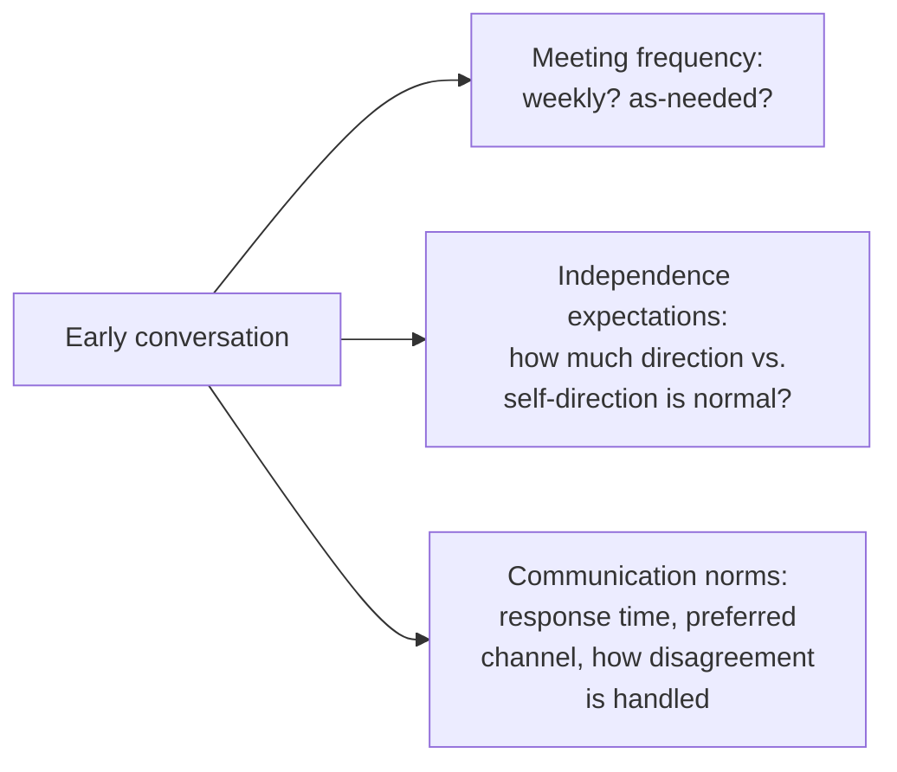

## Learning Objectives

- Explain why finding an advisor is a real, deliberate decision rather than a passive assignment, and what compatibility actually means beyond shared research interests.
- Describe what a productive advisor-student relationship needs to establish early: meeting frequency, expectations around independence, and communication norms.
- Distinguish the advisor's responsibilities in the relationship from the student's, per desJardins's direct advice to both sides.
- Apply this framework to evaluate a described advisor-student relationship for signs of a real, fixable mismatch versus a normal, manageable difference in working style.

## Context & Motivation

`academic-writing`'s own `shaping-a-research-project-and-getting-started` touched the advisor relationship briefly, at the specific moment of starting a project. This concept goes deeper into the relationship itself, sustained across an entire degree, drawing on Marie desJardins's widely circulated essay on being a good graduate student, written from direct experience advising and being advised, alongside Zobel's own treatment of students and advisors. Both sources converge on a claim worth taking seriously: the advisor relationship is arguably the single most consequential relationship of a graduate degree, more consequential, in practical terms, than the specific research topic chosen.

## Core Theory

### Finding an advisor as a deliberate decision

```text
Compatibility is not just shared research interests. It also includes:
  - working style: does the advisor prefer frequent structured
    meetings, or expect mostly independent work with occasional
    check-ins? Does this match how the student actually works best?
  - communication style: direct and blunt feedback, or a more
    gradual, encouraging style; neither is objectively better, but
    a mismatch here causes real, ongoing friction
  - track record with students: how have this advisor's previous
    students' degrees actually gone, in terms of both research
    output and reported experience
```

desJardins is direct that treating advisor selection primarily as "find someone whose research area overlaps with mine" and stopping there is a common, avoidable mistake; working style and communication compatibility matter just as much in practice, over years of sustained interaction, as topical overlap does at the start.

### What a productive relationship establishes early



`shaping-a-research-project-and-getting-started` already established that misaligned expectations, discovered late, are a common source of wasted effort. This concept extends that same principle to the ongoing relationship, not just the project's initial scope: a clear, early conversation about how often to meet, how much independence is expected at different stages of the degree, and how disagreements about research direction get resolved prevents a large fraction of the friction that otherwise surfaces gradually and ambiguously over months.

### The advisor's responsibilities, and the student's

desJardins's essay includes direct advice aimed at advisors specifically, not just students, treating the relationship as a genuine two-way responsibility rather than one where only the student is expected to adapt. An advisor's responsibilities include providing timely, substantive feedback rather than long silences, being honest about a project's real prospects rather than false encouragement, and treating a student's time as a real, limited resource rather than an infinitely available one. A student's responsibilities include communicating proactively rather than waiting to be asked for updates, taking real ownership of the research direction rather than expecting to be told exactly what to do at every step, and raising concerns about the relationship itself directly rather than letting frustration accumulate silently.

### Distinguishing a fixable mismatch from a real incompatibility

Not every friction in an advisor relationship signals a fundamental incompatibility; some is a normal, workable difference in style that an explicit conversation, of the kind this concept's core theory describes, can resolve. A real, harder-to-fix incompatibility is one where an explicit conversation about expectations has already happened and the underlying mismatch, in working style, in research direction, in basic communication, persists despite good-faith effort on both sides; recognizing this distinction matters because it determines whether the right response is a direct conversation or, in genuinely serious and persistent cases, seeking a change in advising arrangement.

## Worked Examples

### Example 1: choosing between two potential advisors

A prospective student is deciding between two advisors with overlapping research interests. One prefers weekly structured meetings and hands-on guidance early in a project; the other expects mostly independent work with occasional check-ins. A student who thrives with more structure, particularly early in a degree, is likely to have a smoother relationship with the first advisor, even if the second advisor's specific research topic is marginally more appealing on paper; desJardins's guidance treats this working-style fit as a real, weighty factor in the decision, not a secondary consideration.

### Example 2: resolving friction through an explicit conversation

A student feels increasingly frustrated by slow feedback on drafts, while the advisor assumes the current pace is normal and has not been told otherwise. A direct conversation, following the early-establishment principle this concept covers, surfaces the mismatch and results in an agreed, explicit turnaround expectation going forward, resolving what had been accumulating as unspoken frustration on one side only.

### Example 3: recognizing a persistent, real incompatibility

A student and advisor have had several explicit conversations about research direction, with the student consistently feeling steered toward topics that do not match their own genuine interests, and no real change follows these conversations over an extended period. Having already tried the direct-conversation approach in good faith without resolution, this pattern indicates a more serious, structural mismatch worth addressing through a change in advising arrangement, rather than continuing to hope the same conversation will eventually produce a different result.

## Common Misconceptions & Pitfalls

- **"Choosing an advisor is just about finding someone in the right research area."** Working style and communication compatibility matter just as much, in practice, over a multi-year relationship, as topical overlap does at the outset; desJardins treats overlooking this as a common, avoidable mistake.
- **"A good student shouldn't need to raise concerns about the relationship; a good advisor should just know."** desJardins's guidance treats the relationship as a genuine two-way responsibility; proactive communication from the student, including raising concerns directly, is part of the student's own responsibility, not solely the advisor's to anticipate unprompted.
- **"Any friction with an advisor means the match was wrong from the start."** Much friction is a normal, workable difference in style, resolvable through an explicit conversation about expectations; a real, harder incompatibility is distinguished by that conversation not resolving the underlying mismatch even after good-faith effort.

## Summary

Finding an advisor is a real, deliberate decision that should weigh working-style and communication compatibility alongside shared research interests, since the relationship, sustained across an entire degree, is arguably the single most consequential one in graduate research. A productive relationship benefits from establishing meeting frequency, independence expectations, and communication norms explicitly and early, treating both sides, per desJardins's direct advice, as having real, distinct responsibilities to the relationship, and distinguishing normal, workable friction from a genuine, persistent incompatibility is what determines whether the right response is a direct conversation or a more serious change in advising arrangement.

## Documentation Links

- [ACM Digital Library: Justin Zobel, Writing for Computer Science (3rd Edition, Springer, 2014)](https://dl.acm.org/doi/10.5555/2742708): Chapter 2's "Students and Advisors" section is a direct source for the early-expectations guidance this concept extends across the full relationship.
- [Marie desJardins, How to Be a Good Graduate Student (1994)](https://www.physlink.com/education/grad_how2.cfm): the direct source for the advisor-selection, compatibility, and two-way-responsibility guidance covered here.
