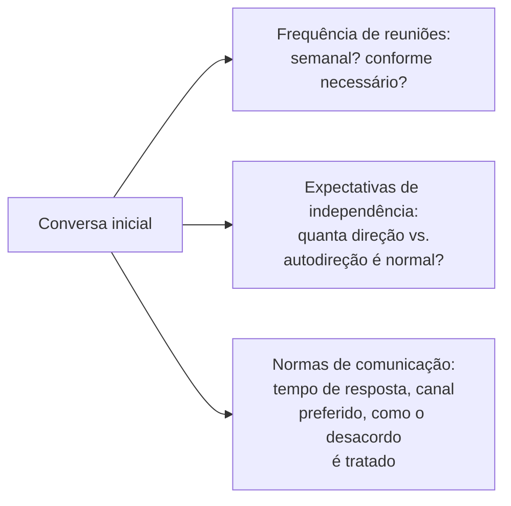

## Objetivos de Aprendizagem

- Explicar por que encontrar um orientador é uma decisão real e deliberada, e não uma designação passiva, e o que a compatibilidade de fato significa para além de interesses de pesquisa compartilhados.
- Descrever o que uma relação produtiva de orientador-estudante precisa estabelecer cedo: frequência de reuniões, expectativas quanto à independência e normas de comunicação.
- Distinguir as responsabilidades do orientador na relação das do estudante, conforme o conselho direto de desJardins aos dois lados.
- Aplicar esse arcabouço para avaliar uma relação de orientador-estudante descrita em busca de sinais de um descompasso real e corrigível versus uma diferença normal e gerenciável de estilo de trabalho.

## Contexto e Motivação

O `shaping-a-research-project-and-getting-started` do próprio `academic-writing` tocou a relação com o orientador brevemente, no momento específico de começar um projeto. Este conceito vai mais fundo na relação em si, sustentada ao longo de um programa inteiro, valendo-se do ensaio amplamente divulgado de Marie desJardins sobre ser um bom estudante de pós-graduação, escrito a partir de experiência direta orientando e sendo orientada, ao lado do próprio tratamento de Zobel sobre estudantes e orientadores. Ambas as fontes convergem para uma afirmação que vale levar a sério: a relação com o orientador é indiscutivelmente a relação mais consequente de um programa de pós-graduação, mais consequente, em termos práticos, do que o tópico de pesquisa específico escolhido.

## Teoria Central

### Encontrar um orientador como decisão deliberada

```text
A compatibilidade não é só interesses de pesquisa compartilhados. Ela também inclui:
  - estilo de trabalho: o orientador prefere reuniões estruturadas
    frequentes, ou espera um trabalho em grande parte independente com
    alinhamentos ocasionais? Isso bate com o jeito em que o estudante de
    fato trabalha melhor?
  - estilo de comunicação: feedback direto e franco, ou um estilo mais
    gradual e encorajador; nenhum é objetivamente melhor, mas
    um descompasso aqui causa atrito real e contínuo
  - histórico com estudantes: como os programas dos estudantes anteriores
    deste orientador de fato correram, em termos tanto de produção
    de pesquisa quanto de experiência relatada
```

desJardins é direta ao dizer que tratar a seleção de orientador principalmente como "encontrar alguém cuja área de pesquisa se sobreponha à minha" e parar aí é um erro comum e evitável; a compatibilidade de estilo de trabalho e de comunicação importa tanto na prática, ao longo de anos de interação sustentada, quanto a sobreposição temática importa no começo.

### O que uma relação produtiva estabelece cedo



`shaping-a-research-project-and-getting-started` já estabeleceu que expectativas desalinhadas, descobertas tarde, são uma fonte comum de esforço desperdiçado. Este conceito estende esse mesmo princípio à relação em curso, não só ao escopo inicial do projeto: uma conversa clara e inicial sobre com que frequência reunir, quanta independência é esperada em diferentes estágios do programa, e como os desacordos sobre a direção da pesquisa se resolvem previne uma grande fração do atrito que, de outra forma, surge aos poucos e de forma ambígua ao longo de meses.

### As responsabilidades do orientador, e as do estudante

O ensaio de desJardins inclui conselho direto dirigido a orientadores especificamente, não só a estudantes, tratando a relação como uma responsabilidade genuína de mão dupla, e não como uma em que só o estudante deve se adaptar. As responsabilidades de um orientador incluem fornecer feedback oportuno e substantivo, em vez de longos silêncios, ser honesto sobre as perspectivas reais de um projeto, em vez de encorajamento falso, e tratar o tempo de um estudante como um recurso real e limitado, e não como um infinitamente disponível. As responsabilidades de um estudante incluem comunicar-se proativamente, em vez de esperar ser pedido para dar atualizações, assumir real propriedade da direção da pesquisa, em vez de esperar ser dito exatamente o que fazer a cada passo, e levantar preocupações sobre a própria relação diretamente, em vez de deixar a frustração se acumular em silêncio.

### Distinguir um descompasso corrigível de uma incompatibilidade real

Nem todo atrito numa relação com orientador sinaliza uma incompatibilidade fundamental; parte é uma diferença de estilo normal e contornável que uma conversa explícita, do tipo que a teoria central deste conceito descreve, consegue resolver. Uma incompatibilidade real e mais difícil de corrigir é aquela em que uma conversa explícita sobre expectativas já aconteceu e o descompasso subjacente, no estilo de trabalho, na direção da pesquisa, na comunicação básica, persiste apesar do esforço de boa-fé dos dois lados; reconhecer essa distinção importa porque ela determina se a resposta certa é uma conversa direta ou, em casos genuinamente sérios e persistentes, buscar uma mudança no arranjo de orientação.

## Exemplos Resolvidos

### Exemplo 1: escolher entre dois potenciais orientadores

Um candidato a estudante está decidindo entre dois orientadores com interesses de pesquisa sobrepostos. Um prefere reuniões estruturadas semanais e orientação próxima no início de um projeto; o outro espera um trabalho em grande parte independente com alinhamentos ocasionais. Um estudante que prospera com mais estrutura, particularmente no início de um programa, provavelmente terá uma relação mais tranquila com o primeiro orientador, mesmo que o tópico de pesquisa específico do segundo orientador seja marginalmente mais atraente no papel; a orientação de desJardins trata esse ajuste de estilo de trabalho como um fator real e de peso na decisão, e não como uma consideração secundária.

### Exemplo 2: resolver o atrito por meio de uma conversa explícita

Um estudante se sente cada vez mais frustrado com o feedback lento sobre rascunhos, enquanto o orientador assume que o ritmo atual é normal e não foi informado do contrário. Uma conversa direta, seguindo o princípio de estabelecimento inicial que este conceito cobre, revela o descompasso e resulta numa expectativa de prazo de retorno acordada e explícita dali em diante, resolvendo o que vinha se acumulando como frustração não dita de um lado só.

### Exemplo 3: reconhecer uma incompatibilidade real e persistente

Um estudante e um orientador tiveram várias conversas explícitas sobre a direção da pesquisa, com o estudante consistentemente se sentindo direcionado a tópicos que não batem com os seus próprios interesses genuínos, e nenhuma mudança real se segue a essas conversas ao longo de um período prolongado. Tendo já tentado a abordagem da conversa direta de boa-fé sem resolução, esse padrão indica um descompasso mais sério e estrutural que vale abordar por meio de uma mudança no arranjo de orientação, em vez de continuar esperando que a mesma conversa eventualmente produza um resultado diferente.

## Equívocos Comuns e Armadilhas

- **"Escolher um orientador é só encontrar alguém na área de pesquisa certa."** A compatibilidade de estilo de trabalho e de comunicação importa tanto, na prática, ao longo de uma relação de vários anos, quanto a sobreposição temática importa no início; desJardins trata ignorar isso como um erro comum e evitável.
- **"Um bom estudante não deveria precisar levantar preocupações sobre a relação; um bom orientador deveria simplesmente saber."** A orientação de desJardins trata a relação como uma responsabilidade genuína de mão dupla; a comunicação proativa do estudante, incluindo levantar preocupações diretamente, é parte da própria responsabilidade do estudante, e não só do orientador a antecipar sem ser provocado.
- **"Qualquer atrito com um orientador significa que o par estava errado desde o começo."** Muito atrito é uma diferença de estilo normal e contornável, resolvível por meio de uma conversa explícita sobre expectativas; uma incompatibilidade real e mais difícil se distingue por essa conversa não resolver o descompasso subjacente mesmo após esforço de boa-fé.

## Resumo

Encontrar um orientador é uma decisão real e deliberada que deve ponderar a compatibilidade de estilo de trabalho e de comunicação ao lado de interesses de pesquisa compartilhados, já que a relação, sustentada ao longo de um programa inteiro, é indiscutivelmente a mais consequente na pesquisa de pós-graduação. Uma relação produtiva se beneficia de estabelecer a frequência de reuniões, as expectativas de independência e as normas de comunicação de forma explícita e cedo, tratando os dois lados, conforme o conselho direto de desJardins, como tendo responsabilidades reais e distintas para com a relação, e distinguir o atrito normal e contornável de uma incompatibilidade genuína e persistente é o que determina se a resposta certa é uma conversa direta ou uma mudança mais séria no arranjo de orientação.

## Documentation Links

- [ACM Digital Library: Justin Zobel, Writing for Computer Science (3ª edição, Springer, 2014)](https://dl.acm.org/doi/10.5555/2742708): a seção "Students and Advisors" do Capítulo 2 é uma fonte direta da orientação sobre expectativas iniciais que este conceito estende por toda a relação.
- [Marie desJardins, How to Be a Good Graduate Student (1994)](https://www.physlink.com/education/grad_how2.cfm): a fonte direta da orientação sobre seleção de orientador, compatibilidade e responsabilidade de mão dupla coberta aqui.
