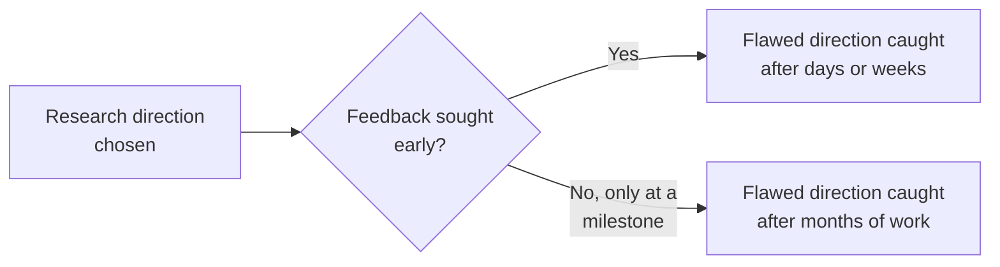

## Learning Objectives

- Explain why most of a research degree consists of incremental, often frustrating daily progress rather than dramatic breakthrough moments, and why this is normal rather than a sign of doing something wrong.
- Describe why actively seeking feedback, rather than waiting to be asked, catches a flawed research direction earlier and at lower cost.
- Identify concrete, varied sources of feedback beyond a primary advisor: labmates, a wider research group, and conference interactions.
- Apply proactive feedback-seeking and motivation-sustaining practices to a described period of stalled or discouraging research progress.

## Context & Motivation

`finding-and-working-with-an-advisor` covered the advisor relationship's structure. This concept covers something adjacent but distinct: the lived, daily texture of doing research over months and years, and the practical habits, primarily around seeking feedback and sustaining motivation, that desJardins's essay treats as real, learnable skills rather than a matter of some researchers simply having more natural resilience than others.

## Core Theory

### The daily grind is normal, not a warning sign

desJardins is direct about something graduate researchers, particularly early in a degree, often do not expect: the overwhelming majority of research time is not spent having insights or making breakthroughs, it is spent on incremental, often unglamorous work, debugging, re-running experiments, revising a draft for the fifth time, reading yet another paper that turns out not to be quite what was needed. This is not evidence of doing something wrong or being insufficiently talented; it is the normal, expected texture of research, and expecting otherwise, expecting a steady stream of breakthrough moments, sets up an unrealistic comparison that can itself become a source of discouragement independent of how the research is actually going.

### Seeking feedback proactively, not waiting for it



The practical cost of waiting to seek feedback until a natural milestone, a scheduled meeting, a completed draft, rather than seeking it proactively when uncertain, is asymmetric: a flawed direction caught early costs days or weeks to correct, while the same flaw caught only at a scheduled checkpoint months later costs everything invested in between. desJardins's guidance treats proactively seeking feedback, not waiting passively for a scheduled opportunity, as one of the most concretely actionable habits a graduate researcher can adopt, directly reducing the real risk of sunk, wasted effort.

### Sources of feedback beyond a primary advisor

```text
- Labmates: often more available day-to-day than an advisor, and
  closer to the actual technical details of related work
- Wider research group or department: a different perspective,
  sometimes catching a blind spot too close to the advisor's own
  usual framing of the problem
- Conference interactions: covered in more depth by
  `attending-conferences-and-building-a-research-network`, but
  worth noting here as a real, distinct feedback source, often
  from researchers with no stake in the specific project
```

Relying on a single feedback source, even a good advisor, misses the real value of getting a genuinely different perspective, which is one reason desJardins treats building relationships with labmates and a wider research community as practically valuable, not just socially pleasant.

### Staying motivated through the grind

Given that most research time is, honestly, the daily grind rather than breakthrough moments, sustaining motivation over a multi-year degree is itself a real, practical concern desJardins addresses directly: recognizing genuine, if small, progress rather than only counting large milestones, maintaining connections outside the immediate research problem (this discipline's own `attending-conferences-and-building-a-research-network` and simply having a life outside research both matter here), and being honest with oneself, and with an advisor, when a sustained lack of progress reflects a genuinely stuck direction rather than normal, temporary friction.

## Worked Examples

### Example 1: seeking feedback early instead of at a scheduled meeting

A student begins implementing an approach and, within the first few days, becomes uncertain whether a key design decision is actually sound. Rather than waiting three weeks for the next scheduled advisor meeting, the student sends a brief, specific question to the advisor and a labmate immediately; the labmate flags a real issue with the approach the same day, saving weeks of implementation work built on a flawed foundation.

### Example 2: recognizing normal grind versus a stuck direction

A student spends several weeks debugging an experimental pipeline with no dramatic breakthrough, feeling discouraged that "nothing is happening." Recognizing this as the normal texture of research, not a sign of a stuck direction, the student continues the methodical debugging work, which eventually resolves the issue; distinguishing this from a genuinely stuck direction, where the same debugging approach has been tried repeatedly without any incremental progress at all, is the practical judgment this concept's framework supports.

### Example 3: drawing on a wider feedback network

A student's advisor, deeply familiar with the project's specific framing, does not notice a scoping issue a labmate working in a related but different area spots immediately, precisely because the labmate's slightly different perspective is not anchored to the same assumptions the advisor and student have both been working within for months. This is a direct, practical example of why relying on a single feedback source, even a strong one, misses real value a wider network provides.

## Common Misconceptions & Pitfalls

- **"If I'm not having regular breakthroughs, I'm probably not doing well."** desJardins treats the daily grind, incremental, often unglamorous progress, as the normal, expected texture of research, not a warning sign; expecting frequent breakthroughs sets up an unrealistic and discouraging comparison.
- **"Feedback should be sought at scheduled meetings, not in between."** The cost of a flawed direction grows the longer it goes uncaught; seeking feedback proactively, as soon as real uncertainty arises, rather than waiting for the next scheduled opportunity, is a concrete, actionable habit that reduces wasted effort.
- **"My advisor is my only real source of useful feedback."** Labmates, a wider research group, and conference interactions each offer genuinely different perspectives an advisor alone may not provide, sometimes catching blind spots the advisor and student share precisely because they have been working closely together.

## Summary

Most of a research degree consists of incremental, often unglamorous daily progress rather than frequent breakthrough moments, and recognizing this as normal, rather than a sign of doing something wrong, is itself a practical, motivation-sustaining habit. Seeking feedback proactively, rather than waiting for a scheduled opportunity, catches a flawed research direction while it is still cheap to correct, and drawing on feedback sources beyond a single advisor, labmates, a wider research group, conference interactions, provides genuinely different perspectives that a single, even excellent, source cannot fully substitute for.

## Documentation Links

- [Marie desJardins, How to Be a Good Graduate Student (1994)](https://www.physlink.com/education/grad_how2.cfm): the direct source for the daily-grind, proactive-feedback-seeking, and motivation-sustaining guidance covered here.
