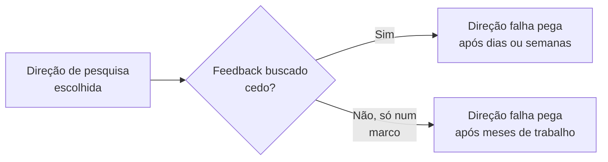

## Objetivos de Aprendizagem

- Explicar por que a maior parte de um programa de pesquisa consiste em progresso diário incremental e muitas vezes frustrante, e não em momentos dramáticos de descoberta, e por que isso é normal, e não um sinal de estar fazendo algo errado.
- Descrever por que buscar ativamente feedback, em vez de esperar ser pedido, pega uma direção de pesquisa falha mais cedo e a um custo menor.
- Identificar fontes concretas e variadas de feedback para além de um orientador principal: colegas de laboratório, um grupo de pesquisa mais amplo e interações de conferência.
- Aplicar práticas de busca proativa de feedback e de sustentação de motivação a um período descrito de progresso de pesquisa estagnado ou desencorajador.

## Contexto e Motivação

`finding-and-working-with-an-advisor` cobriu a estrutura da relação com o orientador. Este conceito cobre algo adjacente, mas distinto: a textura vivida e diária de fazer pesquisa ao longo de meses e anos, e os hábitos práticos, principalmente em torno de buscar feedback e sustentar a motivação, que o ensaio de desJardins trata como habilidades reais e aprendíveis, e não como uma questão de alguns pesquisadores simplesmente terem mais resiliência natural do que outros.

## Teoria Central

### A labuta diária é normal, não um sinal de alerta

desJardins é direta sobre algo que os pesquisadores de pós-graduação, particularmente no início de um programa, muitas vezes não esperam: a esmagadora maioria do tempo de pesquisa não é gasta tendo percepções ou fazendo descobertas, é gasta em trabalho incremental e muitas vezes sem glamour, depurar, reexecutar experimentos, revisar um rascunho pela quinta vez, ler mais um artigo que acaba não sendo bem o que era necessário. Isso não é evidência de estar fazendo algo errado ou de ser insuficientemente talentoso; é a textura normal e esperada da pesquisa, e esperar o contrário, esperar um fluxo constante de momentos de descoberta, cria uma comparação irrealista que pode, ela mesma, se tornar uma fonte de desânimo independente de como a pesquisa de fato está indo.

### Buscar feedback proativamente, não esperar por ele



O custo prático de esperar para buscar feedback até um marco natural, uma reunião agendada, um rascunho concluído, em vez de buscá-lo proativamente quando incerto, é assimétrico: uma direção falha pega cedo custa dias ou semanas para corrigir, enquanto a mesma falha pega só num ponto de checagem agendado meses depois custa tudo o que foi investido no meio. A orientação de desJardins trata buscar feedback proativamente, não esperar passivamente por uma oportunidade agendada, como um dos hábitos mais concretamente acionáveis que um pesquisador de pós-graduação pode adotar, reduzindo diretamente o risco real de esforço afundado e desperdiçado.

### Fontes de feedback para além de um orientador principal

```text
- Colegas de laboratório: muitas vezes mais disponíveis no dia a dia do que um
  orientador, e mais próximos dos detalhes técnicos de fato do trabalho relacionado
- Grupo de pesquisa ou departamento mais amplo: uma perspectiva diferente,
  às vezes pegando um ponto cego perto demais do próprio
  enquadramento usual do orientador para o problema
- Interações de conferência: cobertas em mais profundidade por
  `attending-conferences-and-building-a-research-network`, mas
  vale notar aqui como uma fonte de feedback real e distinta, muitas vezes
  de pesquisadores sem interesse no projeto específico
```

Depender de uma única fonte de feedback, mesmo um bom orientador, perde o valor real de obter uma perspectiva genuinamente diferente, que é uma das razões pelas quais desJardins trata construir relações com colegas de laboratório e uma comunidade de pesquisa mais ampla como praticamente valioso, e não só socialmente agradável.

### Manter-se motivado ao longo da labuta

Dado que a maior parte do tempo de pesquisa é, honestamente, a labuta diária, e não momentos de descoberta, sustentar a motivação ao longo de um programa de vários anos é, ela mesma, uma preocupação real e prática que desJardins aborda diretamente: reconhecer o progresso genuíno, ainda que pequeno, em vez de só contar grandes marcos, manter conexões fora do problema de pesquisa imediato (o próprio `attending-conferences-and-building-a-research-network` desta disciplina e simplesmente ter uma vida fora da pesquisa ambos importam aqui), e ser honesto consigo mesmo, e com um orientador, quando uma falta sustentada de progresso reflete uma direção genuinamente travada, e não um atrito normal e temporário.

## Exemplos Resolvidos

### Exemplo 1: buscar feedback cedo em vez de numa reunião agendada

Um estudante começa a implementar uma abordagem e, dentro dos primeiros dias, fica incerto sobre se uma decisão de projeto fundamental é de fato sólida. Em vez de esperar três semanas pela próxima reunião agendada com o orientador, o estudante envia uma pergunta breve e específica ao orientador e a um colega de laboratório imediatamente; o colega de laboratório sinaliza um problema real com a abordagem no mesmo dia, poupando semanas de trabalho de implementação construído sobre uma base falha.

### Exemplo 2: reconhecer a labuta normal versus uma direção travada

Um estudante passa várias semanas depurando um pipeline experimental sem nenhuma descoberta dramática, sentindo-se desencorajado porque "nada está acontecendo". Reconhecendo isso como a textura normal da pesquisa, e não um sinal de uma direção travada, o estudante continua o trabalho metódico de depuração, que eventualmente resolve o problema; distinguir isso de uma direção genuinamente travada, onde a mesma abordagem de depuração foi tentada repetidamente sem qualquer progresso incremental, é o julgamento prático que o arcabouço deste conceito apoia.

### Exemplo 3: valer-se de uma rede de feedback mais ampla

O orientador de um estudante, profundamente familiarizado com o enquadramento específico do projeto, não nota um problema de escopo que um colega de laboratório trabalhando numa área relacionada, mas diferente, percebe de imediato, precisamente porque a perspectiva levemente diferente do colega de laboratório não está ancorada nas mesmas suposições dentro das quais o orientador e o estudante vêm ambos trabalhando há meses. Esse é um exemplo direto e prático de por que depender de uma única fonte de feedback, mesmo uma forte, perde valor real que uma rede mais ampla fornece.

## Equívocos Comuns e Armadilhas

- **"Se eu não estou tendo descobertas regulares, provavelmente não estou indo bem."** desJardins trata a labuta diária, progresso incremental e muitas vezes sem glamour, como a textura normal e esperada da pesquisa, e não como um sinal de alerta; esperar descobertas frequentes cria uma comparação irrealista e desencorajadora.
- **"O feedback deve ser buscado em reuniões agendadas, não entre elas."** O custo de uma direção falha cresce quanto mais tempo ela passa despercebida; buscar feedback proativamente, assim que uma incerteza real surge, em vez de esperar pela próxima oportunidade agendada, é um hábito concreto e acionável que reduz o esforço desperdiçado.
- **"Meu orientador é a minha única fonte real de feedback útil."** Colegas de laboratório, um grupo de pesquisa mais amplo e interações de conferência cada um oferece perspectivas genuinamente diferentes que um orientador sozinho pode não fornecer, às vezes pegando pontos cegos que o orientador e o estudante compartilham precisamente porque vêm trabalhando juntos de perto.

## Resumo

A maior parte de um programa de pesquisa consiste em progresso diário incremental e muitas vezes sem glamour, e não em momentos frequentes de descoberta, e reconhecer isso como normal, em vez de um sinal de estar fazendo algo errado, é, ele mesmo, um hábito prático que sustenta a motivação. Buscar feedback proativamente, em vez de esperar por uma oportunidade agendada, pega uma direção de pesquisa falha enquanto ainda é barato corrigi-la, e valer-se de fontes de feedback para além de um único orientador, colegas de laboratório, um grupo de pesquisa mais amplo, interações de conferência, fornece perspectivas genuinamente diferentes que uma única fonte, mesmo excelente, não consegue substituir por completo.

## Documentation Links

- [Marie desJardins, How to Be a Good Graduate Student (1994)](https://www.physlink.com/education/grad_how2.cfm): a fonte direta da orientação sobre a labuta diária, a busca proativa de feedback e a sustentação da motivação coberta aqui.
