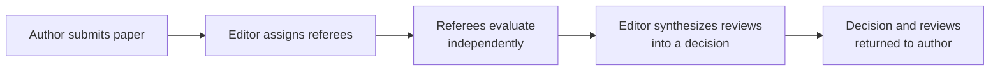

## Learning Objectives

- Distinguish reading a paper as a referee, evaluating whether it should be accepted, from reading a paper for a literature review, evaluating what it contributes to one's own understanding.
- Explain what evaluating a paper's contribution actually involves: judging novelty, soundness, and significance as separate, individually assessable properties.
- Describe what a useful review contains, and why a review exists to serve both an editor's decision and the authors' ability to improve the work.
- Apply a checking pass to a drafted review before submitting it, the same discipline `academic-writing`'s own editing concept applies to a paper.

## Context & Motivation

`academic-writing`'s `reading-critically-and-writing-a-literature-review` covered reading research literature to build one's own understanding and situate one's own work within it. This concept covers a genuinely different reading task graduate researchers are expected to take on well before holding any formal editorial role: reading a submitted paper as a referee, asking not what does this contribute to my own project, but should this specific paper, as written, be accepted for publication. Zobel's chapter on reading and reviewing treats this as its own distinct skill, with its own real structure, "Authors, Editors, and Referees," "Contribution," "Evaluation of Papers," "Content of Reviews," "Drafting a Review," and "Checking Your Review."

## Core Theory

### Authors, editors, and referees: the roles in the review process



A referee's role is narrower and more specific than it might first appear: providing an honest, well reasoned evaluation to help the editor decide, and providing feedback that helps the authors improve the work, whether or not it is ultimately accepted this time. A referee is not the final decision-maker, that is the editor's role, synthesizing multiple independent reviews, sometimes conflicting ones, into one decision.

### Evaluating contribution: novelty, soundness, significance

```text
Novelty:       is this genuinely new, not already established by prior
               published work the authors may or may not be aware of?

Soundness:     is the method actually correct, and does the evidence
               presented actually support the claims being made?

Significance:  even if novel and sound, does this contribution matter
               enough to the field to warrant publication at this
               particular venue?
```

Zobel treats these as separable properties a careful referee evaluates individually, not folded into one vague overall impression. A paper can be sound but not novel (a correct but already-known result), novel but not sound (an interesting but poorly supported claim), or novel and sound but of limited significance (a correct, new, but narrow or minor contribution). Distinguishing which of these applies to a given paper produces a far more useful review than a single undifferentiated judgment of "good" or "not good enough."

### What a useful review actually contains

A review that serves its dual purpose, informing the editor's decision and helping the authors improve, needs a clear summary of what the paper claims to contribute (partly to confirm the referee understood it correctly), an honest assessment against novelty, soundness, and significance separately, specific, actionable points rather than vague dissatisfaction, and a recommendation appropriately matched to the venue's actual standards. A review that says only "this needs more work" without specifying what work, or why, fails both the editor, who needs a defensible basis for a decision, and the authors, who cannot act on vague dissatisfaction even if it happens to be justified.

### Drafting and checking a review

Zobel's guidance treats a first draft of a review the same way `editing-and-revision` treats a first draft of a paper: written to get the real evaluation down, then checked deliberately before submission, for fairness (is the tone constructive even where the assessment is critical), for accuracy (does the review correctly represent what the paper actually says, not a misreading of it), and for actionability (would the authors, reading this review, know specifically what to address). A review submitted without this checking pass risks being unfair, inaccurate, or simply unhelpful, regardless of how much genuine effort went into forming the underlying judgment.

## Worked Examples

### Example 1: separating novelty from soundness

A paper proposes what looks, to a referee unfamiliar with a specific subarea, like a genuinely new caching strategy. A careful literature check, part of the referee's own evaluation work, reveals a highly similar strategy was published two years earlier under different terminology. The paper's method is sound and the evidence supports its claims, but its central claim of novelty does not hold; the review states this distinction precisely, sound but not novel as claimed, rather than a vague "reject" without explaining why.

### Example 2: an actionable versus a vague review

A first-draft review states: "The evaluation section is weak." Revised to be actionable: "The evaluation only tests one workload; the paper's claim of general applicability would need at least two additional, meaningfully different workloads to be adequately supported." The revised version gives the authors something specific and achievable to address.

### Example 3: checking a review for fairness before submission

A referee's first draft, written after being unconvinced by a paper's central claim, reads with a noticeably dismissive tone throughout, even in sections praising real strengths. On the checking pass, the referee revises the tone to remain constructive and specific even where critical, preserving the substance of every criticism while removing language that would read as needlessly harsh to the authors receiving it.

## Common Misconceptions & Pitfalls

- **"A review just needs an overall verdict: accept or reject."** Separating novelty, soundness, and significance produces a far more useful, defensible evaluation than a single undifferentiated judgment, both for the editor's decision and for the authors' ability to act on the feedback.
- **"A harsh, blunt review is more honest than a constructive one."** Honesty and constructiveness are not in tension; a review can be precisely critical, naming exactly what is wrong, while remaining respectful in tone, and Zobel's checking-pass guidance treats fairness of tone as a real part of a review's quality.
- **"Reading for review is basically the same skill as reading for a literature review."** The two tasks ask different questions, what does this contribute to my own understanding versus should this specific paper be accepted, and conflating them produces reviews that read more like a summary than an actual evaluation.

## Summary

Reading a paper as a referee is a distinct skill from reading one for a literature review, asking specifically whether a paper should be accepted rather than what it contributes to the reader's own understanding, and evaluating a paper's contribution well means separating novelty, soundness, and significance as individually assessable properties rather than folding them into one vague impression. A useful review serves both the editor's decision and the authors' ability to improve their work, which requires specific, actionable feedback, and drafting a review benefits from the same deliberate checking pass, for fairness, accuracy, and actionability, that a well written paper itself requires.

## Documentation Links

- [ACM Digital Library: Justin Zobel, Writing for Computer Science (3rd Edition, Springer, 2014)](https://dl.acm.org/doi/10.5555/2742708): Chapter 3's "Authors, Editors, and Referees," "Contribution," "Evaluation of Papers," "Content of Reviews," "Drafting a Review," and "Checking Your Review" sections are the direct source for the referee-side guidance covered here.
