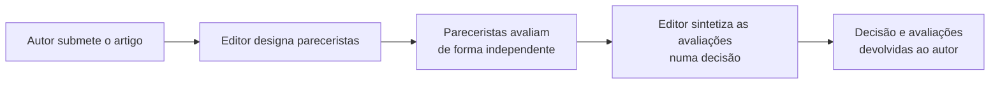

## Objetivos de Aprendizagem

- Distinguir ler um artigo como parecerista, avaliar se ele deve ser aceito, de ler um artigo para uma revisão de literatura, avaliar o que ele contribui para o próprio entendimento.
- Explicar o que avaliar a contribuição de um artigo de fato envolve: julgar novidade, solidez e significância como propriedades separadas e individualmente avaliáveis.
- Descrever o que uma avaliação útil contém, e por que uma avaliação existe para servir tanto à decisão de um editor quanto à capacidade dos autores de melhorar o trabalho.
- Aplicar uma passagem de checagem a uma avaliação rascunhada antes de submetê-la, a mesma disciplina que o próprio conceito de edição de `academic-writing` aplica a um artigo.

## Contexto e Motivação

O `reading-critically-and-writing-a-literature-review` de `academic-writing` cobriu ler literatura de pesquisa para construir o próprio entendimento e situar o próprio trabalho dentro dela. Este conceito cobre uma tarefa de leitura genuinamente diferente que se espera que os pesquisadores de pós-graduação assumam bem antes de ocupar qualquer papel editorial formal: ler um artigo submetido como parecerista, perguntando não o que isto contribui para o meu próprio projeto, mas se este artigo específico, como está escrito, deve ser aceito para publicação. O capítulo de Zobel sobre ler e avaliar trata isso como uma habilidade distinta própria, com a sua própria estrutura real, "Authors, Editors, and Referees", "Contribution", "Evaluation of Papers", "Content of Reviews", "Drafting a Review" e "Checking Your Review".

## Teoria Central

### Autores, editores e pareceristas: os papéis no processo de avaliação



O papel de um parecerista é mais estreito e mais específico do que pode parecer à primeira vista: fornecer uma avaliação honesta e bem fundamentada para ajudar o editor a decidir, e fornecer feedback que ajude os autores a melhorar o trabalho, seja ou não ele por fim aceito desta vez. Um parecerista não é o tomador de decisão final, esse é o papel do editor, sintetizando múltiplas avaliações independentes, às vezes conflitantes, numa só decisão.

### Avaliar a contribuição: novidade, solidez, significância

```text
Novidade:      isto é genuinamente novo, não já estabelecido por trabalho
               publicado anterior que os autores podem ou não conhecer?

Solidez:       o método é de fato correto, e a evidência
               apresentada de fato apoia as afirmações sendo feitas?

Significância: mesmo que novo e sólido, esta contribuição importa
               o bastante para a área a ponto de justificar publicação neste
               veículo específico?
```

Zobel trata essas como propriedades separáveis que um parecerista cuidadoso avalia individualmente, e não dobradas numa única impressão geral vaga. Um artigo pode ser sólido, mas não novo (um resultado correto, mas já conhecido), novo, mas não sólido (uma afirmação interessante, mas mal apoiada), ou novo e sólido, mas de significância limitada (uma contribuição correta, nova, mas estreita ou menor). Distinguir qual desses se aplica a um dado artigo produz uma avaliação muito mais útil do que um único julgamento indiferenciado de "bom" ou "não bom o bastante".

### O que uma avaliação útil de fato contém

Uma avaliação que serve ao seu propósito duplo, informar a decisão do editor e ajudar os autores a melhorar, precisa de um resumo claro do que o artigo alega contribuir (em parte para confirmar que o parecerista o entendeu corretamente), uma avaliação honesta contra novidade, solidez e significância separadamente, pontos específicos e acionáveis, em vez de uma insatisfação vaga, e uma recomendação apropriadamente ajustada aos padrões de fato do veículo. Uma avaliação que diz só "isto precisa de mais trabalho" sem especificar que trabalho, ou por quê, falha tanto com o editor, que precisa de uma base defensável para uma decisão, quanto com os autores, que não conseguem agir sobre uma insatisfação vaga mesmo que ela por acaso seja justificada.

### Rascunhar e conferir uma avaliação

A orientação de Zobel trata um primeiro rascunho de uma avaliação do mesmo jeito que `editing-and-revision` trata um primeiro rascunho de um artigo: escrito para colocar a avaliação real no papel, e depois conferido deliberadamente antes da submissão, quanto à justiça (o tom é construtivo mesmo onde a avaliação é crítica), quanto à acurácia (a avaliação representa corretamente o que o artigo de fato diz, não uma leitura equivocada dele), e quanto à acionabilidade (os autores, lendo esta avaliação, saberiam especificamente o que abordar). Uma avaliação submetida sem essa passagem de checagem arrisca ser injusta, inacurada ou simplesmente inútil, por mais esforço genuíno que tenha entrado na formação do julgamento subjacente.

## Exemplos Resolvidos

### Exemplo 1: separar novidade de solidez

Um artigo propõe o que parece, a um parecerista não familiarizado com uma subárea específica, uma estratégia de cache genuinamente nova. Uma checagem cuidadosa da literatura, parte do próprio trabalho de avaliação do parecerista, revela que uma estratégia bastante semelhante foi publicada dois anos antes sob uma terminologia diferente. O método do artigo é sólido e a evidência apoia as suas afirmações, mas a sua afirmação central de novidade não se sustenta; a avaliação enuncia essa distinção com precisão, sólido, mas não novo como alegado, em vez de um "rejeitar" vago sem explicar por quê.

### Exemplo 2: uma avaliação acionável versus uma vaga

Um primeiro rascunho de avaliação diz: "A seção de avaliação é fraca." Revisado para ser acionável: "A avaliação testa só uma carga; a afirmação do artigo de aplicabilidade geral precisaria de pelo menos duas cargas adicionais e significativamente diferentes para ser adequadamente apoiada." A versão revisada dá aos autores algo específico e alcançável a abordar.

### Exemplo 3: conferir uma avaliação quanto à justiça antes da submissão

O primeiro rascunho de um parecerista, escrito depois de não ter sido convencido pela afirmação central de um artigo, lê com um tom perceptivelmente dispensivo por toda parte, mesmo em seções que elogiam pontos fortes reais. Na passagem de checagem, o parecerista revisa o tom para permanecer construtivo e específico mesmo onde crítico, preservando a substância de toda crítica e removendo a linguagem que soaria desnecessariamente dura para os autores que a recebem.

## Equívocos Comuns e Armadilhas

- **"Uma avaliação só precisa de um veredito geral: aceitar ou rejeitar."** Separar novidade, solidez e significância produz uma avaliação muito mais útil e defensável do que um único julgamento indiferenciado, tanto para a decisão do editor quanto para a capacidade dos autores de agir sobre o feedback.
- **"Uma avaliação dura e franca é mais honesta do que uma construtiva."** Honestidade e construtividade não estão em tensão; uma avaliação pode ser precisamente crítica, nomeando exatamente o que está errado, e permanecer respeitosa no tom, e a orientação da passagem de checagem de Zobel trata a justiça do tom como uma parte real da qualidade de uma avaliação.
- **"Ler para avaliar é basicamente a mesma habilidade que ler para uma revisão de literatura."** As duas tarefas fazem perguntas diferentes, o que isto contribui para o meu próprio entendimento versus se este artigo específico deve ser aceito, e confundi-las produz avaliações que leem mais como um resumo do que como uma avaliação de fato.

## Resumo

Ler um artigo como parecerista é uma habilidade distinta de ler um para uma revisão de literatura, perguntando especificamente se um artigo deve ser aceito, em vez do que ele contribui para o próprio entendimento do leitor, e avaliar bem a contribuição de um artigo significa separar novidade, solidez e significância como propriedades individualmente avaliáveis, em vez de dobrá-las numa impressão vaga. Uma avaliação útil serve tanto à decisão do editor quanto à capacidade dos autores de melhorar o seu trabalho, o que exige feedback específico e acionável, e rascunhar uma avaliação se beneficia da mesma passagem de checagem deliberada, quanto à justiça, à acurácia e à acionabilidade, que um artigo bem escrito em si exige.

## Documentation Links

- [ACM Digital Library: Justin Zobel, Writing for Computer Science (3ª edição, Springer, 2014)](https://dl.acm.org/doi/10.5555/2742708): as seções "Authors, Editors, and Referees", "Contribution", "Evaluation of Papers", "Content of Reviews", "Drafting a Review" e "Checking Your Review" do Capítulo 3 são a fonte direta da orientação do lado do parecerista coberta aqui.
