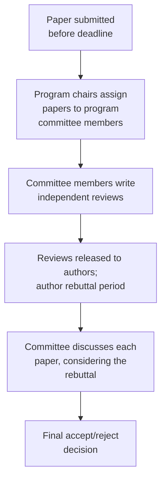

## Learning Objectives

- Explain why computing research places unusually heavy weight on conference publication compared to many other academic fields.
- Describe the real institutional structure of a conference review cycle: program committee assignment, independent review, author rebuttal, and a committee discussion leading to a final decision.
- State what ACM's current policy on authorship, peer review, and conference publication actually governs, and why formalizing this matters.
- Apply this understanding to interpret a real conference review outcome, including how a rebuttal period functions.

## Context & Motivation

`peer-review-from-the-referee-side` covered what a referee actually does when evaluating one paper. This concept zooms out to the institutional machinery a referee's evaluation feeds into, specifically for conferences, which occupy a genuinely unusual position in computing research: unlike most academic fields, where a journal is the primary, most prestigious venue, top computing conferences (systems venues like OSDI and SOSP being direct examples relevant to this curriculum's own Distributed Systems focus, alongside major venues in other subareas) are often the most competitive, most cited, and most career-relevant publication venue in their subfield. Understanding the real process behind that, not just the deadline and the eventual accept-or-reject notification, is what this concept covers.

## Core Theory

### The conference review cycle

A program committee is a group of researchers, typically established, active members of the subfield, who collectively review and decide on a conference's submissions for one year's event. Each paper is typically assigned to several committee members, who write independent reviews before any discussion happens, specifically to avoid one reviewer's opinion anchoring everyone else's before they have formed their own. A rebuttal period, common at many computing venues though not universal, lets authors respond briefly and directly to specific points raised in the reviews, correcting a factual misunderstanding or clarifying an ambiguous point, before the committee's final discussion. This is a real, structured opportunity, not a formality, a well targeted rebuttal genuinely can and does change outcomes.

### Why conferences carry this weight in computing specifically

The practical reason conferences hold unusually high status in computing research traces back to the field's own pace: a conference's fixed annual (or more frequent) deadline and relatively fast turnaround from submission to decision fits a field where research moves quickly and a result can become outdated well before a slower journal review cycle would complete. This is a real, field-specific institutional fact worth understanding explicitly, rather than assuming computing research culture simply mirrors the journal-centric norms of other academic fields, where a conference paper is often treated as a preliminary, lesser publication compared to a journal article.

### ACM's formal policy on the review process

ACM's current Policy on Authorship, Peer Review, Readership, and Conference Publication formalizes real obligations for everyone involved in this process, editors and program chairs handling submissions fairly and without conflicts of interest, reviewers evaluating honestly and confidentially (connecting directly to `confidentiality-and-conflict-of-interest`), and clear expectations around what counts as a legitimate conference publication versus, for instance, republishing substantially the same work at multiple venues without disclosure. That a major, field-wide publishing body maintains this as an explicit, current, formal policy, rather than leaving it to informal convention, is direct evidence the review process's integrity is treated as a real, actively maintained institutional concern.

### Serving on a program committee

Eventually, an experienced graduate researcher, and certainly most faculty, will be invited to serve on a program committee themselves, applying the referee skills from `peer-review-from-the-referee-side` at volume, often reviewing several papers under real time pressure, and participating in committee discussions where reviewers with differing assessments of the same paper have to reach, or at least inform, a collective decision. Understanding the review cycle from the submitting-author side first, as this concept covers, makes that eventual transition to the reviewing side considerably less disorienting.

## Worked Examples

### Example 1: using a rebuttal effectively

A review raises a concern that the paper's evaluation only covers one workload, apparently having missed a second workload reported in an appendix the reviewer did not read closely. The rebuttal politely, briefly points the reviewer to the specific appendix section and result, correcting the factual misunderstanding directly rather than re-arguing the paper's overall contribution, exactly the kind of targeted, effective use of limited rebuttal space that can change an outcome.

### Example 2: understanding why a paper was rejected despite positive individual reviews

A paper receives two mildly positive reviews and one strongly negative review flagging a significant, specific methodological concern the other two reviewers had not caught. In committee discussion, the specific, well substantiated concern outweighs the two milder positive assessments, and the paper is rejected; understanding this as the review cycle's design working as intended, a substantive flaw surfaced by even one careful reviewer, is more useful to a graduate researcher than treating the outcome as simply "bad luck" with reviewer assignment.

### Example 3: recognizing a policy violation

A researcher submits substantially the same paper to two different conferences simultaneously, hoping to increase acceptance odds, without disclosing this to either venue. This is precisely the kind of conduct ACM's conference publication policy is written to prohibit, a real, concrete violation with real consequences, not a harmless efficiency.

## Common Misconceptions & Pitfalls

- **"A conference paper is a lesser publication than a journal paper, in computing as in other fields."** In many areas of computing research, especially systems and distributed systems, the top conferences are the field's most prestigious and competitive venues, a genuinely different norm from fields where journals hold that position.
- **"A rebuttal is just a formality; the decision is already essentially made."** A well targeted rebuttal correcting a specific factual misunderstanding can and does change outcomes; treating it as pointless wastes a real, structured opportunity the review cycle provides.
- **"Getting one harsh review means the paper was reviewed unfairly."** A substantive, well founded concern from even one careful reviewer can and often should outweigh milder positive assessments from others; this is the review process functioning as designed, not evidence of an unfair process.

## Summary

Conferences hold an unusually central place in computing research's publication culture, driven by the field's fast pace relative to slower journal review cycles, and the review cycle behind them, program committee assignment, independent review, author rebuttal, and committee discussion, is a real, structured institutional process, not an opaque black box, with a genuine opportunity for authors to correct factual misunderstandings through rebuttal before a final decision is made. ACM's current, formal policy on authorship, peer review, and conference publication governs this process explicitly, direct institutional evidence that its integrity is actively maintained rather than left to informal convention.

## Documentation Links

- [ACM: Policy on Authorship, Peer Review, Readership, and Conference Publication](https://www.acm.org/publications/policies/roles-and-responsibilities): the current, formal policy governing the conference review process described in this concept.
- [ACM Digital Library: Justin Zobel, Writing for Computer Science (3rd Edition, Springer, 2014)](https://dl.acm.org/doi/10.5555/2742708): additional context on the author-editor-referee relationship this concept extends to the full committee-based conference review process.
