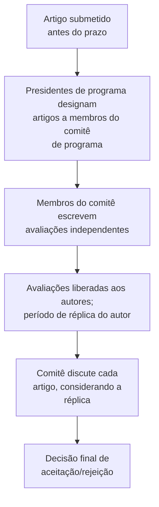

## Objetivos de Aprendizagem

- Explicar por que a pesquisa em computação põe um peso incomumente alto na publicação em conferências em comparação com muitos outros campos acadêmicos.
- Descrever a estrutura institucional real de um ciclo de avaliação de conferência: designação do comitê de programa, avaliação independente, réplica do autor, e uma discussão do comitê levando a uma decisão final.
- Enunciar o que a política atual da ACM sobre autoria, avaliação por pares e publicação em conferências de fato rege, e por que formalizar isso importa.
- Aplicar esse entendimento para interpretar um desfecho real de avaliação de conferência, incluindo como um período de réplica funciona.

## Contexto e Motivação

`peer-review-from-the-referee-side` cobriu o que um parecerista de fato faz ao avaliar um artigo. Este conceito amplia o olhar para a maquinaria institucional na qual a avaliação de um parecerista deságua, especificamente para conferências, que ocupam uma posição genuinamente incomum na pesquisa em computação: diferentemente da maioria dos campos acadêmicos, onde um periódico é o veículo primário e mais prestigioso, as melhores conferências de computação (veículos de sistemas como OSDI e SOSP sendo exemplos diretos relevantes para o próprio foco em Sistemas Distribuídos deste currículo, ao lado de grandes veículos em outras subáreas) são muitas vezes o veículo de publicação mais competitivo, mais citado e mais relevante para a carreira na sua subárea. Entender o processo real por trás disso, não só o prazo e a eventual notificação de aceitação ou rejeição, é o que este conceito cobre.

## Teoria Central

### O ciclo de avaliação de conferência

Um comitê de programa é um grupo de pesquisadores, tipicamente membros estabelecidos e ativos da subárea, que coletivamente avaliam e decidem sobre as submissões de uma conferência para o evento de um ano. Cada artigo é tipicamente designado a vários membros do comitê, que escrevem avaliações independentes antes de qualquer discussão acontecer, especificamente para evitar que a opinião de um avaliador ancore a de todos os demais antes de eles terem formado a sua própria. Um período de réplica, comum em muitos veículos de computação, embora não universal, permite aos autores responder brevemente e diretamente a pontos específicos levantados nas avaliações, corrigindo um mal-entendido factual ou esclarecendo um ponto ambíguo, antes da discussão final do comitê. Essa é uma oportunidade real e estruturada, não uma formalidade, uma réplica bem direcionada genuinamente pode mudar e muda desfechos.

### Por que as conferências carregam esse peso em computação especificamente

A razão prática pela qual as conferências têm um status incomumente alto na pesquisa em computação remonta ao próprio ritmo do campo: o prazo anual fixo (ou mais frequente) de uma conferência e o tempo de retorno relativamente rápido da submissão à decisão se ajustam a um campo onde a pesquisa anda depressa e um resultado pode se tornar desatualizado bem antes de um ciclo de avaliação de periódico mais lento se completar. Esse é um fato institucional real e específico do campo que vale entender explicitamente, em vez de assumir que a cultura de pesquisa em computação simplesmente espelha as normas centradas em periódicos de outros campos acadêmicos, onde um artigo de conferência é muitas vezes tratado como uma publicação preliminar e menor em comparação com um artigo de periódico.

### A política formal da ACM sobre o processo de avaliação

A atual Política da ACM sobre Autoria, Avaliação por Pares, Leitoria e Publicação em Conferências formaliza obrigações reais para todos os envolvidos nesse processo, editores e presidentes de programa tratando as submissões de forma justa e sem conflitos de interesse, avaliadores avaliando de forma honesta e confidencial (conectando-se diretamente a `confidentiality-and-conflict-of-interest`), e expectativas claras em torno do que conta como uma publicação de conferência legítima versus, por exemplo, republicar substancialmente o mesmo trabalho em múltiplos veículos sem revelação. Que um grande órgão editorial de abrangência de campo mantenha isso como uma política explícita, atual e formal, em vez de deixá-lo à convenção informal, é evidência direta de que a integridade do processo de avaliação é tratada como uma preocupação institucional real e ativamente mantida.

### Servir num comitê de programa

Eventualmente, um pesquisador de pós-graduação experiente, e certamente a maioria dos docentes, será convidado a servir ele mesmo num comitê de programa, aplicando as habilidades de parecerista de `peer-review-from-the-referee-side` em volume, muitas vezes avaliando vários artigos sob pressão real de tempo, e participando de discussões de comitê onde avaliadores com avaliações divergentes do mesmo artigo têm de chegar a, ou ao menos informar, uma decisão coletiva. Entender o ciclo de avaliação primeiro pelo lado do autor que submete, como este conceito cobre, torna essa eventual transição para o lado da avaliação consideravelmente menos desorientadora.

## Exemplos Resolvidos

### Exemplo 1: usar uma réplica de forma eficaz

Uma avaliação levanta uma preocupação de que a avaliação do artigo cobre só uma carga, aparentemente tendo perdido uma segunda carga relatada num apêndice que o avaliador não leu de perto. A réplica, educada e brevemente, aponta ao avaliador a seção e o resultado específicos do apêndice, corrigindo o mal-entendido factual diretamente, em vez de reargumentar a contribuição geral do artigo, exatamente o tipo de uso direcionado e eficaz do espaço limitado de réplica que pode mudar um desfecho.

### Exemplo 2: entender por que um artigo foi rejeitado apesar de avaliações individuais positivas

Um artigo recebe duas avaliações levemente positivas e uma avaliação fortemente negativa sinalizando uma preocupação metodológica significativa e específica que os outros dois avaliadores não haviam pego. Na discussão do comitê, a preocupação específica e bem substanciada supera as duas avaliações positivas mais brandas, e o artigo é rejeitado; entender isso como o desenho do ciclo de avaliação funcionando como pretendido, uma falha substantiva trazida à tona por mesmo um avaliador cuidadoso, é mais útil a um pesquisador de pós-graduação do que tratar o desfecho simplesmente como "azar" com a designação de avaliadores.

### Exemplo 3: reconhecer uma violação de política

Um pesquisador submete substancialmente o mesmo artigo a duas conferências diferentes simultaneamente, na esperança de aumentar as chances de aceitação, sem revelar isso a nenhum dos veículos. Esse é precisamente o tipo de conduta que a política de publicação em conferências da ACM é escrita para proibir, uma violação real e concreta com consequências reais, e não uma eficiência inofensiva.

## Equívocos Comuns e Armadilhas

- **"Um artigo de conferência é uma publicação menor do que um artigo de periódico, em computação como em outros campos."** Em muitas áreas da pesquisa em computação, especialmente sistemas e sistemas distribuídos, as melhores conferências são os veículos mais prestigiosos e competitivos do campo, uma norma genuinamente diferente de campos onde os periódicos ocupam essa posição.
- **"Uma réplica é só uma formalidade; a decisão já está essencialmente tomada."** Uma réplica bem direcionada que corrige um mal-entendido factual específico pode mudar e muda desfechos; tratá-la como inútil desperdiça uma oportunidade real e estruturada que o ciclo de avaliação fornece.
- **"Receber uma avaliação dura significa que o artigo foi avaliado de forma injusta."** Uma preocupação substantiva e bem fundamentada de mesmo um avaliador cuidadoso pode e muitas vezes deve superar avaliações positivas mais brandas de outros; isso é o processo de avaliação funcionando como projetado, e não evidência de um processo injusto.

## Resumo

As conferências ocupam um lugar incomumente central na cultura de publicação da pesquisa em computação, impulsionado pelo ritmo rápido do campo em relação aos ciclos de avaliação de periódicos mais lentos, e o ciclo de avaliação por trás delas, designação do comitê de programa, avaliação independente, réplica do autor e discussão do comitê, é um processo institucional real e estruturado, e não uma caixa-preta opaca, com uma oportunidade genuína de os autores corrigirem mal-entendidos factuais por meio da réplica antes de uma decisão final ser tomada. A política atual e formal da ACM sobre autoria, avaliação por pares e publicação em conferências rege esse processo explicitamente, evidência institucional direta de que a sua integridade é ativamente mantida, em vez de deixada à convenção informal.

## Documentation Links

- [ACM: Policy on Authorship, Peer Review, Readership, and Conference Publication](https://www.acm.org/publications/policies/roles-and-responsibilities): a política atual e formal que rege o processo de avaliação de conferência descrito neste conceito.
- [ACM Digital Library: Justin Zobel, Writing for Computer Science (3ª edição, Springer, 2014)](https://dl.acm.org/doi/10.5555/2742708): contexto adicional sobre a relação autor-editor-parecerista que este conceito estende ao processo completo de avaliação de conferência baseado em comitê.
