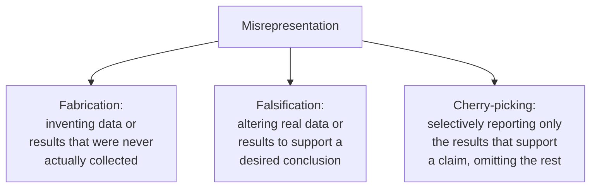

## Learning Objectives

- Explain research output as a real intellectual creation with real ownership questions, distinct from the plagiarism concerns already covered in `academic-writing`.
- State ACM's current, concrete criteria for who qualifies as an author on a research work, and identify authorship practices the policy explicitly names as violations.
- Define misrepresentation of results, and distinguish clear-cut fabrication from subtler forms, like a cherry-picked figure implying a stronger effect than the full data supports.
- Apply the authorship criteria to a described multi-person research collaboration to determine who should and should not be listed as an author.

## Context & Motivation

`academic-writing`'s `citation-reference-and-avoiding-plagiarism` covered one major category of research misconduct in depth, misrepresenting someone else's work as one's own. This concept covers the rest of the research ethics ground Zobel's closing chapter addresses: treating research output as a real intellectual creation with real questions of ownership and credit attached to it, who actually did enough to be named an author, and what counts as misrepresenting one's own results, not someone else's, a genuinely different and in some ways subtler category of misconduct.

## Core Theory

### Research output as intellectual creation

A research contribution, an algorithm, a proof, a dataset, a piece of analysis, is a real intellectual creation, and Zobel treats questions of who actually created it, and who therefore deserves credit and bears responsibility for it, as foundational to everything else in research ethics. This framing matters because it grounds authorship and misrepresentation, covered next, in a concrete question: whose intellectual work does this output actually represent, and is that accurately reflected in how the work is credited and described.

### Who qualifies as an author

```text
ACM's current authorship criteria (paraphrased):
  - Made a substantial intellectual contribution to some component
    of the work (conception, design, analysis, drafting, or revision)
  - Takes full responsibility for the content of the published work
  - Is an identifiable, real individual (not a generative AI tool,
    not an anonymous or pseudonymous entity without real contact
    information on file)

Explicitly named as violations:
  - Gift authorship: listing someone as an author who did not meet
    the criteria, often as a favor or out of seniority
  - Ghost authorship: NOT listing someone who did meet the criteria
  - Guest authorship: listing a prominent figure to lend credibility,
    without a real contribution
  - Purchased authorship: paying for an author credit
```

ACM's current policy on authorship makes this concrete and checkable rather than leaving it to informal convention or hierarchy: contribution and responsibility are what earn authorship, not seniority, not providing funding alone, not simply running an experiment someone else designed without further intellectual contribution. This matters directly for graduate researchers, who are frequently in the least powerful position in an authorship discussion and benefit most from a clear, external, citable standard rather than an implicit departmental norm that may not actually match the field's formal policy.

### Misrepresentation of one's own results



Fabrication and falsification are unambiguous, serious violations. Cherry-picking is subtler and, in Zobel's treatment, arguably more common in practice: reporting only the favorable subset of tested conditions, or presenting a figure constructed in a way that visually exaggerates an effect (connecting directly to `research-statistics`'s own treatment of honest graph construction), misrepresents the work's real findings without any single reported number necessarily being false. This connects back to `good-and-bad-science-measurement-and-reflection`'s standard of honesty about what was and was not tested; misrepresentation, in this broader sense, is exactly the failure that standard exists to prevent.

## Worked Examples

### Example 1: an authorship dispute resolved by the criteria

A graduate student runs all the experiments for a paper based on a research design their advisor proposed, and a lab colleague provides a dataset but has no further involvement. Applying ACM's criteria: the student clearly qualifies (substantial contribution to the experimental work, and responsibility for its content), the advisor clearly qualifies (contribution to conception and design), and the colleague providing only a dataset with no further intellectual contribution to the work itself typically does not meet the bar for authorship, though an acknowledgment is appropriate.

### Example 2: recognizing gift authorship

A senior researcher is added as an author on a paper primarily because of their reputation and seniority, despite having read only the final draft and made no substantive contribution to the work's conception, execution, or analysis. This is precisely what ACM's policy names as gift authorship, a clear violation regardless of how common the practice may be in a particular research culture.

### Example 3: cherry-picking without outright falsification

An evaluation tests a new method on six workloads; results are favorable on four and unfavorable on two. The paper reports only the four favorable results, with no mention that two additional workloads were tested. No individual number reported is false, but the overall impression given, that the method performs well broadly, misrepresents the actual, more mixed finding; this is exactly the honest-scope failure `good-and-bad-science-measurement-and-reflection` and this concept both warn against.

## Common Misconceptions & Pitfalls

- **"Authorship should reflect seniority or who led the lab, not just who did the work."** ACM's current policy grounds authorship explicitly in substantial intellectual contribution and responsibility for the work, not seniority; gift authorship based on status alone is a named, explicit violation.
- **"Only outright fabricated data counts as misrepresentation."** Cherry-picking, selectively reporting favorable results while omitting unfavorable ones actually tested, misrepresents a work's real findings without any single number being false, and is a real, if subtler, form of misrepresentation.
- **"A student who ran the experiments but didn't design the study shouldn't be a full author."** ACM's criteria recognize substantial contribution to any of several components, conception, design, analysis, drafting, revision, execution generally counting as real, substantial intellectual contribution, not a secondary role automatically excluded from authorship.

## Summary

Research output is a real intellectual creation, and this concept covers the ethics of crediting it accurately: ACM's current authorship policy grounds who qualifies as an author in substantial intellectual contribution and acceptance of responsibility, not seniority or funding alone, and explicitly names gift, ghost, guest, and purchased authorship as violations of that standard. Misrepresenting one's own results ranges from unambiguous fabrication and falsification to the subtler, arguably more common failure of cherry-picking, selectively reporting favorable results while omitting unfavorable ones actually tested, which misrepresents a work's real findings without any individually reported number being false.

## Documentation Links

- [ACM Digital Library: Justin Zobel, Writing for Computer Science (3rd Edition, Springer, 2014)](https://dl.acm.org/doi/10.5555/2742708): Chapter 17's "Intellectual Creations," "Misrepresentation," and "Authorship" sections are a direct source for the research-ethics framework covered here.
- [ACM: Policy on Authorship](https://www.acm.org/publications/policies/new-acm-policy-on-authorship): the current, official criteria for who qualifies as an author and the named authorship violations covered in this concept.
