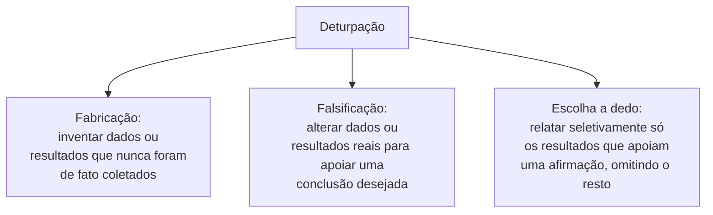

## Objetivos de Aprendizagem

- Explicar o resultado de pesquisa como uma criação intelectual real com questões reais de propriedade, distinta das preocupações com plágio já cobertas em `academic-writing`.
- Enunciar os critérios atuais e concretos da ACM sobre quem se qualifica como autor de um trabalho de pesquisa, e identificar as práticas de autoria que a política nomeia explicitamente como violações.
- Definir a deturpação de resultados, e distinguir a fabricação flagrante de formas mais sutis, como uma figura escolhida a dedo que sugere um efeito mais forte do que os dados completos sustentam.
- Aplicar os critérios de autoria a uma colaboração de pesquisa de várias pessoas descrita para determinar quem deve e quem não deve ser listado como autor.

## Contexto e Motivação

O `citation-reference-and-avoiding-plagiarism` de `academic-writing` cobriu em profundidade uma grande categoria de má conduta em pesquisa, deturpar o trabalho de outra pessoa como se fosse próprio. Este conceito cobre o resto do terreno de ética de pesquisa que o capítulo final de Zobel aborda: tratar o resultado de pesquisa como uma criação intelectual real com questões reais de propriedade e crédito atreladas a ela, quem de fato fez o bastante para ser nomeado autor, e o que conta como deturpar os próprios resultados, e não os de outra pessoa, uma categoria de má conduta genuinamente diferente e, de certa forma, mais sutil.

## Teoria Central

### O resultado de pesquisa como criação intelectual

Uma contribuição de pesquisa, um algoritmo, uma prova, um conjunto de dados, um pedaço de análise, é uma criação intelectual real, e Zobel trata as questões de quem de fato a criou, e quem, portanto, merece crédito e carrega responsabilidade por ela, como fundamentais para todo o resto da ética de pesquisa. Esse enquadramento importa porque fundamenta a autoria e a deturpação, cobertas a seguir, numa pergunta concreta: de quem é o trabalho intelectual que este resultado de fato representa, e isso está refletido com acurácia em como o trabalho é creditado e descrito.

### Quem se qualifica como autor

```text
Critérios atuais de autoria da ACM (parafraseados):
  - Fez uma contribuição intelectual substancial a algum componente
    do trabalho (concepção, projeto, análise, redação ou revisão)
  - Assume responsabilidade plena pelo conteúdo do trabalho publicado
  - É um indivíduo identificável e real (não uma ferramenta de IA
    generativa, não uma entidade anônima ou pseudônima sem informação de
    contato real em registro)

Nomeados explicitamente como violações:
  - Autoria de presente: listar como autor alguém que não atendeu
    aos critérios, muitas vezes como favor ou por senioridade
  - Autoria fantasma: NÃO listar alguém que atendeu aos critérios
  - Autoria de convidado: listar uma figura proeminente para emprestar credibilidade,
    sem uma contribuição real
  - Autoria comprada: pagar por um crédito de autoria
```

A política atual da ACM sobre autoria torna isso concreto e conferível, em vez de deixá-lo à convenção informal ou à hierarquia: contribuição e responsabilidade são o que conquistam a autoria, e não a senioridade, não fornecer financiamento sozinho, não simplesmente rodar um experimento que outra pessoa projetou sem contribuição intelectual adicional. Isso importa diretamente para os pesquisadores de pós-graduação, que estão frequentemente na posição menos poderosa numa discussão de autoria e se beneficiam mais de um padrão claro, externo e citável do que de uma norma departamental implícita que pode não bater de fato com a política formal do campo.

### Deturpação dos próprios resultados



Fabricação e falsificação são violações inequívocas e sérias. A escolha a dedo é mais sutil e, no tratamento de Zobel, indiscutivelmente mais comum na prática: relatar só o subconjunto favorável de condições testadas, ou apresentar uma figura construída de uma forma que exagera visualmente um efeito (conectando-se diretamente ao próprio tratamento de `research-statistics` sobre a construção honesta de gráficos), deturpa as descobertas reais do trabalho sem que nenhum número relatado individual seja necessariamente falso. Isso se conecta de volta ao padrão de `good-and-bad-science-measurement-and-reflection` de honestidade sobre o que foi e o que não foi testado; a deturpação, nesse sentido mais amplo, é exatamente a falha que esse padrão existe para prevenir.

## Exemplos Resolvidos

### Exemplo 1: uma disputa de autoria resolvida pelos critérios

Um estudante de pós-graduação roda todos os experimentos de um artigo com base num projeto de pesquisa que o seu orientador propôs, e um colega de laboratório fornece um conjunto de dados, mas não tem envolvimento adicional. Aplicando os critérios da ACM: o estudante claramente se qualifica (contribuição substancial ao trabalho experimental, e responsabilidade pelo seu conteúdo), o orientador claramente se qualifica (contribuição à concepção e ao projeto), e o colega que fornece só um conjunto de dados sem contribuição intelectual adicional ao trabalho em si tipicamente não atinge o limiar para a autoria, embora um agradecimento seja apropriado.

### Exemplo 2: reconhecer a autoria de presente

Um pesquisador sênior é adicionado como autor de um artigo principalmente por causa da sua reputação e senioridade, apesar de ter lido só o rascunho final e de não ter feito nenhuma contribuição substantiva à concepção, execução ou análise do trabalho. Isso é precisamente o que a política da ACM nomeia como autoria de presente, uma violação clara, por mais comum que a prática possa ser numa cultura de pesquisa específica.

### Exemplo 3: escolha a dedo sem falsificação flagrante

Uma avaliação testa um novo método em seis cargas; os resultados são favoráveis em quatro e desfavoráveis em duas. O artigo relata só os quatro resultados favoráveis, sem menção de que duas cargas adicionais foram testadas. Nenhum número individual relatado é falso, mas a impressão geral dada, de que o método se sai bem amplamente, deturpa a descoberta real e mais mista; essa é exatamente a falha de escopo honesto contra a qual `good-and-bad-science-measurement-and-reflection` e este conceito ambos advertem.

## Equívocos Comuns e Armadilhas

- **"A autoria deve refletir a senioridade ou quem liderou o laboratório, não só quem fez o trabalho."** A política atual da ACM fundamenta a autoria explicitamente na contribuição intelectual substancial e na responsabilidade pelo trabalho, e não na senioridade; a autoria de presente baseada só no status é uma violação nomeada e explícita.
- **"Só dados flagrantemente fabricados contam como deturpação."** A escolha a dedo, relatar seletivamente resultados favoráveis enquanto se omitem os desfavoráveis de fato testados, deturpa as descobertas reais de um trabalho sem que nenhum número individual seja falso, e é uma forma real, ainda que mais sutil, de deturpação.
- **"Um estudante que rodou os experimentos, mas não projetou o estudo não deveria ser um autor pleno."** Os critérios da ACM reconhecem a contribuição substancial a qualquer um de vários componentes, concepção, projeto, análise, redação, revisão, com a execução geralmente contando como contribuição intelectual real e substancial, e não como um papel secundário automaticamente excluído da autoria.

## Resumo

O resultado de pesquisa é uma criação intelectual real, e este conceito cobre a ética de creditá-lo com acurácia: a política atual de autoria da ACM fundamenta quem se qualifica como autor na contribuição intelectual substancial e na aceitação de responsabilidade, e não na senioridade ou no financiamento sozinho, e nomeia explicitamente a autoria de presente, fantasma, de convidado e comprada como violações desse padrão. Deturpar os próprios resultados varia da fabricação e da falsificação inequívocas à falha mais sutil e indiscutivelmente mais comum da escolha a dedo, relatar seletivamente resultados favoráveis enquanto se omitem os desfavoráveis de fato testados, que deturpa as descobertas reais de um trabalho sem que nenhum número relatado individualmente seja falso.

## Documentation Links

- [ACM Digital Library: Justin Zobel, Writing for Computer Science (3ª edição, Springer, 2014)](https://dl.acm.org/doi/10.5555/2742708): as seções "Intellectual Creations", "Misrepresentation" e "Authorship" do Capítulo 17 são uma fonte direta do arcabouço de ética de pesquisa coberto aqui.
- [ACM: Policy on Authorship](https://www.acm.org/publications/policies/new-acm-policy-on-authorship): os critérios atuais e oficiais sobre quem se qualifica como autor e as violações de autoria nomeadas cobertas neste conceito.
