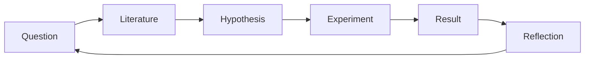

## Learning Objectives

- Connect the undergraduate capstone's question-cycle to graduate research run across an entire career, not a single project.
- Explain why treating a confirmed result as a finished, closed matter understates what research actually is, drawing together Hamming's and Zobel's independently arrived-at versions of this same point.
- Summarize how the three disciplines of `graduate-studies`, writing, method, and culture, function together as ongoing practice rather than a credential earned once.
- Apply this closing framework to this curriculum's own stated ambition of sustained distributed systems research specifically.

## Context & Motivation

This concept closes `graduate-culture`, and with it, the `graduate-studies` category as a whole. It exists to tie the discipline-by-discipline material this category has built, `academic-writing`'s craft of writing, `research-statistics`'s method of designing trustworthy experiments, and `graduate-culture`'s own material on the institutions and relationships research happens within, back to where this platform's own research thread began: the undergraduate capstone's cycle of question, literature, papers, hypothesis, implementation, experiment, result, reflection, new question. That cycle does not end once a graduate degree is earned; it is run again, and again, across an entire research career, and this concept is about what sustaining that practice actually means.

## Core Theory

### The same cycle, run across a career instead of a project



The undergraduate capstone's cycle, question through reflection back to a new question, is not a beginner's simplified version of research that graduate work replaces with something different; it is the same underlying cycle, run here with far greater depth per iteration, informed by the full craft this category has built, and sustained across years rather than one project. A graduate researcher who internalizes `academic-writing`'s skeptical-reader discipline, `research-statistics`'s honest experimental methodology, and `graduate-culture`'s understanding of the institutions and relationships surrounding research is running the exact same cycle the capstone introduced, just with far more capability at every step.

### A confirmed result is not a closed matter

`good-and-bad-science-measurement-and-reflection` already established, from Zobel's own closing reflection on hypotheses and evidence, that a confirmed hypothesis in one specific setting is one data point in a continuing investigation, not a finished question. Hamming's talk, covered in `what-makes-research-significant`, arrives at a closely related point from a different angle: the researchers who produce the most significant work over a career are the ones who keep choosing new, important, often harder questions rather than treating an earlier success as a plateau to rest on. Two independently developed sources, one focused on the epistemics of a single result, the other on the arc of an entire career, converge on the same underlying claim: research is a continuing practice, not a sequence of individually closed, separate achievements.

### Writing, method, and culture as one ongoing practice

```text
academic-writing:      the craft of communicating research honestly
                        and persuasively, to a skeptical reader

research-statistics:   the method of designing and evaluating
                        research trustworthily, so what gets
                        communicated is actually sound

graduate-culture:       the institutions (peer review, ethics,
                        conferences) and relationships (advisors,
                        research communities) research happens
                        within, and how to sustain the practice
                        itself over a career
```

These three disciplines are not three separate, checkbox-style competencies to acquire once. They are three interdependent dimensions of the same ongoing practice: writing without sound method produces persuasive but untrustworthy claims; sound method without honest writing fails to actually communicate what was learned; and either without a sustainable relationship to the surrounding research community and to one's own motivation eventually stalls regardless of individual skill. Sustaining a research career means continuing to practice all three together, not mastering one and setting the others aside.

### Applying this to distributed systems specifically

This curriculum's own stated ambition, real scientific research lines around Distributed Systems, is exactly what this closing framework is meant to make concrete rather than aspirational. `research-statistics`'s own capstone, `designing-experiments-for-distributed-systems-research`, already showed what applying this category's full methodology to that specific domain looks like for one project. Sustaining that as a genuine research line, not a single project, means running the cycle this concept describes repeatedly within that domain: a confirmed result about consensus behavior under partition raising a new, narrower or adjacent question about a different failure mode, a different consistency trade-off, a different workload, each iteration informed by everything `graduate-studies` as a whole has built, rather than each project starting over from nothing.

## Worked Examples

### Example 1: a completed thesis chapter generating a new question

A researcher's thesis chapter confirms a hybrid quorum design reduces tail latency under partial partition, exactly the kind of result `research-statistics`'s own capstone concept was built around. Rather than treating this as the finished answer to the original research question, the researcher, applying this concept's framework, asks the natural next question the result raises: does the same design hold up under a different, more adversarial partition pattern, or under a workload with more extreme key skew, the new question that continues the cycle rather than closing it.

### Example 2: sustaining a research line, not just a research project

Over several years, a researcher's work moves from an initial result on quorum-based replication, to a follow-up investigating a specific failure mode that result surfaced, to a further project applying lessons from both to a related consensus protocol design. Recognizing this trajectory as one continuing research line, informed at every step by the same writing craft, experimental method, and professional practice this category built, rather than three disconnected projects, is what "sustaining a research career" concretely looks like in practice.

### Example 3: applying Hamming's and Zobel's convergent point directly

A researcher, having just had a paper accepted reporting a genuinely significant result, considers what to work on next. Applying this concept's synthesis of Hamming's and Zobel's independently arrived-at point, the researcher treats the accepted result as one confirmed data point that has, in fact, raised several new and arguably more important questions, rather than as a plateau justifying a shift toward safer, more purely incremental follow-up work for its own sake.

## Common Misconceptions & Pitfalls

- **"Graduate research and the undergraduate capstone's research cycle are fundamentally different activities."** They are the same underlying cycle, question through reflection back to a new question, run at far greater depth and sustained over a much longer timeframe, not two separate processes.
- **"Once I've mastered writing, method, or professional practice, I can set the others aside and focus on the one I'm best at."** The three function as interdependent dimensions of one ongoing practice; strength in one does not substitute for the others, since persuasive but unsound writing, sound but poorly communicated method, and either without a sustainable relationship to the research community all eventually undermine a research career.
- **"A significant, confirmed result is a natural stopping point or plateau."** Both Zobel's and Hamming's independently developed perspectives treat a confirmed result as raising new questions rather than closing the investigation, and researchers who treat significant results as plateaus, per Hamming's own observation, tend to produce less significant work over a full career than those who keep choosing new, important questions.

## Summary

This closing concept ties `graduate-studies`'s three disciplines, the writing craft of `academic-writing`, the experimental method of `research-statistics`, and the institutions and relationships of `graduate-culture` itself, back to the same research cycle this platform's undergraduate capstone already introduces, run here at far greater depth and sustained across an entire career rather than a single project. Zobel's and Hamming's independently developed perspectives converge on the same underlying point, that a confirmed result is one data point in a continuing investigation rather than a closed, finished matter, and this curriculum's own stated ambition of sustained distributed systems research specifically is what this framework, applied concretely rather than left abstract, is meant to support.

## Documentation Links

- [Richard Hamming, You and Your Research (Bell Communications Research, 1986)](https://www.cs.princeton.edu/~jrex/teaching/spring2005/fft/hamming.html): the direct source for the career-spanning perspective on choosing new, significant questions rather than resting on past results.
- [ACM Digital Library: Justin Zobel, Writing for Computer Science (3rd Edition, Springer, 2014)](https://dl.acm.org/doi/10.5555/2742708): Chapter 4's "Reflections on Research" is the direct source for the complementary, result-focused version of the same closing point covered here.
