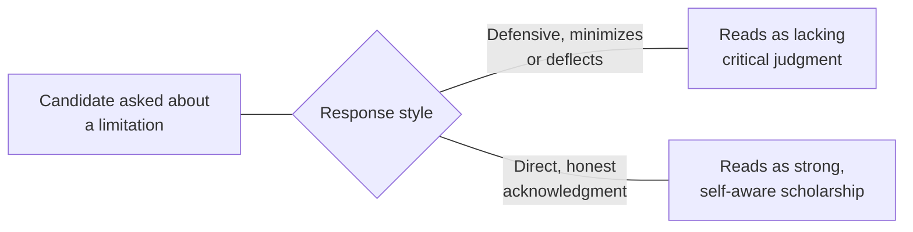

## Learning Objectives

- Distinguish the oral examination from the written thesis it follows, and explain why it requires its own, separate preparation discipline.
- Describe concrete preparation strategies for a viva or thesis defense: anticipating likely examiner questions, and rehearsing a clear, honest account of the work's real contribution and limitations.
- Explain why an honest account of a work's limitations is a strength, not a weakness, in the defense context specifically, extending a theme already established in `academic-writing`.
- Apply preparation strategies to a described set of anticipated defense questions, including handling an unexpected or difficult question calmly.

## Context & Motivation

`academic-writing`'s `thesis-and-dissertation-structure` covered the written document a thesis or dissertation actually is. This concept covers what typically follows it: an oral examination, called a viva voce or thesis defense depending on the institution, where the candidate defends the work directly, in conversation, to examiners. Rowena Murray's dedicated text on surviving a viva, written specifically for this purpose and widely used across graduate programs, treats this as a genuinely different act of persuasion from the written thesis, live, conversational, and unable to be revised after the fact the way a written draft can be, which is exactly why it deserves its own, separate preparation discipline.

## Core Theory

### Why the oral examination is a different task from the written thesis

```text
Written thesis:        can be revised repeatedly before submission;
                        the examiner reads it at their own pace, with
                        time to re-read a difficult section.

Oral examination:       live, conversational; the candidate cannot
                        revise an answer after giving it, and has to
                        respond to unanticipated questions in real
                        time, without the luxury of a redraft.
```

This distinction is the same one `research-talks-and-presentations` already drew between a written paper and a live talk, applied here to the highest-stakes oral presentation most graduate researchers will give: a live audience, here specifically the examiners, cannot be shown a revised version of an answer, which means preparation has to happen before the exam, not during it.

### Anticipating likely examiner questions

Murray's guidance treats preparing for likely questions as a concrete, practical exercise, not vague general readiness: examiners commonly ask about the work's central contribution stated plainly (why does this matter, and to whom), about specific methodological choices and why alternatives were not chosen, about how the work relates to closely related prior work, and about what the candidate would do differently or investigate next given more time. Preparing clear, rehearsed, but genuinely honest answers to this recurring, predictable core of question types covers a large fraction of what most defenses actually involve, even though the exact wording of any specific question cannot be predicted precisely.

### Honesty about limitations as a strength, not a weakness



This extends a theme `academic-writing`'s `thesis-and-dissertation-structure` already established: an examiner is specifically assessing critical judgment, not merely whether the work is flawless, and a candidate who responds to a question about a real limitation with a direct, honest acknowledgment, rather than deflecting or minimizing it, demonstrates exactly the self-aware, critical scholarship a thesis defense exists to certify. Murray treats rehearsing this kind of honest response specifically, not just rehearsing a defense of the work's strengths, as real, important preparation.

### Handling an unexpected or difficult question

Concrete strategies for a genuinely unexpected question include pausing deliberately before answering rather than rushing into a response, asking the examiner to clarify or rephrase a question that was not fully understood rather than guessing at its intent, and, where a question genuinely exceeds what the work investigated, stating that honestly, what would be needed to answer it, rather than improvising an unsupported answer under pressure. Murray's guidance treats these as rehearsable habits, practiced calm responses to pressure, not innate composure some candidates simply have and others lack.

## Worked Examples

### Example 1: preparing for a predictable core question

A candidate anticipates being asked to state their thesis's central contribution in one or two sentences a non-specialist could follow, a nearly universal defense question. Rehearsing a clear, concise answer in advance, rather than assuming it will come naturally under pressure, means the candidate opens the defense confidently on exactly the question most likely to be asked first.

### Example 2: responding honestly to a limitations question

Asked why the evaluation only covers three workloads rather than a broader range, a candidate who has rehearsed an honest response states plainly that time and resource constraints limited the evaluation's scope, and describes specifically what a broader evaluation would need to cover, rather than implying the three workloads were fully sufficient on their own; this direct, self-aware answer is stronger than a defensive one would be.

### Example 3: handling a genuinely unexpected question calmly

An examiner asks a question touching on a related area the thesis did not investigate at all. Rather than improvising a guess, the candidate pauses, acknowledges directly that this was outside the thesis's scope, and offers a brief, genuine, first-principles reasoning about how the work's existing findings might relate to the question, clearly distinguishing this reasoning from an established result; this calm, honest handling of a genuinely unanticipated question is exactly the rehearsed composure Murray's preparation strategies aim to build.

## Common Misconceptions & Pitfalls

- **"If the written thesis is strong, the oral defense should take care of itself."** The oral examination is a genuinely different, live task requiring its own preparation; a strong written thesis does not automatically translate into confident, well handled live responses to unanticipated questions.
- **"Admitting a limitation during the defense weakens the candidate's position."** An examiner is specifically assessing critical judgment; a direct, honest acknowledgment of a real limitation reads as stronger scholarship than a defensive or minimizing response, extending the same principle `academic-writing`'s thesis concept already established for the written document.
- **"Composure under an unexpected question is a fixed personal trait, not something that can be prepared for."** Murray treats calm handling of unanticipated questions, pausing, asking for clarification, honestly distinguishing speculation from established results, as rehearsable habits, not innate temperament.

## Summary

A thesis defense or viva is a genuinely different task from the written thesis it follows, live and conversational rather than revisable, which is why it requires its own, dedicated preparation discipline: anticipating the recurring, predictable core of questions examiners commonly ask, and rehearsing honest, direct answers, including about the work's real limitations, which reads as a strength demonstrating critical judgment rather than a weakness to hide. Handling a genuinely unexpected question calmly, pausing, seeking clarification, honestly distinguishing speculation from established findings, is itself a rehearsable, learnable habit, not simply a matter of some candidates having more natural composure than others.

## Documentation Links

- [Rowena Murray, How to Survive Your Viva: Defending a Thesis in an Oral Examination (Open University Press)](https://research-portal.uws.ac.uk/en/publications/how-to-survive-your-viva): the dedicated, direct source for the examiner-question anticipation and composure-under-pressure strategies covered here.
- [ACM Digital Library: Justin Zobel, Writing for Computer Science (3rd Edition, Springer, 2014)](https://dl.acm.org/doi/10.5555/2742708): the source for the paper-versus-thesis reader distinction this concept extends to the specific case of the oral examination.
