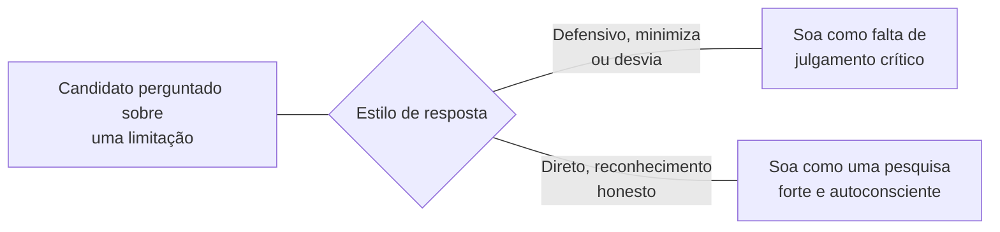

## Objetivos de Aprendizagem

- Distinguir o exame oral da tese escrita que ele segue, e explicar por que ele exige a sua própria disciplina de preparação separada.
- Descrever estratégias concretas de preparação para uma viva ou defesa de tese: antecipar as perguntas prováveis dos examinadores, e ensaiar um relato claro e honesto da contribuição real do trabalho e das suas limitações.
- Explicar por que um relato honesto das limitações de um trabalho é uma força, e não uma fraqueza, no contexto da defesa especificamente, estendendo um tema já estabelecido em `academic-writing`.
- Aplicar estratégias de preparação a um conjunto descrito de perguntas de defesa antecipadas, incluindo lidar com uma pergunta inesperada ou difícil com calma.

## Contexto e Motivação

O `thesis-and-dissertation-structure` de `academic-writing` cobriu o documento escrito que uma tese ou dissertação de fato é. Este conceito cobre o que tipicamente o segue: um exame oral, chamado viva voce ou defesa de tese conforme a instituição, onde o candidato defende o trabalho diretamente, em conversa, perante os examinadores. O texto dedicado de Rowena Murray sobre sobreviver a uma viva, escrito especificamente para esse propósito e amplamente usado em programas de pós-graduação, trata isso como um ato de persuasão genuinamente diferente da tese escrita, ao vivo, conversacional e impossível de revisar após o fato do jeito que um rascunho escrito pode, que é exatamente por que ele merece a sua própria disciplina de preparação separada.

## Teoria Central

### Por que o exame oral é uma tarefa diferente da tese escrita

```text
Tese escrita:          pode ser revisada repetidamente antes da submissão;
                        o examinador a lê no seu próprio ritmo, com
                        tempo para reler uma seção difícil.

Exame oral:             ao vivo, conversacional; o candidato não pode
                        revisar uma resposta depois de dá-la, e tem de
                        responder a perguntas não antecipadas em tempo
                        real, sem o luxo de um novo rascunho.
```

Essa distinção é a mesma que `research-talks-and-presentations` já traçou entre um artigo escrito e uma palestra ao vivo, aplicada aqui à apresentação oral de maior risco que a maioria dos pesquisadores de pós-graduação dará: um público ao vivo, aqui especificamente os examinadores, não pode receber uma versão revisada de uma resposta, o que significa que a preparação tem de acontecer antes do exame, não durante ele.

### Antecipar as perguntas prováveis dos examinadores

A orientação de Murray trata preparar-se para as perguntas prováveis como um exercício concreto e prático, e não como uma prontidão geral vaga: os examinadores comumente perguntam sobre a contribuição central do trabalho enunciada de forma clara (por que isto importa, e para quem), sobre escolhas metodológicas específicas e por que alternativas não foram escolhidas, sobre como o trabalho se relaciona com o trabalho anterior intimamente relacionado, e sobre o que o candidato faria de diferente ou investigaria a seguir com mais tempo. Preparar respostas claras, ensaiadas, mas genuinamente honestas, a esse núcleo recorrente e previsível de tipos de pergunta cobre uma grande fração do que a maioria das defesas de fato envolve, mesmo que a formulação exata de qualquer pergunta específica não possa ser prevista com precisão.

### Honestidade sobre as limitações como força, não fraqueza



Isso estende um tema que o `thesis-and-dissertation-structure` de `academic-writing` já estabeleceu: um examinador está especificamente avaliando o julgamento crítico, e não meramente se o trabalho é impecável, e um candidato que responde a uma pergunta sobre uma limitação real com um reconhecimento direto e honesto, em vez de desviar ou minimizá-la, demonstra exatamente a pesquisa autoconsciente e crítica que uma defesa de tese existe para certificar. Murray trata ensaiar esse tipo de resposta honesta especificamente, e não só ensaiar uma defesa dos pontos fortes do trabalho, como uma preparação real e importante.

### Lidar com uma pergunta inesperada ou difícil

Estratégias concretas para uma pergunta genuinamente inesperada incluem pausar deliberadamente antes de responder, em vez de se apressar numa resposta, pedir ao examinador para esclarecer ou reformular uma pergunta que não foi plenamente entendida, em vez de adivinhar a sua intenção, e, onde uma pergunta genuinamente excede o que o trabalho investigou, enunciar isso honestamente, o que seria necessário para respondê-la, em vez de improvisar uma resposta não apoiada sob pressão. A orientação de Murray trata essas como hábitos ensaiáveis, respostas calmas e praticadas à pressão, e não como uma compostura inata que alguns candidatos simplesmente têm e outros não.

## Exemplos Resolvidos

### Exemplo 1: preparar-se para uma pergunta central previsível

Um candidato antecipa ser perguntado a enunciar a contribuição central da sua tese em uma ou duas frases que um não especialista conseguiria acompanhar, uma pergunta de defesa quase universal. Ensaiar uma resposta clara e concisa com antecedência, em vez de assumir que ela virá naturalmente sob pressão, significa que o candidato abre a defesa com confiança exatamente na pergunta com maior probabilidade de ser feita primeiro.

### Exemplo 2: responder honestamente a uma pergunta de limitações

Perguntado por que a avaliação cobre só três cargas, em vez de uma gama mais ampla, um candidato que ensaiou uma resposta honesta enuncia de forma clara que restrições de tempo e de recursos limitaram o escopo da avaliação, e descreve especificamente o que uma avaliação mais ampla precisaria cobrir, em vez de sugerir que as três cargas eram plenamente suficientes por si mesmas; essa resposta direta e autoconsciente é mais forte do que uma defensiva seria.

### Exemplo 3: lidar com calma com uma pergunta genuinamente inesperada

Um examinador faz uma pergunta tocando numa área relacionada que a tese não investigou de forma alguma. Em vez de improvisar um chute, o candidato pausa, reconhece diretamente que isso estava fora do escopo da tese, e oferece um raciocínio breve, genuíno e a partir de princípios básicos sobre como as descobertas existentes do trabalho poderiam se relacionar com a pergunta, distinguindo claramente esse raciocínio de um resultado estabelecido; esse tratamento calmo e honesto de uma pergunta genuinamente não antecipada é exatamente a compostura ensaiada que as estratégias de preparação de Murray visam construir.

## Equívocos Comuns e Armadilhas

- **"Se a tese escrita é forte, a defesa oral deveria se resolver sozinha."** O exame oral é uma tarefa genuinamente diferente e ao vivo que exige a sua própria preparação; uma tese escrita forte não se traduz automaticamente em respostas ao vivo confiantes e bem conduzidas a perguntas não antecipadas.
- **"Admitir uma limitação durante a defesa enfraquece a posição do candidato."** Um examinador está especificamente avaliando o julgamento crítico; um reconhecimento direto e honesto de uma limitação real soa como uma pesquisa mais forte do que uma resposta defensiva ou minimizadora, estendendo o mesmo princípio que o conceito de tese de `academic-writing` já estabeleceu para o documento escrito.
- **"A compostura sob uma pergunta inesperada é um traço pessoal fixo, não algo para o qual se possa preparar."** Murray trata o tratamento calmo de perguntas não antecipadas, pausar, pedir esclarecimento, distinguir honestamente especulação de resultados estabelecidos, como hábitos ensaiáveis, e não como temperamento inato.

## Resumo

Uma defesa de tese ou viva é uma tarefa genuinamente diferente da tese escrita que ela segue, ao vivo e conversacional em vez de revisável, que é por que ela exige a sua própria disciplina de preparação dedicada: antecipar o núcleo recorrente e previsível de perguntas que os examinadores comumente fazem, e ensaiar respostas honestas e diretas, inclusive sobre as limitações reais do trabalho, que soa como uma força demonstrando julgamento crítico, e não como uma fraqueza a esconder. Lidar com calma com uma pergunta genuinamente inesperada, pausar, buscar esclarecimento, distinguir honestamente especulação de descobertas estabelecidas, é, ele mesmo, um hábito ensaiável e aprendível, e não simplesmente uma questão de alguns candidatos terem mais compostura natural do que outros.

## Documentation Links

- [Rowena Murray, How to Survive Your Viva: Defending a Thesis in an Oral Examination (Open University Press)](https://research-portal.uws.ac.uk/en/publications/how-to-survive-your-viva): a fonte dedicada e direta das estratégias de antecipação de perguntas de examinadores e de compostura sob pressão cobertas aqui.
- [ACM Digital Library: Justin Zobel, Writing for Computer Science (3ª edição, Springer, 2014)](https://dl.acm.org/doi/10.5555/2742708): a fonte da distinção entre o leitor de artigo e o de tese que este conceito estende ao caso específico do exame oral.
