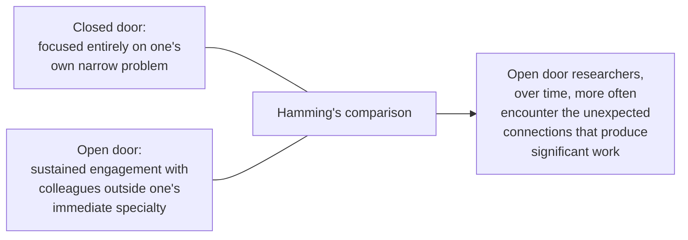

## Learning Objectives

- State Hamming's central question, given comparable effort and talent, why some researchers consistently produce more significant work than others, and his answer that the difference is largely a matter of deliberate, learnable habits.
- Explain the distinction Hamming draws between important problems and merely tractable ones, and why choosing which to work on is itself a skill.
- Describe what Hamming means by "open door" engagement with colleagues outside one's immediate specialty, and why he treats it as more valuable, over time, than a closed-door focus purely on one's own narrow problem.
- Apply Hamming's framework to evaluate a described research direction for whether it is aimed at significance or merely at tractability.

## Context & Motivation

The concepts in this discipline so far, peer review, research ethics, advising, have covered the institutional and relational structure around doing research. This concept addresses a different, more personal question, one Richard Hamming posed directly in a talk that has become one of the most widely circulated and taught pieces of research culture writing in computing: given comparable raw talent and comparable effort, why do some researchers consistently produce more significant work over a career than others? Hamming's 1986 talk at Bell Communications Research, drawing on decades spent observing colleagues at Bell Labs, one of the most productive research environments in the history of computing and communications research, remains a standard reference for this question specifically because his answer is not "innate genius," which would offer graduate researchers nothing actionable, but a set of deliberate, observable, learnable habits.

## Core Theory

### Important problems versus merely tractable ones

```text
A tractable problem:  one that is solvable with reasonably foreseeable
                       effort, using techniques already largely in hand.

An important problem:  one whose solution would genuinely matter to
                        the field or to practice, regardless of how
                        hard or uncertain the path to solving it is.
```

Hamming's central, often-quoted observation is that many capable researchers spend entire careers working on tractable problems while consciously avoiding important ones, precisely because important problems are harder, riskier, and less certain to yield a publishable result on any predictable timeline. His argument is that consistently choosing tractable problems over important ones, even when both are within a researcher's technical reach, is itself the difference that produces merely competent versus genuinely significant careers, a choice made repeatedly, not a single decision made once.

### Courage as a practical, not merely inspirational, requirement

Hamming treats the courage to work on an important problem despite real risk of failure as a practical requirement, not an abstract virtue, precisely because working on a genuinely important problem usually means a real, non-trivial chance of spending significant effort without a guaranteed publishable outcome. This is a real, concrete tradeoff a researcher navigates deliberately throughout a career, not a one-time act of boldness, and Hamming is explicit that this tradeoff does not disappear once someone becomes an established researcher; it recurs at every stage.

### The open door



Hamming observed that researchers who kept their office door consistently open, engaging with colleagues and problems outside their own immediate specialty even at some cost to focused, uninterrupted time on their own narrow problem, tended over years to produce more significant work than equally talented colleagues who kept the door closed to maximize immediate focus. His explanation is that significant connections and insights often come from unexpected adjacent conversations, not from deeper isolation within an already-familiar problem, a genuinely counterintuitive claim worth taking seriously specifically because it runs against the natural instinct to protect focused time above all else.

### Learnable habits, not fixed talent

Hamming's framing throughout treats problem selection, tolerance for risk, and sustained openness to colleagues as habits a researcher can deliberately cultivate and improve at over a career, not fixed personality traits some people simply have and others lack. This is what makes the talk genuinely useful as research culture material rather than merely inspirational: it offers concrete, observable behaviors, working on important rather than merely tractable problems, tolerating real risk of failure, keeping the door open, that a graduate researcher can actually practice and adjust.

## Worked Examples

### Example 1: distinguishing an important problem from a tractable one

Two possible thesis directions are available: refining an existing, well understood technique for a modest, predictable improvement, or attempting a genuinely new approach to a problem the field has not yet solved well, with real uncertainty about whether it will work at all. Applying Hamming's distinction, the first is more tractable and safer; the second is riskier but, if it succeeds even partially, more significant. Hamming's framework does not say the tractable choice is always wrong, a full career of only high-risk bets is not sustainable either, but it names the tradeoff explicitly rather than letting a researcher default to tractability without recognizing the choice being made.

### Example 2: the open door in practice

A researcher deeply focused on a specific distributed consensus problem regularly attends a weekly departmental talk series covering unrelated areas, information theory, machine learning, programming languages, rather than skipping it to protect more focused work time. Months later, an idea from one of those talks, on error-correcting codes from an information theory presentation, suggests an unexpected, genuinely useful technique for the consensus problem, exactly the kind of connection Hamming's open-door observation predicts is more likely to arise from sustained outside engagement than from deeper isolation.

### Example 3: courage as a recurring, not one-time, choice

A researcher with an established, safe line of incremental work considers pivoting toward a riskier, more ambitious direction mid-career, with real uncertainty about whether it will pay off before the next major evaluation point. Recognizing this as the same tractable-versus-important tradeoff Hamming describes, recurring rather than settled once at the start of a career, the researcher makes a deliberate, informed choice rather than defaulting to the safer option purely out of habit.

## Common Misconceptions & Pitfalls

- **"Significant research mostly comes down to raw talent."** Hamming's argument, based on direct observation of a highly productive research environment, is that deliberate habits, problem choice, risk tolerance, sustained outside engagement, account for much of the difference among comparably talented researchers, which is what makes the talk actionable rather than merely descriptive.
- **"Staying tightly focused on my own problem, without distraction, is the best way to make progress on it."** Hamming's open-door observation runs directly against this instinct: sustained engagement with colleagues outside one's immediate specialty, even at some cost to focused time, correlated with more significant work over time in his own direct observation.
- **"Choosing an important, risky problem is a one-time, early-career decision."** Hamming treats this tradeoff as recurring throughout a research career, not a single choice settled once; the courage to keep choosing important problems over safer, tractable ones is a habit exercised repeatedly, not a credential earned once.

## Summary

Richard Hamming's widely taught talk argues that the difference between merely competent and genuinely significant research careers, given comparable talent, comes down largely to deliberate, learnable habits rather than fixed ability: consistently choosing to work on important problems rather than merely tractable ones, tolerating the real, recurring risk of failure that important problems carry, and maintaining an "open door" of sustained engagement with colleagues outside one's immediate specialty, which Hamming observed correlated with more significant work over time than a narrower, more isolated focus. Framing these as habits a researcher can deliberately practice and improve, rather than as fixed personality traits, is what makes the talk genuinely useful research culture material for a graduate researcher actively shaping how they work.

## Documentation Links

- [Richard Hamming, You and Your Research (Bell Communications Research, 1986)](https://www.cs.princeton.edu/~jrex/teaching/spring2005/fft/hamming.html): the direct source for the important-versus-tractable-problems, courage, and open-door framework covered in this concept.
- [ACM Digital Library: Justin Zobel, Writing for Computer Science (3rd Edition, Springer, 2014)](https://dl.acm.org/doi/10.5555/2742708): Chapter 4's "Reflections on Research" section offers a complementary, more procedural perspective on research as ongoing practice, paired here with Hamming's more personal framing.
