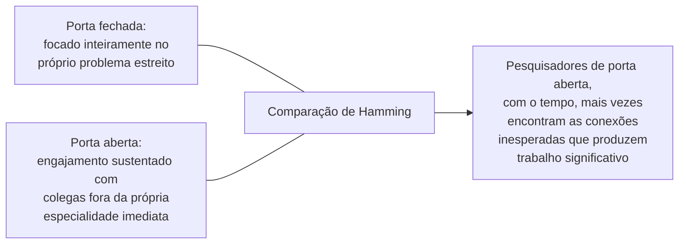

## Objetivos de Aprendizagem

- Enunciar a pergunta central de Hamming, dado esforço e talento comparáveis, por que alguns pesquisadores consistentemente produzem trabalho mais significativo do que outros, e a sua resposta de que a diferença é em grande parte uma questão de hábitos deliberados e aprendíveis.
- Explicar a distinção que Hamming traça entre problemas importantes e meramente tratáveis, e por que escolher em qual trabalhar é, ela mesma, uma habilidade.
- Descrever o que Hamming quer dizer com engajamento de "porta aberta" com colegas fora da própria especialidade imediata, e por que ele o trata como mais valioso, com o tempo, do que um foco de porta fechada puramente no próprio problema estreito.
- Aplicar o arcabouço de Hamming para avaliar uma direção de pesquisa descrita quanto a se ela mira a significância ou meramente a tratabilidade.

## Contexto e Motivação

Os conceitos desta disciplina até aqui, avaliação por pares, ética de pesquisa, orientação, cobriram a estrutura institucional e relacional em torno de fazer pesquisa. Este conceito aborda uma pergunta diferente e mais pessoal, uma que Richard Hamming colocou diretamente numa palestra que se tornou um dos textos de cultura de pesquisa mais amplamente divulgados e ensinados em computação: dado talento bruto comparável e esforço comparável, por que alguns pesquisadores consistentemente produzem trabalho mais significativo ao longo de uma carreira do que outros? A palestra de Hamming de 1986 na Bell Communications Research, valendo-se de décadas observando colegas nos Bell Labs, um dos ambientes de pesquisa mais produtivos da história da pesquisa em computação e comunicações, continua sendo uma referência padrão para essa pergunta especificamente porque a sua resposta não é "gênio inato", que não ofereceria nada acionável aos pesquisadores de pós-graduação, mas um conjunto de hábitos deliberados, observáveis e aprendíveis.

## Teoria Central

### Problemas importantes versus meramente tratáveis

```text
Um problema tratável:  um que é solúvel com um esforço razoavelmente previsível,
                       usando técnicas já em grande parte em mãos.

Um problema importante: um cuja solução genuinamente importaria para
                        a área ou para a prática, independentemente de quão
                        difícil ou incerto seja o caminho para resolvê-lo.
```

A observação central e muitas vezes citada de Hamming é que muitos pesquisadores capazes passam carreiras inteiras trabalhando em problemas tratáveis enquanto conscientemente evitam os importantes, precisamente porque os problemas importantes são mais difíceis, mais arriscados e menos certos de render um resultado publicável em qualquer prazo previsível. O seu argumento é que escolher consistentemente problemas tratáveis em vez de importantes, mesmo quando ambos estão ao alcance técnico de um pesquisador, é, ela mesma, a diferença que produz carreiras meramente competentes versus genuinamente significativas, uma escolha feita repetidamente, e não uma única decisão feita uma vez.

### Coragem como requisito prático, não meramente inspirador

Hamming trata a coragem de trabalhar num problema importante apesar do risco real de fracasso como um requisito prático, e não uma virtude abstrata, precisamente porque trabalhar num problema genuinamente importante normalmente significa uma chance real e não trivial de gastar esforço significativo sem um desfecho publicável garantido. Esse é um trade-off real e concreto que um pesquisador navega deliberadamente ao longo de uma carreira, e não um ato único de ousadia, e Hamming é explícito ao dizer que esse trade-off não desaparece uma vez que alguém se torna um pesquisador estabelecido; ele recorre em cada estágio.

### A porta aberta



Hamming observou que os pesquisadores que mantinham a porta do escritório consistentemente aberta, engajando-se com colegas e problemas fora da própria especialidade imediata mesmo a algum custo de tempo focado e ininterrupto no próprio problema estreito, tendiam, ao longo dos anos, a produzir trabalho mais significativo do que colegas igualmente talentosos que mantinham a porta fechada para maximizar o foco imediato. A sua explicação é que conexões e percepções significativas muitas vezes vêm de conversas adjacentes inesperadas, e não de um isolamento mais profundo dentro de um problema já familiar, uma afirmação genuinamente contraintuitiva que vale levar a sério especificamente porque vai contra o instinto natural de proteger o tempo focado acima de tudo.

### Hábitos aprendíveis, não talento fixo

O enquadramento de Hamming por toda parte trata a seleção de problemas, a tolerância ao risco e a abertura sustentada aos colegas como hábitos que um pesquisador pode deliberadamente cultivar e aprimorar ao longo de uma carreira, e não traços de personalidade fixos que algumas pessoas simplesmente têm e outras não. É isso que torna a palestra genuinamente útil como material de cultura de pesquisa, e não meramente inspiradora: ela oferece comportamentos concretos e observáveis, trabalhar em problemas importantes em vez de meramente tratáveis, tolerar o risco real de fracasso, manter a porta aberta, que um pesquisador de pós-graduação pode de fato praticar e ajustar.

## Exemplos Resolvidos

### Exemplo 1: distinguir um problema importante de um tratável

Duas possíveis direções de tese estão disponíveis: refinar uma técnica existente e bem entendida para uma melhoria modesta e previsível, ou tentar uma abordagem genuinamente nova a um problema que a área ainda não resolveu bem, com incerteza real sobre se ela vai funcionar de todo. Aplicando a distinção de Hamming, a primeira é mais tratável e mais segura; a segunda é mais arriscada, mas, se tiver sucesso mesmo que parcialmente, mais significativa. O arcabouço de Hamming não diz que a escolha tratável está sempre errada, uma carreira inteira só de apostas de alto risco também não é sustentável, mas nomeia o trade-off explicitamente, em vez de deixar um pesquisador recorrer à tratabilidade sem reconhecer a escolha sendo feita.

### Exemplo 2: a porta aberta na prática

Um pesquisador profundamente focado num problema específico de consenso distribuído participa regularmente de uma série semanal de palestras departamentais cobrindo áreas não relacionadas, teoria da informação, aprendizado de máquina, linguagens de programação, em vez de pulá-la para proteger um tempo de trabalho mais focado. Meses depois, uma ideia de uma dessas palestras, sobre códigos corretores de erros de uma apresentação de teoria da informação, sugere uma técnica inesperada e genuinamente útil para o problema de consenso, exatamente o tipo de conexão que a observação de porta aberta de Hamming prevê ter mais probabilidade de surgir de um engajamento externo sustentado do que de um isolamento mais profundo.

### Exemplo 3: coragem como escolha recorrente, não única

Um pesquisador com uma linha estabelecida e segura de trabalho incremental considera pivotar rumo a uma direção mais arriscada e mais ambiciosa no meio da carreira, com incerteza real sobre se ela vai compensar antes do próximo ponto de avaliação importante. Reconhecendo isso como o mesmo trade-off de tratável versus importante que Hamming descreve, recorrente em vez de assentado uma vez no início de uma carreira, o pesquisador faz uma escolha deliberada e informada, em vez de recorrer à opção mais segura puramente por hábito.

## Equívocos Comuns e Armadilhas

- **"A pesquisa significativa se resume principalmente a talento bruto."** O argumento de Hamming, baseado na observação direta de um ambiente de pesquisa altamente produtivo, é que hábitos deliberados, escolha de problemas, tolerância ao risco, engajamento externo sustentado, respondem por boa parte da diferença entre pesquisadores de talento comparável, que é o que torna a palestra acionável, e não meramente descritiva.
- **"Manter-me bem focado no meu próprio problema, sem distração, é a melhor forma de progredir nele."** A observação de porta aberta de Hamming vai diretamente contra esse instinto: o engajamento sustentado com colegas fora da própria especialidade imediata, mesmo a algum custo de tempo focado, correlacionou-se com trabalho mais significativo ao longo do tempo na sua própria observação direta.
- **"Escolher um problema importante e arriscado é uma decisão única, de início de carreira."** Hamming trata esse trade-off como recorrente ao longo de uma carreira de pesquisa, e não como uma única escolha assentada uma vez; a coragem de continuar escolhendo problemas importantes em vez de mais seguros e tratáveis é um hábito exercido repetidamente, e não uma credencial conquistada uma vez.

## Resumo

A palestra amplamente ensinada de Richard Hamming argumenta que a diferença entre carreiras de pesquisa meramente competentes e genuinamente significativas, dado talento comparável, se resume em grande parte a hábitos deliberados e aprendíveis, e não a uma habilidade fixa: escolher consistentemente trabalhar em problemas importantes em vez de meramente tratáveis, tolerar o risco real e recorrente de fracasso que os problemas importantes carregam, e manter uma "porta aberta" de engajamento sustentado com colegas fora da própria especialidade imediata, que Hamming observou se correlacionar com trabalho mais significativo ao longo do tempo do que um foco mais estreito e mais isolado. Enquadrar essas coisas como hábitos que um pesquisador pode deliberadamente praticar e aprimorar, em vez de como traços de personalidade fixos, é o que torna a palestra um material de cultura de pesquisa genuinamente útil para um pesquisador de pós-graduação ativamente moldando como trabalha.

## Documentation Links

- [Richard Hamming, You and Your Research (Bell Communications Research, 1986)](https://www.cs.princeton.edu/~jrex/teaching/spring2005/fft/hamming.html): a fonte direta do arcabouço de problemas importantes versus tratáveis, coragem e porta aberta coberto neste conceito.
- [ACM Digital Library: Justin Zobel, Writing for Computer Science (3ª edição, Springer, 2014)](https://dl.acm.org/doi/10.5555/2742708): a seção "Reflections on Research" do Capítulo 4 oferece uma perspectiva complementar e mais procedimental sobre a pesquisa como prática contínua, pareada aqui com o enquadramento mais pessoal de Hamming.
