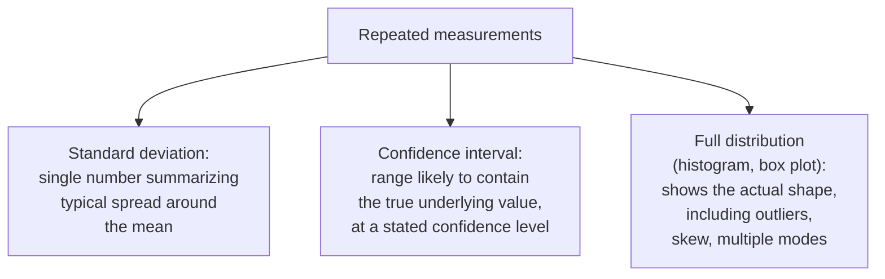

## Learning Objectives

- Explain what information is lost when repeated measurements are reduced to a single summary number, and why that loss matters for a skeptical reader.
- Name and distinguish common ways of reporting variability: standard deviation, confidence intervals, and the full distribution's shape.
- Describe how honestly reported variability lets a reader judge whether an observed difference between two systems is a real effect or noise.
- Apply variability reporting to a described set of repeated measurements, choosing a form of reporting appropriate to the data.

## Context & Motivation

`variables-samples-and-populations` established the vocabulary this concept now puts to direct use: a sample of repeated measurements, ten benchmark runs, a hundred recorded latencies, is rarely reported as a raw list of every individual value. It gets aggregated, most often into a mean, and Zobel's treatment of aggregation and variability is built around a single, important warning: that aggregation step discards real information, specifically how much the underlying measurements varied, and reporting that variability honestly is not an optional refinement but part of what makes a reported result actually interpretable.

## Core Theory

### What aggregation discards

```text
Ten latency measurements (ms): 40, 42, 41, 39, 43, 95, 40, 41, 38, 42

Mean: 46.1 ms

The mean alone hides that nine of the ten measurements cluster tightly
around 40ms, while one, 95ms, is a clear outlier; a reader seeing only
"46.1ms average" has no way to know this from the mean alone.
```

A single summary number like a mean treats every underlying measurement as interchangeable, when in fact the pattern of variation across those measurements, tight and consistent, or widely spread, or dominated by occasional outliers, often carries information just as important as the average itself, sometimes more important, depending on what the research question actually is.

### Forms of reporting variability



A standard deviation is compact and useful for roughly symmetric, well behaved data, but can itself be misleading for data with a skewed distribution or significant outliers, exactly the kind the example above illustrates. A confidence interval communicates a range within which the true underlying value is likely to fall, which is often closer to what a reader actually wants to know when comparing two systems, is the interval for system A's performance meaningfully separated from system B's, or do they overlap substantially. The full distribution, shown as a histogram or box plot, loses the least information and is the right choice specifically when the shape of the variation itself (skew, outliers, multiple distinct modes) matters to the claim being made, connecting directly to `intuition-and-visualization-of-results` later in this discipline.

### Why honest variability reporting matters for comparison

```text
System A: mean 100ms (never reported: measurements ranged 95-105ms,
          tightly clustered)
System B: mean 105ms (never reported: measurements ranged 40-170ms,
          highly variable)
```

Reported as bare means alone, System A looks straightforwardly, if modestly, better. Reported with variability included, a different, more honest picture emerges: System A is consistently around 100ms with very little spread, while System B's wide range means its mean of 105ms is not a reliable predictor of any individual run, sometimes far faster, sometimes far slower. A reader deciding which system better suits a latency-sensitive application needs this variability information, not just the mean, to make a sound judgment; this is precisely the kind of distinction bare, unqualified averages hide.

### Variability as a signal, not noise to be discarded

Zobel's framing treats variability itself as real, informative data, not an inconvenient imprecision to be summarized away as quickly as possible. High variability in one system's measurements compared to another's is often itself a finding worth reporting directly, a system with unpredictable performance has a real, different practical character than one with consistent performance, even at an identical mean.

## Worked Examples

### Example 1: an outlier hidden by a mean

Referring back to this concept's opening example, the ten measurements 40, 42, 41, 39, 43, 95, 40, 41, 38, 42 produce a mean of 46.1ms that misrepresents the typical case. Reporting the median (41ms) alongside the mean, or simply reporting that one of ten runs was a clear outlier at 95ms with the remaining nine tightly clustered near 40ms, gives a reader a far more accurate picture than the mean alone.

### Example 2: choosing a confidence interval for a comparison claim

A researcher wants to claim system A is meaningfully faster than system B. Reporting means alone, "102ms vs 108ms," leaves a reader unable to judge whether this 6ms difference is a real, reliable effect. Reporting 95% confidence intervals instead, "98-106ms vs 103-113ms," lets a reader see the intervals overlap substantially, a more honest and more useful signal that the observed difference may not be as clear-cut as the bare means suggested.

### Example 3: reporting a full distribution because shape matters

A researcher measuring garbage-collection pause times finds most pauses are very short, but a small fraction are dramatically longer, a bimodal pattern a mean and standard deviation alone would badly misrepresent. Reporting a histogram of the full distribution, rather than just a mean pause time, correctly conveys the practically important fact that the system has two genuinely different behavior modes, not one typical behavior with some random noise around it.

## Common Misconceptions & Pitfalls

- **"A mean is a sufficient summary of a set of repeated measurements."** A mean alone discards information about spread, outliers, and shape that is often essential to correctly interpreting or comparing results; it can actively misrepresent data that is skewed or has outliers.
- **"Reporting variability is extra rigor for a more polished paper, not a core requirement."** Zobel treats honest variability reporting as necessary for a reader to judge whether an observed difference is a real effect or noise, making it a basic requirement for a defensible comparison, not an optional enhancement.
- **"High variability is just noise that should be minimized in reporting."** Variability is itself real, informative data; a system with high variability has a genuinely different practical character than a consistent one at the same mean, and this is often worth reporting as a finding in its own right.

## Summary

Reducing a set of repeated measurements to a single mean discards real information about how those measurements varied, spread, outliers, and shape, that is often essential to interpreting a result correctly or comparing it fairly against another system. Standard deviations, confidence intervals, and full distributions each communicate this variability differently, with the right choice depending on the data and the claim being made, and honestly reported variability is what lets a skeptical reader judge whether an observed difference between two systems reflects a real, reliable effect or falls within the normal, expected spread of both.

## Documentation Links

- [ACM Digital Library: Justin Zobel, Writing for Computer Science (3rd Edition, Springer, 2014)](https://dl.acm.org/doi/10.5555/2742708): Chapter 15's "Aggregation and Variability" and "Reporting of Variability" sections are the direct source for the variability-reporting guidance covered here.
