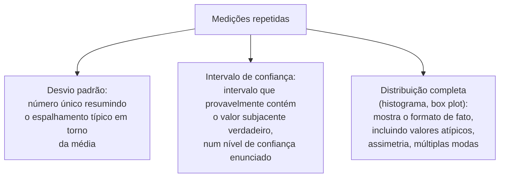

## Objetivos de Aprendizagem

- Explicar que informação se perde quando medições repetidas são reduzidas a um único número de resumo, e por que essa perda importa para um leitor cético.
- Nomear e distinguir formas comuns de relatar a variabilidade: desvio padrão, intervalos de confiança e o formato completo da distribuição.
- Descrever como a variabilidade relatada honestamente permite a um leitor julgar se uma diferença observada entre dois sistemas é um efeito real ou ruído.
- Aplicar o relato de variabilidade a um conjunto descrito de medições repetidas, escolhendo uma forma de relato apropriada aos dados.

## Contexto e Motivação

`variables-samples-and-populations` estabeleceu o vocabulário que este conceito agora põe em uso direto: uma amostra de medições repetidas, dez execuções de benchmark, cem latências registradas, raramente é relatada como uma lista bruta de cada valor individual. Ela é agregada, mais frequentemente numa média, e o tratamento de Zobel sobre agregação e variabilidade é construído em torno de um único aviso importante: esse passo de agregação descarta informação real, especificamente o quanto as medições subjacentes variaram, e relatar essa variabilidade honestamente não é um refinamento opcional, mas parte do que torna um resultado relatado de fato interpretável.

## Teoria Central

### O que a agregação descarta

```text
Dez medições de latência (ms): 40, 42, 41, 39, 43, 95, 40, 41, 38, 42

Média: 46,1 ms

A média sozinha esconde que nove das dez medições se agrupam firmemente
em torno de 40ms, enquanto uma, 95ms, é um valor atípico claro; um leitor
vendo só "46,1ms de média" não tem como saber disso só pela média.
```

Um único número de resumo como uma média trata cada medição subjacente como intercambiável, quando, na verdade, o padrão de variação entre essas medições, apertado e consistente, ou amplamente espalhado, ou dominado por valores atípicos ocasionais, muitas vezes carrega informação tão importante quanto a própria média, às vezes mais importante, dependendo de qual é a pergunta de pesquisa de fato.

### Formas de relatar a variabilidade



Um desvio padrão é compacto e útil para dados aproximadamente simétricos e bem comportados, mas pode, ele mesmo, enganar para dados com uma distribuição assimétrica ou valores atípicos significativos, exatamente o tipo que o exemplo acima ilustra. Um intervalo de confiança comunica um intervalo dentro do qual o valor subjacente verdadeiro provavelmente cai, que é muitas vezes mais próximo do que um leitor de fato quer saber ao comparar dois sistemas, o intervalo do desempenho do sistema A está significativamente separado do do sistema B, ou eles se sobrepõem substancialmente. A distribuição completa, mostrada como um histograma ou box plot, perde a menor quantidade de informação e é a escolha certa especificamente quando o formato da variação em si (assimetria, valores atípicos, múltiplas modas distintas) importa para a afirmação sendo feita, conectando-se diretamente a `intuition-and-visualization-of-results` mais adiante nesta disciplina.

### Por que o relato honesto de variabilidade importa para a comparação

```text
Sistema A: média 100ms (nunca relatado: as medições variaram de 95-105ms,
          firmemente agrupadas)
Sistema B: média 105ms (nunca relatado: as medições variaram de 40-170ms,
          altamente variáveis)
```

Relatados só como médias nuas, o Sistema A parece diretamente, ainda que modestamente, melhor. Relatados com a variabilidade incluída, um quadro diferente e mais honesto emerge: o Sistema A está consistentemente em torno de 100ms com muito pouco espalhamento, enquanto a ampla faixa do Sistema B significa que a sua média de 105ms não é um previsor confiável de qualquer execução individual, às vezes muito mais rápida, às vezes muito mais lenta. Um leitor decidindo qual sistema melhor serve uma aplicação sensível à latência precisa dessa informação de variabilidade, não só da média, para fazer um julgamento sólido; essa é precisamente o tipo de distinção que médias nuas e sem ressalvas escondem.

### A variabilidade como sinal, não como ruído a descartar

O enquadramento de Zobel trata a variabilidade em si como dado real e informativo, e não como uma imprecisão inconveniente a ser resumida para longe o mais depressa possível. Uma alta variabilidade nas medições de um sistema em comparação com as de outro é muitas vezes, ela mesma, uma descoberta digna de relato direto, um sistema com desempenho imprevisível tem um caráter prático real e diferente de um com desempenho consistente, mesmo numa média idêntica.

## Exemplos Resolvidos

### Exemplo 1: um valor atípico escondido por uma média

Referindo-se de volta ao exemplo de abertura deste conceito, as dez medições 40, 42, 41, 39, 43, 95, 40, 41, 38, 42 produzem uma média de 46,1ms que deturpa o caso típico. Relatar a mediana (41ms) ao lado da média, ou simplesmente relatar que uma de dez execuções foi um valor atípico claro de 95ms com as nove restantes firmemente agrupadas perto de 40ms, dá a um leitor um quadro muito mais acurado do que a média sozinha.

### Exemplo 2: escolher um intervalo de confiança para uma afirmação de comparação

Um pesquisador quer alegar que o sistema A é significativamente mais rápido do que o sistema B. Relatar só as médias, "102ms vs 108ms", deixa um leitor incapaz de julgar se essa diferença de 6ms é um efeito real e confiável. Relatar intervalos de confiança de 95% em vez disso, "98-106ms vs 103-113ms", permite a um leitor ver que os intervalos se sobrepõem substancialmente, um sinal mais honesto e mais útil de que a diferença observada pode não ser tão clara quanto as médias nuas sugeriam.

### Exemplo 3: relatar uma distribuição completa porque o formato importa

Um pesquisador medindo tempos de pausa de coleta de lixo descobre que a maioria das pausas é muito curta, mas uma pequena fração é dramaticamente mais longa, um padrão bimodal que uma média e um desvio padrão sozinhos deturpariam gravemente. Relatar um histograma da distribuição completa, em vez de só um tempo médio de pausa, transmite corretamente o fato praticamente importante de que o sistema tem dois modos de comportamento genuinamente diferentes, e não um comportamento típico com algum ruído aleatório em torno dele.

## Equívocos Comuns e Armadilhas

- **"Uma média é um resumo suficiente de um conjunto de medições repetidas."** Uma média sozinha descarta informação sobre espalhamento, valores atípicos e formato que é muitas vezes essencial para interpretar ou comparar resultados corretamente; ela pode deturpar ativamente dados que são assimétricos ou têm valores atípicos.
- **"Relatar a variabilidade é rigor extra para um artigo mais polido, não um requisito central."** Zobel trata o relato honesto de variabilidade como necessário para um leitor julgar se uma diferença observada é um efeito real ou ruído, tornando-o um requisito básico para uma comparação defensável, e não uma melhoria opcional.
- **"Alta variabilidade é só ruído que deve ser minimizado no relato."** A variabilidade é, ela mesma, dado real e informativo; um sistema com alta variabilidade tem um caráter prático genuinamente diferente de um consistente na mesma média, e isso é muitas vezes digno de relato como uma descoberta por si só.

## Resumo

Reduzir um conjunto de medições repetidas a uma única média descarta informação real sobre como essas medições variaram, espalhamento, valores atípicos e formato, que é muitas vezes essencial para interpretar um resultado corretamente ou compará-lo de forma justa contra outro sistema. Desvios padrão, intervalos de confiança e distribuições completas cada um comunica essa variabilidade de forma diferente, com a escolha certa dependendo dos dados e da afirmação sendo feita, e a variabilidade relatada honestamente é o que permite a um leitor cético julgar se uma diferença observada entre dois sistemas reflete um efeito real e confiável ou cai dentro do espalhamento normal e esperado de ambos.

## Documentation Links

- [ACM Digital Library: Justin Zobel, Writing for Computer Science (3ª edição, Springer, 2014)](https://dl.acm.org/doi/10.5555/2742708): as seções "Aggregation and Variability" e "Reporting of Variability" do Capítulo 15 são a fonte direta da orientação sobre relato de variabilidade coberta aqui.
