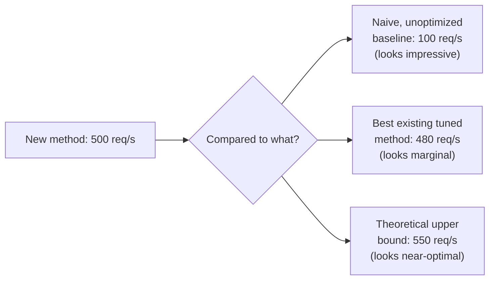

## Learning Objectives

- Explain why a result only has meaning relative to a baseline, and why choosing a weak or outdated baseline can make almost any new method look good regardless of merit.
- State the properties a fair, relevant baseline needs: comparable tuning effort, a genuinely competitive point of comparison, and conditions matched to the actual claim.
- Describe what makes experimental data persuasive to a skeptical reader, beyond simply being present in a paper.
- Apply baseline selection to a concrete experimental design, identifying a genuinely strong point of comparison rather than a convenient one.

## Context & Motivation

`hypotheses-questions-and-forms-of-evidence` and `good-and-bad-science-measurement-and-reflection` established what a falsifiable hypothesis looks like and why fair, matched measurement matters. This concept, opening the "Experimentation" material this discipline draws from Zobel's chapter of the same name, covers the single decision that most determines whether an experiment's result means anything at all: what is it being compared against.

A number on its own, "the new method achieves 500 requests per second," says almost nothing. Whether that is an impressive result or a disappointing one depends entirely on what else could plausibly be compared against it, an existing method, a naive baseline, a theoretical upper bound. Zobel's treatment of baselines is correspondingly direct: choosing a baseline is not a minor procedural step before the "real" experiment; it is one of the most consequential decisions in the entire experimental design, because a weak or outdated baseline can make almost any new method look like an improvement.

## Core Theory

### Why a result is only meaningful relative to a baseline



The same number, 500 requests per second, supports three very different narratives depending entirely on the baseline chosen for comparison, and none of those narratives is wrong exactly, they are each accurate relative to their specific baseline, but only one of them, comparison against the best existing tuned method, actually tells a skeptical reader what they need to know: does this new method represent genuine progress over the current state of the art.

### What makes a baseline fair and relevant

A fair baseline receives comparable tuning effort to the new method being evaluated; an unfairly under-tuned baseline, deliberately or through simple neglect, inflates the apparent advantage of the new approach in a way that will not hold up once someone else tunes the baseline properly. A relevant baseline is one a knowledgeable reader in the area would actually expect to see, typically the strongest existing published method addressing the same problem, not an easier-to-beat but less representative alternative. An outdated baseline, a method that was state of the art years ago but has since been surpassed by work the paper's own related-work section should have surfaced, produces a comparison that looks favorable only because the real competition was left out.

### Persuasive data versus merely present data

```text
Data that is merely present:     a table of numbers, technically
                                  accurate, with no baseline strong
                                  enough to make the comparison mean
                                  anything, or no indication of
                                  variability across repeated runs.

Persuasive data:                 the same kind of numbers, compared
                                  against a genuinely strong baseline,
                                  reported with honest variability, and
                                  presented in a way a skeptical reader
                                  can use to independently judge whether
                                  the claimed effect is real.
```

Zobel's distinction here connects directly back to `academic-writing`'s foundational skeptical-reader standard: data becomes persuasive specifically by giving a skeptical reader what they need to verify a claim themselves, not by simply existing in a results table. A strong baseline is one part of that; honestly reported variability, covered in this discipline's own `aggregation-variability-and-reporting`, is another.

### Baseline selection as an ongoing responsibility

Choosing a baseline is not a one-time decision made and forgotten at the start of a project. As a project develops and the literature review deepens, a stronger, more recent baseline may surface that was not known when the experiment was first designed; Zobel treats updating the baseline in response to this as a real methodological obligation, not optional extra rigor, since publishing a comparison against a baseline already known to be weaker than the actual state of the art produces a misleading result regardless of how honestly everything else in the experiment was conducted.

## Worked Examples

### Example 1: catching an outdated baseline

A student's literature review, conducted early in a project, identifies a caching strategy as the field's standard comparison point. A year into the project, a stronger, more recent strategy is published. Updating the experimental baseline to include this newer strategy, rather than publishing against the now-outdated one, is what this concept requires, even though it means more implementation work late in the project.

### Example 2: fixing an unfair tuning comparison

An evaluation initially tunes a new consensus protocol's timeout parameters carefully while leaving a baseline protocol at its default settings. Applying the fairness standard, the researcher tunes the baseline's parameters with comparable effort before rerunning the comparison; the new protocol's advantage narrows from 40% to 15%, a smaller but far more defensible and persuasive claim.

### Example 3: choosing between two candidate baselines

Comparing a new load-balancing algorithm, a researcher considers two possible baselines: a simple round-robin scheme, easy to implement and guaranteed to look weak by comparison, and a well-tuned least-connections scheme actually used in production systems similar to the target deployment. Choosing the least-connections baseline, even though it is a harder comparison to win, produces a result a skeptical, knowledgeable reader will actually find persuasive; the round-robin comparison would not.

## Common Misconceptions & Pitfalls

- **"Any baseline is better than no baseline."** A weak, outdated, or unfairly tuned baseline can be actively misleading, producing a comparison that looks favorable for reasons that have nothing to do with the new method's actual merit.
- **"The baseline chosen at the start of a project doesn't need revisiting."** A newer, stronger baseline surfacing later in the project's literature review is a real methodological obligation to incorporate, not an optional improvement to skip for convenience.
- **"A results table full of numbers is inherently persuasive."** Data becomes persuasive specifically through a strong, fair baseline and honest variability reporting; numbers alone, without either, are merely present, not persuasive to a genuinely skeptical reader.

## Summary

An experimental result only has meaning relative to a baseline, and a weak, outdated, or unfairly tuned baseline can make almost any new method appear to be an improvement, which is why choosing a fair, relevant, genuinely competitive baseline is one of the most consequential decisions in an experiment's design. Persuasive data is data that gives a skeptical reader what they need to independently verify a claim, a strong baseline and honestly reported variability among the most important components of that, and baseline selection is an ongoing responsibility that may require updating as stronger comparison points surface during a project, not a decision made once and left unrevisited.

## Documentation Links

- [ACM Digital Library: Justin Zobel, Writing for Computer Science (3rd Edition, Springer, 2014)](https://dl.acm.org/doi/10.5555/2742708): Chapter 14's "Baselines" and "Persuasive Data" sections are the direct source for the baseline-fairness and data-persuasiveness guidance covered here.
