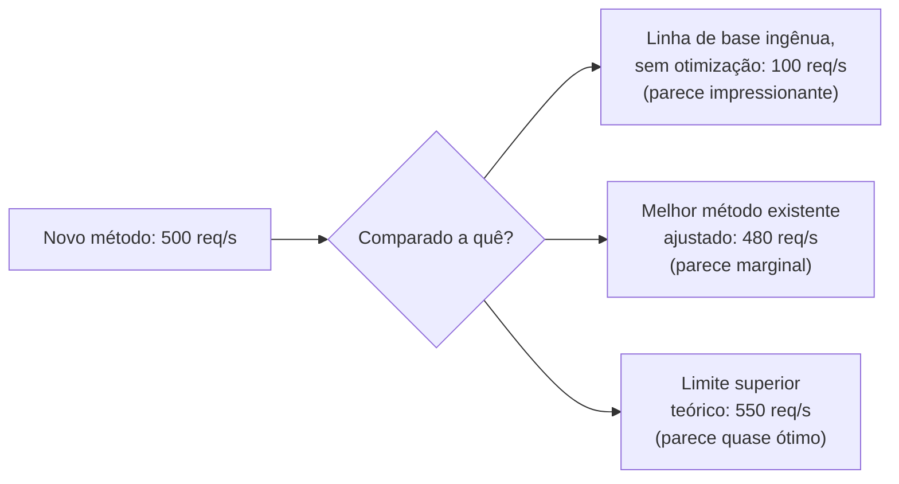

## Objetivos de Aprendizagem

- Explicar por que um resultado só tem significado em relação a uma linha de base, e por que escolher uma linha de base fraca ou desatualizada pode fazer quase qualquer método novo parecer bom, independentemente do mérito.
- Enunciar as propriedades de que uma linha de base justa e relevante precisa: esforço de ajuste comparável, um ponto de comparação genuinamente competitivo, e condições ajustadas à afirmação de fato.
- Descrever o que torna os dados experimentais persuasivos a um leitor cético, para além de simplesmente estarem presentes num artigo.
- Aplicar a seleção de linha de base a um projeto experimental concreto, identificando um ponto de comparação genuinamente forte, e não um conveniente.

## Contexto e Motivação

`hypotheses-questions-and-forms-of-evidence` e `good-and-bad-science-measurement-and-reflection` estabeleceram como se parece uma hipótese falsificável e por que a medição justa e ajustada importa. Este conceito, que abre o material de "Experimentation" de que esta disciplina se vale do capítulo de mesmo nome de Zobel, cobre a única decisão que mais determina se o resultado de um experimento significa algo: contra o que ele está sendo comparado.

Um número por si só, "o novo método alcança 500 requisições por segundo", diz quase nada. Se isso é um resultado impressionante ou decepcionante depende inteiramente do que mais poderia plausivelmente ser comparado com ele, um método existente, uma linha de base ingênua, um limite superior teórico. O tratamento de Zobel sobre linhas de base é correspondentemente direto: escolher uma linha de base não é um passo procedimental menor antes do experimento "de verdade"; é uma das decisões mais consequentes de todo o projeto experimental, porque uma linha de base fraca ou desatualizada pode fazer quase qualquer método novo parecer uma melhoria.

## Teoria Central

### Por que um resultado só é significativo em relação a uma linha de base



O mesmo número, 500 requisições por segundo, apoia três narrativas muito diferentes dependendo inteiramente da linha de base escolhida para comparação, e nenhuma dessas narrativas está errada exatamente, cada uma é acurada em relação à sua linha de base específica, mas só uma delas, a comparação contra o melhor método existente ajustado, de fato diz a um leitor cético o que ele precisa saber: este novo método representa um progresso genuíno sobre o estado da arte atual.

### O que torna uma linha de base justa e relevante

Uma linha de base justa recebe um esforço de ajuste comparável ao do método novo sendo avaliado; uma linha de base injustamente subajustada, deliberadamente ou por simples negligência, infla a vantagem aparente da nova abordagem de uma forma que não vai se sustentar uma vez que outra pessoa ajuste a linha de base adequadamente. Uma linha de base relevante é uma que um leitor conhecedor da área de fato esperaria ver, tipicamente o método publicado existente mais forte que aborda o mesmo problema, e não uma alternativa mais fácil de superar, mas menos representativa. Uma linha de base desatualizada, um método que foi estado da arte anos atrás, mas desde então foi superado por trabalho que a própria seção de trabalhos relacionados do artigo deveria ter trazido à tona, produz uma comparação que parece favorável só porque a concorrência real foi deixada de fora.

### Dados persuasivos versus dados meramente presentes

```text
Dados meramente presentes:       uma tabela de números, tecnicamente
                                  acurada, sem linha de base forte
                                  o bastante para tornar a comparação
                                  significativa, ou sem indicação de
                                  variabilidade entre execuções repetidas.

Dados persuasivos:               o mesmo tipo de números, comparados
                                  contra uma linha de base genuinamente forte,
                                  relatados com variabilidade honesta, e
                                  apresentados de uma forma que um leitor cético
                                  consegue usar para julgar de forma independente se
                                  o efeito alegado é real.
```

A distinção de Zobel aqui se conecta diretamente de volta ao padrão fundacional do leitor cético de `academic-writing`: os dados se tornam persuasivos especificamente por dar a um leitor cético o que ele precisa para verificar uma afirmação por si mesmo, e não por simplesmente existir numa tabela de resultados. Uma linha de base forte é uma parte disso; a variabilidade relatada honestamente, coberta no próprio `aggregation-variability-and-reporting` desta disciplina, é outra.

### A seleção de linha de base como responsabilidade contínua

Escolher uma linha de base não é uma decisão única feita e esquecida no começo de um projeto. Conforme um projeto se desenvolve e a revisão de literatura se aprofunda, uma linha de base mais forte e mais recente pode surgir que não era conhecida quando o experimento foi projetado pela primeira vez; Zobel trata atualizar a linha de base em resposta a isso como uma obrigação metodológica real, e não como rigor extra opcional, já que publicar uma comparação contra uma linha de base já conhecida como mais fraca do que o estado da arte de fato produz um resultado enganoso, independentemente de quão honestamente tudo o mais no experimento foi conduzido.

## Exemplos Resolvidos

### Exemplo 1: pegar uma linha de base desatualizada

A revisão de literatura de um estudante, conduzida cedo num projeto, identifica uma estratégia de cache como o ponto de comparação padrão do campo. Um ano projeto adentro, uma estratégia mais forte e mais recente é publicada. Atualizar a linha de base experimental para incluir essa estratégia mais nova, em vez de publicar contra a agora desatualizada, é o que este conceito exige, ainda que isso signifique mais trabalho de implementação no fim do projeto.

### Exemplo 2: corrigir uma comparação de ajuste injusta

Uma avaliação inicialmente ajusta cuidadosamente os parâmetros de timeout de um novo protocolo de consenso enquanto deixa um protocolo de linha de base nas suas configurações padrão. Aplicando o padrão de justiça, o pesquisador ajusta os parâmetros da linha de base com esforço comparável antes de reexecutar a comparação; a vantagem do novo protocolo se estreita de 40% para 15%, uma afirmação menor, mas muito mais defensável e persuasiva.

### Exemplo 3: escolher entre duas linhas de base candidatas

Comparando um novo algoritmo de balanceamento de carga, um pesquisador considera duas linhas de base possíveis: um esquema simples de round-robin, fácil de implementar e garantido a parecer fraco por comparação, e um esquema de least-connections bem ajustado de fato usado em sistemas de produção semelhantes à implantação-alvo. Escolher a linha de base de least-connections, ainda que seja uma comparação mais difícil de vencer, produz um resultado que um leitor cético e conhecedor de fato achará persuasivo; a comparação de round-robin não.

## Equívocos Comuns e Armadilhas

- **"Qualquer linha de base é melhor do que nenhuma linha de base."** Uma linha de base fraca, desatualizada ou injustamente ajustada pode ser ativamente enganosa, produzindo uma comparação que parece favorável por razões que nada têm a ver com o mérito de fato do novo método.
- **"A linha de base escolhida no começo de um projeto não precisa ser revisitada."** Uma linha de base mais nova e mais forte surgindo mais adiante na revisão de literatura do projeto é uma obrigação metodológica real a incorporar, e não uma melhoria opcional a pular por conveniência.
- **"Uma tabela de resultados cheia de números é inerentemente persuasiva."** Os dados se tornam persuasivos especificamente por meio de uma linha de base forte e justa e do relato honesto de variabilidade; números sozinhos, sem nenhum dos dois, são meramente presentes, e não persuasivos a um leitor genuinamente cético.

## Resumo

Um resultado experimental só tem significado em relação a uma linha de base, e uma linha de base fraca, desatualizada ou injustamente ajustada pode fazer quase qualquer método novo parecer uma melhoria, que é por que escolher uma linha de base justa, relevante e genuinamente competitiva é uma das decisões mais consequentes no projeto de um experimento. Dados persuasivos são dados que dão a um leitor cético o que ele precisa para verificar de forma independente uma afirmação, estando uma linha de base forte e a variabilidade relatada honestamente entre os componentes mais importantes disso, e a seleção de linha de base é uma responsabilidade contínua que pode exigir atualização conforme pontos de comparação mais fortes surgem durante um projeto, e não uma decisão feita uma vez e deixada sem revisitação.

## Documentation Links

- [ACM Digital Library: Justin Zobel, Writing for Computer Science (3ª edição, Springer, 2014)](https://dl.acm.org/doi/10.5555/2742708): as seções "Baselines" e "Persuasive Data" do Capítulo 14 são a fonte direta da orientação sobre justiça de linha de base e persuasividade de dados coberta aqui.
