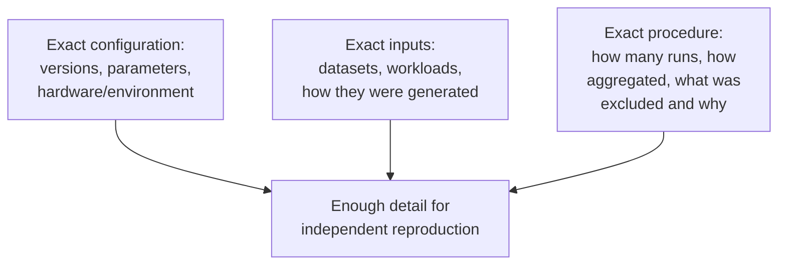

## Learning Objectives

- Explain why code written to run an experiment has a stricter correctness obligation than code written to ship a feature, and what makes a silent bug in an evaluation harness especially dangerous.
- Describe concrete practices for testing and sanity-checking experimental code before trusting its output.
- State what level of detail a written description of an experiment needs to include for another researcher to reproduce it independently.
- Connect this concept to ACM's current Artifact Review and Badging policy as a real, institutional recognition of reproducibility's importance.

## Context & Motivation

`baselines-and-persuasive-data` and `interpretation-and-robustness-of-experimental-results` treated the design of an experiment; this concept covers two closely related practical concerns that determine whether an experiment's results can actually be trusted and reused: the code that runs it, and the written description that lets someone else repeat it. Zobel groups these together deliberately, "Coding for Experimentation" and "Describing Experiments," because both address the same underlying risk, a result that looks solid on the page but cannot actually be trusted or reproduced once examined closely.

## Core Theory

### Why experimental code needs a stricter correctness obligation

```text
Feature code:        a bug is often visible fairly quickly, through a
                      failing test, a crash, or a user-visible defect,
                      and gets caught before it does much damage.

Experimental code:    a bug in a measurement harness, an off-by-one
                      in how results are aggregated, a unit conversion
                      error, a baseline accidentally misconfigured, can
                      silently produce a confidently wrong number that
                      LOOKS correct, passes every code review, and ends
                      up published, because nothing about the paper's
                      prose reveals the underlying error.
```

This asymmetry is what makes experimental code's correctness obligation genuinely stricter in an important sense: ordinary software bugs are often self-revealing through visible failure, while an experimental measurement bug's only symptom is a wrong number that looks entirely plausible, sometimes even more plausible than the correct one would have been.

### Testing and sanity-checking experimental code

Concrete practices Zobel recommends include: testing the measurement and aggregation logic itself on inputs with a known, hand-computed correct answer before trusting it on real experimental data; sanity-checking results against independent expectations, if a result contradicts basic intuition or a simple back-of-envelope estimate, treating that as a signal to investigate the code rather than assuming the surprising result is simply real; and keeping the experimental code itself simple and readable enough that a bug, if present, has a reasonable chance of being noticed on inspection, resisting the temptation to over-optimize or over-engineer code whose only purpose is producing a trustworthy measurement.

### Describing an experiment for reproducibility



A written description of an experiment needs to give a reader enough detail to reproduce it independently, not merely enough to follow the argument being made about it. This means specifying exact software and hardware versions where they could plausibly affect the result, the exact inputs or workloads used and how they were obtained or generated, and the exact procedure, how many repetitions, how results were aggregated, and honestly, what (if anything) was excluded and why. Omitting any of these is not a minor stylistic gap; it is the difference between a result someone else can actually verify and one that has to be taken on faith.

### Reproducibility as a formally recognized institutional concern

This concern is significant enough in the field that ACM maintains a formal, current Artifact Review and Badging policy, awarding independent badges for whether a paper's artifacts were evaluated, made available, and whether its specific results were independently validated by reviewers. That a major publishing body formalized this into an explicit, badge-worthy review process is direct, institutional evidence that describing experiments reproducibly is treated as a real component of research quality in computing, not an optional courtesy to readers.

## Worked Examples

### Example 1: catching a silent measurement bug

A researcher's benchmark harness reports a new algorithm running twice as fast as expected, an unusually large improvement given the algorithm's design. Rather than reporting this exciting result immediately, a sanity check against a hand-computed expectation on a small, known input reveals the harness was accidentally measuring only half the actual workload due to an off-by-one in a loop bound; fixing the bug produces a smaller, more plausible, and now trustworthy result.

### Example 2: writing a reproducible experiment description

A draft methods section states "we ran the benchmark on our server and measured throughput." Revised for reproducibility: "we ran the benchmark on a machine with [specific CPU, memory, OS version], using [specific software version], on [specific workload, with a link to how it was generated], averaging over 20 runs after a 1000-request warm-up period, discarding no results." The revised version gives a reader everything needed to attempt an independent reproduction.

### Example 3: keeping experimental code simple enough to audit

A researcher initially writes a highly optimized, complex measurement harness to minimize its own overhead. Recognizing this complexity makes bugs harder to spot on inspection, the harness is rewritten more simply, accepting slightly more overhead in exchange for code a colleague can actually read and verify correct by inspection, a deliberate tradeoff favoring trustworthiness over cleverness for code whose entire purpose is producing a number other people will rely on.

## Common Misconceptions & Pitfalls

- **"If the result looks plausible, the code that produced it is probably correct."** A silent measurement bug's defining feature is producing a wrong result that looks entirely plausible; plausibility alone is not evidence of correctness for experimental code specifically.
- **"A brief description of the experimental setup is enough if the results speak for themselves."** Results only "speak for themselves" to a reader who can verify them; without enough procedural detail to attempt reproduction, a result has to be taken on faith rather than checked.
- **"Reproducibility is a nice-to-have, not a core part of research quality."** ACM's formal Artifact Review and Badging policy is direct, institutional evidence the field treats reproducibility as a real, recognized dimension of research quality, not an optional courtesy.

## Summary

Code written to run an experiment carries a stricter correctness obligation than typical feature code, because a measurement bug can silently produce a confidently wrong but entirely plausible-looking result that no amount of careful prose will reveal, which is why testing measurement logic against known answers and sanity-checking surprising results before trusting them are essential practices. Describing an experiment for reproducibility means specifying exact configuration, exact inputs, and exact procedure, enough detail for genuinely independent reproduction, not just enough to follow the argument, and ACM's own current Artifact Review and Badging policy is real, institutional confirmation that this concern is treated as a core part of research quality in computing.

## Documentation Links

- [ACM Digital Library: Justin Zobel, Writing for Computer Science (3rd Edition, Springer, 2014)](https://dl.acm.org/doi/10.5555/2742708): Chapter 14's "Coding for Experimentation" and "Describing Experiments" sections are the direct source for the experimental-code and reproducible-description guidance covered here.
- [ACM: Artifact Review and Badging, Version 2.0 (Current)](https://www.acm.org/publications/policies/artifact-review-and-badging-current): the field's current, formal policy recognizing and rewarding reproducibility, directly relevant to why describing experiments precisely matters institutionally, not just pedagogically.
