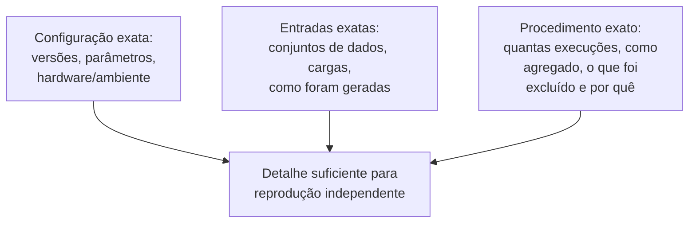

## Objetivos de Aprendizagem

- Explicar por que código escrito para rodar um experimento tem uma obrigação de correção mais estrita do que código escrito para entregar uma funcionalidade, e o que torna um bug silencioso num arcabouço de avaliação especialmente perigoso.
- Descrever práticas concretas para testar e checar a sanidade do código experimental antes de confiar na sua saída.
- Enunciar que nível de detalhe uma descrição escrita de um experimento precisa incluir para que outro pesquisador o reproduza de forma independente.
- Conectar este conceito à política atual de Artifact Review and Badging da ACM como um reconhecimento real e institucional da importância da reprodutibilidade.

## Contexto e Motivação

`baselines-and-persuasive-data` e `interpretation-and-robustness-of-experimental-results` trataram do projeto de um experimento; este conceito cobre duas preocupações práticas intimamente relacionadas que determinam se os resultados de um experimento podem de fato ser confiados e reusados: o código que o roda, e a descrição escrita que permite a outra pessoa repeti-lo. Zobel as agrupa deliberadamente, "Coding for Experimentation" e "Describing Experiments", porque ambas abordam o mesmo risco subjacente, um resultado que parece sólido na página, mas não pode de fato ser confiado ou reproduzido uma vez examinado de perto.

## Teoria Central

### Por que o código experimental precisa de uma obrigação de correção mais estrita

```text
Código de funcionalidade:  um bug é muitas vezes visível razoavelmente depressa, por um
                      teste que falha, uma falha, ou um defeito visível ao usuário,
                      e é pego antes de causar muito dano.

Código experimental:  um bug num arcabouço de medição, um off-by-one
                      em como os resultados são agregados, um erro de conversão
                      de unidade, uma linha de base acidentalmente mal configurada, pode
                      produzir silenciosamente um número confiantemente errado que
                      PARECE correto, passa por toda revisão de código, e acaba
                      publicado, porque nada na prosa do artigo
                      revela o erro subjacente.
```

Essa assimetria é o que torna a obrigação de correção do código experimental genuinamente mais estrita num sentido importante: bugs de software comuns são muitas vezes autorrevelados por meio de falha visível, enquanto o único sintoma de um bug de medição experimental é um número errado que parece inteiramente plausível, às vezes até mais plausível do que o correto teria sido.

### Testar e checar a sanidade do código experimental

Práticas concretas que Zobel recomenda incluem: testar a própria lógica de medição e agregação em entradas com uma resposta correta conhecida e calculada à mão antes de confiar nela em dados experimentais reais; checar a sanidade dos resultados contra expectativas independentes, se um resultado contradiz a intuição básica ou uma estimativa simples de guardanapo, tratar isso como um sinal para investigar o código, em vez de assumir que o resultado surpreendente é simplesmente real; e manter o próprio código experimental simples e legível o bastante para que um bug, se presente, tenha uma chance razoável de ser notado na inspeção, resistindo à tentação de super-otimizar ou super-engenheirar um código cujo único propósito é produzir uma medição confiável.

### Descrever um experimento para reprodutibilidade



Uma descrição escrita de um experimento precisa dar a um leitor detalhe suficiente para reproduzi-lo de forma independente, e não meramente suficiente para acompanhar o argumento sendo feito sobre ele. Isso significa especificar as versões exatas de software e hardware onde elas poderiam plausivelmente afetar o resultado, as entradas ou cargas exatas usadas e como foram obtidas ou geradas, e o procedimento exato, quantas repetições, como os resultados foram agregados, e honestamente, o que (se é que algo) foi excluído e por quê. Omitir qualquer um desses não é uma lacuna estilística menor; é a diferença entre um resultado que outra pessoa pode de fato verificar e um que tem de ser aceito com base na fé.

### A reprodutibilidade como preocupação institucional formalmente reconhecida

Essa preocupação é significativa o bastante no campo a ponto de a ACM manter uma política formal e atual de Artifact Review and Badging, concedendo selos independentes para se os artefatos de um artigo foram avaliados, disponibilizados, e se os seus resultados específicos foram validados de forma independente por avaliadores. Que um grande órgão editorial tenha formalizado isso num processo de avaliação explícito e digno de selo é evidência direta e institucional de que descrever experimentos de forma reprodutível é tratado como um componente real da qualidade de pesquisa em computação, e não como uma cortesia opcional aos leitores.

## Exemplos Resolvidos

### Exemplo 1: pegar um bug de medição silencioso

O arcabouço de benchmark de um pesquisador relata um novo algoritmo rodando duas vezes mais rápido do que o esperado, uma melhoria incomumente grande dado o projeto do algoritmo. Em vez de relatar esse resultado empolgante imediatamente, uma checagem de sanidade contra uma expectativa calculada à mão numa entrada pequena e conhecida revela que o arcabouço estava medindo acidentalmente só metade da carga de fato por causa de um off-by-one num limite de laço; corrigir o bug produz um resultado menor, mais plausível e agora confiável.

### Exemplo 2: escrever uma descrição de experimento reprodutível

Um rascunho de seção de métodos diz "rodamos o benchmark no nosso servidor e medimos a vazão". Revisado para reprodutibilidade: "rodamos o benchmark numa máquina com [CPU, memória, versão de SO específicas], usando [versão de software específica], em [carga específica, com um link de como foi gerada], tirando a média de 20 execuções após um período de aquecimento de 1000 requisições, descartando nenhum resultado". A versão revisada dá a um leitor tudo o que é necessário para tentar uma reprodução independente.

### Exemplo 3: manter o código experimental simples o bastante para auditar

Um pesquisador inicialmente escreve um arcabouço de medição altamente otimizado e complexo para minimizar a sua própria sobrecarga. Reconhecendo que essa complexidade torna os bugs mais difíceis de notar na inspeção, o arcabouço é reescrito de forma mais simples, aceitando uma sobrecarga ligeiramente maior em troca de um código que um colega pode de fato ler e verificar correto por inspeção, um trade-off deliberado favorecendo a confiabilidade em vez da esperteza para um código cujo propósito inteiro é produzir um número do qual outras pessoas vão depender.

## Equívocos Comuns e Armadilhas

- **"Se o resultado parece plausível, o código que o produziu provavelmente está correto."** A característica definidora de um bug de medição silencioso é produzir um resultado errado que parece inteiramente plausível; a plausibilidade sozinha não é evidência de correção para o código experimental especificamente.
- **"Uma descrição breve da configuração experimental é suficiente se os resultados falam por si."** Os resultados só "falam por si" a um leitor que consegue verificá-los; sem detalhe procedimental suficiente para tentar a reprodução, um resultado tem de ser aceito com base na fé, em vez de conferido.
- **"A reprodutibilidade é um bônus, não uma parte central da qualidade de pesquisa."** A política formal de Artifact Review and Badging da ACM é evidência direta e institucional de que o campo trata a reprodutibilidade como uma dimensão real e reconhecida da qualidade de pesquisa, e não como uma cortesia opcional.

## Resumo

Código escrito para rodar um experimento carrega uma obrigação de correção mais estrita do que o código de funcionalidade típico, porque um bug de medição pode produzir silenciosamente um resultado confiantemente errado, mas de aparência inteiramente plausível, que nenhuma prosa cuidadosa vai revelar, que é por que testar a lógica de medição contra respostas conhecidas e checar a sanidade de resultados surpreendentes antes de confiar neles são práticas essenciais. Descrever um experimento para reprodutibilidade significa especificar a configuração exata, as entradas exatas e o procedimento exato, detalhe suficiente para uma reprodução genuinamente independente, e não só suficiente para acompanhar o argumento, e a própria política atual de Artifact Review and Badging da ACM é a confirmação real e institucional de que essa preocupação é tratada como uma parte central da qualidade de pesquisa em computação.

## Documentation Links

- [ACM Digital Library: Justin Zobel, Writing for Computer Science (3ª edição, Springer, 2014)](https://dl.acm.org/doi/10.5555/2742708): as seções "Coding for Experimentation" e "Describing Experiments" do Capítulo 14 são a fonte direta da orientação sobre código experimental e descrição reprodutível coberta aqui.
- [ACM: Artifact Review and Badging, Version 2.0 (Current)](https://www.acm.org/publications/policies/artifact-review-and-badging-current): a política atual e formal do campo que reconhece e recompensa a reprodutibilidade, diretamente relevante para por que descrever experimentos com precisão importa institucionalmente, e não só pedagogicamente.
