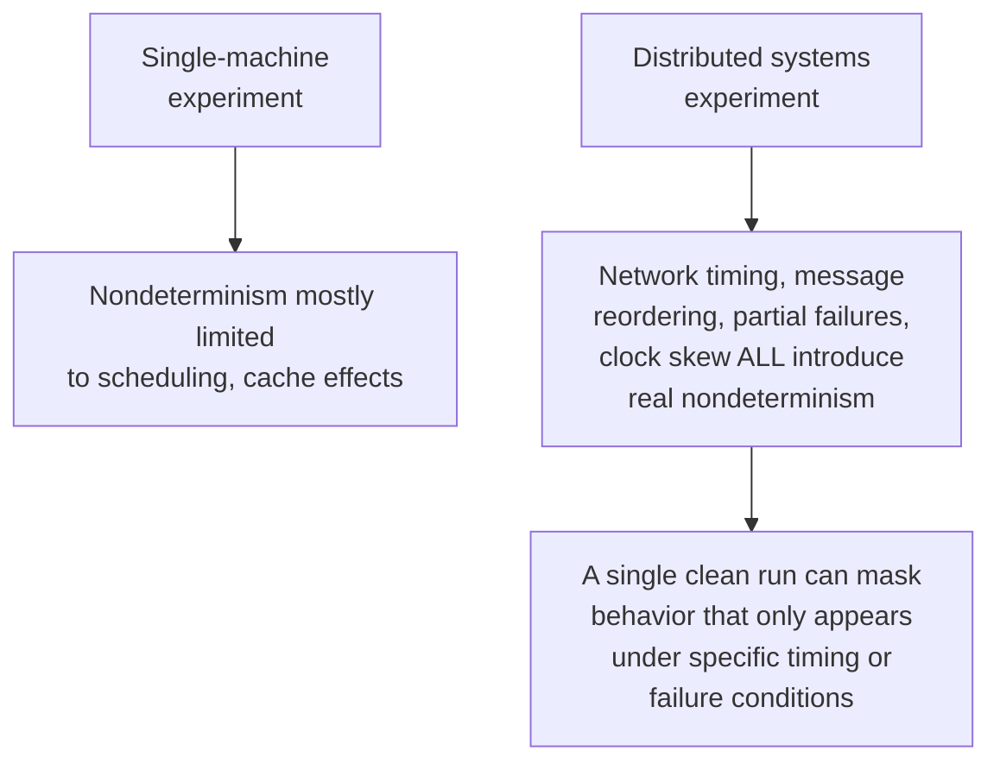

## Learning Objectives

- Apply this discipline's full methodology, honest baselines, robustness checking, correct performance measurement, and real statistical significance, to the specific domain of distributed systems research.
- Identify what a fair, strong baseline looks like for a distributed consensus or replication protocol, as distinct from a strawman comparison.
- Explain why distributed systems experiments are unusually vulnerable to hidden nondeterminism, and what a robustness check needs to cover that a single-machine experiment does not.
- Design an experiment plan for a concrete distributed systems research question, choosing what to hold fixed, what to vary, and how to report results honestly.

## Context & Motivation

This concept is where `research-statistics` closes by applying everything it has built (falsifiable hypotheses, fair baselines, robustness checking, correct performance measurement, honest variability and significance reporting) to a specific, concrete technical domain: distributed systems. This is not a coincidental choice of example. This curriculum's own `distributed-systems-ii` already gives real, substantial technical depth to consensus (Byzantine fault tolerance, PBFT), replication (leaderless quorum-based systems, anti-entropy), and consistency trade-offs (PACELC, CRDTs), and `graduate-studies` exists specifically to turn technical depth like that into genuine, publishable research contribution. Designing a sound experiment is the concrete, methodological step that connects the two: knowing consensus protocols deeply is not the same skill as knowing how to design a trustworthy experiment comparing two of them, and this concept is about the second skill, applied to the first domain.

## Core Theory

### What a fair, strong baseline looks like for a distributed protocol

`baselines-and-persuasive-data` established that a baseline needs comparable tuning effort and needs to be genuinely competitive, not a strawman. Applied to distributed systems specifically: comparing a new quorum design against `dynamo-style-leaderless-replication-and-quorum-intersection`'s already-established quorum-intersection approach means tuning both systems' quorum sizes and replication factors with comparable care, not leaving the baseline at an arbitrary default while carefully tuning the new design. A genuinely strong baseline for a new consensus protocol is a well tuned, widely used existing protocol, not a deliberately simplified or under-optimized version of one, since a comparison against a weakened baseline produces exactly the misleadingly favorable result `baselines-and-persuasive-data` warned against.

### Why distributed experiments are unusually vulnerable to hidden nondeterminism

`measuring-algorithm-and-systems-performance` already covered warm-up effects and background load as confounds in single-machine benchmarking. Distributed systems experiments face all of that plus a genuinely larger source of hidden nondeterminism: network timing variation, message reordering, partial node failures, and clock skew across machines can all affect a protocol's behavior in ways a single run, especially one conducted under unusually favorable, quiet network conditions, will not reveal at all. This is exactly why `interpretation-and-robustness-of-experimental-results`'s robustness-checking discipline matters more here, not less: a consensus protocol's real behavior under a network partition, the condition `distributed-systems-ii`'s own PACELC concept treats as the central trade-off distributed systems have to make, will simply never appear in an experiment that only ever runs under a clean, unpartitioned network.

### Choosing what to hold fixed and what to vary

Sound experimental design for a distributed systems claim means deliberately varying the conditions the claim is actually about, network conditions (unpartitioned, partial partition affecting a stated fraction of nodes, full partition), workload skew (uniform versus hot-key access patterns), and failure patterns (crash-only versus Byzantine, where relevant), while holding other factors, hardware, software versions, unrelated configuration, fixed so that observed differences can be attributed to the varied condition rather than to an uncontrolled confound. A protocol evaluated only under ideal, unpartitioned network conditions has not actually been tested against the specific failure modes distributed systems research usually cares about most.

### Reporting variability under realistic network behavior

Applying `aggregation-variability-and-reporting` and `statistical-significance-and-avoiding-common-errors` here specifically: a distributed protocol's latency or throughput under realistic, variable network conditions typically has meaningfully more spread than the same measurement on a single machine, which makes honest variability reporting, and appropriately corrected significance testing when comparing multiple protocols across multiple network conditions, more important, not less, than in simpler single-machine benchmarks. A protocol claimed to "tolerate partial network partitions well" needs that claim tested and reported across repeated trials under actually varied partition patterns, not a single favorable trial under one specific, possibly unrepresentative partition scenario.

## Worked Examples

### Example 1: designing a fair comparison of quorum designs

A researcher proposes a hybrid quorum design intended to reduce tail latency under partial partition, compared against the standard leaderless quorum-intersection approach. Designing this fairly means tuning both systems' quorum parameters with comparable effort, testing both under an identical set of partition scenarios (not a scenario chosen because it happens to favor the new design), and running enough repetitions under each scenario to report honest variability rather than a single run per condition.

### Example 2: a robustness check that reveals hidden nondeterminism

An initial single run shows a new protocol maintaining availability cleanly through a simulated partition. Repeating the experiment across twenty independent trials, with randomized timing of the partition event relative to in-flight requests, reveals that a small fraction of trials show a brief unavailability window the single clean run happened not to capture, exactly the kind of hidden nondeterminism this concept's core theory predicts distributed experiments are unusually prone to; the honest report includes this fraction, not just the favorable single-run result.

### Example 3: choosing what to vary for a workload-sensitivity claim

A researcher claims a new replication strategy handles skewed access patterns better than the Dynamo-style baseline. The experiment is designed to vary key-access skew deliberately, from uniform to heavily skewed, while holding network conditions, hardware, and replication factor fixed across both systems, isolating skew as the one varied factor the claim is actually about, rather than conflating it with unrelated differences in how the two systems happen to be configured.

## Common Misconceptions & Pitfalls

- **"A protocol that works correctly under normal network conditions is sufficiently validated."** Distributed systems' central research questions are usually about behavior under partition, failure, or adverse timing specifically; an evaluation that never tests those conditions has not actually tested the claim most distributed systems research cares about.
- **"One clean experimental run demonstrating the desired behavior is enough to report."** Given the real, well documented nondeterminism network timing and partial failures introduce, a single run cannot distinguish a reliable property from a coincidence of that run's particular timing, which is exactly why robustness checking across repeated, varied trials matters more here than in simpler settings.
- **"Comparing against a simplified, easier-to-beat version of an existing protocol is acceptable if the real protocol is hard to reimplement correctly."** This produces exactly the unfair, weak-baseline comparison this discipline warns against; a claim of improvement over a strawman does not support a claim of improvement over the actual state of the art.

## Summary

Designing a sound distributed systems experiment means applying this discipline's full methodology, honest and fairly tuned baselines, deliberate robustness checking, correct performance measurement, and honestly reported variability and significance, to a domain that is unusually vulnerable to hidden nondeterminism from network timing, partial failures, and clock skew, nondeterminism a single clean experimental run can easily mask entirely. This is the concrete, practical link between the deep technical content this curriculum already built in `distributed-systems-ii` and the graduate-level objective `graduate-studies` exists to serve: turning real technical depth in an area like consensus, replication, or consistency trade-offs into genuinely trustworthy, publishable research contribution, not just a working implementation.

## Documentation Links

- [ACM Digital Library: Justin Zobel, Writing for Computer Science (3rd Edition, Springer, 2014)](https://dl.acm.org/doi/10.5555/2742708): the source for the baseline-fairness, robustness, and variability-reporting principles applied to the distributed systems domain throughout this concept.
- [Cambridge University Press: Catherine C. McGeoch, A Guide to Experimental Algorithmics (2012)](https://www.cambridge.org/core/books/guide-to-experimental-algorithmics/CDB0CB718F6250E0806C909E1D3D1082): the source for the systems-performance-measurement discipline this concept extends to distributed, multi-machine experimental settings.
