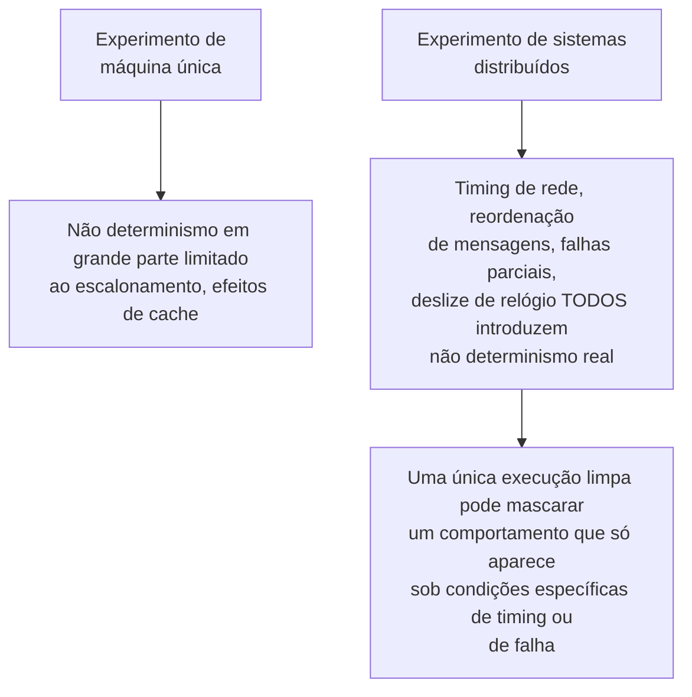

## Objetivos de Aprendizagem

- Aplicar a metodologia completa desta disciplina, linhas de base honestas, checagem de robustez, medição correta de desempenho e significância estatística real, ao domínio específico da pesquisa em sistemas distribuídos.
- Identificar como se parece uma linha de base justa e forte para um protocolo de consenso ou replicação distribuído, como distinta de uma comparação de espantalho.
- Explicar por que os experimentos de sistemas distribuídos são incomumente vulneráveis a um não determinismo oculto, e o que uma checagem de robustez precisa cobrir que um experimento de máquina única não cobre.
- Projetar um plano de experimento para uma pergunta de pesquisa concreta de sistemas distribuídos, escolhendo o que manter fixo, o que variar e como relatar os resultados honestamente.

## Contexto e Motivação

Este conceito é onde `research-statistics` se encerra aplicando tudo o que construiu (hipóteses falsificáveis, linhas de base justas, checagem de robustez, medição correta de desempenho, relato honesto de variabilidade e significância) a um domínio técnico específico e concreto: sistemas distribuídos. Essa não é uma escolha coincidente de exemplo. O próprio `distributed-systems-ii` deste currículo já dá real e substancial profundidade técnica a consenso (tolerância a falhas bizantinas, PBFT), replicação (sistemas sem líder baseados em quórum, anti-entropia) e trade-offs de consistência (PACELC, CRDTs), e `graduate-studies` existe especificamente para transformar profundidade técnica como essa em contribuição de pesquisa genuína e publicável. Projetar um experimento sólido é o passo concreto e metodológico que conecta os dois: conhecer protocolos de consenso profundamente não é a mesma habilidade que saber projetar um experimento confiável comparando dois deles, e este conceito é sobre a segunda habilidade, aplicada ao primeiro domínio.

## Teoria Central

### Como se parece uma linha de base justa e forte para um protocolo distribuído

`baselines-and-persuasive-data` estabeleceu que uma linha de base precisa de esforço de ajuste comparável e precisa ser genuinamente competitiva, não um espantalho. Aplicado a sistemas distribuídos especificamente: comparar um novo projeto de quórum contra a abordagem de interseção de quórum já estabelecida de `dynamo-style-leaderless-replication-and-quorum-intersection` significa ajustar os tamanhos de quórum e os fatores de replicação de ambos os sistemas com cuidado comparável, e não deixar a linha de base num padrão arbitrário enquanto se ajusta cuidadosamente o novo projeto. Uma linha de base genuinamente forte para um novo protocolo de consenso é um protocolo existente bem ajustado e amplamente usado, e não uma versão deliberadamente simplificada ou subotimizada de um, já que uma comparação contra uma linha de base enfraquecida produz exatamente o resultado enganosamente favorável contra o qual `baselines-and-persuasive-data` advertiu.

### Por que os experimentos distribuídos são incomumente vulneráveis ao não determinismo oculto

`measuring-algorithm-and-systems-performance` já cobriu efeitos de aquecimento e carga de fundo como confundidores no benchmarking de máquina única. Os experimentos de sistemas distribuídos enfrentam tudo isso mais uma fonte genuinamente maior de não determinismo oculto: a variação de timing de rede, a reordenação de mensagens, as falhas parciais de nós e o deslize de relógio entre máquinas podem todos afetar o comportamento de um protocolo de maneiras que uma única execução, especialmente uma conduzida sob condições de rede incomumente favoráveis e silenciosas, não vai revelar de forma alguma. É exatamente por isso que a disciplina de checagem de robustez de `interpretation-and-robustness-of-experimental-results` importa mais aqui, não menos: o comportamento real de um protocolo de consenso sob uma partição de rede, a condição que o próprio conceito de PACELC de `distributed-systems-ii` trata como o trade-off central que os sistemas distribuídos têm de fazer, simplesmente nunca aparecerá num experimento que só roda sob uma rede limpa e não particionada.

### Escolher o que manter fixo e o que variar

Um projeto experimental sólido para uma afirmação de sistemas distribuídos significa variar deliberadamente as condições sobre as quais a afirmação de fato é, condições de rede (não particionada, partição parcial afetando uma fração enunciada de nós, partição completa), viés de carga (padrões de acesso uniforme versus de chave quente) e padrões de falha (só crash versus bizantina, onde relevante), enquanto se mantêm outros fatores, hardware, versões de software, configuração não relacionada, fixos, para que as diferenças observadas possam ser atribuídas à condição variada, e não a um confundidor não controlado. Um protocolo avaliado só sob condições de rede ideais e não particionadas não foi de fato testado contra os modos de falha específicos com que a pesquisa em sistemas distribuídos geralmente mais se importa.

### Relatar a variabilidade sob comportamento de rede realista

Aplicando `aggregation-variability-and-reporting` e `statistical-significance-and-avoiding-common-errors` aqui especificamente: a latência ou a vazão de um protocolo distribuído sob condições de rede realistas e variáveis tipicamente tem um espalhamento significativamente maior do que a mesma medição numa máquina única, o que torna o relato honesto de variabilidade, e o teste de significância apropriadamente corrigido ao comparar múltiplos protocolos ao longo de múltiplas condições de rede, mais importante, não menos, do que em benchmarks de máquina única mais simples. Um protocolo alegado como capaz de "tolerar bem partições parciais de rede" precisa que essa afirmação seja testada e relatada ao longo de ensaios repetidos sob padrões de partição de fato variados, e não um único ensaio favorável sob um cenário de partição específico e possivelmente não representativo.

## Exemplos Resolvidos

### Exemplo 1: projetar uma comparação justa de projetos de quórum

Um pesquisador propõe um projeto de quórum híbrido destinado a reduzir a latência de cauda sob partição parcial, comparado contra a abordagem padrão de interseção de quórum sem líder. Projetar isso de forma justa significa ajustar os parâmetros de quórum de ambos os sistemas com esforço comparável, testar ambos sob um conjunto idêntico de cenários de partição (não um cenário escolhido porque por acaso favorece o novo projeto), e rodar repetições suficientes sob cada cenário para relatar variabilidade honesta, em vez de uma única execução por condição.

### Exemplo 2: uma checagem de robustez que revela não determinismo oculto

Uma execução única inicial mostra um novo protocolo mantendo a disponibilidade de forma limpa através de uma partição simulada. Repetir o experimento ao longo de vinte ensaios independentes, com timing aleatorizado do evento de partição em relação às requisições em voo, revela que uma pequena fração dos ensaios mostra uma breve janela de indisponibilidade que a execução única e limpa por acaso não capturou, exatamente o tipo de não determinismo oculto que a teoria central deste conceito prevê que os experimentos distribuídos são incomumente propensos a ter; o relato honesto inclui essa fração, e não só o resultado favorável da execução única.

### Exemplo 3: escolher o que variar para uma afirmação de sensibilidade à carga

Um pesquisador alega que uma nova estratégia de replicação lida melhor com padrões de acesso enviesados do que a linha de base em estilo Dynamo. O experimento é projetado para variar deliberadamente o viés de acesso a chaves, do uniforme ao fortemente enviesado, enquanto se mantêm as condições de rede, o hardware e o fator de replicação fixos entre ambos os sistemas, isolando o viés como o único fator variado sobre o qual a afirmação de fato é, em vez de confundi-lo com diferenças não relacionadas em como os dois sistemas por acaso estão configurados.

## Equívocos Comuns e Armadilhas

- **"Um protocolo que funciona corretamente sob condições normais de rede está suficientemente validado."** As perguntas de pesquisa centrais dos sistemas distribuídos são geralmente sobre o comportamento sob partição, falha ou timing adverso especificamente; uma avaliação que nunca testa essas condições não testou de fato a afirmação com que a maior parte da pesquisa em sistemas distribuídos se importa.
- **"Uma única execução experimental limpa demonstrando o comportamento desejado é suficiente para relatar."** Dado o não determinismo real e bem documentado que o timing de rede e as falhas parciais introduzem, uma única execução não consegue distinguir uma propriedade confiável de uma coincidência do timing particular daquela execução, que é exatamente por que a checagem de robustez ao longo de ensaios repetidos e variados importa mais aqui do que em cenários mais simples.
- **"Comparar contra uma versão simplificada e mais fácil de superar de um protocolo existente é aceitável se o protocolo real for difícil de reimplementar corretamente."** Isso produz exatamente a comparação injusta de linha de base fraca contra a qual esta disciplina adverte; uma afirmação de melhoria sobre um espantalho não apoia uma afirmação de melhoria sobre o estado da arte de fato.

## Resumo

Projetar um experimento sólido de sistemas distribuídos significa aplicar a metodologia completa desta disciplina, linhas de base honestas e justamente ajustadas, checagem deliberada de robustez, medição correta de desempenho e variabilidade e significância relatadas honestamente, a um domínio que é incomumente vulnerável a um não determinismo oculto vindo do timing de rede, das falhas parciais e do deslize de relógio, um não determinismo que uma única execução experimental limpa pode facilmente mascarar por completo. Esse é o elo concreto e prático entre o conteúdo técnico profundo que este currículo já construiu em `distributed-systems-ii` e o objetivo de nível de pós-graduação que `graduate-studies` existe para servir: transformar real profundidade técnica numa área como consenso, replicação ou trade-offs de consistência em contribuição de pesquisa genuinamente confiável e publicável, e não só uma implementação funcional.

## Documentation Links

- [ACM Digital Library: Justin Zobel, Writing for Computer Science (3ª edição, Springer, 2014)](https://dl.acm.org/doi/10.5555/2742708): a fonte dos princípios de justiça de linha de base, robustez e relato de variabilidade aplicados ao domínio dos sistemas distribuídos ao longo deste conceito.
- [Cambridge University Press: Catherine C. McGeoch, A Guide to Experimental Algorithmics (2012)](https://www.cambridge.org/core/books/guide-to-experimental-algorithmics/CDB0CB718F6250E0806C909E1D3D1082): a fonte da disciplina de medição de desempenho de sistemas que este conceito estende a cenários experimentais distribuídos e de múltiplas máquinas.
