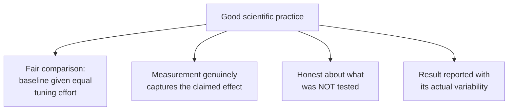

## Learning Objectives

- Explain why choosing how and what to measure is itself a research decision made before data collection begins, not a neutral technical detail.
- List the concrete, checkable properties Zobel associates with good scientific practice in computing research, and the corresponding failures that mark bad practice.
- Distinguish honest reporting of what was not tested from an implicit overclaim by omission.
- Describe research as an ongoing, reflective practice rather than a process that ends once one hypothesis is confirmed.

## Context & Motivation

`hypotheses-questions-and-forms-of-evidence` established what a falsifiable hypothesis looks like and what kinds of evidence can support one. This concept covers a decision that sits between forming a hypothesis and actually testing it: how, precisely, will the relevant quantity be measured, and is that measurement approach actually capturing what the hypothesis claims. Zobel closes his chapter on hypotheses and evidence with exactly this concern, approaches to measurement, followed by a direct discussion of what separates good science from bad science in computing research, and a closing reflection on research as a continuing practice rather than a single completed exercise.

## Core Theory

### Measurement as a research decision

```text
Hypothesis: "The new scheduler reduces average job wait time."

Measurement choices that change what this actually tests:
  - Wait time measured from submission, or from when resources
    become available?
  - Averaged across all jobs, or weighted by job size?
  - Measured under the system's typical load, or under a
    stress-test load unlikely to occur in practice?
```

Each of these choices changes what the resulting number actually means, and a careless or convenient choice, one that happens to be easy to implement rather than one that genuinely matches the hypothesis's intent, can produce a technically accurate measurement that still fails to test the claim it was meant to test. Zobel's point is that this decision deserves the same deliberate attention as choosing the hypothesis itself, since a well-formed hypothesis tested with a poorly matched measurement produces a result that answers a different, unstated question.

### Good science: concrete, checkable properties



Zobel treats good science as reducible to properties like these, checkable by a careful reader, rather than as a matter of a researcher's general trustworthiness or the sophistication of the technique used. A simple, honestly conducted experiment with a fair baseline is better science than an elaborate one with a weak or unfairly tuned point of comparison. Bad science, in this concrete sense, includes tuning a proposed method carefully while leaving the baseline at its default configuration, measuring under conditions cherry-picked to favor the hypothesis, or silently omitting a tested condition where the result was unfavorable.

### Honesty about what was not tested

A claim's real scope is defined as much by what was not tested as by what was. A paper reporting strong results on three workloads is honest science when it states clearly that only those three were tested, and becomes dishonest by omission if its prose implies a broader claim, "this approach performs well," than the actual evidence, "this approach performed well on these three specific workloads," supports. This connects directly to the tone discipline `academic-writing`'s own `good-style-economy-tone-and-audience` concept covers, matching a claim's stated confidence to what the evidence actually shows, applied here at the earlier stage of deciding what to test and report in the first place, not just how to phrase it afterward.

### Research as reflective, ongoing practice

Zobel's closing reflection on this chapter resists the idea that a research project ends cleanly once a hypothesis is confirmed. A confirmed hypothesis in one specific setting routinely raises new, narrower or adjacent questions, does the effect hold under a different workload, does it hold at a different scale, and treating a single confirmed result as a finished, closed question, rather than one data point in a continuing investigation, is itself a subtler form of overclaiming: it implies more finality than one result, honestly considered, actually supports.

## Worked Examples

### Example 1: an unfair comparison caught before publication

A researcher benchmarks a new indexing structure against an established baseline, initially using the baseline's default configuration while carefully tuning the new structure's parameters. Applying the fair-comparison standard, the researcher instead spends comparable tuning effort on the baseline before rerunning the comparison; the new structure's advantage shrinks but remains real, producing a smaller but far more trustworthy claim than the original, unfairly tuned comparison would have supported.

### Example 2: measurement that doesn't match the hypothesis

A hypothesis claims a new caching layer "improves user-perceived latency." A researcher initially measures only server-side processing time, which excludes network transit and client-side rendering, the components that actually dominate what a user perceives. Recognizing the mismatch, the measurement is revised to capture end-to-end latency from request initiation to content displayed, now actually testing the claim as stated.

### Example 3: honest scope reporting

An evaluation covers four benchmark workloads; the new method underperforms on one of them, which involves unusually small input sizes. Reported honestly: "the method improved performance on three of four tested workloads, with a small regression observed on the workload involving inputs under 100 elements," rather than omitting the fourth workload or describing the overall result only in the most favorable terms.

## Common Misconceptions & Pitfalls

- **"How something is measured is a technical implementation detail, not a research decision."** A measurement approach that does not actually capture the effect a hypothesis claims produces a technically accurate but substantively misleading result; the choice deserves as much deliberate attention as the hypothesis itself.
- **"Reporting only the workloads where a method succeeded is fine, since those are the real results."** Omitting tested-but-unfavorable conditions misrepresents the claim's actual, supported scope, even if every individually reported number is accurate.
- **"A confirmed hypothesis closes the question."** Zobel's reflection on research treats a single confirmed result as one data point in an ongoing investigation, not a finished, closed matter; a broader or more general version of the same claim usually still needs further testing.

## Summary

Deciding how and what to measure is a real research decision, made before data collection begins, that can produce a technically accurate but substantively mismatched result if it is not deliberately aligned with what the hypothesis actually claims. Good science in computing research reduces to concrete, checkable properties, a fair comparison, a matched measurement approach, honest reporting of what was and was not tested, rather than to a researcher's general credibility or a technique's sophistication, and treating a confirmed hypothesis as a closed question, rather than one point in a continuing investigation, is itself a subtler, easily overlooked form of overclaiming.

## Documentation Links

- [ACM Digital Library: Justin Zobel, Writing for Computer Science (3rd Edition, Springer, 2014)](https://dl.acm.org/doi/10.5555/2742708): Chapter 4's "Approaches to Measurement," "Good and Bad Science," and "Reflections on Research" sections are the direct source for the measurement, fairness, and honest-scope guidance covered here.
