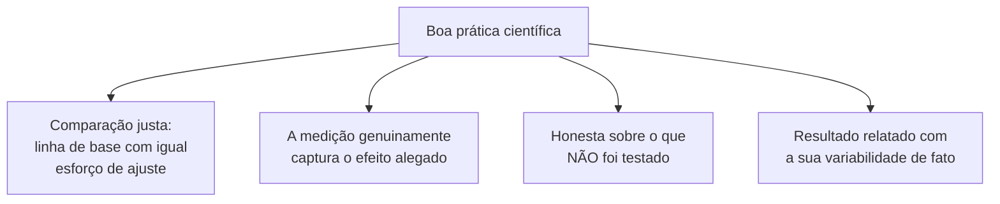

## Objetivos de Aprendizagem

- Explicar por que escolher como e o que medir é, ela mesma, uma decisão de pesquisa feita antes de a coleta de dados começar, e não um detalhe técnico neutro.
- Listar as propriedades concretas e conferíveis que Zobel associa à boa prática científica na pesquisa em computação, e as falhas correspondentes que marcam a má prática.
- Distinguir o relato honesto do que não foi testado de um exagero implícito por omissão.
- Descrever a pesquisa como uma prática contínua e reflexiva, e não como um processo que termina uma vez que uma hipótese é confirmada.

## Contexto e Motivação

`hypotheses-questions-and-forms-of-evidence` estabeleceu como se parece uma hipótese falsificável e que tipos de evidência podem apoiar uma. Este conceito cobre uma decisão que fica entre formar uma hipótese e de fato testá-la: como, precisamente, a quantidade relevante será medida, e se essa abordagem de medição de fato captura o que a hipótese alega. Zobel encerra o seu capítulo sobre hipóteses e evidência com exatamente essa preocupação, abordagens à medição, seguida de uma discussão direta sobre o que separa a ciência boa da ciência ruim na pesquisa em computação, e uma reflexão de encerramento sobre a pesquisa como uma prática contínua, e não como um exercício único concluído.

## Teoria Central

### A medição como decisão de pesquisa

```text
Hipótese: "O novo escalonador reduz o tempo médio de espera dos jobs."

Escolhas de medição que mudam o que isto de fato testa:
  - Tempo de espera medido a partir da submissão, ou a partir de quando os recursos
    ficam disponíveis?
  - Média entre todos os jobs, ou ponderada pelo tamanho do job?
  - Medido sob a carga típica do sistema, ou sob uma
    carga de teste de estresse improvável de ocorrer na prática?
```

Cada uma dessas escolhas muda o que o número resultante de fato significa, e uma escolha descuidada ou conveniente, uma que por acaso é fácil de implementar, em vez de uma que genuinamente bate com a intenção da hipótese, pode produzir uma medição tecnicamente acurada que ainda assim deixa de testar a afirmação que ela deveria testar. O ponto de Zobel é que essa decisão merece a mesma atenção deliberada que escolher a própria hipótese, já que uma hipótese bem formada testada com uma medição mal ajustada produz um resultado que responde a uma pergunta diferente e não enunciada.

### Ciência boa: propriedades concretas e conferíveis



Zobel trata a boa ciência como redutível a propriedades como essas, conferíveis por um leitor cuidadoso, e não como uma questão da confiabilidade geral de um pesquisador ou da sofisticação da técnica usada. Um experimento simples e honestamente conduzido com uma linha de base justa é melhor ciência do que um elaborado com um ponto de comparação fraco ou injustamente ajustado. A má ciência, nesse sentido concreto, inclui ajustar cuidadosamente um método proposto enquanto se deixa a linha de base na sua configuração padrão, medir sob condições escolhidas a dedo para favorecer a hipótese, ou omitir silenciosamente uma condição testada onde o resultado foi desfavorável.

### Honestidade sobre o que não foi testado

O escopo real de uma afirmação é definido tanto pelo que não foi testado quanto pelo que foi. Um artigo que relata resultados fortes em três cargas é ciência honesta quando enuncia claramente que só essas três foram testadas, e se torna desonesto por omissão se a sua prosa sugere uma afirmação mais ampla, "esta abordagem se sai bem", do que a evidência de fato, "esta abordagem se saiu bem nessas três cargas específicas", apoia. Isso se conecta diretamente à disciplina de tom que o próprio conceito `good-style-economy-tone-and-audience` de `academic-writing` cobre, ajustar a confiança enunciada de uma afirmação ao que a evidência de fato mostra, aplicada aqui no estágio mais inicial de decidir o que testar e relatar em primeiro lugar, e não só como formulá-lo depois.

### A pesquisa como prática reflexiva e contínua

A reflexão de encerramento de Zobel sobre este capítulo resiste à ideia de que um projeto de pesquisa termina de forma limpa uma vez que uma hipótese é confirmada. Uma hipótese confirmada num cenário específico rotineiramente levanta perguntas novas, mais estreitas ou adjacentes, o efeito se sustenta sob uma carga diferente, se sustenta numa escala diferente, e tratar um único resultado confirmado como uma pergunta terminada e encerrada, em vez de um ponto de dado numa investigação contínua, é, ele mesmo, uma forma mais sutil de exagerar: sugere mais finalidade do que um único resultado, honestamente considerado, de fato apoia.

## Exemplos Resolvidos

### Exemplo 1: uma comparação injusta pega antes da publicação

Um pesquisador faz o benchmark de uma nova estrutura de indexação contra uma linha de base estabelecida, inicialmente usando a configuração padrão da linha de base enquanto ajusta cuidadosamente os parâmetros da nova estrutura. Aplicando o padrão de comparação justa, o pesquisador, em vez disso, gasta um esforço de ajuste comparável na linha de base antes de reexecutar a comparação; a vantagem da nova estrutura encolhe, mas permanece real, produzindo uma afirmação menor, mas muito mais confiável, do que a comparação original e injustamente ajustada teria apoiado.

### Exemplo 2: uma medição que não bate com a hipótese

Uma hipótese alega que uma nova camada de cache "melhora a latência percebida pelo usuário". Um pesquisador inicialmente mede só o tempo de processamento do lado do servidor, que exclui o trânsito de rede e a renderização do lado do cliente, os componentes que de fato dominam o que um usuário percebe. Reconhecendo o descompasso, a medição é revisada para capturar a latência ponta a ponta da iniciação da requisição ao conteúdo exibido, agora de fato testando a afirmação como enunciada.

### Exemplo 3: relato honesto de escopo

Uma avaliação cobre quatro cargas de benchmark; o novo método tem desempenho inferior em uma delas, que envolve entradas de tamanho incomumente pequeno. Relatado honestamente: "o método melhorou o desempenho em três de quatro cargas testadas, com uma pequena regressão observada na carga que envolve entradas de menos de 100 elementos", em vez de omitir a quarta carga ou descrever o resultado geral só nos termos mais favoráveis.

## Equívocos Comuns e Armadilhas

- **"Como algo é medido é um detalhe técnico de implementação, não uma decisão de pesquisa."** Uma abordagem de medição que não captura de fato o efeito que uma hipótese alega produz um resultado tecnicamente acurado, mas substantivamente enganoso; a escolha merece tanta atenção deliberada quanto a própria hipótese.
- **"Relatar só as cargas onde um método teve sucesso está tudo bem, já que esses são os resultados reais."** Omitir condições testadas, mas desfavoráveis, deturpa o escopo de fato apoiado da afirmação, mesmo que cada número relatado individualmente seja acurado.
- **"Uma hipótese confirmada encerra a pergunta."** A reflexão de Zobel sobre a pesquisa trata um único resultado confirmado como um ponto de dado numa investigação contínua, e não como um assunto terminado e encerrado; uma versão mais ampla ou mais geral da mesma afirmação geralmente ainda precisa de mais testes.

## Resumo

Decidir como e o que medir é uma decisão de pesquisa real, feita antes de a coleta de dados começar, que pode produzir um resultado tecnicamente acurado, mas substantivamente descompassado, se não for deliberadamente alinhada com o que a hipótese de fato alega. A boa ciência na pesquisa em computação se reduz a propriedades concretas e conferíveis, uma comparação justa, uma abordagem de medição ajustada, o relato honesto do que foi e do que não foi testado, e não à credibilidade geral de um pesquisador ou à sofisticação de uma técnica, e tratar uma hipótese confirmada como uma pergunta encerrada, em vez de um ponto numa investigação contínua, é, ele mesmo, uma forma mais sutil e facilmente despercebida de exagerar.

## Documentation Links

- [ACM Digital Library: Justin Zobel, Writing for Computer Science (3ª edição, Springer, 2014)](https://dl.acm.org/doi/10.5555/2742708): as seções "Approaches to Measurement", "Good and Bad Science" e "Reflections on Research" do Capítulo 4 são a fonte direta da orientação sobre medição, justiça e escopo honesto coberta aqui.
