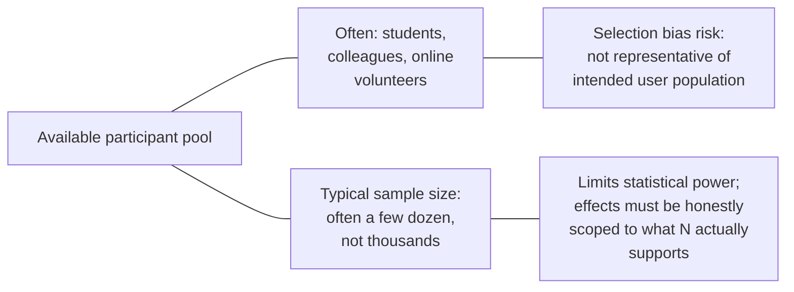

## Learning Objectives

- Identify what kinds of computing research questions genuinely require human participants rather than purely algorithmic or systems evaluation.
- Explain how observation effects, a participant behaving differently because they know they are being studied, can distort a human study's results.
- Describe the sample-size and selection-bias challenges typical of computing human studies, and why they differ in scale from fields built around large clinical or survey trials.
- Apply honest reporting of a human study's real limitations given realistic participant recruitment constraints.

## Context & Motivation

Most of this discipline's concepts, baselines, robustness, performance measurement, address experiments run on algorithms and systems, evaluated without a human in the loop as the object of study. Some computing research questions are different in kind: how quickly do programmers actually find a bug using a new debugging tool, does a particular interface design measurably reduce user error rates, does a documentation format actually help readers understand a concept faster. These questions require studying how real people interact with a system, not just how the system performs on its own, and Zobel's chapter on experimentation dedicates a section specifically to the distinct methodological concerns this introduces.

## Core Theory

### When a study genuinely needs human participants

A study needs human participants when the research question is fundamentally about human behavior, comprehension, or experience interacting with a system, not merely about the system's own measurable properties. A claim about a system's raw throughput does not need a human study; a claim about how quickly a typical developer can correctly use a new API does, because "quickly" and "correctly," in that claim, are properties of the human-system interaction, not of the system alone. Recognizing this distinction matters because running a human study where a purely algorithmic evaluation would have sufficed adds real cost and ethical overhead without adding evidential value the simpler study could not provide.

### The observation effect

```text
A participant who knows they are being observed or studied may:
  - work more carefully than they would unsupervised (inflating
    performance on a usability task)
  - feel pressure to perform well (introducing stress unrepresentative
    of normal use)
  - guess what the study is "supposed" to show and unconsciously
    behave accordingly
```

This general phenomenon, behavior changing specifically because of being observed, is a well documented, real threat to a human study's validity, and mitigating it, through study design choices like not revealing the specific hypothesis being tested until after a task is completed, or comparing conditions in a way that keeps the observation effect roughly constant across the groups being compared, is a real part of designing a trustworthy human study in computing research.

### Sample size and selection bias at realistic scale



Computing human studies typically recruit far fewer participants than fields built around large-scale clinical or survey research, often a few dozen rather than hundreds or thousands, both because computing studies are frequently exploratory or resource-constrained and because recruiting genuinely representative participants (professional developers with specific experience levels, for instance) is harder than recruiting a convenience sample of students or colleagues. This has two real, honest consequences a computing researcher has to accept rather than gloss over: a small sample limits the statistical power available to detect anything but a fairly large effect (connecting to this discipline's own treatment of samples and significance later on), and a convenience sample may not represent the population the claim is actually meant to generalize to.

### Honest reporting given these constraints

Given these realistic constraints, the responsible practice Zobel describes is not avoiding human studies altogether, but reporting their real limitations honestly: stating the actual sample size and how participants were recruited, being explicit about how representative (or not) the sample is of the intended target population, and scoping any claimed effect to what the study's actual size and design can support, rather than implying a broader, more general claim than a dozen-participant convenience sample can really carry.

## Worked Examples

### Example 1: recognizing a study needs human participants

A team wants to know whether a new error-message format helps developers fix bugs faster. Because "helps developers" is fundamentally about human comprehension and behavior, not a property of the error-message system alone, this genuinely requires a human study, timing how long participants take to diagnose a seeded bug given the new format versus the old one, rather than a purely algorithmic evaluation.

### Example 2: mitigating an observation effect

In an initial pilot, participants told explicitly that the study is testing "whether the new interface is faster" tend to work unusually quickly, apparently trying to help confirm the hypothesis. The study is redesigned so participants are told only that they are testing a development tool, without being told which specific property is being measured, and the observation effect's distortion is noticeably reduced in the revised results.

### Example 3: honest scoping given a small sample

A usability study recruits 15 computer science graduate students, not professional developers, to test a new debugging tool. The findings are reported honestly as suggestive evidence from a small, non-representative convenience sample, with an explicit statement that a larger study with professional developers would be needed before the result could be generalized to that intended population, rather than presenting the graduate-student result as though it directly established the tool's value for professional use.

## Common Misconceptions & Pitfalls

- **"Any research question can be answered with a purely algorithmic evaluation if you think hard enough."** Some questions are fundamentally about human behavior or comprehension and cannot be answered without studying real people interacting with the system; recognizing which questions these are is part of sound experimental design.
- **"Participants behave the same whether or not they know they're being studied."** The observation effect is a well documented, real threat to validity; study design needs to actively account for it, not assume it away.
- **"A convenience sample of a dozen students is basically as good as a larger, representative sample, if the effect is real."** A small, non-representative sample genuinely limits both statistical power and generalizability; honest research reports these limitations rather than implying a broader claim than the study can support.

## Summary

Some computing research questions are fundamentally about human behavior, comprehension, or experience, and genuinely require studying real participants rather than purely algorithmic or systems evaluation, which introduces distinct methodological concerns: the observation effect, where a participant's awareness of being studied can distort their behavior, and realistic constraints on sample size and representativeness that are typically much tighter in computing research than in fields built around large-scale human trials. Responsible practice does not mean avoiding human studies, it means designing around these concerns where possible and reporting their remaining limitations honestly, scoping any claimed effect to what the study's actual size and sample can genuinely support.

## Documentation Links

- [ACM Digital Library: Justin Zobel, Writing for Computer Science (3rd Edition, Springer, 2014)](https://dl.acm.org/doi/10.5555/2742708): Chapter 14's "Human Studies" section is the direct source for the observation-effect, sample-size, and honest-reporting guidance covered here.
