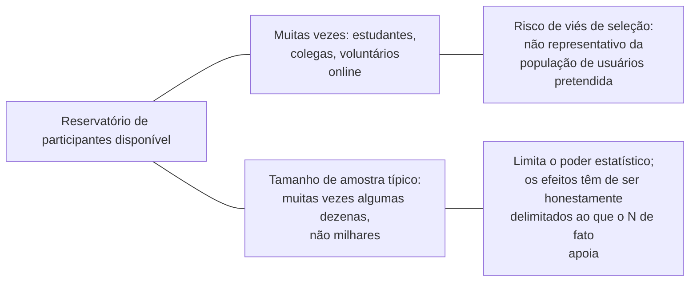

## Objetivos de Aprendizagem

- Identificar que tipos de perguntas de pesquisa em computação genuinamente exigem participantes humanos, em vez de uma avaliação puramente algorítmica ou de sistemas.
- Explicar como os efeitos de observação, um participante se comportando de forma diferente porque sabe que está sendo estudado, podem distorcer os resultados de um estudo com humanos.
- Descrever os desafios de tamanho de amostra e de viés de seleção típicos dos estudos com humanos em computação, e por que eles diferem em escala de campos construídos em torno de grandes ensaios clínicos ou de pesquisa de opinião.
- Aplicar o relato honesto das limitações reais de um estudo com humanos dadas as restrições realistas de recrutamento de participantes.

## Contexto e Motivação

A maioria dos conceitos desta disciplina, linhas de base, robustez, medição de desempenho, aborda experimentos rodados em algoritmos e sistemas, avaliados sem um humano no laço como objeto de estudo. Algumas perguntas de pesquisa em computação são diferentes em tipo: quão depressa os programadores de fato encontram um bug usando uma nova ferramenta de depuração, um projeto de interface específico reduz mensuravelmente as taxas de erro do usuário, um formato de documentação de fato ajuda os leitores a entender um conceito mais depressa. Essas perguntas exigem estudar como pessoas reais interagem com um sistema, não só como o sistema se sai sozinho, e o capítulo de Zobel sobre experimentação dedica uma seção especificamente às preocupações metodológicas distintas que isso introduz.

## Teoria Central

### Quando um estudo genuinamente precisa de participantes humanos

Um estudo precisa de participantes humanos quando a pergunta de pesquisa é fundamentalmente sobre comportamento, compreensão ou experiência humana interagindo com um sistema, e não meramente sobre as próprias propriedades mensuráveis do sistema. Uma afirmação sobre a vazão bruta de um sistema não precisa de um estudo com humanos; uma afirmação sobre quão depressa um desenvolvedor típico consegue usar corretamente uma nova API precisa, porque "depressa" e "corretamente", nessa afirmação, são propriedades da interação humano-sistema, e não do sistema sozinho. Reconhecer essa distinção importa porque rodar um estudo com humanos onde uma avaliação puramente algorítmica teria bastado acrescenta custo real e sobrecarga ética sem acrescentar valor de evidência que o estudo mais simples não poderia fornecer.

### O efeito de observação

```text
Um participante que sabe que está sendo observado ou estudado pode:
  - trabalhar com mais cuidado do que faria sem supervisão (inflando
    o desempenho numa tarefa de usabilidade)
  - sentir pressão para se sair bem (introduzindo estresse não representativo
    do uso normal)
  - adivinhar o que o estudo "deveria" mostrar e inconscientemente
    se comportar de acordo
```

Esse fenômeno geral, o comportamento mudando especificamente por causa de estar sendo observado, é uma ameaça real e bem documentada à validade de um estudo com humanos, e mitigá-la, por meio de escolhas de projeto de estudo como não revelar a hipótese específica sendo testada até depois de uma tarefa ser concluída, ou comparar condições de uma forma que mantém o efeito de observação mais ou menos constante entre os grupos sendo comparados, é uma parte real de projetar um estudo com humanos confiável na pesquisa em computação.

### Tamanho de amostra e viés de seleção em escala realista



Os estudos com humanos em computação tipicamente recrutam muito menos participantes do que campos construídos em torno de pesquisa clínica ou de opinião de larga escala, muitas vezes algumas dezenas, em vez de centenas ou milhares, tanto porque os estudos de computação são frequentemente exploratórios ou restritos por recursos quanto porque recrutar participantes genuinamente representativos (desenvolvedores profissionais com níveis de experiência específicos, por exemplo) é mais difícil do que recrutar uma amostra de conveniência de estudantes ou colegas. Isso tem duas consequências reais e honestas que um pesquisador de computação tem de aceitar, em vez de encobrir: uma amostra pequena limita o poder estatístico disponível para detectar qualquer coisa que não seja um efeito bastante grande (conectando-se ao próprio tratamento de amostras e significância desta disciplina mais adiante), e uma amostra de conveniência pode não representar a população para a qual a afirmação de fato pretende generalizar.

### Relato honesto dadas essas restrições

Dadas essas restrições realistas, a prática responsável que Zobel descreve não é evitar os estudos com humanos por completo, mas relatar as suas limitações reais honestamente: enunciar o tamanho de amostra de fato e como os participantes foram recrutados, ser explícito sobre quão representativa (ou não) a amostra é da população-alvo pretendida, e delimitar qualquer efeito alegado ao que o tamanho e o projeto de fato do estudo conseguem apoiar, em vez de sugerir uma afirmação mais ampla e mais geral do que uma amostra de conveniência de uma dúzia de participantes consegue de fato carregar.

## Exemplos Resolvidos

### Exemplo 1: reconhecer que um estudo precisa de participantes humanos

Uma equipe quer saber se um novo formato de mensagem de erro ajuda os desenvolvedores a corrigir bugs mais depressa. Como "ajuda os desenvolvedores" é fundamentalmente sobre compreensão e comportamento humanos, e não uma propriedade do sistema de mensagens de erro sozinho, isso genuinamente exige um estudo com humanos, cronometrando quanto tempo os participantes levam para diagnosticar um bug plantado dado o novo formato versus o antigo, em vez de uma avaliação puramente algorítmica.

### Exemplo 2: mitigar um efeito de observação

Num piloto inicial, participantes informados explicitamente de que o estudo está testando "se a nova interface é mais rápida" tendem a trabalhar incomumente depressa, aparentemente tentando ajudar a confirmar a hipótese. O estudo é reprojetado para que os participantes sejam informados só de que estão testando uma ferramenta de desenvolvimento, sem serem informados de qual propriedade específica está sendo medida, e a distorção do efeito de observação é perceptivelmente reduzida nos resultados revisados.

### Exemplo 3: delimitação honesta dada uma amostra pequena

Um estudo de usabilidade recruta 15 estudantes de pós-graduação em ciência da computação, não desenvolvedores profissionais, para testar uma nova ferramenta de depuração. As descobertas são relatadas honestamente como evidência sugestiva de uma amostra de conveniência pequena e não representativa, com uma declaração explícita de que um estudo maior com desenvolvedores profissionais seria necessário antes de o resultado poder ser generalizado para essa população pretendida, em vez de apresentar o resultado com estudantes de pós-graduação como se ele estabelecesse diretamente o valor da ferramenta para uso profissional.

## Equívocos Comuns e Armadilhas

- **"Qualquer pergunta de pesquisa pode ser respondida com uma avaliação puramente algorítmica se você pensar o bastante."** Algumas perguntas são fundamentalmente sobre comportamento ou compreensão humanos e não podem ser respondidas sem estudar pessoas reais interagindo com o sistema; reconhecer quais perguntas são essas é parte de um projeto experimental sólido.
- **"Os participantes se comportam da mesma forma, saibam ou não que estão sendo estudados."** O efeito de observação é uma ameaça real e bem documentada à validade; o projeto de estudo precisa levá-lo em conta ativamente, e não assumi-lo como inexistente.
- **"Uma amostra de conveniência de uma dúzia de estudantes é basicamente tão boa quanto uma amostra maior e representativa, se o efeito for real."** Uma amostra pequena e não representativa genuinamente limita tanto o poder estatístico quanto a generalizabilidade; a pesquisa honesta relata essas limitações, em vez de sugerir uma afirmação mais ampla do que o estudo consegue apoiar.

## Resumo

Algumas perguntas de pesquisa em computação são fundamentalmente sobre comportamento, compreensão ou experiência humanos, e genuinamente exigem estudar participantes reais, em vez de uma avaliação puramente algorítmica ou de sistemas, o que introduz preocupações metodológicas distintas: o efeito de observação, onde a consciência de um participante de estar sendo estudado pode distorcer o seu comportamento, e restrições realistas sobre o tamanho e a representatividade da amostra que são tipicamente muito mais apertadas na pesquisa em computação do que em campos construídos em torno de ensaios humanos de larga escala. A prática responsável não significa evitar os estudos com humanos, significa projetar em torno dessas preocupações onde possível e relatar as suas limitações remanescentes honestamente, delimitando qualquer efeito alegado ao que o tamanho e a amostra de fato do estudo conseguem genuinamente apoiar.

## Documentation Links

- [ACM Digital Library: Justin Zobel, Writing for Computer Science (3ª edição, Springer, 2014)](https://dl.acm.org/doi/10.5555/2742708): a seção "Human Studies" do Capítulo 14 é a fonte direta da orientação sobre efeito de observação, tamanho de amostra e relato honesto coberta aqui.
