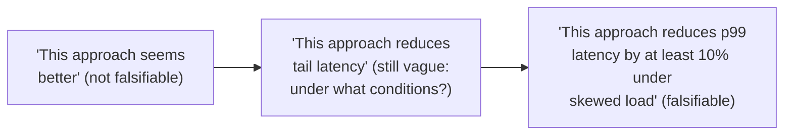

## Learning Objectives

- Define a hypothesis as a specific, falsifiable claim, and explain why "falsifiable" is the property that turns a vague interest into something a research method can actually evaluate.
- Distinguish the different forms evidence can take in computing research: a mathematical proof, a measured empirical result, a constructed counterexample, and an argument from first principles, and state what each form can and cannot establish.
- Explain why matching the form of evidence to the actual claim being made, not the form that happens to be easiest to produce, is a real methodological decision.
- Apply this framework to classify a given research claim by what kind of evidence would actually support or refute it.

## Context & Motivation

`academic-writing` covered how to write about research convincingly once it exists. This discipline, `research-statistics`, starts one step earlier: how to design and evaluate the research itself, so that what eventually gets written about is actually sound. Justin Zobel's *Writing for Computer Science*, the same primary source anchoring `academic-writing`, dedicates a full chapter, "Hypotheses, Questions, and Evidence," to exactly this earlier stage, and its opening move is worth taking as seriously as `academic-writing`'s own opening concept did for the skeptical reader: a research question only becomes genuinely investigable once it is sharpened into a hypothesis specific enough to be falsifiable.

A hypothesis is a claim precise enough that some conceivable observation could show it to be false. "This system is efficient" is not yet a hypothesis in this sense, nothing concrete would count as refuting it. "This system's median request latency is under 50ms at 10,000 requests per second" is, because a measurement could straightforwardly contradict it. This distinction matters because a claim that cannot in principle be refuted also cannot, in any meaningful sense, be confirmed either, there is no evidence that would count against it, so no evidence really counts for it in a rigorous sense.

## Core Theory

### From vague interest to falsifiable hypothesis



Each step in this refinement removes a degree of vagueness that would otherwise let the claim survive almost any outcome unchanged. The final form commits to a specific, checkable magnitude and a specific, checkable condition, which means a disappointing result cannot be quietly reinterpreted as a success after the fact; the hypothesis was precise enough in advance to actually be wrong.

### The forms evidence can take

```text
Proof:                 establishes a claim with mathematical certainty,
                        but only for claims stated formally enough to
                        admit one (a complexity bound, a correctness
                        property under stated assumptions).

Measured result:       establishes that an effect was observed under
                        the specific conditions tested; does not, on
                        its own, establish the effect holds more
                        generally (see robustness, covered later in
                        this discipline).

Constructed example
or counterexample:      establishes existence or non-existence claims
                        directly; a single well-chosen counterexample
                        refutes a universal claim completely, without
                        needing a broader study.

Argument from first
principles:             establishes plausibility by reasoning from
                        already-accepted premises; weaker on its own
                        than the other three, but often what shapes a
                        hypothesis before stronger evidence is
                        available.
```

### Matching evidence to the claim

A common, avoidable error is producing evidence of one kind to support a claim that actually needs another kind. A single successful benchmark run (a measured result) does not establish a general complexity bound (which needs a proof or, at minimum, a much broader empirical study with explicit robustness checking). A first-principles argument for why an approach should work does not substitute for actually measuring whether it does. Zobel's treatment of this is direct: the researcher's job includes being honest, to themselves and eventually to readers, about which form of evidence a given hypothesis genuinely requires, rather than defaulting to whichever form was easiest or fastest to produce.

### Defending a hypothesis honestly

Defending a hypothesis well means actively looking for the evidence most likely to refute it, not only the evidence that would confirm it. A researcher convinced a new caching strategy improves performance should test it specifically under the conditions most likely to expose its weaknesses (skewed access patterns, adversarial workloads, resource-constrained environments), not only the conditions where it is expected to shine. A hypothesis that survives a genuine attempt at refutation is far more credible than one only ever tested under favorable conditions.

## Worked Examples

### Example 1: sharpening a vague claim into a hypothesis

A researcher starts with "our consensus protocol variant handles network partitions well." Sharpened: "under a simulated network partition affecting up to one-third of nodes, our protocol variant maintains availability for the majority partition with no more than a 20% increase in commit latency compared to the unpartitioned baseline." The sharpened version specifies exactly what would count as success and what would count as failure.

### Example 2: matching evidence to a complexity claim

A student claims a new algorithm has better average-case time complexity than an established alternative. A handful of benchmark timings on specific inputs is suggestive but does not establish this; the claim, being a formal complexity statement, actually needs either an analytical proof of the average-case bound or, if a proof is out of reach, a much more extensive empirical study explicitly designed to probe average-case behavior across a representative distribution of inputs, with the empirical result honestly labeled as evidence toward, not proof of, the complexity claim.

### Example 3: actively seeking refutation

A researcher believes a new sharding scheme improves throughput. Rather than testing only under uniform key distribution, where sharding schemes generally perform well, the researcher deliberately also tests under a heavily skewed key distribution, the condition most likely to reveal a hot-shard problem the new scheme might not actually solve. Finding the scheme holds up even under this harder condition is much stronger evidence than a uniform-distribution-only test would have provided.

## Common Misconceptions & Pitfalls

- **"A hypothesis just needs to sound plausible."** Plausibility is not the same as falsifiability; a plausible-sounding claim vague enough that no observation could contradict it has not actually been turned into a testable hypothesis yet.
- **"One good measured result proves the claim."** A measured result establishes what happened under the specific conditions tested; whether it generalizes is a separate question this discipline's later concept on robustness addresses directly.
- **"Testing only under favorable conditions is fine, since that's where the effect is expected."** Defending a hypothesis honestly means actively seeking the conditions most likely to refute it; testing only favorable conditions produces weaker, less trustworthy evidence even when the result looks positive.

## Summary

A research question becomes genuinely investigable only once it is sharpened into a falsifiable hypothesis, specific enough that some conceivable observation could show it false, and evidence in computing research takes several genuinely different forms, proof, measured result, constructed example, and argument from first principles, each of which establishes a different kind of claim and none of which substitutes freely for another. Defending a hypothesis honestly means actively seeking the conditions most likely to refute it, not only the conditions that would confirm it, which is what separates a hypothesis genuinely tested from one merely illustrated favorably.

## Documentation Links

- [ACM Digital Library: Justin Zobel, Writing for Computer Science (3rd Edition, Springer, 2014)](https://dl.acm.org/doi/10.5555/2742708): Chapter 4, "Hypotheses, Questions, and Evidence," is the direct source for the falsifiability, forms-of-evidence, and honest-defense framework covered here.
