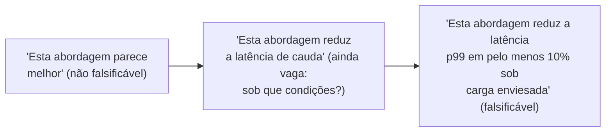

## Objetivos de Aprendizagem

- Definir uma hipótese como uma afirmação específica e falsificável, e explicar por que "falsificável" é a propriedade que transforma um interesse vago em algo que um método de pesquisa consegue de fato avaliar.
- Distinguir as diferentes formas que a evidência pode tomar na pesquisa em computação: uma prova matemática, um resultado empírico medido, um contraexemplo construído e um argumento a partir de princípios básicos, e enunciar o que cada forma consegue e não consegue estabelecer.
- Explicar por que ajustar a forma de evidência à afirmação de fato sendo feita, e não à forma que por acaso é mais fácil de produzir, é uma decisão metodológica real.
- Aplicar esse arcabouço para classificar uma dada afirmação de pesquisa pelo tipo de evidência que de fato a apoiaria ou refutaria.

## Contexto e Motivação

`academic-writing` cobriu como escrever sobre pesquisa de forma convincente uma vez que ela existe. Esta disciplina, `research-statistics`, começa um passo antes: como projetar e avaliar a própria pesquisa, para que aquilo sobre o que eventualmente se escreve seja de fato sólido. *Writing for Computer Science*, de Justin Zobel, a mesma fonte primária que ancora `academic-writing`, dedica um capítulo inteiro, "Hypotheses, Questions, and Evidence", a exatamente esse estágio mais inicial, e o seu movimento de abertura vale ser levado tão a sério quanto o próprio conceito de abertura de `academic-writing` levou o leitor cético: uma pergunta de pesquisa só se torna genuinamente investigável uma vez afiada numa hipótese específica o bastante para ser falsificável.

Uma hipótese é uma afirmação precisa o bastante para que alguma observação concebível pudesse mostrá-la falsa. "Este sistema é eficiente" ainda não é uma hipótese nesse sentido, nada concreto contaria como refutá-la. "A latência mediana de requisição deste sistema é inferior a 50ms a 10.000 requisições por segundo" é, porque uma medição poderia contradizê-la diretamente. Essa distinção importa porque uma afirmação que não pode, em princípio, ser refutada também não pode, em nenhum sentido significativo, ser confirmada tampouco, não há evidência que contasse contra ela, então nenhuma evidência de fato conta a seu favor num sentido rigoroso.

## Teoria Central

### De interesse vago a hipótese falsificável



Cada passo nesse refinamento remove um grau de vagueza que, de outra forma, deixaria a afirmação sobreviver a quase qualquer desfecho sem mudança. A forma final se compromete com uma magnitude específica e conferível e uma condição específica e conferível, o que significa que um resultado decepcionante não pode ser silenciosamente reinterpretado como um sucesso após o fato; a hipótese era precisa o bastante de antemão para de fato estar errada.

### As formas que a evidência pode tomar

```text
Prova:                 estabelece uma afirmação com certeza matemática,
                        mas só para afirmações enunciadas de forma formal o bastante para
                        admitir uma (um limite de complexidade, uma propriedade de
                        correção sob suposições enunciadas).

Resultado medido:      estabelece que um efeito foi observado sob
                        as condições específicas testadas; não estabelece,
                        por si só, que o efeito se sustenta de forma mais
                        geral (ver robustez, coberta mais adiante
                        nesta disciplina).

Exemplo ou contraexemplo
construído:            estabelece afirmações de existência ou não existência
                        diretamente; um único contraexemplo bem escolhido
                        refuta uma afirmação universal por completo, sem
                        precisar de um estudo mais amplo.

Argumento a partir de
princípios básicos:    estabelece a plausibilidade raciocinando a partir de
                        premissas já aceitas; mais fraco por si só
                        do que os outros três, mas muitas vezes o que molda uma
                        hipótese antes de uma evidência mais forte estar
                        disponível.
```

### Ajustar a evidência à afirmação

Um erro comum e evitável é produzir evidência de um tipo para apoiar uma afirmação que de fato precisa de outro tipo. Uma única execução de benchmark bem-sucedida (um resultado medido) não estabelece um limite de complexidade geral (que precisa de uma prova ou, no mínimo, de um estudo empírico muito mais amplo com checagem explícita de robustez). Um argumento de princípios básicos sobre por que uma abordagem deveria funcionar não substitui de fato medir se ela funciona. O tratamento de Zobel sobre isso é direto: o trabalho do pesquisador inclui ser honesto, consigo mesmo e eventualmente com os leitores, sobre qual forma de evidência uma dada hipótese genuinamente exige, em vez de recorrer a qualquer forma que tenha sido mais fácil ou mais rápida de produzir.

### Defender uma hipótese honestamente

Defender bem uma hipótese significa buscar ativamente a evidência com maior probabilidade de refutá-la, não só a evidência que a confirmaria. Um pesquisador convencido de que uma nova estratégia de cache melhora o desempenho deveria testá-la especificamente sob as condições com maior probabilidade de expor as suas fraquezas (padrões de acesso enviesados, cargas adversariais, ambientes restritos por recursos), não só as condições onde se espera que ela brilhe. Uma hipótese que sobrevive a uma tentativa genuína de refutação é muito mais crível do que uma só testada sob condições favoráveis.

## Exemplos Resolvidos

### Exemplo 1: afiar uma afirmação vaga numa hipótese

Um pesquisador começa com "a nossa variante de protocolo de consenso lida bem com partições de rede". Afiada: "sob uma partição de rede simulada afetando até um terço dos nós, a nossa variante de protocolo mantém a disponibilidade para a partição majoritária com um aumento não superior a 20% na latência de commit em comparação com a linha de base não particionada". A versão afiada especifica exatamente o que contaria como sucesso e o que contaria como fracasso.

### Exemplo 2: ajustar a evidência a uma afirmação de complexidade

Um estudante alega que um novo algoritmo tem melhor complexidade de tempo de caso médio do que uma alternativa estabelecida. Um punhado de cronometragens de benchmark em entradas específicas é sugestivo, mas não estabelece isso; a afirmação, sendo uma declaração de complexidade formal, de fato precisa ou de uma prova analítica do limite de caso médio ou, se uma prova estiver fora de alcance, de um estudo empírico muito mais extenso explicitamente projetado para sondar o comportamento de caso médio ao longo de uma distribuição representativa de entradas, com o resultado empírico honestamente rotulado como evidência rumo à, e não prova da, afirmação de complexidade.

### Exemplo 3: buscar ativamente a refutação

Um pesquisador acredita que um novo esquema de sharding melhora a vazão. Em vez de testar só sob distribuição de chaves uniforme, onde os esquemas de sharding geralmente se saem bem, o pesquisador também testa deliberadamente sob uma distribuição de chaves fortemente enviesada, a condição com maior probabilidade de revelar um problema de shard quente que o novo esquema poderia não de fato resolver. Descobrir que o esquema se sustenta mesmo sob essa condição mais difícil é uma evidência muito mais forte do que um teste só de distribuição uniforme teria fornecido.

## Equívocos Comuns e Armadilhas

- **"Uma hipótese só precisa soar plausível."** A plausibilidade não é a mesma coisa que a falsificabilidade; uma afirmação de som plausível e vaga o bastante para que nenhuma observação pudesse contradizê-la ainda não foi de fato transformada numa hipótese testável.
- **"Um bom resultado medido prova a afirmação."** Um resultado medido estabelece o que aconteceu sob as condições específicas testadas; se ele generaliza é uma pergunta separada que o conceito posterior desta disciplina sobre robustez aborda diretamente.
- **"Testar só sob condições favoráveis está tudo bem, já que é lá que o efeito é esperado."** Defender uma hipótese honestamente significa buscar ativamente as condições com maior probabilidade de refutá-la; testar só condições favoráveis produz uma evidência mais fraca e menos confiável mesmo quando o resultado parece positivo.

## Resumo

Uma pergunta de pesquisa se torna genuinamente investigável só uma vez afiada numa hipótese falsificável, específica o bastante para que alguma observação concebível pudesse mostrá-la falsa, e a evidência na pesquisa em computação toma várias formas genuinamente diferentes, prova, resultado medido, exemplo construído e argumento a partir de princípios básicos, cada uma das quais estabelece um tipo diferente de afirmação e nenhuma das quais substitui livremente outra. Defender uma hipótese honestamente significa buscar ativamente as condições com maior probabilidade de refutá-la, não só as condições que a confirmariam, que é o que separa uma hipótese genuinamente testada de uma meramente ilustrada de forma favorável.

## Documentation Links

- [ACM Digital Library: Justin Zobel, Writing for Computer Science (3ª edição, Springer, 2014)](https://dl.acm.org/doi/10.5555/2742708): o Capítulo 4, "Hypotheses, Questions, and Evidence", é a fonte direta do arcabouço de falsificabilidade, formas de evidência e defesa honesta coberto aqui.
