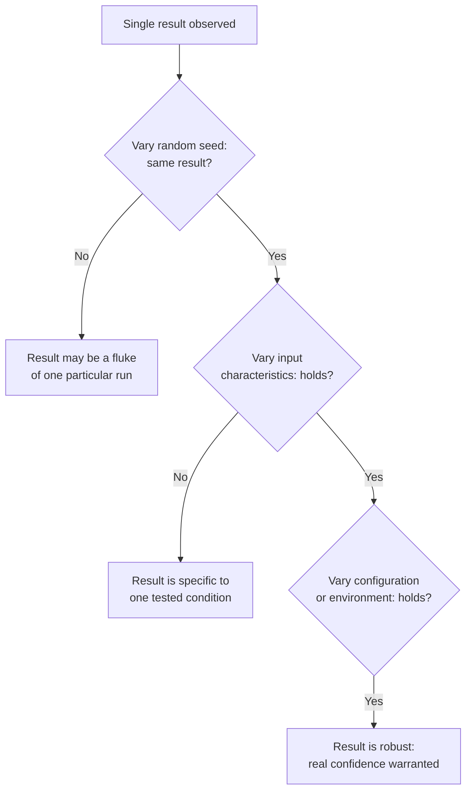

## Learning Objectives

- Explain what interpreting a result actually involves beyond stating a raw number, and why a number requires context to mean anything about a hypothesis.
- Define robustness as a checkable property of a result, and describe concrete ways to test for it: varying inputs, random seeds, and configuration.
- Distinguish a result that holds under varied conditions from a result that was a coincidence of one particular experimental setup.
- Apply a robustness check to a described experimental result and identify what additional testing would strengthen or weaken confidence in it.

## Context & Motivation

`baselines-and-persuasive-data` established that a result only means something relative to a fair, relevant baseline. This concept goes one step further: even with a good baseline in place, a single measured result still needs interpretation, what does this specific comparison actually imply about the hypothesis under test, and it needs a robustness check before that interpretation can be trusted at all. Zobel's chapter on experimentation treats these as genuinely separate, sequential concerns, interpretation first asks what a result means, robustness then asks whether that meaning actually holds up.

## Core Theory

### Interpretation: from a number to a claim

A raw measurement, "the new method completed in 42 seconds, the baseline in 58," is not yet an interpreted result. Interpretation connects that number back to the hypothesis: does a 28% reduction in completion time constitute meaningful support for a hypothesis that predicted "substantially faster," or was the hypothesis vague enough that almost any improvement would have counted, in which case the result's real evidential weight is weaker than it first appears (connecting directly to the falsifiability concern `hypotheses-questions-and-forms-of-evidence` raised). Interpretation also means being honest about alternative explanations: did the new method actually win on its own merits, or could the same improvement have come from an unrelated factor, a faster test machine, a warmer cache, a smaller test input, that has nothing to do with the hypothesis being tested.

### Robustness: does the result hold up under variation

A result observed in a single run, under one specific configuration, with one specific random seed, could be entirely real or could be a coincidence of that particular setup. Robustness is checked by deliberately varying the conditions most likely to expose fragility: repeating the experiment with different random seeds (for anything involving randomness, from hashing to sampling to probabilistic algorithms), testing across inputs with different characteristics (not just the one input size or distribution the effect happened to first appear on), and testing under different configurations or environments (different hardware, different load conditions) where the underlying claim is meant to generalize.

### Coincidence versus real effect

The practical difference between a fragile, coincidental result and a robust one is precisely whether it survives this deliberate variation. An algorithm that outperforms a baseline on one specific random seed but not on nine others tested afterward was showing a coincidence of that one seed, not a real, repeatable advantage. This connects to the statistical treatment of variability and significance this discipline covers later, `aggregation-variability-and-reporting` and `statistical-significance-and-avoiding-common-errors`, but the underlying intuition, a claim needs to survive repetition under varied conditions before it earns real confidence, is established here first as a general experimental principle, not only a statistical technicality.

### Robustness is checked, not assumed

Zobel's guidance treats robustness checking as something a careful researcher does deliberately and reports honestly, not something a single successful run is allowed to imply by default. A result presented without any indication that robustness was checked, no mention of repeated runs, no variation across conditions, leaves a skeptical reader unable to distinguish a genuinely reliable effect from a fragile, one-off observation, even if the single reported number is entirely accurate.

## Worked Examples

### Example 1: interpreting a result against the hypothesis

A hypothesis predicts a new sorting variant is "meaningfully faster" on nearly sorted data. A measured 3% speedup on one test case is technically an improvement but, interpreted against a hypothesis that specifically claimed a meaningful effect, is weak support at best; the interpretation step is what catches that a technically positive result does not automatically constitute strong evidence for the specific claim made.

### Example 2: a result that fails a robustness check

An algorithm shows a 15% improvement over a baseline on one benchmark run. Repeating the experiment with five different random seeds, the improvement ranges from a 2% regression to a 22% improvement, with no consistent pattern. This variation reveals the original single-run result was not a reliable, robust effect, and the honest conclusion is that the algorithm's advantage, if real at all, is much less certain than the initial run suggested.

### Example 3: a result that survives robustness checking

A caching strategy shows a consistent latency improvement across ten different random seeds, three different workload distributions, and two different hardware configurations, with the improvement's magnitude varying somewhat but never disappearing or reversing. This pattern of consistent, if not identical, improvement across deliberately varied conditions is what robust evidence for the hypothesis actually looks like.

## Common Misconceptions & Pitfalls

- **"A positive number is evidence the hypothesis is true."** A number only becomes evidence once interpreted against the specific hypothesis, including whether the hypothesis was precise enough to be meaningfully supported or refuted by that particular result.
- **"One successful run is enough to report a result."** A single run cannot distinguish a real, repeatable effect from a coincidence of that specific run's conditions; robustness has to be checked deliberately, by varying seeds, inputs, and configuration, before the result can be trusted.
- **"Robustness checking is extra, optional rigor for a stronger paper."** Zobel treats it as a basic requirement for interpreting a result honestly at all, not an enhancement layered on top of an otherwise complete experiment.

## Summary

A raw measured result requires interpretation, connecting the number back to what the hypothesis actually predicted and considering alternative explanations, before it can be treated as evidence at all, and it requires a robustness check, deliberately varying random seeds, inputs, and configuration, before that interpretation can be trusted as more than a coincidence of one particular experimental run. A result that survives this variation, showing a consistent effect across deliberately varied conditions, is genuinely robust evidence; a result that disappears or reverses under variation was never as strong as a single favorable run made it look.

## Documentation Links

- [ACM Digital Library: Justin Zobel, Writing for Computer Science (3rd Edition, Springer, 2014)](https://dl.acm.org/doi/10.5555/2742708): Chapter 14's "Interpretation" and "Robustness" sections are the direct source for the interpretation and robustness-checking guidance covered here.
