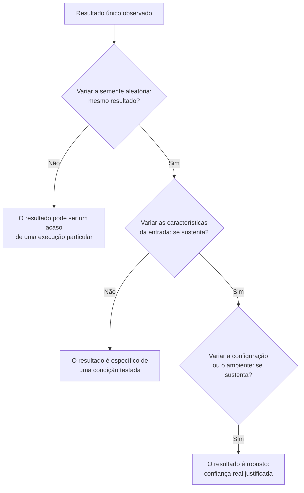

## Objetivos de Aprendizagem

- Explicar o que interpretar um resultado de fato envolve para além de enunciar um número bruto, e por que um número exige contexto para significar algo sobre uma hipótese.
- Definir a robustez como uma propriedade conferível de um resultado, e descrever formas concretas de testá-la: variar entradas, sementes aleatórias e configuração.
- Distinguir um resultado que se sustenta sob condições variadas de um resultado que foi uma coincidência de uma configuração experimental particular.
- Aplicar uma checagem de robustez a um resultado experimental descrito e identificar que testes adicionais fortaleceriam ou enfraqueceriam a confiança nele.

## Contexto e Motivação

`baselines-and-persuasive-data` estabeleceu que um resultado só significa algo em relação a uma linha de base justa e relevante. Este conceito vai um passo adiante: mesmo com uma boa linha de base em vigor, um único resultado medido ainda precisa de interpretação, o que esta comparação específica de fato implica sobre a hipótese sob teste, e precisa de uma checagem de robustez antes de essa interpretação poder ser confiada de todo. O capítulo de Zobel sobre experimentação trata essas como preocupações genuinamente separadas e sequenciais, a interpretação primeiro pergunta o que um resultado significa, a robustez então pergunta se esse significado de fato se sustenta.

## Teoria Central

### Interpretação: de um número a uma afirmação

Uma medição bruta, "o novo método concluiu em 42 segundos, a linha de base em 58", ainda não é um resultado interpretado. A interpretação conecta esse número de volta à hipótese: uma redução de 28% no tempo de conclusão constitui apoio significativo para uma hipótese que previu "substancialmente mais rápido", ou a hipótese era vaga o bastante para que quase qualquer melhoria tivesse contado, caso em que o peso de evidência real do resultado é mais fraco do que parece à primeira vista (conectando-se diretamente à preocupação de falsificabilidade que `hypotheses-questions-and-forms-of-evidence` levantou). A interpretação também significa ser honesto sobre explicações alternativas: o novo método de fato venceu por seus próprios méritos, ou a mesma melhoria poderia ter vindo de um fator não relacionado, uma máquina de teste mais rápida, um cache mais quente, uma entrada de teste menor, que nada tem a ver com a hipótese sendo testada.

### Robustez: o resultado se sustenta sob variação

Um resultado observado numa única execução, sob uma configuração específica, com uma semente aleatória específica, poderia ser inteiramente real ou poderia ser uma coincidência daquela configuração particular. A robustez é checada variando deliberadamente as condições com maior probabilidade de expor fragilidade: repetir o experimento com sementes aleatórias diferentes (para qualquer coisa que envolva aleatoriedade, de hashing a amostragem a algoritmos probabilísticos), testar ao longo de entradas com características diferentes (não só o único tamanho ou distribuição de entrada em que o efeito por acaso apareceu primeiro), e testar sob configurações ou ambientes diferentes (hardware diferente, condições de carga diferentes) onde a afirmação subjacente pretende generalizar.

### Coincidência versus efeito real

A diferença prática entre um resultado frágil e coincidente e um robusto é precisamente se ele sobrevive a essa variação deliberada. Um algoritmo que supera uma linha de base numa semente aleatória específica, mas não em nove outras testadas depois, estava mostrando uma coincidência daquela única semente, e não uma vantagem real e repetível. Isso se conecta ao tratamento estatístico de variabilidade e significância que esta disciplina cobre mais adiante, `aggregation-variability-and-reporting` e `statistical-significance-and-avoiding-common-errors`, mas a intuição subjacente, uma afirmação precisa sobreviver à repetição sob condições variadas antes de conquistar confiança real, é estabelecida aqui primeiro como um princípio experimental geral, e não só como um tecnicismo estatístico.

### A robustez é checada, não assumida

A orientação de Zobel trata a checagem de robustez como algo que um pesquisador cuidadoso faz deliberadamente e relata honestamente, e não como algo que uma única execução bem-sucedida tem permissão de sugerir por padrão. Um resultado apresentado sem qualquer indicação de que a robustez foi checada, nenhuma menção de execuções repetidas, nenhuma variação entre condições, deixa um leitor cético incapaz de distinguir um efeito genuinamente confiável de uma observação frágil e única, mesmo que o único número relatado seja inteiramente acurado.

## Exemplos Resolvidos

### Exemplo 1: interpretar um resultado contra a hipótese

Uma hipótese prevê que uma nova variante de ordenação é "significativamente mais rápida" em dados quase ordenados. Um ganho de velocidade medido de 3% num caso de teste é tecnicamente uma melhoria, mas, interpretado contra uma hipótese que alegou especificamente um efeito significativo, é um apoio fraco na melhor das hipóteses; o passo de interpretação é o que pega que um resultado tecnicamente positivo não constitui automaticamente uma evidência forte para a afirmação específica feita.

### Exemplo 2: um resultado que falha numa checagem de robustez

Um algoritmo mostra uma melhoria de 15% sobre uma linha de base numa execução de benchmark. Repetindo o experimento com cinco sementes aleatórias diferentes, a melhoria varia de uma regressão de 2% a uma melhoria de 22%, sem padrão consistente. Essa variação revela que o resultado original de execução única não era um efeito confiável e robusto, e a conclusão honesta é que a vantagem do algoritmo, se é que é real, é muito menos certa do que a execução inicial sugeriu.

### Exemplo 3: um resultado que sobrevive à checagem de robustez

Uma estratégia de cache mostra uma melhoria consistente de latência ao longo de dez sementes aleatórias diferentes, três distribuições de carga diferentes e duas configurações de hardware diferentes, com a magnitude da melhoria variando um tanto, mas nunca desaparecendo nem invertendo. Esse padrão de melhoria consistente, ainda que não idêntica, ao longo de condições deliberadamente variadas é como de fato se parece uma evidência robusta para a hipótese.

## Equívocos Comuns e Armadilhas

- **"Um número positivo é evidência de que a hipótese é verdadeira."** Um número só se torna evidência uma vez interpretado contra a hipótese específica, incluindo se a hipótese era precisa o bastante para ser significativamente apoiada ou refutada por aquele resultado particular.
- **"Uma execução bem-sucedida é suficiente para relatar um resultado."** Uma única execução não consegue distinguir um efeito real e repetível de uma coincidência das condições daquela execução específica; a robustez tem de ser checada deliberadamente, variando sementes, entradas e configuração, antes de o resultado poder ser confiado.
- **"A checagem de robustez é um rigor extra e opcional para um artigo mais forte."** Zobel a trata como um requisito básico para interpretar um resultado honestamente de todo, e não como uma melhoria acrescentada sobre um experimento de resto completo.

## Resumo

Um resultado medido bruto exige interpretação, conectando o número de volta ao que a hipótese de fato previu e considerando explicações alternativas, antes de poder ser tratado como evidência de todo, e exige uma checagem de robustez, variando deliberadamente sementes aleatórias, entradas e configuração, antes de essa interpretação poder ser confiada como mais do que uma coincidência de uma execução experimental particular. Um resultado que sobrevive a essa variação, mostrando um efeito consistente ao longo de condições deliberadamente variadas, é uma evidência genuinamente robusta; um resultado que desaparece ou inverte sob variação nunca foi tão forte quanto uma única execução favorável o fez parecer.

## Documentation Links

- [ACM Digital Library: Justin Zobel, Writing for Computer Science (3ª edição, Springer, 2014)](https://dl.acm.org/doi/10.5555/2742708): as seções "Interpretation" e "Robustness" do Capítulo 14 são a fonte direta da orientação sobre interpretação e checagem de robustez coberta aqui.
