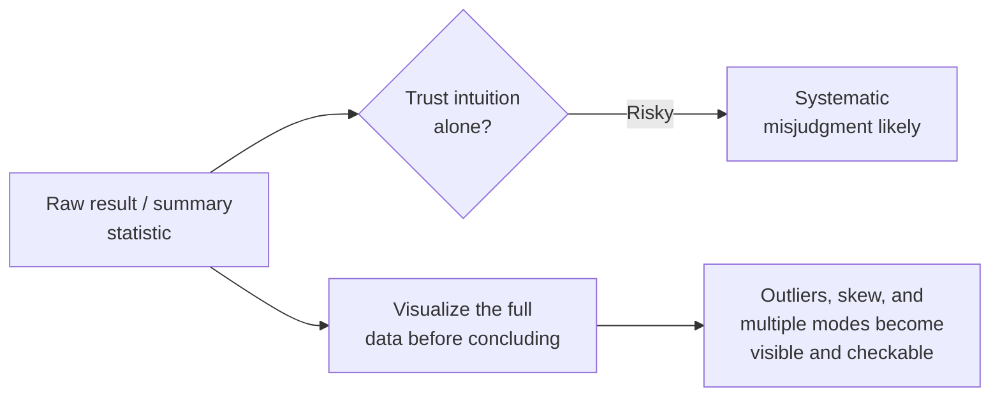

## Learning Objectives

- Describe specific, well documented ways human intuition about probability and variability is systematically unreliable.
- Explain why deliberate visualization of results functions as a real check against misleading intuition, not merely a presentation aid added afterward.
- Connect this concept to `academic-writing`'s treatment of honest graph construction as the same underlying discipline applied at two different stages: first seeing a result correctly, then presenting it.
- Apply a visualization-first approach to inspecting a results dataset before drawing conclusions from summary statistics alone.

## Context & Motivation

This discipline's cluster on statistical principles has built up, concept by concept, the tools needed to reason carefully about experimental data: samples and populations, aggregation and variability, significance and effect size. This closing concept in the cluster addresses something more basic and easy to overlook: the human researcher doing all this reasoning has intuitions about probability and variability that are, in specific, well documented ways, unreliable, and Zobel treats deliberate visualization as a real, practical check against exactly this unreliability, not simply a way of presenting already-understood results more attractively.

## Core Theory

### Specific ways intuition about data is unreliable

```text
- Small samples: people routinely underestimate how much a small
  sample's summary statistic (a mean, a rate) can vary just from
  sampling noise alone, and over-interpret a small sample's result as
  more stable and reliable than it actually is.

- Randomness: genuinely random data often contains apparent patterns
  (streaks, clusters) that intuition reads as meaningful structure,
  when they are exactly what random data is expected to produce some
  of the time.

- Regression to the mean: an unusually extreme result is often
  followed by a more typical one on a repeat measurement, not because
  anything changed, but because the first result was partly an
  extreme sampling fluctuation; intuition often misreads this as a
  real effect of whatever happened between the two measurements.
```

These are not quirks specific to inexperienced researchers; they are well documented, general features of human intuition about probability, which is exactly why relying on intuition alone to judge whether a result "looks real" is not a sound substitute for the deliberate statistical tools covered earlier in this discipline.

### Visualization as a check, not a presentation afterthought



Zobel's guidance treats visualizing results, plotting the actual data, not just computing a summary statistic, as a deliberate practice applied early, while a researcher is still trying to understand what a dataset actually shows, not only later when preparing a polished figure for publication. A histogram or scatter plot can reveal an outlier distorting a mean, a skewed distribution a standard deviation summarizes poorly, or a bimodal pattern hiding entirely behind an average, exactly the kinds of structure `aggregation-variability-and-reporting` already established a bare summary number can conceal. Looking at the actual shape of the data before drawing conclusions is a real, practical defense against the specific ways intuition tends to misjudge probabilistic information.

### The same discipline, two stages

This concept and `academic-writing`'s own `graphs-figures-and-tables` concept cover what looks, on the surface, like the same subject, visualization, but at two genuinely different, sequential stages of a research project. This concept is about visualization as a private, investigative tool, looking honestly at raw results to understand what actually happened before any conclusion is drawn or written down. `academic-writing`'s concept is about visualization as public communication, constructing an honest, persuasive graph for a skeptical reader once the underlying finding is already understood and confirmed. Getting the first stage right, understanding the data honestly, is what makes the second stage, presenting it honestly, possible in the first place; a researcher who never looked closely at their own raw data cannot reliably construct a graph that doesn't inadvertently mislead, since they may not have noticed the outlier or skew themselves.

## Worked Examples

### Example 1: catching a misleading pattern in random-looking data

A researcher notices what looks like a clear upward trend across ten consecutive benchmark runs and begins forming a hypothesis about why performance is improving over time. Plotting a larger set of forty runs reveals the apparent trend was a short-lived fluctuation within essentially random variation, not a real, sustained pattern, a correction visualization surfaced that would have been easy to miss trusting the initial ten-run intuition alone.

### Example 2: regression to the mean misread as a real effect

A team observes an unusually slow response time on one day, applies a configuration change, and observes a faster response time the next day, concluding the change helped. Plotting the full time series of response times over several weeks reveals the "unusually slow" day was already an outlier relative to a fairly stable baseline; the next day's more typical value is consistent with regression to the mean, not clear evidence the configuration change caused an improvement, a distinction only visible by looking at the fuller data rather than the two isolated points.

### Example 3: visualization before summary statistics

Before computing any mean or standard deviation, a researcher first plots a histogram of two hundred latency measurements and immediately notices a small but clear second cluster of unusually high values, distinct from the main body of the data. Investigating this visually apparent bimodal pattern before computing summary statistics leads to discovering a subset of requests hitting an unoptimized code path, a finding that a mean and standard deviation computed first, without this visual check, would likely have obscured rather than revealed.

## Common Misconceptions & Pitfalls

- **"An experienced researcher's intuition about whether a result looks real is generally trustworthy."** Well documented biases in how humans judge probability and variability affect experienced researchers just as much as inexperienced ones; deliberate visualization is a check against this, not a step only novices need.
- **"Visualization is something to do at the end, when preparing figures for the paper."** Zobel treats early, investigative visualization, looking honestly at raw results before drawing conclusions, as equally, if not more, important than the later, polished visualization done for publication.
- **"A pattern that looks clear and consistent across a handful of data points is probably real."** Small samples are exactly where intuition is least reliable about distinguishing real patterns from random variation; a larger dataset, visualized directly, is a more trustworthy check than a small sample's apparent clarity.

## Summary

Human intuition about probability and variability is unreliable in specific, well documented ways, underestimating how much small samples can vary by chance, misreading genuine randomness as meaningful pattern, and misattributing regression to the mean as a real effect, which is exactly why deliberate visualization of the full data, not just a computed summary statistic, functions as a real, practical check before drawing conclusions. This concept and `academic-writing`'s treatment of honest graph construction are the same underlying discipline applied at two different, sequential stages: first seeing a result correctly through early, investigative visualization, and only then presenting it honestly to a reader once it is actually understood.

## Documentation Links

- [ACM Digital Library: Justin Zobel, Writing for Computer Science (3rd Edition, Springer, 2014)](https://dl.acm.org/doi/10.5555/2742708): Chapter 15's "Intuition" and "Visualization of Results" sections are the direct source for the intuition-bias and investigative-visualization guidance covered here.
