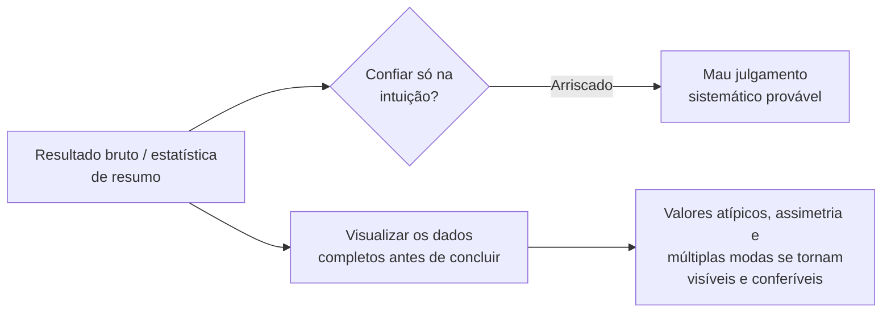

## Objetivos de Aprendizagem

- Descrever formas específicas e bem documentadas em que a intuição humana sobre probabilidade e variabilidade é sistematicamente não confiável.
- Explicar por que a visualização deliberada de resultados funciona como uma verificação real contra a intuição enganosa, e não meramente como um auxílio de apresentação acrescentado depois.
- Conectar este conceito ao tratamento de `academic-writing` sobre a construção honesta de gráficos como a mesma disciplina subjacente aplicada em dois estágios diferentes: primeiro enxergar um resultado corretamente, depois apresentá-lo.
- Aplicar uma abordagem de visualização primeiro para inspecionar um conjunto de dados de resultados antes de tirar conclusões só de estatísticas de resumo.

## Contexto e Motivação

O agrupamento desta disciplina sobre princípios estatísticos construiu, conceito por conceito, as ferramentas necessárias para raciocinar com cuidado sobre dados experimentais: amostras e populações, agregação e variabilidade, significância e tamanho de efeito. Este conceito de encerramento do agrupamento aborda algo mais básico e fácil de ignorar: o pesquisador humano fazendo todo esse raciocínio tem intuições sobre probabilidade e variabilidade que são, de formas específicas e bem documentadas, não confiáveis, e Zobel trata a visualização deliberada como uma verificação real e prática contra exatamente essa falta de confiabilidade, e não simplesmente como uma forma de apresentar resultados já entendidos de maneira mais atraente.

## Teoria Central

### Formas específicas em que a intuição sobre dados é não confiável

```text
- Amostras pequenas: as pessoas rotineiramente subestimam o quanto a estatística
  de resumo de uma amostra pequena (uma média, uma taxa) pode variar só por
  ruído de amostragem sozinho, e superinterpretam o resultado de uma amostra pequena como
  mais estável e confiável do que ele de fato é.

- Aleatoriedade: dados genuinamente aleatórios muitas vezes contêm padrões aparentes
  (sequências, agrupamentos) que a intuição lê como estrutura significativa,
  quando eles são exatamente o que se espera que dados aleatórios produzam parte
  do tempo.

- Regressão à média: um resultado incomumente extremo é muitas vezes
  seguido de um mais típico numa medição repetida, não porque
  algo mudou, mas porque o primeiro resultado foi em parte uma
  flutuação extrema de amostragem; a intuição muitas vezes lê isso mal como um
  efeito real do que quer que tenha acontecido entre as duas medições.
```

Essas não são peculiaridades específicas de pesquisadores inexperientes; são características gerais e bem documentadas da intuição humana sobre probabilidade, que é exatamente por que confiar só na intuição para julgar se um resultado "parece real" não é um substituto sólido para as ferramentas estatísticas deliberadas cobertas antes nesta disciplina.

### A visualização como verificação, não como algo acessório de apresentação



A orientação de Zobel trata visualizar resultados, plotar os dados de fato, não só calcular uma estatística de resumo, como uma prática deliberada aplicada cedo, enquanto um pesquisador ainda está tentando entender o que um conjunto de dados de fato mostra, e não só depois, ao preparar uma figura polida para publicação. Um histograma ou gráfico de dispersão pode revelar um valor atípico distorcendo uma média, uma distribuição assimétrica que um desvio padrão resume mal, ou um padrão bimodal escondido inteiramente atrás de uma média, exatamente os tipos de estrutura que `aggregation-variability-and-reporting` já estabeleceu que um número de resumo nu pode ocultar. Olhar o formato de fato dos dados antes de tirar conclusões é uma defesa real e prática contra as formas específicas em que a intuição tende a julgar mal a informação probabilística.

### A mesma disciplina, dois estágios

Este conceito e o próprio conceito `graphs-figures-and-tables` de `academic-writing` cobrem o que parece, na superfície, o mesmo assunto, visualização, mas em dois estágios genuinamente diferentes e sequenciais de um projeto de pesquisa. Este conceito é sobre a visualização como ferramenta privada e investigativa, olhar honestamente os resultados brutos para entender o que de fato aconteceu antes de qualquer conclusão ser tirada ou escrita. O conceito de `academic-writing` é sobre a visualização como comunicação pública, construir um gráfico honesto e persuasivo para um leitor cético uma vez que a descoberta subjacente já está entendida e confirmada. Acertar o primeiro estágio, entender os dados honestamente, é o que torna o segundo estágio, apresentá-los honestamente, possível em primeiro lugar; um pesquisador que nunca olhou de perto os seus próprios dados brutos não consegue construir de forma confiável um gráfico que não engane inadvertidamente, já que ele mesmo pode não ter notado o valor atípico ou a assimetria.

## Exemplos Resolvidos

### Exemplo 1: pegar um padrão enganoso em dados de aparência aleatória

Um pesquisador nota o que parece uma clara tendência de alta ao longo de dez execuções consecutivas de benchmark e começa a formar uma hipótese sobre por que o desempenho está melhorando ao longo do tempo. Plotar um conjunto maior de quarenta execuções revela que a tendência aparente era uma flutuação de curta duração dentro de uma variação essencialmente aleatória, e não um padrão real e sustentado, uma correção que a visualização trouxe à tona e que teria sido fácil de perder confiando só na intuição das dez execuções iniciais.

### Exemplo 2: regressão à média lida mal como um efeito real

Uma equipe observa um tempo de resposta incomumente lento num dia, aplica uma mudança de configuração, e observa um tempo de resposta mais rápido no dia seguinte, concluindo que a mudança ajudou. Plotar a série temporal completa dos tempos de resposta ao longo de várias semanas revela que o dia "incomumente lento" já era um valor atípico em relação a uma linha de base bastante estável; o valor mais típico do dia seguinte é consistente com a regressão à média, e não uma evidência clara de que a mudança de configuração causou uma melhoria, uma distinção só visível ao olhar os dados mais completos, em vez dos dois pontos isolados.

### Exemplo 3: visualização antes das estatísticas de resumo

Antes de calcular qualquer média ou desvio padrão, um pesquisador primeiro plota um histograma de duzentas medições de latência e imediatamente nota um pequeno, mas claro, segundo agrupamento de valores incomumente altos, distinto do corpo principal dos dados. Investigar esse padrão bimodal visualmente aparente antes de calcular as estatísticas de resumo leva a descobrir um subconjunto de requisições atingindo um caminho de código não otimizado, uma descoberta que uma média e um desvio padrão calculados primeiro, sem essa verificação visual, provavelmente teriam obscurecido, em vez de revelado.

## Equívocos Comuns e Armadilhas

- **"A intuição de um pesquisador experiente sobre se um resultado parece real é geralmente confiável."** Vieses bem documentados em como os humanos julgam probabilidade e variabilidade afetam pesquisadores experientes tanto quanto inexperientes; a visualização deliberada é uma verificação contra isso, e não um passo de que só os novatos precisam.
- **"A visualização é algo para fazer no fim, ao preparar figuras para o artigo."** Zobel trata a visualização investigativa e precoce, olhar honestamente os resultados brutos antes de tirar conclusões, como igualmente, se não mais, importante do que a visualização posterior e polida feita para publicação.
- **"Um padrão que parece claro e consistente ao longo de um punhado de pontos de dados provavelmente é real."** Amostras pequenas são exatamente onde a intuição é menos confiável quanto a distinguir padrões reais de variação aleatória; um conjunto de dados maior, visualizado diretamente, é uma verificação mais confiável do que a clareza aparente de uma amostra pequena.

## Resumo

A intuição humana sobre probabilidade e variabilidade é não confiável de formas específicas e bem documentadas, subestimando o quanto amostras pequenas podem variar por acaso, lendo mal a aleatoriedade genuína como padrão significativo, e atribuindo mal a regressão à média como um efeito real, que é exatamente por que a visualização deliberada dos dados completos, não só uma estatística de resumo calculada, funciona como uma verificação real e prática antes de tirar conclusões. Este conceito e o tratamento de `academic-writing` sobre a construção honesta de gráficos são a mesma disciplina subjacente aplicada em dois estágios diferentes e sequenciais: primeiro enxergar um resultado corretamente por meio de uma visualização precoce e investigativa, e só então apresentá-lo honestamente a um leitor uma vez que ele de fato esteja entendido.

## Documentation Links

- [ACM Digital Library: Justin Zobel, Writing for Computer Science (3ª edição, Springer, 2014)](https://dl.acm.org/doi/10.5555/2742708): as seções "Intuition" e "Visualization of Results" do Capítulo 15 são a fonte direta da orientação sobre viés de intuição e visualização investigativa coberta aqui.
