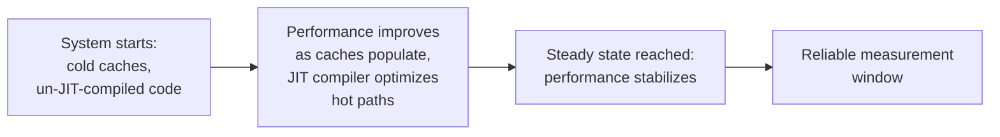

## Learning Objectives

- Name concrete, non-obvious sources of measurement error specific to performance benchmarking: clock resolution and jitter, warm-up effects, and confounding background load.
- Explain why a system needs to reach a steady state before measurements are trusted, and how a warm-up period is identified and handled correctly.
- Describe why benchmarking on a shared or noisy machine is a real methodological risk, and what practices mitigate it.
- Apply sound performance-measurement practice to design a benchmark that avoids these specific, well documented pitfalls.

## Context & Motivation

`baselines-and-persuasive-data` and `interpretation-and-robustness-of-experimental-results` covered the comparative and interpretive side of experimentation. This concept covers a narrower but consequential problem specific to computing research: the act of measuring how fast or how resource-efficient a real running system or algorithm actually is turns out to be its own established subfield, with documented, recurring pitfalls that can corrupt a measurement before any statistical analysis is even applied to it.

Catherine McGeoch, whose 1986 dissertation helped establish experimental algorithmics as a distinct area of study, and whose later book *A Guide to Experimental Algorithmics* remains a standard reference, treats performance measurement as requiring its own dedicated methodology, drawing on ideas from algorithm design, computer systems, and statistics together. Zobel's own treatment of "Performance of Algorithms" in *Writing for Computer Science* covers the same ground from the writing-and-research-practice side. Both converge on a shared, practical lesson: naive timing code, start a clock, run the operation, stop the clock, is not sufficient for trustworthy performance measurement, because several well documented effects can distort the result long before statistics enters the picture.

## Core Theory

### System clock resolution and jitter

```text
Naive timing:  measure a single, very fast operation (microseconds)
               using a clock whose resolution is coarser than the
               operation itself; the reported time is dominated by
               clock granularity, not the operation's real cost.

Better practice: repeat the operation many times and measure total
               elapsed time, then divide; or use a higher-resolution
               timing mechanism appropriate to the operation's actual
               scale.
```

A system clock has finite resolution, and on a shared or virtualized machine, timing measurements can also be affected by jitter, small, irregular variations introduced by the operating system's scheduler, competing processes, or virtualization layer. Measuring an operation whose real duration is close to or below the clock's resolution, or close to the scale of typical jitter, produces numbers dominated by measurement artifact rather than the operation's actual cost.

### Warm-up effects and steady state



Many real systems, particularly those running on managed runtimes with just-in-time compilation, or systems relying heavily on caching, do not perform at their eventual steady-state level from the very first operation. A benchmark that measures performance starting from a cold start captures a mix of warm-up overhead and true steady-state behavior, conflating two genuinely different things. The correct practice, well established in experimental algorithmics, is to run a warm-up period before measurement begins, discard those initial results, and only measure once the system has demonstrably reached a stable, steady-state performance level.

### Confounding background load

A benchmark run on a shared machine, one also running other processes, other users' jobs, or background system tasks, measures a combination of the target operation's real cost and however much interference happened to occur from unrelated activity during that specific run. This confound is a real, common source of misleading results, especially in cloud or shared-infrastructure environments increasingly common in distributed systems research specifically, where "the same" experiment run at different times of day can produce meaningfully different numbers purely due to background load, unrelated to anything the experiment is actually testing.

### Mitigating these effects

Established practice addresses each of these directly: using a dedicated or minimally loaded machine when feasible, or at minimum being transparent about and controlling for background load when it cannot be eliminated; running enough repetitions, after an adequate warm-up period, that timing artifacts from clock resolution and momentary jitter average out; and reporting the full distribution of repeated measurements, not just a single run's number, connecting directly to this discipline's own `aggregation-variability-and-reporting` concept.

## Worked Examples

### Example 1: fixing a clock-resolution problem

A researcher benchmarks a single hash-table lookup, an operation completing in roughly 50 nanoseconds, using a timer with millisecond resolution. The reported time is meaningless, dominated entirely by clock granularity. Corrected, the researcher measures the total time for one million consecutive lookups and divides, producing a number where the clock's resolution is a negligible fraction of the total measured interval.

### Example 2: catching a warm-up artifact

A benchmark measures a JIT-compiled service's request latency starting from process startup, and reports an average that blends the first, slower requests, processed before the JIT compiler has optimized hot code paths, with the much faster steady-state requests that follow. Corrected, the researcher runs a warm-up period of several thousand requests, confirms latency has stabilized, discards the warm-up data, and measures only the steady-state period that follows.

### Example 3: identifying confounding load

Two benchmark runs of the same distributed protocol, conducted a week apart on a shared cloud testbed, produce noticeably different latency numbers. Investigating, the researcher finds the second run coincided with unrelated, heavy background jobs on shared infrastructure. Rather than reporting either number without qualification, the researcher reruns the experiment on a dedicated, isolated testbed, and the two runs then produce consistent results, confirming the original discrepancy was a confound, not a real effect.

## Common Misconceptions & Pitfalls

- **"A simple start-clock, stop-clock measurement is good enough."** For operations near the scale of clock resolution or typical system jitter, this naive approach produces numbers dominated by measurement artifact rather than the operation's real cost.
- **"The first measurement is as valid as any later one."** Systems with caches or JIT compilation often have a real warm-up period during which performance has not yet stabilized; measuring from a cold start conflates warm-up overhead with steady-state behavior.
- **"Benchmarking on whatever machine happens to be available is fine."** Background load on a shared machine is a real, common confound that can produce misleading run-to-run variation unrelated to the actual experiment; controlling for or at least reporting on the measurement environment matters.

## Summary

Measuring algorithm and systems performance accurately is its own established methodology, not a trivial matter of starting and stopping a clock: system clock resolution and jitter can dominate measurements of fast operations, warm-up effects mean a system's true steady-state performance is often not reflected in its earliest measurements, and background load on shared infrastructure is a real, common confound in distributed systems benchmarking specifically. Established practice, drawing on both Zobel's research-methods guidance and Catherine McGeoch's dedicated experimental-algorithmics text, addresses each of these directly through repetition, deliberate warm-up periods, and controlled or transparently reported measurement environments.

## Documentation Links

- [ACM Digital Library: Justin Zobel, Writing for Computer Science (3rd Edition, Springer, 2014)](https://dl.acm.org/doi/10.5555/2742708): Chapter 14's "Performance of Algorithms" section is a direct source for the measurement-pitfalls guidance covered here.
- [Cambridge University Press: Catherine C. McGeoch, A Guide to Experimental Algorithmics (2012)](https://www.cambridge.org/core/books/guide-to-experimental-algorithmics/CDB0CB718F6250E0806C909E1D3D1082): the field's dedicated, standard reference on experimental methodology for measuring algorithm and systems performance, the direct source for the clock-resolution, warm-up, and confounding-load guidance covered here.
