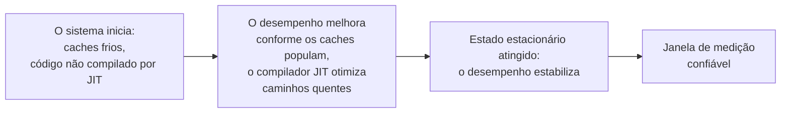

## Objetivos de Aprendizagem

- Nomear fontes concretas e não óbvias de erro de medição específicas do benchmarking de desempenho: resolução e jitter do relógio, efeitos de aquecimento e carga de fundo de confusão.
- Explicar por que um sistema precisa atingir um estado estacionário antes de as medições serem confiadas, e como um período de aquecimento é identificado e tratado corretamente.
- Descrever por que fazer benchmark numa máquina compartilhada ou ruidosa é um risco metodológico real, e que práticas o mitigam.
- Aplicar uma prática sólida de medição de desempenho para projetar um benchmark que evita essas armadilhas específicas e bem documentadas.

## Contexto e Motivação

`baselines-and-persuasive-data` e `interpretation-and-robustness-of-experimental-results` cobriram o lado comparativo e interpretativo da experimentação. Este conceito cobre um problema mais estreito, mas consequente, específico da pesquisa em computação: o ato de medir quão rápido ou quão eficiente em recursos um sistema ou algoritmo real em execução de fato é acaba sendo a sua própria subárea estabelecida, com armadilhas documentadas e recorrentes que podem corromper uma medição antes mesmo de qualquer análise estatística ser aplicada a ela.

Catherine McGeoch, cuja dissertação de 1986 ajudou a estabelecer a algorítmica experimental como uma área de estudo distinta, e cujo livro posterior *A Guide to Experimental Algorithmics* continua sendo uma referência padrão, trata a medição de desempenho como algo que exige a sua própria metodologia dedicada, valendo-se de ideias do projeto de algoritmos, dos sistemas de computador e da estatística em conjunto. O próprio tratamento de Zobel sobre "Performance of Algorithms" em *Writing for Computer Science* cobre o mesmo terreno do lado da prática de escrita e de pesquisa. Ambos convergem para uma lição compartilhada e prática: código de cronometragem ingênuo, inicie um relógio, rode a operação, pare o relógio, não é suficiente para uma medição de desempenho confiável, porque vários efeitos bem documentados podem distorcer o resultado muito antes de a estatística entrar em cena.

## Teoria Central

### Resolução e jitter do relógio do sistema

```text
Cronometragem ingênua:  medir uma única operação muito rápida (microssegundos)
               usando um relógio cuja resolução é mais grossa do que a própria
               operação; o tempo relatado é dominado pela
               granularidade do relógio, e não pelo custo real da operação.

Melhor prática: repetir a operação muitas vezes e medir o tempo total
               decorrido, depois dividir; ou usar um mecanismo de cronometragem
               de resolução mais alta apropriado à escala de fato da operação.
```

Um relógio de sistema tem resolução finita, e numa máquina compartilhada ou virtualizada, as medições de cronometragem também podem ser afetadas por jitter, pequenas variações irregulares introduzidas pelo escalonador do sistema operacional, por processos concorrentes ou pela camada de virtualização. Medir uma operação cuja duração real está próxima de ou abaixo da resolução do relógio, ou próxima da escala do jitter típico, produz números dominados por artefato de medição, em vez do custo de fato da operação.

### Efeitos de aquecimento e estado estacionário



Muitos sistemas reais, particularmente os que rodam em runtimes gerenciados com compilação just-in-time, ou sistemas que dependem fortemente de cache, não têm desempenho no seu nível eventual de estado estacionário desde a primeiríssima operação. Um benchmark que mede o desempenho começando de uma partida fria captura uma mistura de sobrecarga de aquecimento e comportamento verdadeiro de estado estacionário, confundindo duas coisas genuinamente diferentes. A prática correta, bem estabelecida na algorítmica experimental, é rodar um período de aquecimento antes de a medição começar, descartar esses resultados iniciais, e só medir uma vez que o sistema tenha comprovadamente atingido um nível de desempenho estável e de estado estacionário.

### Carga de fundo de confusão

Um benchmark rodado numa máquina compartilhada, uma que também roda outros processos, jobs de outros usuários, ou tarefas de sistema de fundo, mede uma combinação do custo real da operação-alvo e de quanta interferência por acaso ocorreu de atividade não relacionada durante aquela execução específica. Esse fator de confusão é uma fonte real e comum de resultados enganosos, especialmente em ambientes de nuvem ou de infraestrutura compartilhada cada vez mais comuns na pesquisa em sistemas distribuídos especificamente, onde "o mesmo" experimento rodado em horários diferentes do dia pode produzir números significativamente diferentes puramente por causa da carga de fundo, sem relação com nada que o experimento de fato está testando.

### Mitigar esses efeitos

A prática estabelecida aborda cada um deles diretamente: usar uma máquina dedicada ou minimamente carregada quando viável, ou no mínimo ser transparente sobre e controlar a carga de fundo quando ela não pode ser eliminada; rodar repetições suficientes, após um período de aquecimento adequado, para que os artefatos de cronometragem da resolução do relógio e do jitter momentâneo se compensem na média; e relatar a distribuição completa das medições repetidas, não só o número de uma única execução, conectando-se diretamente ao próprio conceito `aggregation-variability-and-reporting` desta disciplina.

## Exemplos Resolvidos

### Exemplo 1: corrigir um problema de resolução de relógio

Um pesquisador faz o benchmark de uma única busca em tabela hash, uma operação que se completa em mais ou menos 50 nanossegundos, usando um cronômetro com resolução de milissegundos. O tempo relatado é sem sentido, dominado inteiramente pela granularidade do relógio. Corrigido, o pesquisador mede o tempo total de um milhão de buscas consecutivas e divide, produzindo um número onde a resolução do relógio é uma fração desprezível do intervalo total medido.

### Exemplo 2: pegar um artefato de aquecimento

Um benchmark mede a latência de requisição de um serviço compilado por JIT começando da inicialização do processo, e relata uma média que mistura as primeiras requisições, mais lentas, processadas antes de o compilador JIT ter otimizado os caminhos de código quentes, com as requisições de estado estacionário muito mais rápidas que se seguem. Corrigido, o pesquisador roda um período de aquecimento de vários milhares de requisições, confirma que a latência se estabilizou, descarta os dados de aquecimento, e mede só o período de estado estacionário que se segue.

### Exemplo 3: identificar carga de confusão

Duas execuções de benchmark do mesmo protocolo distribuído, conduzidas com uma semana de intervalo num testbed de nuvem compartilhado, produzem números de latência perceptivelmente diferentes. Investigando, o pesquisador descobre que a segunda execução coincidiu com jobs de fundo pesados e não relacionados na infraestrutura compartilhada. Em vez de relatar qualquer um dos números sem ressalva, o pesquisador reexecuta o experimento num testbed dedicado e isolado, e as duas execuções então produzem resultados consistentes, confirmando que a discrepância original era um fator de confusão, e não um efeito real.

## Equívocos Comuns e Armadilhas

- **"Uma medição simples de inicia-relógio, para-relógio é boa o bastante."** Para operações próximas da escala da resolução do relógio ou do jitter típico do sistema, essa abordagem ingênua produz números dominados por artefato de medição, em vez do custo real da operação.
- **"A primeira medição é tão válida quanto qualquer uma posterior."** Sistemas com caches ou compilação JIT muitas vezes têm um período de aquecimento real durante o qual o desempenho ainda não se estabilizou; medir de uma partida fria confunde a sobrecarga de aquecimento com o comportamento de estado estacionário.
- **"Fazer benchmark em qualquer máquina que por acaso esteja disponível está tudo bem."** A carga de fundo numa máquina compartilhada é um fator de confusão real e comum que pode produzir variação de execução para execução enganosa e sem relação com o experimento de fato; controlar ou ao menos relatar o ambiente de medição importa.

## Resumo

Medir o desempenho de algoritmos e sistemas com acurácia é a sua própria metodologia estabelecida, e não uma questão trivial de iniciar e parar um relógio: a resolução e o jitter do relógio do sistema podem dominar medições de operações rápidas, os efeitos de aquecimento significam que o verdadeiro desempenho de estado estacionário de um sistema muitas vezes não se reflete nas suas medições mais iniciais, e a carga de fundo em infraestrutura compartilhada é um fator de confusão real e comum no benchmarking de sistemas distribuídos especificamente. A prática estabelecida, valendo-se tanto da orientação de métodos de pesquisa de Zobel quanto do texto dedicado de algorítmica experimental de Catherine McGeoch, aborda cada um deles diretamente por meio de repetição, períodos de aquecimento deliberados e ambientes de medição controlados ou relatados de forma transparente.

## Documentation Links

- [ACM Digital Library: Justin Zobel, Writing for Computer Science (3ª edição, Springer, 2014)](https://dl.acm.org/doi/10.5555/2742708): a seção "Performance of Algorithms" do Capítulo 14 é uma fonte direta da orientação sobre armadilhas de medição coberta aqui.
- [Cambridge University Press: Catherine C. McGeoch, A Guide to Experimental Algorithmics (2012)](https://www.cambridge.org/core/books/guide-to-experimental-algorithmics/CDB0CB718F6250E0806C909E1D3D1082): a referência dedicada e padrão do campo sobre metodologia experimental para medir o desempenho de algoritmos e sistemas, a fonte direta da orientação sobre resolução de relógio, aquecimento e carga de confusão coberta aqui.
