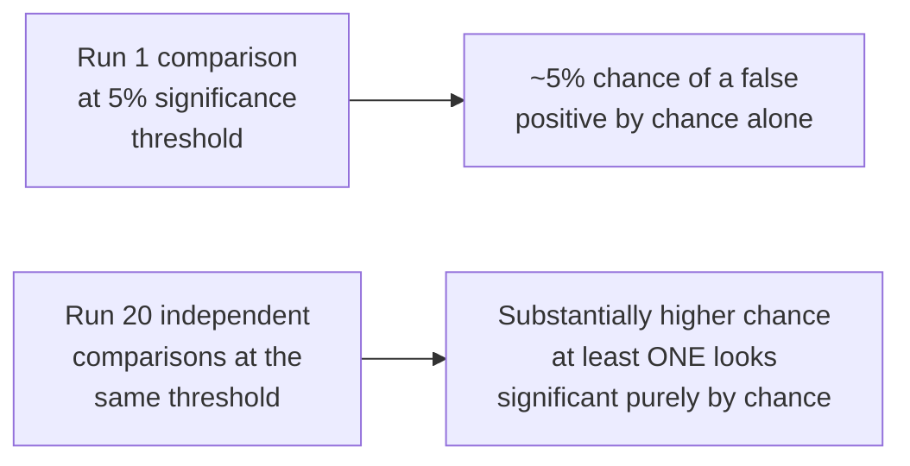

## Learning Objectives

- State precisely what a statistical significance test answers, and distinguish that narrow question from the broader question of whether a difference is meaningful in practice.
- Explain the multiple-comparisons problem: why running many comparisons at once makes some look significant purely by chance, and what corrections address this.
- Distinguish statistical significance from effect size, and explain why a result can be significant but practically unimportant, or practically important but not significant given a small sample.
- Apply Demšar's documented cautions about comparing methods across multiple datasets to a described machine-learning or systems evaluation.

## Context & Motivation

`aggregation-variability-and-reporting` established that honest variability reporting is what lets a reader judge whether an observed difference is real or noise. Statistical significance testing is the formal tool built to answer a specific version of that question, and this concept, together with Zobel's own treatment of randomness and error, covers both what that tool actually establishes and the well documented ways it gets misused, drawing specifically on Janez Demšar's widely cited methodology paper, itself a direct response to systematic errors he found in how the machine learning community was comparing classifiers across benchmark datasets.

## Core Theory

### What a significance test actually answers

```text
The narrow question a significance test answers:

  "If there were really NO underlying difference between these two
  systems, how likely would it be to observe a difference at least
  this large, purely by chance, given this sample size?"

NOT the same as:

  "Is this difference meaningful or important in practice?"
```

A small p-value indicates the observed difference would be unlikely under the assumption of no real effect, which is evidence against that assumption, but it says nothing directly about how large or practically important the effect actually is. Conflating these two questions, treating "statistically significant" as synonymous with "meaningful," is one of the most common and consequential errors in reporting experimental comparisons, in computing research and well beyond it.

### The multiple-comparisons problem



Demšar's paper documents, with real examples from published machine learning evaluations, exactly how this problem manifests when researchers compare several methods across several datasets: running many pairwise comparisons at a fixed significance threshold means that, purely by chance, some fraction of them will appear significant even if no real underlying difference exists anywhere. Established corrections, adjusting the significance threshold to account for the number of comparisons made, or using a method designed specifically for comparing multiple methods across multiple datasets at once (Demšar recommends the Friedman test followed by a post-hoc test for this exact scenario), are not optional statistical pedantry; they directly address a real, demonstrated source of false claims in the published literature.

### Significance versus effect size

Statistical significance and effect size, the actual magnitude of a difference, are genuinely separate properties, and both matter for a complete, honest report. A very large sample can make even a tiny, practically irrelevant difference statistically significant, because with enough data, almost any real (even if minuscule) difference eventually clears a significance threshold. Conversely, a small sample can fail to reach significance even for a difference that would be practically important if confirmed, simply because the sample was not large enough to distinguish it reliably from noise. Reporting both the significance result and the effect size, how large the difference actually is, in units that matter practically, is what lets a reader judge both questions Demšar's and Zobel's guidance separate: is this difference likely real, and is it actually large enough to matter.

### Randomness and error, more broadly

Zobel's own treatment of "Randomness and Error" extends this concern beyond formal significance testing: understanding which parts of an experimental pipeline introduce randomness (a randomized algorithm's own behavior, measurement noise, sampling variation) and reasoning carefully about how that randomness propagates into the final reported result is a broader discipline that formal significance testing is one tool within, not a substitute for.

## Worked Examples

### Example 1: significant but not meaningful

A study compares two caching strategies across a million requests and finds strategy A is significantly faster than strategy B, with a p-value well below the standard threshold. The actual effect size, however, is a 0.3-millisecond average difference, well below anything a user would perceive or that matters for the application's requirements. The result is real (the significance test is not wrong), but reporting only "statistically significant improvement" without the effect size would mislead a reader into overestimating its practical importance.

### Example 2: correcting for multiple comparisons

A researcher compares five algorithms across eight benchmark datasets, running 5×4/2=10 pairwise comparisons per dataset, 80 comparisons total, each at the standard 5% significance threshold. Following Demšar's guidance, rather than treating each of the 80 raw p-values independently, which would produce several apparently significant results purely by chance, the researcher uses a Friedman test to first check whether any real difference exists across the full set of algorithms, followed by an appropriate post-hoc test only where that initial check indicates a real difference is present.

### Example 3: an important difference not reaching significance

A small pilot study with only 8 participants shows one interface design produces meaningfully fewer errors than another, but the difference does not reach statistical significance given the small sample. Rather than concluding "no difference exists," the honest report states the result is suggestive but underpowered, and recommends a larger follow-up study specifically sized to detect an effect of the magnitude observed, rather than either overclaiming significance or discarding a potentially real, important finding.

## Common Misconceptions & Pitfalls

- **"A statistically significant result means the effect is important."** Significance and effect size are separate properties; a very large sample can make a practically irrelevant difference statistically significant, which is why both need to be reported together.
- **"Running many comparisons and reporting whichever ones came out significant is fine, since each individual test is valid."** This is exactly the multiple-comparisons problem Demšar documents: running many comparisons at a fixed threshold makes some appear significant purely by chance, and this needs to be corrected for, not ignored.
- **"A non-significant result means there's definitely no real effect."** A non-significant result with a small sample may simply reflect insufficient statistical power to detect a real effect, not evidence the effect doesn't exist; the honest conclusion is "not detected at this sample size," not "does not exist."

## Summary

A statistical significance test answers a narrow, specific question, how likely an observed difference is to have arisen by chance if no real effect existed, which is a genuinely different question from whether that difference is meaningful in practice, and reporting effect size alongside significance is what lets a reader judge both. Janez Demšar's widely cited methodology paper documents, with real examples from the machine learning literature, how running many comparisons at once inflates the chance some will look significant purely by coincidence, the multiple-comparisons problem, and recommends established corrections specifically for the common scenario of comparing several methods across several datasets, guidance directly applicable to comparing algorithms or systems in computing research more broadly.

## Documentation Links

- [ACM Digital Library: Justin Zobel, Writing for Computer Science (3rd Edition, Springer, 2014)](https://dl.acm.org/doi/10.5555/2742708): Chapter 15's "Randomness and Error" section is a direct source for the broader treatment of randomness in experimental pipelines covered here.
- [JMLR: Janez Demšar, Statistical Comparisons of Classifiers over Multiple Data Sets (2006)](https://jmlr.org/papers/v7/demsar06a.html): the direct source for the multiple-comparisons problem and the Friedman-test-plus-post-hoc-test methodology recommended for comparing several methods across several datasets.
