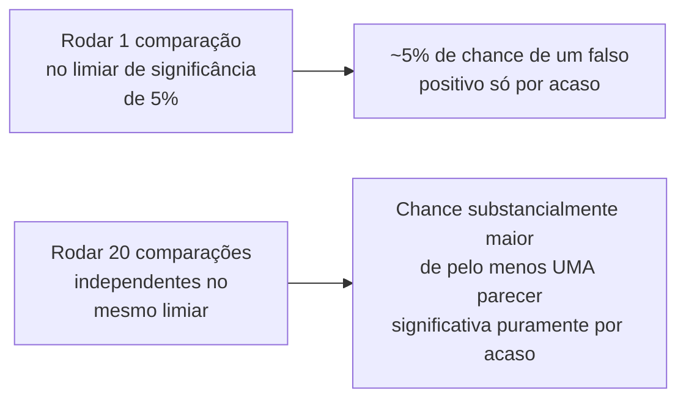

## Objetivos de Aprendizagem

- Enunciar com precisão o que um teste de significância estatística responde, e distinguir essa pergunta estreita da pergunta mais ampla sobre se uma diferença é significativa na prática.
- Explicar o problema das comparações múltiplas: por que rodar muitas comparações de uma só vez faz algumas parecerem significativas puramente por acaso, e que correções o abordam.
- Distinguir a significância estatística do tamanho de efeito, e explicar por que um resultado pode ser significativo, mas praticamente sem importância, ou praticamente importante, mas não significativo dada uma amostra pequena.
- Aplicar as cautelas documentadas de Demšar sobre comparar métodos ao longo de múltiplos conjuntos de dados a uma avaliação descrita de aprendizado de máquina ou de sistemas.

## Contexto e Motivação

`aggregation-variability-and-reporting` estabeleceu que o relato honesto de variabilidade é o que permite a um leitor julgar se uma diferença observada é real ou ruído. O teste de significância estatística é a ferramenta formal construída para responder a uma versão específica dessa pergunta, e este conceito, junto do próprio tratamento de Zobel sobre aleatoriedade e erro, cobre tanto o que essa ferramenta de fato estabelece quanto as formas bem documentadas em que ela é mal usada, valendo-se especificamente do artigo de metodologia amplamente citado de Janez Demšar, ele mesmo uma resposta direta a erros sistemáticos que ele encontrou em como a comunidade de aprendizado de máquina estava comparando classificadores ao longo de conjuntos de dados de benchmark.

## Teoria Central

### O que um teste de significância de fato responde

```text
A pergunta estreita que um teste de significância responde:

  "Se de fato NÃO houvesse diferença subjacente entre estes dois
  sistemas, quão provável seria observar uma diferença pelo menos
  deste tamanho, puramente por acaso, dado este tamanho de amostra?"

NÃO é a mesma que:

  "Esta diferença é significativa ou importante na prática?"
```

Um p-valor pequeno indica que a diferença observada seria improvável sob a suposição de nenhum efeito real, o que é evidência contra essa suposição, mas nada diz diretamente sobre quão grande ou praticamente importante o efeito de fato é. Confundir essas duas perguntas, tratar "estatisticamente significativo" como sinônimo de "significativo", é um dos erros mais comuns e consequentes ao relatar comparações experimentais, na pesquisa em computação e muito além dela.

### O problema das comparações múltiplas



O artigo de Demšar documenta, com exemplos reais de avaliações publicadas de aprendizado de máquina, exatamente como esse problema se manifesta quando os pesquisadores comparam vários métodos ao longo de vários conjuntos de dados: rodar muitas comparações par a par num limiar fixo de significância significa que, puramente por acaso, alguma fração delas parecerá significativa mesmo que nenhuma diferença real subjacente exista em lugar nenhum. Correções estabelecidas, ajustar o limiar de significância para levar em conta o número de comparações feitas, ou usar um método projetado especificamente para comparar múltiplos métodos ao longo de múltiplos conjuntos de dados de uma só vez (Demšar recomenda o teste de Friedman seguido de um teste post-hoc para exatamente esse cenário), não são pedantismo estatístico opcional; elas abordam diretamente uma fonte real e demonstrada de afirmações falsas na literatura publicada.

### Significância versus tamanho de efeito

A significância estatística e o tamanho de efeito, a magnitude de fato de uma diferença, são propriedades genuinamente separadas, e ambas importam para um relato completo e honesto. Uma amostra muito grande pode tornar até uma diferença minúscula e praticamente irrelevante estatisticamente significativa, porque, com dados suficientes, quase qualquer diferença real (ainda que minúscula) eventualmente ultrapassa um limiar de significância. Inversamente, uma amostra pequena pode deixar de atingir a significância mesmo para uma diferença que seria praticamente importante se confirmada, simplesmente porque a amostra não era grande o bastante para distingui-la de forma confiável do ruído. Relatar tanto o resultado de significância quanto o tamanho de efeito, quão grande a diferença de fato é, em unidades que importam na prática, é o que permite a um leitor julgar as duas perguntas que as orientações de Demšar e de Zobel separam: esta diferença provavelmente é real, e ela é de fato grande o bastante para importar.

### Aleatoriedade e erro, de forma mais ampla

O próprio tratamento de Zobel sobre "Randomness and Error" estende essa preocupação para além do teste formal de significância: entender quais partes de um pipeline experimental introduzem aleatoriedade (o próprio comportamento de um algoritmo aleatorizado, o ruído de medição, a variação de amostragem) e raciocinar com cuidado sobre como essa aleatoriedade se propaga para o resultado final relatado é uma disciplina mais ampla da qual o teste formal de significância é uma ferramenta, e não um substituto.

## Exemplos Resolvidos

### Exemplo 1: significativo, mas não significativo (em importância)

Um estudo compara duas estratégias de cache ao longo de um milhão de requisições e descobre que a estratégia A é significativamente mais rápida do que a estratégia B, com um p-valor bem abaixo do limiar padrão. O tamanho de efeito de fato, no entanto, é uma diferença média de 0,3 milissegundo, bem abaixo de qualquer coisa que um usuário perceberia ou que importe para os requisitos da aplicação. O resultado é real (o teste de significância não está errado), mas relatar só "melhoria estatisticamente significativa" sem o tamanho de efeito enganaria um leitor, levando-o a superestimar a sua importância prática.

### Exemplo 2: corrigir para comparações múltiplas

Um pesquisador compara cinco algoritmos ao longo de oito conjuntos de dados de benchmark, rodando 5×4/2=10 comparações par a par por conjunto de dados, 80 comparações no total, cada uma no limiar padrão de significância de 5%. Seguindo a orientação de Demšar, em vez de tratar cada um dos 80 p-valores brutos de forma independente, o que produziria vários resultados aparentemente significativos puramente por acaso, o pesquisador usa um teste de Friedman para primeiro checar se alguma diferença real existe ao longo do conjunto completo de algoritmos, seguido de um teste post-hoc apropriado só onde essa checagem inicial indica que uma diferença real está presente.

### Exemplo 3: uma diferença importante que não atinge a significância

Um pequeno estudo piloto com apenas 8 participantes mostra que um projeto de interface produz significativamente menos erros do que outro, mas a diferença não atinge a significância estatística dada a amostra pequena. Em vez de concluir "nenhuma diferença existe", o relato honesto enuncia que o resultado é sugestivo, mas de poder insuficiente, e recomenda um estudo de acompanhamento maior especificamente dimensionado para detectar um efeito da magnitude observada, em vez de ou exagerar a significância ou descartar uma descoberta potencialmente real e importante.

## Equívocos Comuns e Armadilhas

- **"Um resultado estatisticamente significativo significa que o efeito é importante."** Significância e tamanho de efeito são propriedades separadas; uma amostra muito grande pode tornar uma diferença praticamente irrelevante estatisticamente significativa, que é por que ambos precisam ser relatados juntos.
- **"Rodar muitas comparações e relatar as que saíram significativas está tudo bem, já que cada teste individual é válido."** Esse é exatamente o problema das comparações múltiplas que Demšar documenta: rodar muitas comparações num limiar fixo faz algumas parecerem significativas puramente por acaso, e isso precisa ser corrigido, e não ignorado.
- **"Um resultado não significativo significa que definitivamente não há efeito real."** Um resultado não significativo com uma amostra pequena pode simplesmente refletir poder estatístico insuficiente para detectar um efeito real, e não evidência de que o efeito não existe; a conclusão honesta é "não detectado neste tamanho de amostra", e não "não existe".

## Resumo

Um teste de significância estatística responde a uma pergunta estreita e específica, quão provável é que uma diferença observada tenha surgido por acaso se nenhum efeito real existisse, que é uma pergunta genuinamente diferente de se essa diferença é significativa na prática, e relatar o tamanho de efeito ao lado da significância é o que permite a um leitor julgar ambas. O artigo de metodologia amplamente citado de Janez Demšar documenta, com exemplos reais da literatura de aprendizado de máquina, como rodar muitas comparações de uma só vez infla a chance de algumas parecerem significativas puramente por coincidência, o problema das comparações múltiplas, e recomenda correções estabelecidas especificamente para o cenário comum de comparar vários métodos ao longo de vários conjuntos de dados, orientação diretamente aplicável a comparar algoritmos ou sistemas na pesquisa em computação de forma mais ampla.

## Documentation Links

- [ACM Digital Library: Justin Zobel, Writing for Computer Science (3ª edição, Springer, 2014)](https://dl.acm.org/doi/10.5555/2742708): a seção "Randomness and Error" do Capítulo 15 é uma fonte direta do tratamento mais amplo da aleatoriedade em pipelines experimentais coberto aqui.
- [JMLR: Janez Demšar, Statistical Comparisons of Classifiers over Multiple Data Sets (2006)](https://jmlr.org/papers/v7/demsar06a.html): a fonte direta do problema das comparações múltiplas e da metodologia de teste de Friedman mais teste post-hoc recomendada para comparar vários métodos ao longo de vários conjuntos de dados.
