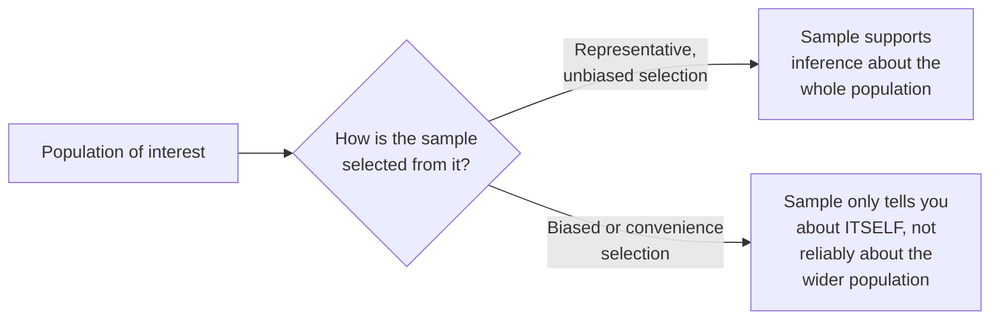

## Learning Objectives

- Define a variable, a sample, and a population in the context of a computing experiment, and explain how they relate to each other.
- Explain why a sample is only useful evidence about a wider population if it was selected in a way that does not systematically bias it.
- Identify common sources of sampling bias specific to computing experiments: benchmark suite selection, workload generation, and participant recruitment.
- Apply the sample-versus-population distinction to judge whether a given experimental claim is actually scoped correctly to what was tested.

## Context & Motivation

The preceding concepts in this discipline, from hypothesis formation through experimental design, all produce data: measured latencies, recorded outcomes, observed behaviors. This concept establishes the foundational statistical vocabulary needed to reason correctly about that data once it exists, opening Zobel's "Statistical Principles" chapter, the third and final major section of material this discipline draws from *Writing for Computer Science*. Every later concept in this cluster, aggregation and variability, statistical significance, visualization, depends on getting this foundational distinction right first: what, precisely, is a variable, a sample, and a population, in the specific context of a computing experiment.

## Core Theory

### Variables, samples, and populations defined

```text
Variable:    a quantity that is measured or recorded, and that can take
             different values across observations (e.g., request
             latency, memory usage, task completion time).

Population:  the full, often conceptual, set of all possible instances
             the researcher actually cares about generalizing to (e.g.,
             "all requests this service will ever receive," "all
             professional developers using this kind of tool").

Sample:      the specific, finite subset of the population that was
             actually observed or measured in a given experiment (e.g.,
             the 10,000 requests actually benchmarked, the 15
             participants actually recruited).
```

A population is very often not something that can be exhaustively observed, it may be effectively infinite (all future requests to a service) or practically inaccessible (every professional developer worldwide), which is precisely why research relies on a sample and then reasons, carefully, about what that sample implies about the broader population.

### Why sample selection determines usefulness



A sample is only useful evidence about the population it is drawn from if the way it was selected does not systematically favor certain kinds of outcomes over others. A sample selected to be convenient rather than representative, benchmarking only on inputs that happened to be easy to generate, recruiting only participants easy to reach, can still be perfectly accurate about the specific instances it actually measured, while being poor, misleading evidence about the wider population the researcher actually wants to make a claim about.

### Sources of sampling bias specific to computing experiments

Benchmark suite selection is a common, easy-to-overlook source of bias: a benchmark suite assembled years ago, or assembled by a specific research group with specific workloads in mind, may not represent the actual distribution of real-world usage a claim is meant to generalize to. Workload generation, when synthetic data is used rather than real traces, risks encoding whatever assumptions the workload generator's author made, sometimes assumptions that happen to favor the very method being evaluated, into the "population" the experiment is effectively sampling from. Participant recruitment, covered in more depth by this discipline's own `human-studies-in-computing-research`, introduces the same underlying concern for human studies specifically: a convenience sample of students is a sample from a different, narrower population than "professional developers," even when both groups are loosely described as "programmers."

### Scoping a claim correctly to the sample actually tested

The practical, honest discipline this concept enables is scoping a claim to match what the sample actually supports. A result observed on a specific, non-representative benchmark suite supports a claim scoped to "on this benchmark suite," not automatically a broader claim about "typical workloads" in general, unless a real, separate argument is made for why the sample is in fact representative of that broader population. This is the same honest-scope discipline `good-and-bad-science-measurement-and-reflection` already introduced, grounded here in the specific statistical vocabulary of samples and populations.

## Worked Examples

### Example 1: identifying a benchmark suite's implicit population

An evaluation uses a decade-old benchmark suite originally assembled for a different class of hardware. The population this sample actually represents is closer to "workloads typical of systems from a decade ago" than "workloads typical of current production systems," and a claim generalizing to current systems needs either a more recent benchmark suite or an explicit, separate argument for why the older suite remains representative.

### Example 2: a synthetic workload that encodes bias

A researcher generates synthetic request data for a caching experiment using a simple, uniform-random key distribution. Because most real production workloads follow a much more skewed distribution (a small number of keys accessed disproportionately often), this synthetic sample represents a population, "workloads with uniform key access," that differs meaningfully from the population, "typical production workloads," the researcher actually wants to generalize the claim to.

### Example 3: correctly scoping a claim

A study finds a new API design reduces integration errors among 20 recruited graduate students. Scoped correctly: "reduces integration errors among the graduate student sample tested," with an explicit note that generalizing to professional developers, a related but different population, would require a separate study with that population actually sampled, rather than a broader claim the current sample does not support.

## Common Misconceptions & Pitfalls

- **"A sample is automatically representative of the population it's drawn from."** Representativeness depends entirely on how the sample was selected; a convenient but biased sample can be perfectly accurate about itself while being poor evidence about the wider population.
- **"A synthetic workload is a neutral stand-in for real data."** A synthetic workload's generation process encodes assumptions, sometimes ones that happen to favor the method being tested, and those assumptions define a specific population the sample represents, which may differ meaningfully from real-world usage.
- **"If it works on students, it will work on professional developers, since both are programmers."** Students and professional developers are genuinely different populations for many research questions; a sample from one does not automatically support a claim about the other without a separate argument or study.

## Summary

A variable is a measured quantity, a population is the full set of instances a researcher actually wants to generalize a claim to, and a sample is the specific, finite subset actually observed in a given experiment, and a sample is only useful evidence about its population if it was selected without systematic bias favoring certain outcomes. Computing experiments have specific, recurring sources of sampling bias, benchmark suite selection, synthetic workload generation, and participant recruitment among them, and the honest, disciplined practice this concept establishes is scoping any claim to match what the actual sample tested supports, rather than implicitly generalizing to a broader population the sample was never shown to represent.

## Documentation Links

- [ACM Digital Library: Justin Zobel, Writing for Computer Science (3rd Edition, Springer, 2014)](https://dl.acm.org/doi/10.5555/2742708): Chapter 15's "Variables" and "Samples and Populations" sections are the direct source for the foundational vocabulary and sampling-bias guidance covered here.
