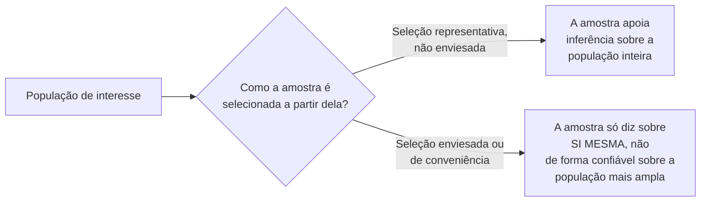

## Objetivos de Aprendizagem

- Definir uma variável, uma amostra e uma população no contexto de um experimento de computação, e explicar como elas se relacionam entre si.
- Explicar por que uma amostra só é evidência útil sobre uma população mais ampla se foi selecionada de uma forma que não a enviese sistematicamente.
- Identificar fontes comuns de viés de amostragem específicas dos experimentos de computação: seleção de suíte de benchmark, geração de carga e recrutamento de participantes.
- Aplicar a distinção amostra versus população para julgar se uma dada afirmação experimental está de fato delimitada corretamente ao que foi testado.

## Contexto e Motivação

Os conceitos precedentes desta disciplina, da formação de hipóteses ao projeto experimental, todos produzem dados: latências medidas, desfechos registrados, comportamentos observados. Este conceito estabelece o vocabulário estatístico fundacional necessário para raciocinar corretamente sobre esses dados uma vez que eles existem, abrindo o capítulo "Statistical Principles" de Zobel, a terceira e última grande seção de material de que esta disciplina se vale de *Writing for Computer Science*. Todo conceito posterior deste agrupamento, agregação e variabilidade, significância estatística, visualização, depende de acertar essa distinção fundacional primeiro: o que, precisamente, é uma variável, uma amostra e uma população, no contexto específico de um experimento de computação.

## Teoria Central

### Variáveis, amostras e populações definidas

```text
Variável:    uma quantidade que é medida ou registrada, e que pode tomar
             valores diferentes ao longo das observações (ex.: latência
             de requisição, uso de memória, tempo de conclusão de tarefa).

População:   o conjunto completo, muitas vezes conceitual, de todas as instâncias
             possíveis para as quais o pesquisador de fato se importa em generalizar (ex.:
             "todas as requisições que este serviço jamais receberá", "todos os
             desenvolvedores profissionais usando este tipo de ferramenta").

Amostra:     o subconjunto específico e finito da população que foi
             de fato observado ou medido num dado experimento (ex.:
             as 10.000 requisições de fato submetidas ao benchmark, os 15
             participantes de fato recrutados).
```

Uma população muitas vezes não é algo que possa ser observado exaustivamente, pode ser efetivamente infinita (todas as requisições futuras a um serviço) ou praticamente inacessível (todo desenvolvedor profissional no mundo), que é precisamente por que a pesquisa depende de uma amostra e então raciocina, com cuidado, sobre o que essa amostra implica sobre a população mais ampla.

### Por que a seleção da amostra determina a utilidade



Uma amostra só é evidência útil sobre a população da qual é extraída se a forma como foi selecionada não favorece sistematicamente certos tipos de desfechos em detrimento de outros. Uma amostra selecionada para ser conveniente, e não representativa, fazer benchmark só em entradas que por acaso foram fáceis de gerar, recrutar só participantes fáceis de alcançar, ainda pode ser perfeitamente acurada sobre as instâncias específicas que de fato mediu, enquanto é uma evidência fraca e enganosa sobre a população mais ampla sobre a qual o pesquisador de fato quer fazer uma afirmação.

### Fontes de viés de amostragem específicas dos experimentos de computação

A seleção de suíte de benchmark é uma fonte comum e fácil de ignorar de viés: uma suíte de benchmark montada anos atrás, ou montada por um grupo de pesquisa específico com cargas específicas em mente, pode não representar a distribuição de fato do uso do mundo real para a qual uma afirmação pretende generalizar. A geração de carga, quando dados sintéticos são usados em vez de traços reais, arrisca codificar quaisquer suposições que o autor do gerador de carga tenha feito, às vezes suposições que por acaso favorecem exatamente o método sendo avaliado, na "população" da qual o experimento está efetivamente amostrando. O recrutamento de participantes, coberto em mais profundidade pelo próprio `human-studies-in-computing-research` desta disciplina, introduz a mesma preocupação subjacente para estudos com humanos especificamente: uma amostra de conveniência de estudantes é uma amostra de uma população diferente e mais estreita do que "desenvolvedores profissionais", mesmo quando ambos os grupos são frouxamente descritos como "programadores".

### Delimitar uma afirmação corretamente à amostra de fato testada

A disciplina prática e honesta que este conceito viabiliza é delimitar uma afirmação para bater com o que a amostra de fato apoia. Um resultado observado numa suíte de benchmark específica e não representativa apoia uma afirmação delimitada a "nesta suíte de benchmark", e não automaticamente uma afirmação mais ampla sobre "cargas típicas" em geral, a menos que um argumento real e separado seja feito sobre por que a amostra é de fato representativa daquela população mais ampla. Essa é a mesma disciplina de escopo honesto que `good-and-bad-science-measurement-and-reflection` já introduziu, fundamentada aqui no vocabulário estatístico específico de amostras e populações.

## Exemplos Resolvidos

### Exemplo 1: identificar a população implícita de uma suíte de benchmark

Uma avaliação usa uma suíte de benchmark de uma década atrás originalmente montada para uma classe diferente de hardware. A população que essa amostra de fato representa está mais perto de "cargas típicas de sistemas de uma década atrás" do que de "cargas típicas de sistemas de produção atuais", e uma afirmação que generaliza para sistemas atuais precisa ou de uma suíte de benchmark mais recente ou de um argumento explícito e separado sobre por que a suíte mais antiga continua representativa.

### Exemplo 2: uma carga sintética que codifica viés

Um pesquisador gera dados de requisição sintéticos para um experimento de cache usando uma distribuição de chaves uniforme e simples, aleatória. Como a maioria das cargas de produção reais segue uma distribuição muito mais enviesada (um pequeno número de chaves acessado desproporcionalmente com frequência), essa amostra sintética representa uma população, "cargas com acesso de chave uniforme", que difere significativamente da população, "cargas de produção típicas", para a qual o pesquisador de fato quer generalizar a afirmação.

### Exemplo 3: delimitar corretamente uma afirmação

Um estudo descobre que um novo projeto de API reduz erros de integração entre 20 estudantes de pós-graduação recrutados. Delimitado corretamente: "reduz erros de integração entre a amostra de estudantes de pós-graduação testada", com uma nota explícita de que generalizar para desenvolvedores profissionais, uma população relacionada, mas diferente, exigiria um estudo separado com essa população de fato amostrada, em vez de uma afirmação mais ampla que a amostra atual não apoia.

## Equívocos Comuns e Armadilhas

- **"Uma amostra é automaticamente representativa da população da qual é extraída."** A representatividade depende inteiramente de como a amostra foi selecionada; uma amostra conveniente, mas enviesada, pode ser perfeitamente acurada sobre si mesma enquanto é uma evidência fraca sobre a população mais ampla.
- **"Uma carga sintética é um substituto neutro de dados reais."** O processo de geração de uma carga sintética codifica suposições, às vezes algumas que por acaso favorecem o método sendo testado, e essas suposições definem uma população específica que a amostra representa, que pode diferir significativamente do uso do mundo real.
- **"Se funciona com estudantes, vai funcionar com desenvolvedores profissionais, já que ambos são programadores."** Estudantes e desenvolvedores profissionais são populações genuinamente diferentes para muitas perguntas de pesquisa; uma amostra de uma não apoia automaticamente uma afirmação sobre a outra sem um argumento ou estudo separado.

## Resumo

Uma variável é uma quantidade medida, uma população é o conjunto completo de instâncias para as quais um pesquisador de fato quer generalizar uma afirmação, e uma amostra é o subconjunto específico e finito de fato observado num dado experimento, e uma amostra só é evidência útil sobre a sua população se foi selecionada sem viés sistemático que favoreça certos desfechos. Os experimentos de computação têm fontes específicas e recorrentes de viés de amostragem, a seleção de suíte de benchmark, a geração de carga sintética e o recrutamento de participantes entre elas, e a prática honesta e disciplinada que este conceito estabelece é delimitar qualquer afirmação para bater com o que a amostra de fato testada apoia, em vez de generalizar implicitamente para uma população mais ampla que a amostra nunca foi mostrada representar.

## Documentation Links

- [ACM Digital Library: Justin Zobel, Writing for Computer Science (3ª edição, Springer, 2014)](https://dl.acm.org/doi/10.5555/2742708): as seções "Variables" e "Samples and Populations" do Capítulo 15 são a fonte direta do vocabulário fundacional e da orientação sobre viés de amostragem coberta aqui.
