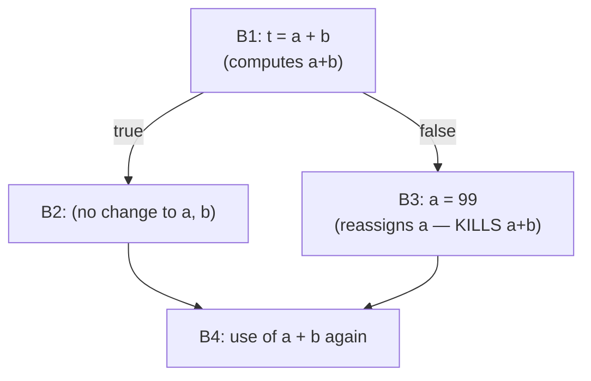

## Learning Objectives

- Define availability precisely: an expression is available at a point if every path reaching that point has already computed it, and none of its operands has been reassigned since.
- Instantiate the data-flow framework for available expressions: identify its lattice, its direction (forward, like reaching definitions), and — critically — its join operator (intersection, a genuine departure from the two previous analyses).
- Explain concretely why availability must use intersection rather than union, contrasting it directly with reaching definitions' union.
- Run the worklist algorithm on a small CFG with a branch, computing which expressions are available at a merge point.
- Connect this analysis forward to `common-subexpression-elimination`, the very next concept, which deletes exactly the recomputations this analysis certifies as safe to remove.

## Context & Motivation

`reaching-definitions` and `live-variable-analysis` were both MAY analyses — union at merge points, because "possibly true along some path" was the right notion of safety for each. Available expressions is this discipline's first MUST analysis: an expression is available at a point only if it was ALREADY computed along EVERY path reaching that point, with none of its operands reassigned since. Getting this MUST distinction right — intersection, not union, at merge points — is the entire point of this concept, and getting it wrong (using union by analogy with the previous two analyses) would make the optimization it enables, `common-subexpression-elimination`, unsound.

The intuition for why MUST is the correct choice here: deleting a recomputation and reusing an old result is only safe if that old result is GUARANTEED to already exist, on every possible path that could have led to this point — if even one path skipped the computation, reusing a stale or nonexistent result on that path would silently produce a wrong answer.

## Core Theory

### Instantiating the framework — intersection this time

```text
Lattice:      sets of expressions (e.g. "a + b", "c * d")
Direction:    FORWARD (an expression computed earlier can still be
              available later, following execution's natural direction)
Join:         INTERSECTION (an expression is available only if it's
              available along EVERY incoming path — a MUST analysis)
Transfer function for block B, given IN(B):
  GEN(B)  = expressions computed in B whose operands are not
            reassigned again later within B
  KILL(B) = expressions killed by B — any expression that USES a
            variable B reassigns (once that variable changes, the
            old computed value of any expression built from it is
            stale and no longer trustworthy)
  OUT(B) = GEN(B) ∪ (IN(B) - KILL(B))
```

The transfer function's SHAPE looks identical to reaching definitions' — GEN, minus KILL, unioned — but the MEET/JOIN at merge points is the crucial difference: reaching definitions unions incoming facts (may); available expressions INTERSECTS them (must).

### Why intersection, concretely



At `B4`, is `a + b` available? Along the path through `B2`, yes — `a+b` was computed in `B1` and never invalidated. Along the path through `B3`, no — `a` was reassigned, invalidating any earlier computation of `a+b`. Since there EXISTS a path (through `B3`) where `a+b` is NOT already correctly computed, it is UNSAFE to assume it's available at `B4` and skip recomputing it — using union here (as reaching definitions correctly does for its own, different question) would incorrectly report `a+b` as available, and `common-subexpression-elimination` would then unsoundly delete a computation that was genuinely needed on the path through `B3`.

## Worked Examples

### Example 1: an expression available on every path — safe to reuse

```text
B1: t1 = a + b
    if (c) {
B2:   x = 1;        ; doesn't touch a or b
    } else {
B3:   y = 2;        ; doesn't touch a or b either
    }
B4: t2 = a + b       ; is a+b available here?

OUT(B1) = {a+b}
OUT(B2) = IN(B2) - KILL(B2) ∪ GEN(B2) = {a+b} (nothing killed, nothing new)
OUT(B3) = {a+b} (same reasoning)

IN(B4) = OUT(B2) ∩ OUT(B3) = {a+b} ∩ {a+b} = {a+b}
  → a+b IS available at B4 on EVERY path — safe to reuse t1's value
    instead of recomputing, exactly the case common-subexpression-
    elimination (next concept) acts on.
```

### Example 2: an expression killed on one path — NOT safe to reuse

```text
B1: t1 = a + b
    if (c) {
B2:   a = 99;        ; KILLS a+b on this path
    } else {
B3:   y = 2;         ; a+b still available on this path
    }
B4: t2 = a + b        ; is a+b available here?

OUT(B2) = OUT(B1) - {a+b} (killed, since a is reassigned) = {}
OUT(B3) = OUT(B1) = {a+b}

IN(B4) = OUT(B2) ∩ OUT(B3) = {} ∩ {a+b} = {}
  → a+b is NOT available at B4 — the intersection correctly reports
    this, because ONE path (through B2) invalidated it; recomputing
    t2 = a + b at B4 is genuinely necessary here.
```

### Example 3: contrasting the same CFG shape against reaching definitions

```text
Same diamond shape as Example 2, but asking reaching-definitions'
question instead: "which definitions of a reach B4?"

  Definition of a in B2 (a=99) reaches B4 along the B2 path.
  The ORIGINAL a (from before B1, whatever defined it) reaches B4
    along the B3 path (a is untouched there).
  reaching-definitions correctly UNIONS both: {a=99, whatever-earlier-def}
    — both are possibly the source of a's current value at B4.

This is the same diamond CFG shape, but the two analyses correctly
use OPPOSITE join operators (union vs. intersection) because they are
answering genuinely different kinds of questions — "could possibly be
true" versus "is guaranteed to be true" — the exact distinction this
concept is built to make precise.
```

## Common Misconceptions & Pitfalls

- **"Since available expressions and reaching definitions have the same GEN/KILL transfer-function shape, they must use the same join operator too."** They deliberately do not — the transfer function's shape (GEN ∪ (IN − KILL)) is coincidentally similar, but the MEET/JOIN choice at merge points is independent of that shape and depends entirely on whether the analysis needs a may-guarantee (union) or a must-guarantee (intersection); getting this backward is the single most common way to implement this analysis incorrectly.
- **"An expression's availability only depends on whether it was computed before, never on its operands changing afterward."** KILL(B) exists specifically because an expression built from operands that get reassigned is no longer trustworthy — Example 2's `a+b` is invalidated the moment `a` changes, even though the EXPRESSION `a+b` itself was never directly reassigned.
- **"Available expressions and common subexpression elimination are the same thing, just under two different names."** They are related but distinct — available expressions is the ANALYSIS that determines which recomputations are provably safe to skip; `common-subexpression-elimination`, the next concept, is the OPTIMIZATION (the actual code rewrite) that acts on the analysis's findings; the analysis could exist and be computed without ever performing the rewrite.
- **"A MUST analysis is always 'more correct' than a MAY analysis, so it should be preferred whenever possible."** Neither is more correct in general — each analysis is defined by the SPECIFIC safety property its downstream optimization needs; reaching definitions genuinely needs a may-guarantee (any possible source counts), while available expressions genuinely needs a must-guarantee (only a guaranteed-safe reuse counts) — the correct choice is dictated by the question being asked, not a general preference.

## Summary

Available expressions is a forward, MUST analysis — the first in this discipline to use intersection rather than union at merge points — determining that an expression is available at a point only if every incoming path has already computed it, with none of its operands reassigned since, via the same GEN/KILL transfer-function shape as reaching definitions but a fundamentally different (and fundamentally necessary) join operator. This distinction between may (union) and must (intersection) analyses is the single most important lesson this concept adds to the generic framework, and getting it right is precisely what keeps the very next concept, `common-subexpression-elimination`, sound: it deletes only the recomputations this analysis certifies as guaranteed-safe to skip, on every possible path. With all three data-flow analyses in place — reaching definitions, live variables, available expressions — the discipline now turns to the Optimization cluster proper, where each of these analyses becomes the concrete justification for a specific, real code rewrite.

## Documentation Links

- [Cooper & Torczon — Engineering a Compiler (companion site)](https://shop.elsevier.com/books/book-companion/9780120884780) — textbook presenting available expressions as the canonical MUST analysis, contrasted directly with the MAY analyses (reaching definitions, liveness) covered alongside it.
- [Stanford CS143 — Compilers](http://web.stanford.edu/class/cs143/) — optimization material using available expressions as the analysis directly underlying common subexpression elimination.
