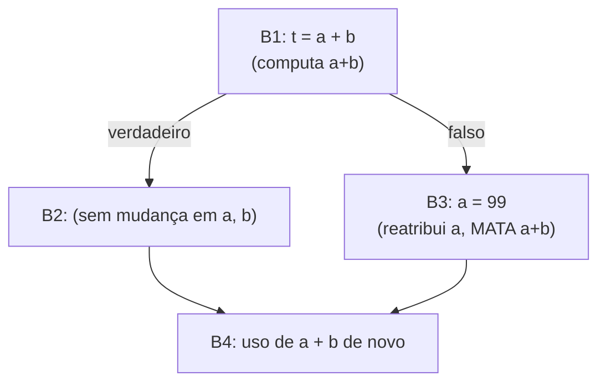

## Objetivos de Aprendizagem

- Definir a disponibilidade com precisão: uma expressão está disponível num ponto se todo caminho que alcança aquele ponto já a computou, e nenhum dos seus operandos foi reatribuído desde então.
- Instanciar o arcabouço de fluxo de dados para expressões disponíveis: identificar o seu reticulado, a sua direção (direta, como as definições que alcançam) e, criticamente, o seu operador de junção (interseção, uma partida genuína das duas análises anteriores).
- Explicar concretamente por que a disponibilidade precisa usar interseção em vez de união, contrastando-a diretamente com a união das definições que alcançam.
- Rodar o algoritmo de lista de trabalho num pequeno CFG com um desvio, computando quais expressões estão disponíveis num ponto de junção.
- Conectar esta análise adiante a `common-subexpression-elimination`, o próprio conceito seguinte, que deleta exatamente as recomputações que esta análise certifica como seguras de remover.

## Contexto e Motivação

`reaching-definitions` e `live-variable-analysis` foram ambas análises MAY, união nos pontos de junção, porque "possivelmente verdadeiro ao longo de algum caminho" era a noção certa de segurança para cada uma. Expressões disponíveis é a primeira análise MUST desta disciplina: uma expressão está disponível num ponto só se foi JÁ computada ao longo de TODO caminho que alcança aquele ponto, sem nenhum dos seus operandos reatribuído desde então. Acertar essa distinção MUST, interseção, não união, nos pontos de junção, é o ponto inteiro deste conceito, e errá-la (usar união por analogia com as duas análises anteriores) tornaria a otimização que ela viabiliza, `common-subexpression-elimination`, incorreta.

A intuição de por que MUST é a escolha correta aqui: deletar uma recomputação e reusar um resultado antigo só é seguro se esse resultado antigo tiver GARANTIA de já existir, em todo caminho possível que poderia ter levado a este ponto. Se mesmo um caminho pulou a computação, reusar um resultado obsoleto ou inexistente nesse caminho produziria silenciosamente uma resposta errada.

## Teoria Central

### Instanciar o arcabouço, interseção desta vez

```text
Reticulado:   conjuntos de expressões (ex.: "a + b", "c * d")
Direção:      DIRETA (uma expressão computada antes ainda pode estar
              disponível depois, seguindo a direção natural da execução)
Junção:       INTERSEÇÃO (uma expressão está disponível só se estiver
              disponível ao longo de TODO caminho de entrada, uma análise MUST)
Função de transferência para o bloco B, dado IN(B):
  GEN(B)  = expressões computadas em B cujos operandos não são
            reatribuídos de novo mais tarde dentro de B
  KILL(B) = expressões mortas por B, qualquer expressão que USA uma
            variável que B reatribui (uma vez que essa variável muda, o
            valor antigo computado de qualquer expressão construída a partir dela
            está obsoleto e não é mais confiável)
  OUT(B) = GEN(B) ∪ (IN(B) - KILL(B))
```

O FORMATO da função de transferência parece idêntico ao das definições que alcançam, GEN, menos KILL, unido, mas o ENCONTRO/JUNÇÃO nos pontos de junção é a diferença crucial: as definições que alcançam unem (union) os fatos de entrada (may); as expressões disponíveis os INTERSECTAM (must).

### Por que interseção, concretamente



Em `B4`, `a + b` está disponível? Ao longo do caminho por `B2`, sim, `a+b` foi computada em `B1` e nunca invalidada. Ao longo do caminho por `B3`, não, `a` foi reatribuída, invalidando qualquer computação anterior de `a+b`. Como EXISTE um caminho (por `B3`) onde `a+b` NÃO está já corretamente computada, é INSEGURO assumir que ela está disponível em `B4` e pular a sua recomputação. Usar união aqui (como as definições que alcançam corretamente fazem para a sua própria pergunta, diferente) reportaria incorretamente `a+b` como disponível, e `common-subexpression-elimination` então deletaria de forma incorreta uma computação que era genuinamente necessária no caminho por `B3`.

## Exemplos Resolvidos

### Exemplo 1: uma expressão disponível em todo caminho, segura de reusar

```text
B1: t1 = a + b
    if (c) {
B2:   x = 1;        ; não toca em a nem b
    } else {
B3:   y = 2;        ; também não toca em a nem b
    }
B4: t2 = a + b       ; a+b está disponível aqui?

OUT(B1) = {a+b}
OUT(B2) = IN(B2) - KILL(B2) ∪ GEN(B2) = {a+b} (nada morto, nada novo)
OUT(B3) = {a+b} (mesmo raciocínio)

IN(B4) = OUT(B2) ∩ OUT(B3) = {a+b} ∩ {a+b} = {a+b}
  → a+b ESTÁ disponível em B4 em TODO caminho, seguro de reusar o valor
    de t1 em vez de recomputar, exatamente o caso sobre o qual a
    eliminação de subexpressões comuns (conceito seguinte) atua.
```

### Exemplo 2: uma expressão morta num caminho, NÃO segura de reusar

```text
B1: t1 = a + b
    if (c) {
B2:   a = 99;        ; MATA a+b neste caminho
    } else {
B3:   y = 2;         ; a+b ainda disponível neste caminho
    }
B4: t2 = a + b        ; a+b está disponível aqui?

OUT(B2) = OUT(B1) - {a+b} (morta, já que a é reatribuída) = {}
OUT(B3) = OUT(B1) = {a+b}

IN(B4) = OUT(B2) ∩ OUT(B3) = {} ∩ {a+b} = {}
  → a+b NÃO está disponível em B4, a interseção reporta isso
    corretamente, porque UM caminho (por B2) a invalidou; recomputar
    t2 = a + b em B4 é genuinamente necessário aqui.
```

### Exemplo 3: contrastar o mesmo formato de CFG com as definições que alcançam

```text
Mesmo formato de diamante do Exemplo 2, mas fazendo a pergunta das
definições que alcançam em vez disso: "quais definições de a alcançam B4?"

  A definição de a em B2 (a=99) alcança B4 ao longo do caminho B2.
  O a ORIGINAL (de antes de B1, seja lá o que o definiu) alcança B4
    ao longo do caminho B3 (a fica intocada ali).
  as definições que alcançam corretamente UNEM ambas: {a=99, def-anterior-qualquer}
    , ambas são possivelmente a fonte do valor atual de a em B4.

Esse é o mesmo formato de CFG em diamante, mas as duas análises corretamente
usam operadores de junção OPOSTOS (união vs. interseção) porque estão
respondendo a tipos genuinamente diferentes de perguntas, "poderia possivelmente ser
verdadeiro" versus "tem garantia de ser verdadeiro", a exata distinção que este
conceito é construído para tornar precisa.
```

## Equívocos Comuns e Armadilhas

- **"Como as expressões disponíveis e as definições que alcançam têm o mesmo formato de função de transferência GEN/KILL, elas devem usar o mesmo operador de junção também."** Deliberadamente não usam, o formato da função de transferência (GEN ∪ (IN − KILL)) é coincidentemente semelhante, mas a escolha de ENCONTRO/JUNÇÃO nos pontos de junção é independente desse formato e depende inteiramente de se a análise precisa de uma garantia may (união) ou de uma garantia must (interseção); inverter isso é a forma individual mais comum de implementar esta análise incorretamente.
- **"A disponibilidade de uma expressão só depende de se ela foi computada antes, nunca de os seus operandos mudarem depois."** KILL(B) existe especificamente porque uma expressão construída a partir de operandos que são reatribuídos não é mais confiável, o `a+b` do Exemplo 2 é invalidado no momento em que `a` muda, mesmo que a própria EXPRESSÃO `a+b` nunca tenha sido diretamente reatribuída.
- **"Expressões disponíveis e eliminação de subexpressões comuns são a mesma coisa, só sob dois nomes diferentes."** Elas são relacionadas, mas distintas, expressões disponíveis é a ANÁLISE que determina quais recomputações são comprovadamente seguras de pular; `common-subexpression-elimination`, o conceito seguinte, é a OTIMIZAÇÃO (a reescrita de código de fato) que atua sobre as descobertas da análise; a análise poderia existir e ser computada sem jamais realizar a reescrita.
- **"Uma análise MUST é sempre 'mais correta' do que uma análise MAY, então ela deveria ser preferida sempre que possível."** Nenhuma é mais correta em geral, cada análise é definida pela propriedade de segurança ESPECÍFICA de que a sua otimização a jusante precisa; as definições que alcançam genuinamente precisam de uma garantia may (qualquer fonte possível conta), enquanto as expressões disponíveis genuinamente precisam de uma garantia must (só um reuso com segurança garantida conta), a escolha correta é ditada pela pergunta sendo feita, e não por uma preferência geral.

## Resumo

Expressões disponíveis é uma análise direta, MUST, a primeira desta disciplina a usar interseção em vez de união nos pontos de junção, determinando que uma expressão está disponível num ponto só se todo caminho de entrada já a computou, sem nenhum dos seus operandos reatribuído desde então, por meio do mesmo formato de função de transferência GEN/KILL das definições que alcançam, mas um operador de junção fundamentalmente diferente (e fundamentalmente necessário). Essa distinção entre análises may (união) e must (interseção) é a lição individual mais importante que este conceito acrescenta ao arcabouço genérico, e acertá-la é precisamente o que mantém o próprio conceito seguinte, `common-subexpression-elimination`, correto: ele deleta só as recomputações que esta análise certifica como seguras garantidas de pular, em todo caminho possível. Com as três análises de fluxo de dados em vigor, definições que alcançam, variáveis vivas, expressões disponíveis, a disciplina agora se volta para o agrupamento de Otimização propriamente dito, onde cada uma dessas análises se torna a justificativa concreta para uma reescrita de código específica e real.

## Documentation Links

- [Cooper & Torczon — Engineering a Compiler (companion site)](https://shop.elsevier.com/books/book-companion/9780120884780): livro-texto que apresenta as expressões disponíveis como a análise MUST canônica, contrastada diretamente com as análises MAY (definições que alcançam, vivacidade) cobertas ao seu lado.
- [Stanford CS143 — Compilers](http://web.stanford.edu/class/cs143/): material de otimização que usa as expressões disponíveis como a análise que diretamente fundamenta a eliminação de subexpressões comuns.
