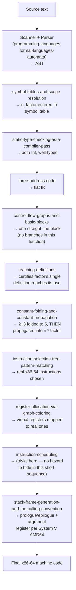

## Learning Objectives

- Trace one small, concrete source function through every stage this discipline covers, in order, naming the specific concept responsible for each step.
- Show at least one optimization (constant folding, enabled by reaching definitions) actually firing on real IR during the trace, not just described abstractly.
- Show the final register-allocated, scheduled x86-64 output, explicitly naming the `c-and-assembly` concepts (registers, calling convention, stack frame) the trace lands on.
- Explain, in one place, exactly where this discipline's boundary sits relative to `programming-languages`, `formal-languages-automata`, `c-and-assembly`, and `computer-architecture` — what each contributed to this one trace.
- State explicitly what a real production compiler would do differently or additionally at scale (more aggressive optimization, real SSA-based passes, a more sophisticated register allocator) — an honest scope acknowledgment, not a claim of completeness.

## Context & Motivation

Every concept in this discipline covered one stage of a real compiler in isolation. This capstone puts them all back together, the way `capstone-assembling-a-complete-tree-walking-interpreter` did for `programming-languages` and `capstone-from-c-source-to-a-traced-function-call` did for `c-and-assembly` — one small, concrete piece of source code, followed step by step, front to back, through the entire pipeline this discipline built, with every stage named explicitly.

The source chosen is deliberately small enough to trace completely by hand, but rich enough to exercise a real optimization opportunity and a real calling-convention-driven code generation, so nothing in the trace is hollow or hand-waved.

## Core Theory

### The source, and the full pipeline it passes through

```c
int scale(int n) {
  int factor = 2 + 3;      // deliberately foldable at compile time
  return n * factor;
}
```



### Step by step, with real intermediate artifacts

**AST** (front end, reused from `programming-languages`/`formal-languages-automata`, not re-derived here):

```text
function scale(n: Int) -> Int {
  factor = 2 + 3
  return n * factor
}
```

**Semantic analysis** (this discipline): `symbol-tables-and-scope-resolution` enters `n` (parameter) and `factor` (local) into a symbol table; `static-type-checking-as-a-compiler-pass` confirms `2 + 3` is `Int`, `n * factor` is `Int`, and the declared return type `Int` matches.

**Three-address code** (`three-address-code`):

```text
t1 = 2 + 3
factor = t1
t2 = n * factor
return t2
```

**Control-flow graph** (`control-flow-graphs-and-basic-blocks`): a single basic block — no branches at all in this function, so the CFG is trivially one node with no outgoing edges besides the implicit return.

**Optimization, actually firing** (`reaching-definitions` + `constant-folding-and-constant-propagation`): `reaching-definitions` certifies exactly one definition of `factor` reaches its use in `t2 = n * factor` (no branch, no other assignment). `2 + 3` is folded to `5` directly (both operands already literal). `factor`'s single reaching definition, now a literal constant, is propagated:

```text
factor = 5          ; folded
t2 = n * 5           ; propagated — factor's only reaching def substituted
return t2
```

**Instruction selection** (`instruction-selection-tree-pattern-matching`), using tiles matching real x86-64 instructions from `c-and-assembly`'s `x86-64-registers-and-data-movement` and `arithmetic-and-logical-instructions`:

```text
imull $5, %vreg_n, %vreg_t2     ; a single multiply-by-immediate
                                   instruction covers this IR step
```

**Register allocation** (`register-allocation-via-graph-coloring`): `%vreg_n` and `%vreg_t2` are never simultaneously live with anything else in this tiny function — no interference at all, both allocated directly to real registers, no spill needed:

```text
imull $5, %edi, %eax    ; n arrives in %edi per the calling
                          convention; result placed directly in
                          %eax, the register that convention
                          designates for a function's return value
```

**Instruction scheduling** (`instruction-scheduling`): with only one instruction in the body, there is no load-use hazard to hide and nothing to reorder — a real, honest acknowledgment that this pass has genuinely no work to do on an example this small.

**Stack frame and calling convention** (`stack-frame-generation-and-the-calling-convention`, landing directly on `c-and-assembly`'s `stack-frames-prologue-and-epilogue` and `the-system-v-amd64-calling-convention`):

```text
scale:
  pushq %rbp
  movq  %rsp, %rbp
  ; no locals need stack space — factor was fully folded away
  ; and never needed its own memory slot at all
  imull $5, %edi, %eax
  leave
  ret
```

## Worked Examples

### Example 1: naming which discipline is responsible for each artifact in the trace

```text
"function scale(n: Int) -> Int { ... }" as TEXT
  → programming-languages (scanning) + formal-languages-automata (grammar)

The parsed AST's tree SHAPE
  → programming-languages (parsing-expressions-into-an-abstract-syntax-tree)

"factor is declared as an Int local, n as an Int parameter"
  → THIS discipline (symbol-tables-and-scope-resolution)

"2 + 3 : Int, n * factor : Int, return type matches"
  → THIS discipline (static-type-checking-as-a-compiler-pass)

"t1 = 2 + 3; factor = t1; t2 = n * factor; return t2"
  → THIS discipline (three-address-code)

"factor = 5; t2 = n * 5" (the fold + propagation)
  → THIS discipline (reaching-definitions +
    constant-folding-and-constant-propagation)

"imull $5, %edi, %eax" (the actual instruction)
  → THIS discipline (instruction-selection-tree-pattern-matching)
    choosing among instructions c-and-assembly already covers

"pushq %rbp; movq %rsp, %rbp; ... leave; ret"
  → THIS discipline (stack-frame-generation-and-the-calling-convention)
    automating the exact pattern c-and-assembly covered by hand
```

### Example 2: what changes if `factor` were NOT foldable

```text
int scale(int n, int userFactor) {
  int factor = userFactor + 1;   // NOT a compile-time constant —
  return n * factor;                userFactor's value is unknown
                                     until the function actually runs
}

reaching-definitions still certifies exactly ONE definition of factor
reaches its use — but constant-folding-and-constant-propagation has
NOTHING to fold, since userFactor isn't a literal. The multiply must
be generated as a genuine runtime instruction operating on two real
register values, not an immediate:

  imull %esi, %edi     ; both n and userFactor arrive in registers
                          per the calling convention (2nd int arg
                          in %esi) — a real multiply, not a
                          multiply-by-constant, since no fold applied
```

### Example 3: what a real, production-scale compiler would add beyond this trace

```text
This capstone deliberately used a function small enough to trace
completely by hand — a real production compiler (GCC, LLVM/Clang)
compiling even this same tiny function would additionally:
  - construct genuine SSA form (static-single-assignment-form) even
    for this trivial case, as part of a uniform internal pipeline
    applied to every function regardless of size;
  - run many MORE optimization passes than just constant folding
    (inlining this function directly into its caller is a very
    realistic further step, entirely plausible for a function this
    small, though inlining itself was not covered as its own concept
    in this discipline — a genuine, acknowledged scope boundary);
  - use a full, cost-based instruction selector (not just maximal
    munch) and a production-grade register allocator handling many
    more registers and far more complex interference patterns across
    a real, much larger function body.
This trace shows every MECHANISM this discipline covers working
correctly end to end — not a claim that it matches a production
compiler's full sophistication at scale.
```

## Common Misconceptions & Pitfalls

- **"A capstone this small doesn't really exercise the discipline's harder material (data-flow analysis, optimization)."** It deliberately does — `reaching-definitions` genuinely runs (certifying `factor`'s single definition) and `constant-folding-and-constant-propagation` genuinely fires (folding `2+3` and propagating the result), not just described in the abstract; the function's small size makes the trace completable by hand, not the analyses trivial to skip.
- **"Since this function has no branches, `control-flow-graphs-and-basic-blocks` and the data-flow framework don't really apply here."** They apply exactly as designed — a straight-line function is simply the SIMPLEST possible CFG (one block, no edges), and every data-flow fact in this trace is still computed via the same GEN/KILL/join machinery; it's just that the simplest possible input produces the simplest possible (still entirely real) computation.
- **"This trace shows everything a real compiler does — nothing more is needed in practice."** Example 3 states honestly that a production compiler goes considerably further (real SSA construction even on trivial code, many more optimization passes, inlining, sophisticated cost-based instruction selection) — this capstone demonstrates every MECHANISM covered working correctly, not a claim of matching production-scale sophistication.
- **"Instruction scheduling having 'nothing to do' in this example means the concept was unnecessary to cover."** A single-instruction function is exactly the honest edge case where a real pass legitimately does no work — the concept remains necessary for the vast majority of real functions with multiple instructions and genuine load-use hazards to hide, exactly as `instruction-scheduling`'s own worked examples showed on slightly larger sequences.

## Summary

This capstone traced `int scale(int n) { int factor = 2 + 3; return n * factor; }` through every stage this discipline covers: semantic analysis (symbol table, static type checking) on the AST already built by `programming-languages` and `formal-languages-automata`; lowering to three-address code and a trivial one-block control-flow graph; a real optimization (`reaching-definitions` certifying a single reaching definition, `constant-folding-and-constant-propagation` folding and substituting it) actually firing on that IR; and code generation (instruction selection, register allocation, scheduling, and calling-convention-driven frame generation) landing directly on the concrete x86-64 material `c-and-assembly` already established. Every stage was named explicitly, and the trace closed with an honest acknowledgment of what a production-scale compiler does beyond what a hand-traceable example can show. This is where `software-distributed/compilers` ends and hands off cleanly to what already exists: the front end this discipline never re-derived (`programming-languages`, `formal-languages-automata`), the target machine this discipline's back end targets (`c-and-assembly`, `computer-architecture`), and the undecidability result (`computability-complexity`) that explains why every optimization along the way was necessarily conservative.

## Documentation Links

- [Stanford CS143 — Compilers](http://web.stanford.edu/class/cs143/) — course whose full pipeline (semantic analysis through code generation) this capstone traces end to end on one concrete example.
- [MIT 6.035 — Computer Language Engineering, Calendar](https://ocw.mit.edu/courses/6-035-computer-language-engineering-sma-5502-fall-2005/pages/calendar/) — course structuring its own compiler project around the identical five-segment pipeline (scanner/parser, semantic checker, code generator, data-flow optimizer, instruction optimizer) this capstone closes out.
