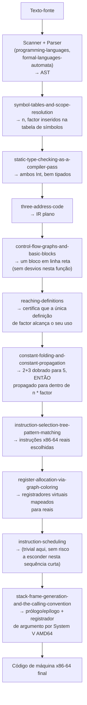

## Objetivos de Aprendizagem

- Rastrear uma pequena e concreta função de origem por cada estágio que esta disciplina cobre, em ordem, nomeando o conceito específico responsável por cada passo.
- Mostrar pelo menos uma otimização (dobra de constante, viabilizada pelas definições que alcançam) de fato disparando sobre IR real durante o rastreamento, e não só descrita de forma abstrata.
- Mostrar a saída x86-64 final, com registradores alocados e escalonada, nomeando explicitamente os conceitos de `c-and-assembly` (registradores, convenção de chamada, quadro de pilha) sobre os quais o rastreamento aterrissa.
- Explicar, num só lugar, exatamente onde fica a fronteira desta disciplina em relação a `programming-languages`, `formal-languages-automata`, `c-and-assembly` e `computer-architecture`, o que cada uma contribuiu para este único rastreamento.
- Enunciar explicitamente o que um compilador de produção real faria de diferente ou adicionalmente em escala (otimização mais agressiva, passagens reais baseadas em SSA, um alocador de registradores mais sofisticado), um reconhecimento honesto de escopo, e não uma alegação de completude.

## Contexto e Motivação

Cada conceito nesta disciplina cobriu um estágio de um compilador real isoladamente. Este capstone os junta todos de volta, do jeito que `capstone-assembling-a-complete-tree-walking-interpreter` fez para `programming-languages` e `capstone-from-c-source-to-a-traced-function-call` fez para `c-and-assembly`, um pequeno e concreto pedaço de código-fonte, seguido passo a passo, da frente ao fim, por todo o pipeline que esta disciplina construiu, com cada estágio nomeado explicitamente.

A origem escolhida é deliberadamente pequena o bastante para ser rastreada completamente à mão, mas rica o bastante para exercitar uma oportunidade de otimização real e uma geração de código real guiada pela convenção de chamada, de modo que nada no rastreamento é oco ou passado por cima.

## Teoria Central

### A origem, e o pipeline completo pelo qual ela passa

```c
int scale(int n) {
  int factor = 2 + 3;      // deliberadamente dobrável em tempo de compilação
  return n * factor;
}
```



### Passo a passo, com artefatos intermediários reais

**AST** (front end, reaproveitado de `programming-languages`/`formal-languages-automata`, não rederivado aqui):

```text
function scale(n: Int) -> Int {
  factor = 2 + 3
  return n * factor
}
```

**Análise semântica** (esta disciplina): `symbol-tables-and-scope-resolution` insere `n` (parâmetro) e `factor` (local) numa tabela de símbolos; `static-type-checking-as-a-compiler-pass` confirma que `2 + 3` é `Int`, `n * factor` é `Int`, e o tipo de retorno declarado `Int` bate.

**Código de três endereços** (`three-address-code`):

```text
t1 = 2 + 3
factor = t1
t2 = n * factor
return t2
```

**Grafo de fluxo de controle** (`control-flow-graphs-and-basic-blocks`): um único bloco básico, sem desvios de forma alguma nesta função, então o CFG é trivialmente um nó com nenhuma aresta de saída além do retorno implícito.

**Otimização, de fato disparando** (`reaching-definitions` + `constant-folding-and-constant-propagation`): `reaching-definitions` certifica que exatamente uma definição de `factor` alcança o seu uso em `t2 = n * factor` (sem desvio, sem outra atribuição). `2 + 3` é dobrado para `5` diretamente (ambos os operandos já literais). A única definição que alcança de `factor`, agora uma constante literal, é propagada:

```text
factor = 5          ; dobrado
t2 = n * 5           ; propagado, a única def que alcança de factor substituída
return t2
```

**Seleção de instruções** (`instruction-selection-tree-pattern-matching`), usando ladrilhos que correspondem a instruções x86-64 reais de `x86-64-registers-and-data-movement` e `arithmetic-and-logical-instructions` de `c-and-assembly`:

```text
imull $5, %vreg_n, %vreg_t2     ; uma única instrução de multiplicar-por-imediato
                                   cobre este passo de IR
```

**Alocação de registradores** (`register-allocation-via-graph-coloring`): `%vreg_n` e `%vreg_t2` nunca estão simultaneamente vivos com qualquer outra coisa nesta função minúscula, sem interferência de forma alguma, ambos alocados diretamente a registradores reais, sem spill necessário:

```text
imull $5, %edi, %eax    ; n chega em %edi por convenção de
                          chamada; resultado colocado diretamente em
                          %eax, o registrador que a convenção
                          designa para o valor de retorno de uma função
```

**Escalonamento de instruções** (`instruction-scheduling`): com só uma instrução no corpo, não há risco de uso-de-carga a esconder e nada a reordenar, um reconhecimento real e honesto de que esta passagem genuinamente não tem trabalho a fazer num exemplo tão pequeno.

**Quadro de pilha e convenção de chamada** (`stack-frame-generation-and-the-calling-convention`, aterrissando diretamente em `stack-frames-prologue-and-epilogue` e `the-system-v-amd64-calling-convention` de `c-and-assembly`):

```text
scale:
  pushq %rbp
  movq  %rsp, %rbp
  ; nenhum local precisa de espaço de pilha, factor foi totalmente dobrado
  ; e nunca precisou do seu próprio slot de memória de forma alguma
  imull $5, %edi, %eax
  leave
  ret
```

## Exemplos Resolvidos

### Exemplo 1: nomear qual disciplina é responsável por cada artefato no rastreamento

```text
"function scale(n: Int) -> Int { ... }" como TEXTO
  → programming-languages (scanning) + formal-languages-automata (gramática)

O FORMATO de árvore do AST analisado
  → programming-languages (parsing-expressions-into-an-abstract-syntax-tree)

"factor é declarado como um local Int, n como um parâmetro Int"
  → ESTA disciplina (symbol-tables-and-scope-resolution)

"2 + 3 : Int, n * factor : Int, o tipo de retorno bate"
  → ESTA disciplina (static-type-checking-as-a-compiler-pass)

"t1 = 2 + 3; factor = t1; t2 = n * factor; return t2"
  → ESTA disciplina (three-address-code)

"factor = 5; t2 = n * 5" (a dobra + propagação)
  → ESTA disciplina (reaching-definitions +
    constant-folding-and-constant-propagation)

"imull $5, %edi, %eax" (a instrução de fato)
  → ESTA disciplina (instruction-selection-tree-pattern-matching)
    escolhendo entre instruções que c-and-assembly já cobre

"pushq %rbp; movq %rsp, %rbp; ... leave; ret"
  → ESTA disciplina (stack-frame-generation-and-the-calling-convention)
    automatizando o exato padrão que c-and-assembly cobriu à mão
```

### Exemplo 2: o que muda se `factor` NÃO fosse dobrável

```text
int scale(int n, int userFactor) {
  int factor = userFactor + 1;   // NÃO uma constante de tempo de compilação,
  return n * factor;                o valor de userFactor é desconhecido
                                     até a função de fato rodar
}

reaching-definitions ainda certifica que exatamente UMA definição de factor
alcança o seu uso, mas constant-folding-and-constant-propagation não tem
NADA a dobrar, já que userFactor não é um literal. A multiplicação tem de
ser gerada como uma instrução genuína de tempo de execução operando sobre dois
valores de registrador reais, e não um imediato:

  imull %esi, %edi     ; tanto n quanto userFactor chegam em registradores
                          por convenção de chamada (2º arg int
                          em %esi), uma multiplicação real, e não uma
                          multiplicação-por-constante, já que nenhuma dobra se aplicou
```

### Exemplo 3: o que um compilador real de escala de produção acrescentaria além deste rastreamento

```text
Este capstone usou deliberadamente uma função pequena o bastante para ser rastreada
completamente à mão, um compilador real de produção (GCC, LLVM/Clang)
compilando mesmo esta mesma função minúscula adicionalmente:
  - construiria forma SSA genuína (static-single-assignment-form) mesmo
    para este caso trivial, como parte de um pipeline interno uniforme
    aplicado a toda função independentemente do tamanho;
  - rodaria MUITO mais passagens de otimização do que só dobra de constante
    (inlinar esta função diretamente no seu chamador é um passo adicional
    muito realista, inteiramente plausível para uma função tão
    pequena, embora o inlining em si não tenha sido coberto como seu próprio conceito
    nesta disciplina, uma fronteira de escopo genuína e reconhecida);
  - usaria um seletor de instruções completo e baseado em custo (não só maximal
    munch) e um alocador de registradores de nível de produção lidando com muitos
    mais registradores e padrões de interferência muito mais complexos ao longo
    de um corpo de função real e bem maior.
Este rastreamento mostra todo MECANISMO que esta disciplina cobre funcionando
corretamente de ponta a ponta, e não uma alegação de que ele corresponde à
sofisticação completa de um compilador de produção em escala.
```

## Equívocos Comuns e Armadilhas

- **"Um capstone tão pequeno não exercita de fato o material mais difícil da disciplina (análise de fluxo de dados, otimização)."** Ele deliberadamente o faz, `reaching-definitions` genuinamente roda (certificando a única definição de `factor`) e `constant-folding-and-constant-propagation` genuinamente dispara (dobrando `2+3` e propagando o resultado), não só descrito de forma abstrata; o tamanho pequeno da função torna o rastreamento completável à mão, e não as análises triviais de pular.
- **"Como esta função não tem desvios, `control-flow-graphs-and-basic-blocks` e o arcabouço de fluxo de dados não se aplicam de fato aqui."** Eles se aplicam exatamente como projetado, uma função em linha reta é simplesmente o CFG mais SIMPLES possível (um bloco, nenhuma aresta), e todo fato de fluxo de dados neste rastreamento ainda é computado pela mesma maquinaria GEN/KILL/junção; só acontece que a entrada mais simples possível produz a computação mais simples possível (ainda inteiramente real).
- **"Este rastreamento mostra tudo o que um compilador real faz, nada mais é necessário na prática."** O Exemplo 3 enuncia honestamente que um compilador de produção vai consideravelmente mais longe (construção real de SSA mesmo em código trivial, muito mais passagens de otimização, inlining, seleção de instruções sofisticada baseada em custo), este capstone demonstra todo MECANISMO coberto funcionando corretamente, e não uma alegação de corresponder à sofisticação de escala de produção.
- **"O escalonamento de instruções não ter 'nada a fazer' neste exemplo significa que o conceito era desnecessário de cobrir."** Uma função de instrução única é exatamente o caso de borda honesto onde uma passagem real legitimamente não faz trabalho, o conceito continua necessário para a vasta maioria das funções reais com múltiplas instruções e riscos genuínos de uso-de-carga a esconder, exatamente como os próprios exemplos resolvidos de `instruction-scheduling` mostraram em sequências um pouco maiores.

## Resumo

Este capstone rastreou `int scale(int n) { int factor = 2 + 3; return n * factor; }` por cada estágio que esta disciplina cobre: análise semântica (tabela de símbolos, checagem estática de tipos) sobre o AST já construído por `programming-languages` e `formal-languages-automata`; rebaixamento a código de três endereços e a um grafo de fluxo de controle trivial de um bloco; uma otimização real (`reaching-definitions` certificando uma única definição que alcança, `constant-folding-and-constant-propagation` dobrando-a e substituindo-a) de fato disparando sobre esse IR; e geração de código (seleção de instruções, alocação de registradores, escalonamento e geração de quadro guiada pela convenção de chamada) aterrissando diretamente no material x86-64 concreto que `c-and-assembly` já estabeleceu. Cada estágio foi nomeado explicitamente, e o rastreamento se encerrou com um reconhecimento honesto do que um compilador de escala de produção faz além do que um exemplo rastreável à mão pode mostrar. É aqui que `software-distributed/compilers` termina e passa o bastão de forma limpa para o que já existe: o front end que esta disciplina nunca rederivou (`programming-languages`, `formal-languages-automata`), a máquina-alvo que o back end desta disciplina mira (`c-and-assembly`, `computer-architecture`), e o resultado de indecidibilidade (`computability-complexity`) que explica por que toda otimização pelo caminho foi necessariamente conservadora.

## Documentation Links

- [Stanford CS143 — Compilers](http://web.stanford.edu/class/cs143/): curso cujo pipeline completo (análise semântica até geração de código) este capstone rastreia de ponta a ponta num exemplo concreto.
- [MIT 6.035 — Computer Language Engineering, Calendar](https://ocw.mit.edu/courses/6-035-computer-language-engineering-sma-5502-fall-2005/pages/calendar/): curso que estrutura o seu próprio projeto de compilador em torno do pipeline idêntico de cinco segmentos (scanner/parser, verificador semântico, gerador de código, otimizador de fluxo de dados, otimizador de instruções) que este capstone encerra.
