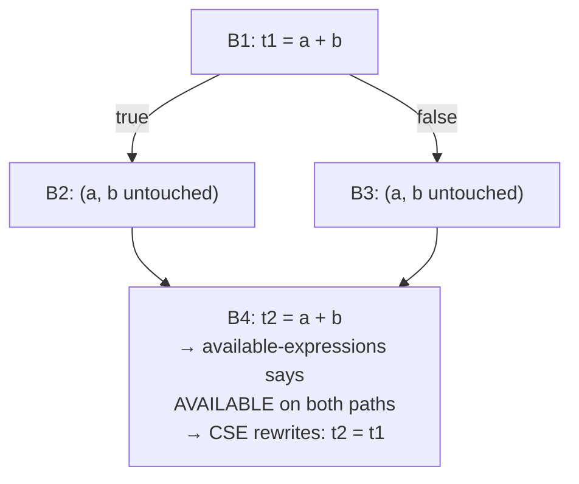

## Learning Objectives

- Explain exactly how common subexpression elimination (CSE) uses `available-expressions-analysis`'s findings to justify a rewrite.
- Apply CSE to a small piece of three-address code, replacing a redundant recomputation with a reference to an earlier temporary.
- Explain why CSE must never act where availability is not guaranteed on every path, using a concrete case where the optimization would be unsound if attempted anyway.
- Distinguish LOCAL CSE (within one basic block, needing no data-flow analysis at all) from GLOBAL CSE (across blocks, needing the full available-expressions analysis).
- Connect CSE's benefit concretely to real machine cost — an eliminated arithmetic instruction is one less instruction `instruction-scheduling` and `register-allocation-via-graph-coloring` even need to consider, later in this discipline.

## Context & Motivation

`available-expressions-analysis` computed, for every point in a program, exactly which expressions are GUARANTEED to already have been evaluated, on every possible path reaching that point, with none of their operands changed since. Common subexpression elimination is the direct, mechanical payoff of that analysis: wherever an expression is available, recomputing it is pure, provable waste — the exact same instruction has already run, its result is still valid, and the second computation can be replaced outright with a reference to the first one's result.

This is a genuinely conservative, always-safe optimization precisely because it only ever acts where the analysis has already certified safety with a MUST guarantee — this is exactly why `available-expressions-analysis` needed intersection, not union, at merge points: CSE can never be wrong about an expression being available, because acting incorrectly would mean substituting a stale or nonexistent value for a real computation.

## Core Theory

### The rewrite itself

```text
Before:                       After CSE:
  t1 = a + b                    t1 = a + b
  ... (a, b unchanged) ...      ... (a, b unchanged) ...
  t2 = a + b                    t2 = t1        ; reuse, don't recompute
```

The second computation of `a + b` is replaced by a simple copy of `t1` — a much cheaper operation than a fresh addition, and on many real architectures a copy can often be eliminated entirely during register allocation if `t1` and `t2` end up assigned to compatible locations.

### Local vs. global CSE

Within a SINGLE basic block, CSE requires no formal data-flow analysis at all — a block's instructions execute in a fixed, known sequence with no branching in the middle (exactly the "one entry, one exit" property from `control-flow-graphs-and-basic-blocks`), so simply scanning the block once, tracking which expressions have already been computed and are still valid, is sufficient:

```text
Local CSE, scanning one block top to bottom:
  t1 = a + b       ; record: "a+b" is now available, result in t1
  t2 = c * d       ; record: "c+d"... wait, this is c*d, different expr
  t3 = a + b       ; "a+b" already recorded and a,b unchanged → t3 = t1
```

GLOBAL CSE — recognizing a redundant computation across DIFFERENT basic blocks, possibly separated by a branch and a merge — is exactly where the full `available-expressions-analysis` becomes necessary, since knowing whether an expression is available at the START of some block requires knowing what happened on every path leading into it, a genuinely cross-block question local scanning cannot answer.



### Why CSE never needs to act "optimistically"

CSE is one of a small handful of optimizations that never has a "maybe, be careful" middle ground — either `available-expressions-analysis` certifies an expression as available at a point (every path guarantees it), in which case the rewrite is unconditionally safe, or it doesn't, in which case CSE simply does nothing at that point and leaves the recomputation exactly as it was. There is no partial or speculative version of this optimization to reason about.

## Worked Examples

### Example 1: local CSE within a single block

```text
Before:
  t1 = x * y
  t2 = x * y + 1
  t3 = x * y

After (scanning once, left to right):
  t1 = x * y
  t2 = t1 + 1        ; reused t1 instead of recomputing x*y
  t3 = t1              ; reused again
```

### Example 2: global CSE, safe because availability holds on every path (from `available-expressions-analysis`'s own Example 1)

```text
B1: t1 = a + b
    if (c) { x = 1; } else { y = 2; }   ; neither branch touches a or b
B4: t2 = a + b

available-expressions-analysis already established a+b IS available
at B4 on every path (neither branch invalidates it) → CSE rewrites:
B4: t2 = t1
```

### Example 3: correctly refusing to act where availability fails (from `available-expressions-analysis`'s own Example 2)

```text
B1: t1 = a + b
    if (c) { a = 99; } else { y = 2; }   ; ONE branch reassigns a
B4: t2 = a + b

available-expressions-analysis reports a+b is NOT available at B4
(the branch through B2 killed it) → CSE correctly does NOTHING here;
t2 = a + b is left as a genuine, necessary recomputation. Attempting
the rewrite anyway (t2 = t1) would silently compute the WRONG value
whenever the a=99 branch was actually taken at runtime — this is
exactly the unsoundness available-expressions-analysis's intersection
join was built specifically to prevent.
```

## Common Misconceptions & Pitfalls

- **"CSE can safely act on any two textually identical expressions in a function, regardless of what happens in between."** Only when `available-expressions-analysis` (or, within one block, a simple linear scan) certifies the expression is still valid at the second occurrence — Example 3 shows textually identical expressions (`a + b` appearing twice) where the rewrite would be unsound, because one path in between invalidated it.
- **"Local CSE and global CSE are the same algorithm, just applied at different scales."** Local CSE needs no formal data-flow analysis at all — a single linear scan of one basic block suffices, since there's no branching to reason about within it; global CSE genuinely requires the full iterative `available-expressions-analysis` to correctly handle expressions spanning multiple blocks and possible branches.
- **"Eliminating a redundant computation is always worth doing, unconditionally."** In almost every realistic case it is a pure win (fewer instructions, no correctness risk), but a genuinely pathological case exists in real compilers where holding onto `t1`'s value across a very long live range (to reuse it much later) can increase register pressure enough to force an otherwise-avoidable spill — a real tension with `register-allocation-via-graph-coloring`, though one CSE implementations do not typically need to resolve themselves, since a separate, later pass handles spilling if it becomes necessary.
- **"CSE is the same thing as constant folding, since both replace a computation with a simpler result."** They act under different justifications — constant folding replaces a computation with a compile-time-known literal value; CSE replaces a computation with a REFERENCE to an earlier, still-valid computation of the identical expression — a completely different analysis (`available-expressions-analysis` versus `reaching-definitions`) underlies each.

## Summary

Common subexpression elimination replaces a recomputation of an expression with a direct reference to an earlier computation's result, acting only where `available-expressions-analysis` has certified — with its intersection-based MUST guarantee — that the expression is guaranteed available on every path reaching the second occurrence. Within a single basic block this needs no formal analysis at all (a linear scan suffices); across blocks, the full data-flow analysis is what makes the rewrite provably safe rather than a guess. The next concept, `dead-code-elimination`, is the mirror-image optimization built on `live-variable-analysis` instead: rather than reusing a redundant computation, it deletes one outright, whenever liveness proves its result is never read at all.

## Documentation Links

- [Cooper & Torczon — Engineering a Compiler (companion site)](https://shop.elsevier.com/books/book-companion/9780120884780) — textbook presenting common subexpression elimination as the direct optimization consumer of available-expressions analysis.
- [Stanford CS143 — Compilers](http://web.stanford.edu/class/cs143/) — local and global optimization material distinguishing within-block versus cross-block redundancy elimination.
