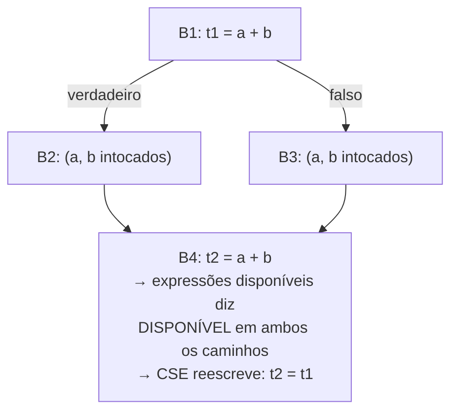

## Objetivos de Aprendizagem

- Explicar exatamente como a eliminação de subexpressões comuns (CSE) usa as descobertas de `available-expressions-analysis` para justificar uma reescrita.
- Aplicar a CSE a um pequeno pedaço de código de três endereços, substituindo uma recomputação redundante por uma referência a um temporário anterior.
- Explicar por que a CSE nunca deve atuar onde a disponibilidade não é garantida em todo caminho, usando um caso concreto onde a otimização seria incorreta se tentada mesmo assim.
- Distinguir a CSE LOCAL (dentro de um bloco básico, sem precisar de nenhuma análise de fluxo de dados) da CSE GLOBAL (entre blocos, precisando da análise completa de expressões disponíveis).
- Conectar o benefício da CSE concretamente ao custo real de máquina, uma instrução aritmética eliminada é uma instrução a menos que `instruction-scheduling` e `register-allocation-via-graph-coloring` sequer precisam considerar, mais adiante nesta disciplina.

## Contexto e Motivação

`available-expressions-analysis` computou, para cada ponto de um programa, exatamente quais expressões têm GARANTIA de já terem sido avaliadas, em todo caminho possível que alcança aquele ponto, sem nenhum dos seus operandos mudado desde então. A eliminação de subexpressões comuns é o retorno direto e mecânico dessa análise: onde quer que uma expressão esteja disponível, recomputá-la é um desperdício puro e comprovável, a exata mesma instrução já rodou, o seu resultado ainda é válido, e a segunda computação pode ser substituída de uma vez por uma referência ao resultado da primeira.

Essa é uma otimização genuinamente conservadora e sempre segura precisamente porque ela só atua onde a análise já certificou a segurança com uma garantia MUST, é exatamente por isso que `available-expressions-analysis` precisou de interseção, não de união, nos pontos de junção: a CSE nunca pode estar errada sobre uma expressão estar disponível, porque atuar incorretamente significaria substituir um valor obsoleto ou inexistente por uma computação real.

## Teoria Central

### A reescrita em si

```text
Antes:                        Depois da CSE:
  t1 = a + b                    t1 = a + b
  ... (a, b inalterados) ...    ... (a, b inalterados) ...
  t2 = a + b                    t2 = t1        ; reusa, não recomputa
```

A segunda computação de `a + b` é substituída por uma cópia simples de `t1`, uma operação muito mais barata do que uma adição nova, e em muitas arquiteturas reais uma cópia muitas vezes pode ser eliminada por completo durante a alocação de registradores se `t1` e `t2` acabarem atribuídos a locais compatíveis.

### CSE local vs. global

Dentro de um ÚNICO bloco básico, a CSE não exige nenhuma análise formal de fluxo de dados, as instruções de um bloco executam numa sequência fixa e conhecida sem desvio no meio (exatamente a propriedade de "uma entrada, uma saída" de `control-flow-graphs-and-basic-blocks`), então simplesmente varrer o bloco uma vez, rastreando quais expressões já foram computadas e ainda são válidas, é suficiente:

```text
CSE local, varrendo um bloco de cima para baixo:
  t1 = a + b       ; registra: "a+b" agora está disponível, resultado em t1
  t2 = c * d       ; registra: "c+d"... espere, isto é c*d, expr diferente
  t3 = a + b       ; "a+b" já registrado e a,b inalterados → t3 = t1
```

A CSE GLOBAL, reconhecer uma computação redundante entre blocos básicos DIFERENTES, possivelmente separados por um desvio e uma junção, é exatamente onde a `available-expressions-analysis` completa se torna necessária, já que saber se uma expressão está disponível no INÍCIO de algum bloco exige saber o que aconteceu em todo caminho que leva até ele, uma pergunta genuinamente entre blocos que a varredura local não consegue responder.



### Por que a CSE nunca precisa atuar "de forma otimista"

A CSE é uma de um pequeno punhado de otimizações que nunca tem um meio-termo de "talvez, com cuidado", ou `available-expressions-analysis` certifica uma expressão como disponível num ponto (todo caminho a garante), caso em que a reescrita é incondicionalmente segura, ou não certifica, caso em que a CSE simplesmente não faz nada naquele ponto e deixa a recomputação exatamente como estava. Não há uma versão parcial ou especulativa desta otimização sobre a qual raciocinar.

## Exemplos Resolvidos

### Exemplo 1: CSE local dentro de um único bloco

```text
Antes:
  t1 = x * y
  t2 = x * y + 1
  t3 = x * y

Depois (varrendo uma vez, da esquerda para a direita):
  t1 = x * y
  t2 = t1 + 1        ; reusou t1 em vez de recomputar x*y
  t3 = t1              ; reusou de novo
```

### Exemplo 2: CSE global, segura porque a disponibilidade se mantém em todo caminho (do próprio Exemplo 1 de `available-expressions-analysis`)

```text
B1: t1 = a + b
    if (c) { x = 1; } else { y = 2; }   ; nenhum ramo toca em a nem b
B4: t2 = a + b

available-expressions-analysis já estabeleceu que a+b ESTÁ disponível
em B4 em todo caminho (nenhum ramo a invalida) → CSE reescreve:
B4: t2 = t1
```

### Exemplo 3: recusar corretamente atuar onde a disponibilidade falha (do próprio Exemplo 2 de `available-expressions-analysis`)

```text
B1: t1 = a + b
    if (c) { a = 99; } else { y = 2; }   ; UM ramo reatribui a
B4: t2 = a + b

available-expressions-analysis reporta que a+b NÃO está disponível em B4
(o ramo por B2 a matou) → CSE corretamente NÃO faz nada aqui;
t2 = a + b é deixado como uma recomputação genuína e necessária. Tentar
a reescrita mesmo assim (t2 = t1) computaria silenciosamente o valor ERRADO
sempre que o ramo a=99 fosse de fato tomado em tempo de execução, essa é
exatamente a incorreção que a junção por interseção de available-expressions-analysis
foi construída especificamente para prevenir.
```

## Equívocos Comuns e Armadilhas

- **"A CSE pode atuar com segurança sobre quaisquer duas expressões textualmente idênticas numa função, independentemente do que acontece no meio."** Só quando `available-expressions-analysis` (ou, dentro de um bloco, uma varredura linear simples) certifica que a expressão ainda é válida na segunda ocorrência, o Exemplo 3 mostra expressões textualmente idênticas (`a + b` aparecendo duas vezes) onde a reescrita seria incorreta, porque um caminho no meio a invalidou.
- **"CSE local e CSE global são o mesmo algoritmo, só aplicado em escalas diferentes."** A CSE local não precisa de nenhuma análise formal de fluxo de dados, uma única varredura linear de um bloco básico basta, já que não há desvio sobre o qual raciocinar dentro dele; a CSE global genuinamente exige a `available-expressions-analysis` iterativa completa para lidar corretamente com expressões que abrangem múltiplos blocos e possíveis desvios.
- **"Eliminar uma computação redundante vale sempre a pena, incondicionalmente."** Em quase todo caso realista é um ganho puro (menos instruções, nenhum risco de correção), mas um caso genuinamente patológico existe em compiladores reais onde segurar o valor de `t1` ao longo de um intervalo de vida muito longo (para reusá-lo muito depois) pode aumentar a pressão de registradores o bastante para forçar um spill de resto evitável, uma tensão real com `register-allocation-via-graph-coloring`, embora uma que as implementações de CSE tipicamente não precisem resolver por si mesmas, já que uma passagem separada e posterior lida com o spill se ele se tornar necessário.
- **"CSE é a mesma coisa que dobra de constante, já que ambas substituem uma computação por um resultado mais simples."** Elas atuam sob justificativas diferentes, a dobra de constante substitui uma computação por um valor literal conhecido em tempo de compilação; a CSE substitui uma computação por uma REFERÊNCIA a uma computação anterior e ainda válida da expressão idêntica, uma análise completamente diferente (`available-expressions-analysis` versus `reaching-definitions`) fundamenta cada uma.

## Resumo

A eliminação de subexpressões comuns substitui uma recomputação de uma expressão por uma referência direta ao resultado de uma computação anterior, atuando só onde `available-expressions-analysis` certificou, com a sua garantia MUST baseada em interseção, que a expressão tem garantia de estar disponível em todo caminho que alcança a segunda ocorrência. Dentro de um único bloco básico isso não precisa de nenhuma análise formal (uma varredura linear basta); entre blocos, a análise de fluxo de dados completa é o que torna a reescrita comprovadamente segura, e não um chute. O conceito seguinte, `dead-code-elimination`, é a otimização espelhada construída sobre `live-variable-analysis` em vez disso: em vez de reusar uma computação redundante, ele deleta uma de uma vez, sempre que a vivacidade prova que o seu resultado nunca é lido de forma alguma.

## Documentation Links

- [Cooper & Torczon — Engineering a Compiler (companion site)](https://shop.elsevier.com/books/book-companion/9780120884780): livro-texto que apresenta a eliminação de subexpressões comuns como a consumidora direta de otimização da análise de expressões disponíveis.
- [Stanford CS143 — Compilers](http://web.stanford.edu/class/cs143/): material de otimização local e global que distingue a eliminação de redundância dentro-do-bloco versus entre-blocos.
