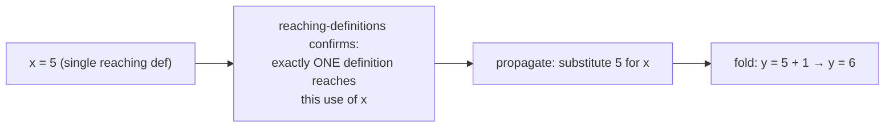

## Learning Objectives

- Distinguish constant folding (evaluating a purely constant expression at compile time) from constant propagation (substituting a variable's known constant value into its uses).
- Explain, using `reaching-definitions`, exactly when a substitution is safe: only when a single, constant-valued definition reaches a use.
- Apply constant folding and propagation together, in alternating passes, to a small piece of three-address code, showing each fold exposing a further one.
- Explain why this optimization can never change a program's observable output, only when a value is computed.
- State honestly what floating-point folding must be careful about (rounding behavior can differ subtly between compile-time and runtime evaluation on some targets) as a genuine, real caveat.

## Context & Motivation

This is the first optimization in this discipline that a data-flow analysis directly enables, and it's chosen first precisely because it's the simplest concrete payoff: if the compiler can DETERMINE, with certainty, that a value is some fixed constant at a given point, it can compute with that constant right now, at compile time, instead of generating instructions to compute it again every single time the program actually runs.

Two closely related but genuinely distinct techniques do this work together. CONSTANT FOLDING evaluates an expression whose operands are ALREADY literal constants — `2 + 3` becomes `5`, with no analysis required beyond looking at the instruction itself. CONSTANT PROPAGATION is what feeds folding real inputs to work with: it substitutes a variable's KNOWN constant value into a use of that variable, using `reaching-definitions` to certify that the substitution is safe — legitimate only when exactly one definition reaches that use, and that definition assigns a literal constant.

## Core Theory

### Constant folding: evaluating what's already fully known

```text
t1 = 2 + 3          →     t1 = 5          (fold — both operands literal)
t2 = 4 * 6          →     t2 = 24
t3 = true && false  →     t3 = false
```

No analysis beyond reading the instruction's own operands is needed here — if both operands are already literal constants, the compiler can perform the arithmetic itself, once, and emit the result directly.

### Constant propagation: using reaching definitions to justify substitution

```text
x = 5              ; d1
y = x + 1          ; is it safe to substitute 5 for x here?
```

`reaching-definitions` answers this exactly: if `d1` is the ONLY definition reaching this use of `x` (no branch, no other assignment could have changed it in between), the substitution `y = 5 + 1` is provably sound. If a SECOND definition of `x` also reaches this point (as in `reaching-definitions`'s own Example 1, a diamond with two different assignments to `x` merging), substituting either single constant would be unsound — the analysis's own precision is exactly what draws this line correctly.



### Why folding and propagation alternate, each exposing more of the other

A single pass of propagation can expose a NEW opportunity for folding, and a fold can in turn expose a new propagation opportunity — a real optimizing compiler runs these (along with other passes) repeatedly, to a fixed point, exactly for this reason:

```text
a = 2
b = 3
c = a + b     ; propagate a→2, b→3: c = 2 + 3
              ; fold: c = 5
d = c * 2     ; propagate c→5: d = 5 * 2
              ; fold: d = 10
```

Each step only became possible because the previous step's fold produced a new literal constant to propagate — this cascading effect is a real, common pattern, not a contrived example; it is one reason compilers structure their optimizers as a pipeline of passes run to a fixed point rather than each pass running exactly once.

## Worked Examples

### Example 1: a straightforward fold-and-propagate chain

```text
Before:
  x = 10
  y = x + 5
  z = y * 2

After propagation + folding (repeated to a fixed point):
  x = 10
  y = 15          ; propagated x→10, folded 10+5
  z = 30          ; propagated y→15, folded 15*2
```

### Example 2: propagation correctly refusing an unsafe substitution

```text
x = 1;
if (cond) {
  x = 2;
}
y = x + 1;      ; TWO definitions of x reach here (x=1 if cond false,
                  x=2 if cond true) — reaching-definitions reports
                  BOTH, so propagation must NOT substitute either
                  constant here; y = x + 1 is left unchanged, correctly.
```

This is exactly the case `reaching-definitions`'s own diamond example already worked out — this concept's optimization is the direct downstream consumer of that analysis's result, refusing to act precisely where the analysis reports genuine ambiguity.

### Example 3: a real caveat — floating-point folding is not always bit-for-bit identical to runtime evaluation

```text
t = 0.1 + 0.2

Folding this at compile time computes the sum using the COMPILER's
own floating-point arithmetic (often on the host machine building the
compiler); running the equivalent instructions at runtime computes it
using the TARGET machine's floating-point unit. For IEEE 754 doubles
with standard rounding these normally agree bit-for-bit — but a real
optimizing compiler must be careful about cases involving extended
precision intermediate registers, non-default rounding modes, or a
target whose floating-point behavior genuinely differs from the host's
— a real, documented class of subtle bug in aggressive constant
folders, not a purely theoretical worry.
```

## Common Misconceptions & Pitfalls

- **"Constant folding and constant propagation are the same optimization under two names."** They are complementary but distinct — folding evaluates an expression whose operands are ALREADY literal; propagation is what makes an operand literal in the first place, by substituting in a variable's known value from an earlier assignment, certified safe by reaching-definitions.
- **"Propagation can always substitute a variable's most recent assignment, since that's obviously the current value."** Only safe when reaching-definitions reports a SINGLE definition reaching that specific use — Example 2 shows a case with two possible reaching definitions where no single substitution is sound, regardless of which one looks "more recent" in the source text.
- **"This optimization can change what a program computes, as long as the result is 'basically the same.'"** It must never change OBSERVABLE behavior at all — folding and propagation only change WHEN a value is computed (at compile time instead of runtime), never WHAT value results, with the one honest, documented caveat being certain floating-point edge cases where host and target arithmetic can genuinely diverge.
- **"A single pass of constant propagation followed by a single pass of folding always finds every possible constant in a program."** Example 1's cascading chain shows the opposite — each fold can expose a NEW propagation opportunity, so real compilers run these passes repeatedly (often interleaved with other optimizations) until a fixed point is reached, not just once each.

## Summary

Constant folding evaluates an already-fully-constant expression at compile time; constant propagation substitutes a variable's known constant value into a use, safely only when `reaching-definitions` certifies exactly one definition reaches that use — the two techniques run together, often repeatedly, each fold exposing new propagation opportunities and vice versa, cascading through a program until no further constants can be resolved. This optimization changes only WHEN a computation happens, never WHAT it computes, with floating-point arithmetic being the one real, documented area demanding care. The next concept, `common-subexpression-elimination`, is this discipline's first optimization built on a MUST analysis rather than a MAY one — `available-expressions-analysis`'s direct downstream consumer.

## Documentation Links

- [Stanford CS143 — Compilers](http://web.stanford.edu/class/cs143/) — optimization lectures covering constant folding and propagation as the first concrete data-flow-driven rewrites.
- [MIT 6.035 — Computer Language Engineering, Calendar](https://ocw.mit.edu/courses/6-035-computer-language-engineering-sma-5502-fall-2005/pages/calendar/) — "Data-flow Optimizations" lecture directly following the data-flow-analysis lectures this optimization consumes.
