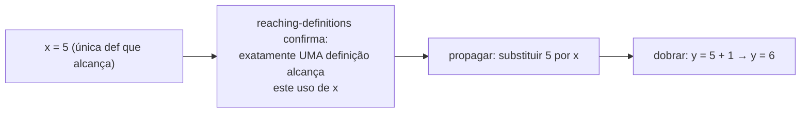

## Objetivos de Aprendizagem

- Distinguir a dobra de constantes (avaliar uma expressão puramente constante em tempo de compilação) da propagação de constantes (substituir o valor constante conhecido de uma variável nos seus usos).
- Explicar, usando `reaching-definitions`, exatamente quando uma substituição é segura: só quando uma única definição de valor constante alcança um uso.
- Aplicar a dobra e a propagação de constantes juntas, em passagens alternadas, a um pequeno pedaço de código de três endereços, mostrando cada dobra expondo mais uma.
- Explicar por que esta otimização nunca pode mudar a saída observável de um programa, só quando um valor é computado.
- Enunciar honestamente com o que a dobra de ponto flutuante tem de ter cuidado (o comportamento de arredondamento pode diferir sutilmente entre a avaliação em tempo de compilação e em tempo de execução em alguns alvos) como uma ressalva genuína e real.

## Contexto e Motivação

Esta é a primeira otimização nesta disciplina que uma análise de fluxo de dados viabiliza diretamente, e é escolhida primeiro precisamente porque é o retorno concreto mais simples: se o compilador consegue DETERMINAR, com certeza, que um valor é alguma constante fixa num dado ponto, ele pode computar com essa constante agora mesmo, em tempo de compilação, em vez de gerar instruções para computá-la de novo toda vez que o programa de fato roda.

Duas técnicas intimamente relacionadas, mas genuinamente distintas, fazem esse trabalho juntas. A DOBRA DE CONSTANTES avalia uma expressão cujos operandos já são constantes literais, `2 + 3` vira `5`, sem análise necessária além de olhar a própria instrução. A PROPAGAÇÃO DE CONSTANTES é o que alimenta a dobra com entradas reais para trabalhar: ela substitui o valor constante CONHECIDO de uma variável num uso dessa variável, usando `reaching-definitions` para certificar que a substituição é segura, legítima só quando exatamente uma definição alcança aquele uso, e essa definição atribui uma constante literal.

## Teoria Central

### Dobra de constantes: avaliar o que já é totalmente conhecido

```text
t1 = 2 + 3          →     t1 = 5          (dobra, ambos os operandos literais)
t2 = 4 * 6          →     t2 = 24
t3 = true && false  →     t3 = false
```

Nenhuma análise além de ler os próprios operandos da instrução é necessária aqui, se ambos os operandos já são constantes literais, o compilador pode realizar a aritmética ele mesmo, uma vez, e emitir o resultado diretamente.

### Propagação de constantes: usar as definições que alcançam para justificar a substituição

```text
x = 5              ; d1
y = x + 1          ; é seguro substituir 5 por x aqui?
```

`reaching-definitions` responde isso exatamente: se `d1` é a ÚNICA definição que alcança este uso de `x` (nenhum desvio, nenhuma outra atribuição poderia tê-lo mudado no meio), a substituição `y = 5 + 1` é comprovadamente sólida. Se uma SEGUNDA definição de `x` também alcança este ponto (como no próprio Exemplo 1 de `reaching-definitions`, um diamante com duas atribuições diferentes a `x` se juntando), substituir qualquer constante única seria incorreto, a própria precisão da análise é exatamente o que traça essa linha corretamente.



### Por que a dobra e a propagação alternam, cada uma expondo mais da outra

Uma única passagem de propagação pode expor uma NOVA oportunidade de dobra, e uma dobra pode, por sua vez, expor uma nova oportunidade de propagação, um compilador otimizador real roda estas (junto de outras passagens) repetidamente, até um ponto fixo, exatamente por esse motivo:

```text
a = 2
b = 3
c = a + b     ; propagar a→2, b→3: c = 2 + 3
              ; dobrar: c = 5
d = c * 2     ; propagar c→5: d = 5 * 2
              ; dobrar: d = 10
```

Cada passo só se tornou possível porque a dobra do passo anterior produziu uma nova constante literal para propagar, esse efeito em cascata é um padrão real e comum, não um exemplo forçado; é uma das razões pelas quais os compiladores estruturam os seus otimizadores como um pipeline de passagens rodadas até um ponto fixo, em vez de cada passagem rodar exatamente uma vez.

## Exemplos Resolvidos

### Exemplo 1: uma cadeia direta de dobrar-e-propagar

```text
Antes:
  x = 10
  y = x + 5
  z = y * 2

Depois da propagação + dobra (repetidas até um ponto fixo):
  x = 10
  y = 15          ; propagou x→10, dobrou 10+5
  z = 30          ; propagou y→15, dobrou 15*2
```

### Exemplo 2: a propagação recusando corretamente uma substituição insegura

```text
x = 1;
if (cond) {
  x = 2;
}
y = x + 1;      ; DUAS definições de x alcançam aqui (x=1 se cond falso,
                  x=2 se cond verdadeiro), reaching-definitions reporta
                  AMBAS, então a propagação NÃO deve substituir nenhuma
                  constante aqui; y = x + 1 é deixado inalterado, corretamente.
```

Esse é exatamente o caso que o próprio exemplo de diamante de `reaching-definitions` já resolveu, a otimização deste conceito é a consumidora direta a jusante do resultado dessa análise, recusando atuar precisamente onde a análise reporta ambiguidade genuína.

### Exemplo 3: uma ressalva real, a dobra de ponto flutuante nem sempre é bit a bit idêntica à avaliação em tempo de execução

```text
t = 0.1 + 0.2

Dobrar isto em tempo de compilação computa a soma usando a própria
aritmética de ponto flutuante do COMPILADOR (muitas vezes na máquina hospedeira que
constrói o compilador); rodar as instruções equivalentes em tempo de execução a computa
usando a unidade de ponto flutuante da máquina-ALVO. Para doubles IEEE 754
com arredondamento padrão estes normalmente concordam bit a bit, mas um compilador
otimizador real tem de ter cuidado com casos que envolvem registradores
intermediários de precisão estendida, modos de arredondamento não padrão, ou um
alvo cujo comportamento de ponto flutuante genuinamente difere do hospedeiro,
uma classe real e documentada de bug sutil em dobradores de constantes
agressivos, não uma preocupação puramente teórica.
```

## Equívocos Comuns e Armadilhas

- **"Dobra de constantes e propagação de constantes são a mesma otimização sob dois nomes."** Elas são complementares, mas distintas, a dobra avalia uma expressão cujos operandos já são literais; a propagação é o que torna um operando literal em primeiro lugar, substituindo o valor conhecido de uma variável de uma atribuição anterior, certificado seguro pelas definições que alcançam.
- **"A propagação pode sempre substituir a atribuição mais recente de uma variável, já que esse é obviamente o valor atual."** Só é seguro quando as definições que alcançam reportam uma ÚNICA definição alcançando aquele uso específico, o Exemplo 2 mostra um caso com duas possíveis definições que alcançam onde nenhuma substituição única é sólida, independentemente de qual pareça "mais recente" no texto-fonte.
- **"Esta otimização pode mudar o que um programa computa, desde que o resultado seja 'basicamente o mesmo'."** Ela nunca deve mudar o comportamento OBSERVÁVEL de forma alguma, a dobra e a propagação só mudam QUANDO um valor é computado (em tempo de compilação em vez de em tempo de execução), nunca QUE valor resulta, sendo a única ressalva honesta e documentada certos casos de borda de ponto flutuante onde a aritmética do hospedeiro e a do alvo podem genuinamente divergir.
- **"Uma única passagem de propagação de constantes seguida de uma única passagem de dobra sempre encontra toda constante possível num programa."** A cadeia em cascata do Exemplo 1 mostra o oposto, cada dobra pode expor uma NOVA oportunidade de propagação, então compiladores reais rodam estas passagens repetidamente (muitas vezes intercaladas com outras otimizações) até um ponto fixo ser alcançado, e não só uma vez cada.

## Resumo

A dobra de constantes avalia uma expressão já totalmente constante em tempo de compilação; a propagação de constantes substitui o valor constante conhecido de uma variável num uso, com segurança só quando `reaching-definitions` certifica que exatamente uma definição alcança aquele uso, as duas técnicas rodam juntas, muitas vezes repetidamente, cada dobra expondo novas oportunidades de propagação e vice-versa, em cascata por um programa até nenhuma outra constante poder ser resolvida. Esta otimização muda só QUANDO uma computação acontece, nunca O QUE ela computa, sendo a aritmética de ponto flutuante a única área real e documentada que exige cuidado. O conceito seguinte, `common-subexpression-elimination`, é a primeira otimização desta disciplina construída sobre uma análise MUST em vez de uma MAY, a consumidora direta a jusante de `available-expressions-analysis`.

## Documentation Links

- [Stanford CS143 — Compilers](http://web.stanford.edu/class/cs143/): aulas de otimização que cobrem a dobra e a propagação de constantes como as primeiras reescritas concretas guiadas por fluxo de dados.
- [MIT 6.035 — Computer Language Engineering, Calendar](https://ocw.mit.edu/courses/6-035-computer-language-engineering-sma-5502-fall-2005/pages/calendar/): aula de "Data-flow Optimizations" diretamente após as aulas de análise de fluxo de dados que esta otimização consome.
