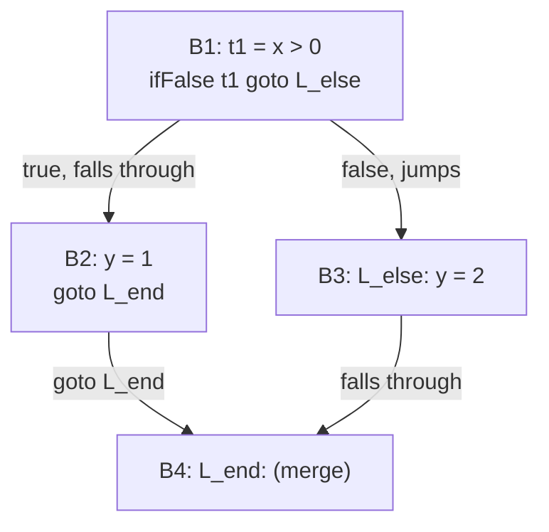
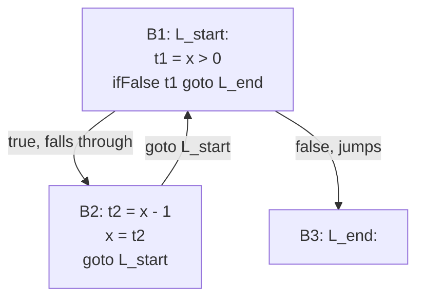

## Learning Objectives

- Define a basic block precisely: a maximal sequence of three-address instructions with exactly one entry point and one exit point.
- Partition a sequence of three-address code into basic blocks by identifying leaders (the first instruction of each block).
- Build a control-flow graph (CFG) by connecting basic blocks with directed edges corresponding to every possible jump, fall-through included.
- Explain why "maximal run with one entry and one exit" is exactly the property that makes a basic block a safe unit for local optimizations to treat as indivisible.
- Read a CFG and identify a loop, a diamond (if/else merge), and an unreachable block by their graph shape alone.

## Context & Motivation

`three-address-code` produced a flat sequence of instructions with explicit jumps — but a flat sequence is still not the shape data-flow analysis needs. What's missing is an explicit representation of every possible PATH execution could take through that sequence: after `ifFalse t1 goto L_else`, execution goes to exactly one of two places depending on a runtime condition, and after `L_end:`, several different upstream instructions might have led here. A CONTROL-FLOW GRAPH (CFG) makes this explicit: nodes are BASIC BLOCKS — maximal runs of instructions with no jumps in or out except at the very start and very end — and directed edges connect a block to every block it might transfer control to next.

This is the structure `the-data-flow-analysis-framework-lattices-and-fixed-points`, and every specific analysis after it, is actually defined over — not the three-address instruction sequence taken as a flat list, and certainly not the original AST.

## Core Theory

### Finding basic blocks by identifying leaders

A LEADER is the first instruction of some basic block. Three simple rules identify every leader in a three-address sequence:

```text
1. The very first instruction in the sequence is a leader.
2. Any instruction that is the TARGET of a jump (conditional or
   unconditional) is a leader.
3. Any instruction immediately FOLLOWING a jump or a conditional jump
   is a leader (because control might fall through to it, or the
   previous instruction might redirect control elsewhere entirely —
   either way, this instruction begins a new region with a genuinely
   different set of possible predecessors).
```

A basic block is then exactly the leader together with every instruction up to (but not including) the next leader:

```text
Three-address code:
  1: t1 = x > 0
  2: ifFalse t1 goto L_else      ; rule 3 → instruction 3 is a leader
  3: y = 1                       ; leader (rule 3)
  4: goto L_end                  ; rule 3 → instruction 5 is a leader
  5: L_else:                     ; leader (rule 2 — jump target)
  6: y = 2
  7: L_end:                      ; leader (rule 2 — jump target)

Leaders: 1, 3, 5, 7

Basic blocks:
  B1: [1, 2]     (t1 = x > 0;  ifFalse t1 goto L_else)
  B2: [3, 4]     (y = 1;  goto L_end)
  B3: [5, 6]     (L_else: y = 2)
  B4: [7]        (L_end: — the merge point)
```

### Wiring blocks into a graph

Every jump (fall-through included) becomes a directed edge from the block containing it to the block whose leader it targets:



This diagram makes the diamond shape of an `if`/`else` visible directly as a graph shape — exactly the pattern every later analysis (and, later still, every instruction-scheduling and register-allocation pass) needs to reason about paths through, since "every path reaching B4" now literally means "every path through this graph that ends at node B4," a precise graph-theoretic question rather than an implicit property of nested `if` syntax.

### Why "one entry, one exit" is the property that matters

Within a single basic block, if the FIRST instruction executes, every instruction in the block is guaranteed to execute, in order, with no branching possible in between — a basic block is therefore a safe unit for a LOCAL optimization (one that only looks within a single block) to treat as an indivisible, straight-line sequence: reordering, merging, or rewriting instructions strictly within one block can never accidentally skip over a branch that would have changed which instructions actually run, precisely because no such branch exists inside a block by construction.

## Worked Examples

### Example 1: identifying leaders and blocks for a `while` loop

```text
Three-address code:
  1: L_start:
  2: t1 = x > 0
  3: ifFalse t1 goto L_end
  4: t2 = x - 1
  5: x = t2
  6: goto L_start
  7: L_end:

Leaders: 1 (first instruction, and also a jump target — rules 1 and 2
           both apply), 4 (rule 3, follows a conditional jump),
           7 (rule 2, jump target)

Basic blocks:
  B1: [1, 2, 3]
  B2: [4, 5, 6]
  B3: [7]
```



The back-edge from B2 to B1 is exactly what makes this graph shape recognizable as a loop, purely from graph structure — a cycle in the CFG — with no need to consult the original `while` keyword at all.

### Example 2: an unreachable block, visible directly as a graph property

```text
Three-address code:
  1: goto L_end
  2: y = 999          ; never reached by any path — DEAD CODE
  3: L_end:
      ...

Leaders: 1 (first instruction), 2 (follows a jump — rule 3),
         3 (jump target — rule 2)

CFG:  B1 (goto L_end) --> B3 (L_end: ...)
      B2 (y = 999) has NO incoming edge from anywhere in the graph.
```

A block with zero incoming edges (other than possibly being the very first block) is unreachable — this is a real, common finding a CFG makes visible mechanically, one instance of the broader dead-code problem `dead-code-elimination` addresses more generally later in this discipline.

### Example 3: two different source constructs producing the identical CFG shape

```text
if (c) { s1; } else { s2; }        for (i = 0; i < n; i++) { body; }

Both eventually produce a "diamond" (if/else) or a "loop with a back
edge" shape once lowered to three-address code and partitioned into
basic blocks — a data-flow analysis or an optimization pass never
needs to know whether the ORIGINAL source used `if`/`else`, a `while`,
or a `for`; it only ever needs to see the resulting graph shape, which
is exactly the language-independence why-intermediate-representations-
exist argued for, now realized concretely at the control-flow level.
```

## Common Misconceptions & Pitfalls

- **"A basic block can contain a jump instruction anywhere inside it, not just at the very end."** By definition it cannot — a jump (conditional or unconditional) can only be the LAST instruction of a basic block; if it appeared mid-block, the block would not have a single, well-defined exit, violating the "one entry, one exit" property this concept is built on.
- **"Every three-address instruction that follows a jump is automatically unreachable."** Only true if nothing ELSE in the program jumps to it — Example 2's `y = 999` happens to have no incoming edges at all, but an instruction right after a `goto` that is ALSO the target of some other jump elsewhere is both a leader (by rule 3) and perfectly reachable (via that other jump).
- **"The number of basic blocks in a CFG always equals the number of `if`/`while`/`for` constructs in the source."** There's no fixed correspondence — a single `if`/`else` produces (at least) four blocks in the examples above, and a sufficiently flattened straight-line sequence with no branching at all is exactly one block regardless of how many individual statements it contains.
- **"A CFG's structure is only useful for optimization, not for understanding a program."** The exact same CFG structure this concept builds is also the structure a debugger's call graph, a code coverage tool's "which lines were exercised" report, and a static analyzer's reachability check are all built on — it's a genuinely general-purpose representation, not an optimization-only artifact.

## Summary

A control-flow graph groups three-address code into basic blocks — maximal runs of instructions with exactly one entry and one exit, found by identifying leaders (the first instruction, every jump target, and every instruction following a jump) — and connects those blocks with directed edges for every possible jump, fall-through included. The resulting graph makes control-flow properties (loops as cycles, if/else as diamonds, dead code as unreachable nodes) into precise, mechanically checkable graph-theoretic facts, entirely independent of which original source construct produced them. This is exactly the structure the next concept, `static-single-assignment-form`, restructures variable naming over, and the structure every data-flow analysis after that is formally defined against.

## Documentation Links

- [Cooper & Torczon — Engineering a Compiler (companion site)](https://shop.elsevier.com/books/book-companion/9780120884780) — textbook whose IR chapters define basic blocks via the leader algorithm and build the CFG from them.
- [MIT 6.035 — Computer Language Engineering, Calendar](https://ocw.mit.edu/courses/6-035-computer-language-engineering-sma-5502-fall-2005/pages/calendar/) — lecture sequence placing intermediate representations directly ahead of the program-analysis and optimization lectures that consume the CFG.
