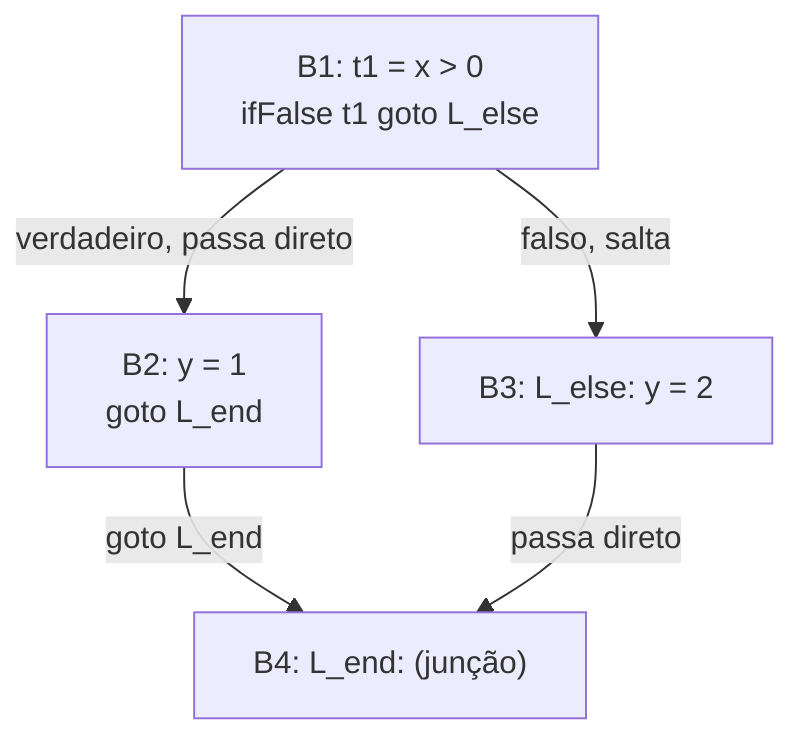
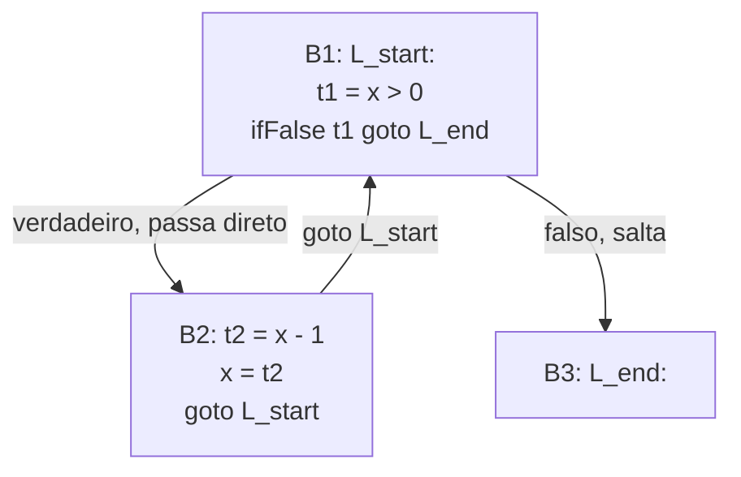

## Objetivos de Aprendizagem

- Definir um bloco básico com precisão: uma sequência maximal de instruções de três endereços com exatamente um ponto de entrada e um ponto de saída.
- Particionar uma sequência de código de três endereços em blocos básicos identificando líderes (a primeira instrução de cada bloco).
- Construir um grafo de fluxo de controle (CFG) conectando blocos básicos com arestas dirigidas correspondentes a todo salto possível, inclusive a passagem direta (fall-through).
- Explicar por que "sequência maximal com uma entrada e uma saída" é exatamente a propriedade que torna um bloco básico uma unidade segura para as otimizações locais tratarem como indivisível.
- Ler um CFG e identificar um laço, um diamante (junção de if/else) e um bloco inalcançável só pelo seu formato de grafo.

## Contexto e Motivação

`three-address-code` produziu uma sequência plana de instruções com saltos explícitos, mas uma sequência plana ainda não é o formato de que a análise de fluxo de dados precisa. O que falta é uma representação explícita de todo CAMINHO possível que a execução poderia tomar por essa sequência: depois de `ifFalse t1 goto L_else`, a execução vai para exatamente um de dois lugares dependendo de uma condição de tempo de execução, e depois de `L_end:`, várias instruções diferentes a montante poderiam ter levado até aqui. Um GRAFO DE FLUXO DE CONTROLE (CFG) torna isso explícito: os nós são BLOCOS BÁSICOS, sequências maximais de instruções sem saltos para dentro ou para fora exceto bem no começo e bem no fim, e arestas dirigidas conectam um bloco a todo bloco ao qual ele pode transferir o controle em seguida.

Esta é a estrutura sobre a qual `the-data-flow-analysis-framework-lattices-and-fixed-points`, e toda análise específica depois dela, é de fato definida, e não a sequência de instruções de três endereços tomada como uma lista plana, e certamente não o AST original.

## Teoria Central

### Encontrar blocos básicos identificando líderes

Um LÍDER é a primeira instrução de algum bloco básico. Três regras simples identificam todo líder numa sequência de três endereços:

```text
1. A primeiríssima instrução na sequência é um líder.
2. Qualquer instrução que é o ALVO de um salto (condicional ou
   incondicional) é um líder.
3. Qualquer instrução imediatamente SEGUINTE a um salto ou a um salto
   condicional é um líder (porque o controle pode cair nela por passagem direta, ou a
   instrução anterior pode redirecionar o controle inteiramente para outro lugar,
   de qualquer forma, esta instrução começa uma nova região com um conjunto
   genuinamente diferente de possíveis predecessores).
```

Um bloco básico é então exatamente o líder junto de toda instrução até (mas não incluindo) o próximo líder:

```text
Código de três endereços:
  1: t1 = x > 0
  2: ifFalse t1 goto L_else      ; regra 3 → instrução 3 é um líder
  3: y = 1                       ; líder (regra 3)
  4: goto L_end                  ; regra 3 → instrução 5 é um líder
  5: L_else:                     ; líder (regra 2, alvo de salto)
  6: y = 2
  7: L_end:                      ; líder (regra 2, alvo de salto)

Líderes: 1, 3, 5, 7

Blocos básicos:
  B1: [1, 2]     (t1 = x > 0;  ifFalse t1 goto L_else)
  B2: [3, 4]     (y = 1;  goto L_end)
  B3: [5, 6]     (L_else: y = 2)
  B4: [7]        (L_end:, o ponto de junção)
```

### Ligar blocos num grafo

Todo salto (passagem direta inclusa) vira uma aresta dirigida do bloco que o contém para o bloco cujo líder ele mira:



Este diagrama torna o formato de diamante de um `if`/`else` visível diretamente como um formato de grafo, exatamente o padrão sobre cujos caminhos toda análise posterior (e, mais tarde ainda, toda passagem de escalonamento de instruções e de alocação de registradores) precisa raciocinar, já que "todo caminho que alcança B4" agora significa literalmente "todo caminho por este grafo que termina no nó B4", uma pergunta precisa de teoria dos grafos em vez de uma propriedade implícita da sintaxe de `if` aninhado.

### Por que "uma entrada, uma saída" é a propriedade que importa

Dentro de um único bloco básico, se a PRIMEIRA instrução executa, toda instrução no bloco tem garantia de executar, em ordem, sem desvio possível no meio, um bloco básico é portanto uma unidade segura para uma otimização LOCAL (uma que só olha dentro de um único bloco) tratar como uma sequência em linha reta e indivisível: reordenar, fundir ou reescrever instruções estritamente dentro de um bloco nunca pode acidentalmente pular por cima de um desvio que teria mudado quais instruções de fato rodam, precisamente porque nenhum desvio desse tipo existe dentro de um bloco por construção.

## Exemplos Resolvidos

### Exemplo 1: identificar líderes e blocos de um laço `while`

```text
Código de três endereços:
  1: L_start:
  2: t1 = x > 0
  3: ifFalse t1 goto L_end
  4: t2 = x - 1
  5: x = t2
  6: goto L_start
  7: L_end:

Líderes: 1 (primeira instrução, e também alvo de salto, regras 1 e 2
           ambas se aplicam), 4 (regra 3, segue um salto condicional),
           7 (regra 2, alvo de salto)

Blocos básicos:
  B1: [1, 2, 3]
  B2: [4, 5, 6]
  B3: [7]
```



A aresta de retorno de B2 para B1 é exatamente o que torna este formato de grafo reconhecível como um laço, puramente a partir da estrutura do grafo, um ciclo no CFG, sem necessidade de consultar a palavra-chave `while` original de forma alguma.

### Exemplo 2: um bloco inalcançável, visível diretamente como propriedade de grafo

```text
Código de três endereços:
  1: goto L_end
  2: y = 999          ; nunca alcançado por nenhum caminho, CÓDIGO MORTO
  3: L_end:
      ...

Líderes: 1 (primeira instrução), 2 (segue um salto, regra 3),
         3 (alvo de salto, regra 2)

CFG:  B1 (goto L_end) --> B3 (L_end: ...)
      B2 (y = 999) NÃO tem aresta de entrada de lugar nenhum no grafo.
```

Um bloco com zero arestas de entrada (além de possivelmente ser o primeiríssimo bloco) é inalcançável, essa é uma descoberta real e comum que um CFG torna visível mecanicamente, uma instância do problema mais amplo de código morto que `dead-code-elimination` aborda de forma mais geral mais adiante nesta disciplina.

### Exemplo 3: duas construções de fonte diferentes produzindo o formato idêntico de CFG

```text
if (c) { s1; } else { s2; }        for (i = 0; i < n; i++) { body; }

Ambas eventualmente produzem um formato de "diamante" (if/else) ou de "laço com
aresta de retorno" uma vez rebaixadas a código de três endereços e particionadas em
blocos básicos, uma análise de fluxo de dados ou uma passagem de otimização nunca
precisa saber se a fonte ORIGINAL usou `if`/`else`, um `while`
ou um `for`; ela só precisa ver o formato de grafo resultante, que
é exatamente a independência de linguagem pela qual por-que-representações-intermediárias-
existem argumentaram, agora realizada concretamente no nível de fluxo de controle.
```

## Equívocos Comuns e Armadilhas

- **"Um bloco básico pode conter uma instrução de salto em qualquer lugar dentro dele, não só bem no fim."** Por definição ele não pode, um salto (condicional ou incondicional) só pode ser a ÚLTIMA instrução de um bloco básico; se aparecesse no meio do bloco, o bloco não teria uma única saída bem definida, violando a propriedade de "uma entrada, uma saída" sobre a qual este conceito é construído.
- **"Toda instrução de três endereços que segue um salto é automaticamente inalcançável."** Só é verdade se nada MAIS no programa salta para ela, o `y = 999` do Exemplo 2 por acaso não tem arestas de entrada de forma alguma, mas uma instrução logo após um `goto` que é TAMBÉM o alvo de algum outro salto em outro lugar é tanto um líder (pela regra 3) quanto perfeitamente alcançável (por aquele outro salto).
- **"O número de blocos básicos num CFG sempre é igual ao número de construções `if`/`while`/`for` na fonte."** Não há correspondência fixa, um único `if`/`else` produz (pelo menos) quatro blocos nos exemplos acima, e uma sequência em linha reta suficientemente achatada sem desvio de forma alguma é exatamente um bloco, independentemente de quantas instruções individuais ele contenha.
- **"A estrutura de um CFG só é útil para otimização, não para entender um programa."** A exata mesma estrutura de CFG que este conceito constrói é também a estrutura sobre a qual o grafo de chamadas de um depurador, o relatório de "quais linhas foram exercitadas" de uma ferramenta de cobertura de código e a checagem de alcançabilidade de um analisador estático são todos construídos, é uma representação genuinamente de propósito geral, não um artefato apenas de otimização.

## Resumo

Um grafo de fluxo de controle agrupa o código de três endereços em blocos básicos, sequências maximais de instruções com exatamente uma entrada e uma saída, encontradas identificando líderes (a primeira instrução, todo alvo de salto e toda instrução seguinte a um salto), e conecta esses blocos com arestas dirigidas para todo salto possível, passagem direta inclusa. O grafo resultante torna as propriedades de fluxo de controle (laços como ciclos, if/else como diamantes, código morto como nós inalcançáveis) fatos precisos e checáveis mecanicamente de teoria dos grafos, inteiramente independentes de qual construção de fonte original os produziu. Esta é exatamente a estrutura sobre a qual o conceito seguinte, `static-single-assignment-form`, reestrutura a nomeação de variáveis, e a estrutura contra a qual toda análise de fluxo de dados depois disso é formalmente definida.

## Documentation Links

- [Cooper & Torczon — Engineering a Compiler (companion site)](https://shop.elsevier.com/books/book-companion/9780120884780): livro-texto cujos capítulos de IR definem os blocos básicos pelo algoritmo de líderes e constroem o CFG a partir deles.
- [MIT 6.035 — Computer Language Engineering, Calendar](https://ocw.mit.edu/courses/6-035-computer-language-engineering-sma-5502-fall-2005/pages/calendar/): sequência de aulas que coloca as representações intermediárias diretamente antes das aulas de análise de programa e de otimização que consomem o CFG.
