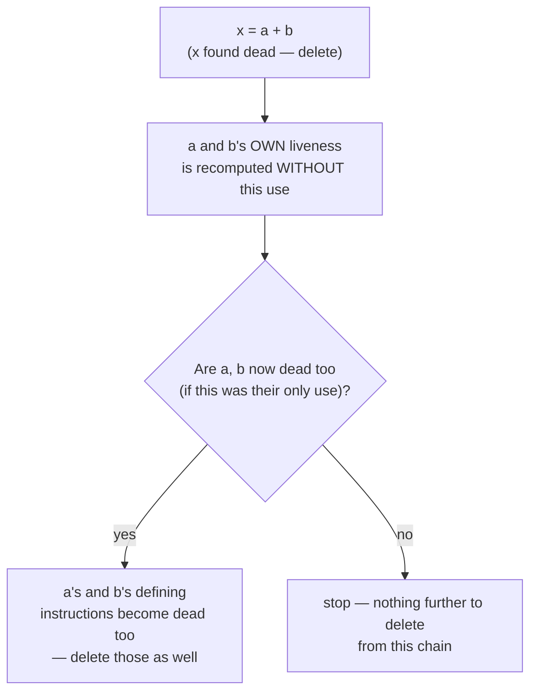

## Learning Objectives

- Explain exactly how dead-code elimination (DCE) uses `live-variable-analysis`'s findings to justify deleting an instruction outright.
- Apply DCE to a small piece of three-address code, including a case where deleting one dead instruction exposes a NEW one to delete.
- Distinguish DCE (deleting an instruction whose result is never read) from unreachable-code elimination (deleting a block no path can ever reach at all, from `control-flow-graphs-and-basic-blocks`).
- Explain why DCE must never delete an instruction with an observable SIDE EFFECT, even if its result value is genuinely never read.
- Trace the alternating cascade between DCE and constant folding/propagation, showing how the three optimizations covered so far compound each other's effects.

## Context & Motivation

`live-variable-analysis` computed, for every point in a program, exactly which variables' CURRENT values might still be read somewhere downstream. Dead-code elimination is the direct payoff: if an assignment's target is NOT live immediately after that assignment — no path forward ever reads the value it just computed — the assignment computes something genuinely useless, and can be deleted outright, along with whatever instruction computed the value being thrown away.

This is `common-subexpression-elimination`'s mirror image, built on the OTHER data-flow analysis this discipline covered: CSE reuses a result that's redundant because it was already computed; DCE deletes a result that's dead because it will never be used. Both act only where their respective analysis has already certified the rewrite as unconditionally safe.

## Core Theory

### The deletion rule

```text
x = a + b       ; if x is NOT live immediately after this instruction
                ; (live-variable-analysis's OUT set for this point
                ; does not contain x), this entire instruction is
                ; dead — delete it outright.
```

Deleting it is safe precisely because "not live" means no path forward ever reads `x`'s value before something else overwrites it or the program ends — the computed value, whatever it would have been, was never going to matter to the program's observable behavior.

### The cascading effect: deleting one dead instruction exposes another



Deleting `x = a + b` removes the one place `a` and `b` were used at that instruction — if that was ALSO their only remaining use anywhere downstream, `a`'s and `b`'s own defining instructions become dead in turn, exactly the same cascading pattern `constant-folding-and-constant-propagation` showed for folds exposing further folds. Real compilers re-run liveness (or maintain it incrementally) and re-apply DCE repeatedly, to a fixed point, for exactly this reason.

### Dead code vs. unreachable code — a genuinely different concept

`control-flow-graphs-and-basic-blocks` already showed a DIFFERENT kind of "useless code": a basic block with no incoming edge at all, unreachable by ANY execution path (like a block sitting right after an unconditional `goto` that jumps past it). Dead-code elimination is a different question entirely — a REACHABLE instruction whose computed value is simply never read by anything downstream. Both are real, distinct optimizations a production compiler performs (often called "unreachable code elimination" and "dead code elimination" respectively), and confusing them is a real, common mistake: an instruction can be perfectly reachable and still dead (this concept), or perfectly "live" in the sense of computing something useful, yet sit in a block nothing ever reaches (the earlier concept's concern).

## Worked Examples

### Example 1: a single dead assignment, found and deleted

```text
Before:                        Live-variable analysis finds:
  x = 1                          x is NOT live after this line
  y = 2                          (y IS live — used below)
  z = y + 1

After DCE:
  y = 2
  z = y + 1
```

### Example 2: a cascading deletion, exactly the case `live-variable-analysis`'s own worked example set up

```text
Before:
  a = 5
  b = 6
  x = a + b        ; x is never used anywhere after this — DEAD
  y = 10

Pass 1: x = a + b deleted (x not live afterward)
Pass 2: with that use of a and b gone, are a and b live anywhere
  else? If this was their ONLY use, both a = 5 and b = 6 are now
  ALSO dead in turn.

After DCE (fixed point):
  y = 10
```

Three instructions were removed even though only ONE was originally, directly identified as dead — the other two became dead only as a downstream CONSEQUENCE of the first deletion, exactly the cascade pattern this concept's Core Theory section diagrams.

### Example 3: an instruction that looks dead but must NOT be deleted — a real side effect

```text
x = readInputFromDevice();   ; x is never used afterward — but this
                                function call has an OBSERVABLE SIDE
                                EFFECT (it consumes input from a real
                                device) — deleting it would silently
                                change the program's observable
                                behavior, which no correct optimization
                                may ever do.

A correct DCE implementation only deletes a PURE computation (one
with no side effects) whose result is dead — a call to a function the
compiler cannot prove is side-effect-free must be conservatively kept,
regardless of whether its return value is ever used.
```

## Common Misconceptions & Pitfalls

- **"Dead-code elimination and unreachable-code elimination are the same optimization, just described two different ways."** They act on genuinely different properties — unreachable code is about the CFG's graph structure (no path reaches this block at all, a `control-flow-graphs-and-basic-blocks` concern); dead code is about a variable's value never being read on a REACHABLE path (a `live-variable-analysis` concern) — a real compiler runs both, as separate passes, for separate reasons.
- **"An instruction whose result is never used can always be deleted safely."** Only if the instruction is PURE — Example 3 shows a call with an observable side effect where the return value being dead is completely irrelevant to whether deleting the CALL itself would be safe; DCE must be conservative about anything the compiler cannot prove has no observable effect beyond its return value.
- **"DCE only ever removes instructions that were directly, individually identified as dead in a single pass."** Example 2 shows the opposite is common — a single deletion frequently exposes MORE dead code downstream (the now-unused operands' own defining instructions), which is exactly why real optimizers re-run DCE (often interleaved with liveness recomputation) to a fixed point rather than in one shot.
- **"DCE and constant propagation/folding are unrelated optimizations that happen to be covered in the same cluster."** They actively compound each other in practice: a fold can make a variable's value a known constant that gets propagated everywhere, leaving its ORIGINAL defining instruction with no remaining live use — at which point DCE deletes that now-genuinely-dead original assignment, a real, common interaction in production optimizing compilers.

## Summary

Dead-code elimination deletes an assignment outright wherever `live-variable-analysis` certifies its target is not live immediately afterward — no path forward will ever read the value being computed — and, like `common-subexpression-elimination`, this is unconditionally safe precisely because it only acts where the underlying analysis has already ruled out every possible way it could go wrong, with the one genuine exception being an instruction with an observable side effect, which must be conservatively kept regardless of its return value's liveness. Deleting one dead instruction routinely exposes further dead code downstream, the same cascading pattern already seen with constant folding and propagation — all three optimizations compound each other in a real optimizing compiler's pass pipeline. The next concept, `loop-optimizations-invariant-code-motion-and-strength-reduction`, moves from these general, whole-program rewrites to optimizations specifically targeting loops, where the same small rewrite pays off disproportionately because it runs on every iteration instead of once.

## Documentation Links

- [MIT 6.035 — Computer Language Engineering, Calendar](https://ocw.mit.edu/courses/6-035-computer-language-engineering-sma-5502-fall-2005/pages/calendar/) — "Data-flow Optimizations" lecture covering dead-code elimination as a direct consumer of live-variable analysis.
- [Cooper & Torczon — Engineering a Compiler (companion site)](https://shop.elsevier.com/books/book-companion/9780120884780) — textbook distinguishing dead-code elimination from unreachable-code elimination as genuinely separate optimizations.
